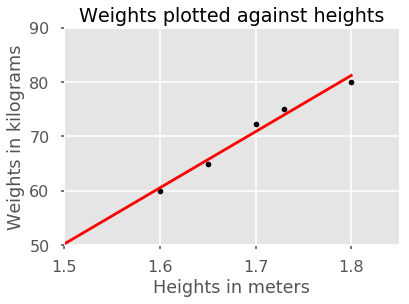
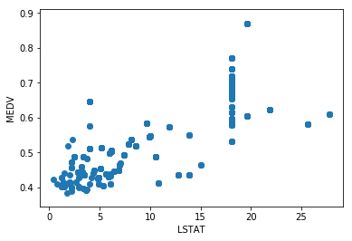

```python
from pandas import DataFrame
import pandas as pd
import os

import matplotlib.pyplot as plt
from matplotlib import style
style.use("ggplot")
plt.plot(
[1,2,3,4,5,6,7,8,9,10],
[2,4.5,1,2,3.5,2,1,2,3,2]
)
plt.title("Results")
plt.xlabel("Semester")
plt.ylabel("Grade")

```


    Text(0, 0.5, 'Grade')


```python
import os
os.chdir('C:\\Users\\HP\\OneDrive\\MACs\\results\\No stim Bulk')
mypath  = 'C:\\Users\\HP\\OneDrive\\MACs\\results\\No stim Bulk'

from os import listdir
os.listdir(mypath)
```


    ['biplot.pdf',
     'biplot.png',
     'biplot2.pdf',
     'heatmap bulk NKs.pdf',
     'ind_PCA.pdf',
     'list_markers.html',
     'marker.txt',
     'marker.xlsx',
     'markers_cluster_PCA.pdf',
     'NK Bulk Contingence table.docx',
     'No stim Bulk MACs_code_mediance_data_frame.R',
     'Nostim NK bulk MACs code.R',
     'Phenotype Expression BC170705A.xls',
     'Phenotype Expression BC170705A1.xls',
     'Phenotype Expression BC170705A2.xls',
     'Phenotype Expression BC170705A3.xls',
     'Phenotype Expression BC170705A4.xls',
     'Phenotype Expression BC170705B.xls',
     'Phenotype Expression BC170705B1.xls',
     'Phenotype Expression BC170705B2.xls',
     'Phenotype Expression BC170705B3.xls',
     'Phenotype Expression BC170705B4.xls',
     'Phenotype Expression BC170816A.xls',
     'Phenotype Expression BC170816A1.xls',
     'Phenotype Expression BC170816A2.xls',
     'Phenotype Expression BC170816A3.xls',
     'Phenotype Expression BC170816A4.xls',
     'Phenotype Expression BC170816B.xls',
     'Phenotype Expression BC170816B1.xls',
     'Phenotype Expression BC170816B2.xls',
     'Phenotype Expression BC170816B3.xls',
     'Phenotype Expression BC170816B4.xls',
     'Phenotype Expression BC170829A.xls',
     'Phenotype Expression BC170829A1.xls',
     'Phenotype Expression BC170829A2.xls',
     'Phenotype Expression BC170829A3.xls',
     'Phenotype Expression BC170829A4.xls',
     'Phenotype Expression BC170829B.xls',
     'Phenotype Expression BC170829B1.xls',
     'Phenotype Expression BC170829B2.xls',
     'Phenotype Expression BC170829B3.xls',
     'Phenotype Expression BC170829B4.xls',
     'Phenotype Expression BC171023A.xls',
     'Phenotype Expression BC171023A1.xls',
     'Phenotype Expression BC171023A2.xls',
     'Phenotype Expression BC171023A3.xls',
     'Phenotype Expression BC171023A4.xls',
     'Phenotype Expression BC171023B.xls',
     'Phenotype Expression BC171023B1.xls',
     'Phenotype Expression BC171023B2.xls',
     'Phenotype Expression BC171023B3.xls',
     'Phenotype Expression BC171023B4.xls',
     'Phenotype Expression BC171023C.xls',
     'Phenotype Expression BC171023C1.xls',
     'Phenotype Expression BC171023C2.xls',
     'Phenotype Expression BC171023C3.xls',
     'Phenotype Expression BC171023C4.xls',
     'Phenotype Expression BC171023D.xls',
     'Phenotype Expression BC171023D1.xls',
     'Phenotype Expression BC171023D2.xls',
     'Phenotype Expression BC171023D3.xls',
     'Phenotype Expression BC171023D4.xls',
     'Phenotype Expression BC171101A.xls',
     'Phenotype Expression BC171101A1.xls',
     'Phenotype Expression BC171101A2.xls',
     'Phenotype Expression BC171101A3.xls',
     'Phenotype Expression BC171101A4.xls',
     'Phenotype Expression BC171101B.xls',
     'Phenotype Expression BC171101B1.xls',
     'Phenotype Expression BC171101B2.xls',
     'Phenotype Expression BC171101B3.xls',
     'Phenotype Expression BC171101B4.xls',
     'Phenotype Expression BC171101C.xls',
     'Phenotype Expression BC171101C1.xls',
     'Phenotype Expression BC171101C2.xls',
     'Phenotype Expression BC171101C3.xls',
     'Phenotype Expression BC171101C4.xls',
     'Phenotype Expression BC171101D.xls',
     'Phenotype Expression BC171101D1.xls',
     'Phenotype Expression BC171101D2.xls',
     'Phenotype Expression BC171101D3.xls',
     'Phenotype Expression BC171101D4.xls',
     'Phenotype Expression BC171213A.xls',
     'Phenotype Expression BC171213A1.xls',
     'Phenotype Expression BC171213A2.xls',
     'Phenotype Expression BC171213A3.xls',
     'Phenotype Expression BC171213A4.xls',
     'Phenotype Expression BC171213B.xls',
     'Phenotype Expression BC171213B1.xls',
     'Phenotype Expression BC171213B2.xls',
     'Phenotype Expression BC171213B3.xls',
     'Phenotype Expression BC171213B4.xls',
     'Phenotype Expression BC171213C.xls',
     'Phenotype Expression BC171213C1.xls',
     'Phenotype Expression BC171213C2.xls',
     'Phenotype Expression BC171213C3.xls',
     'Phenotype Expression BC171213C4.xls',
     'Phenotype Expression BC171213D.xls',
     'Phenotype Expression BC171213D1.xls',
     'Phenotype Expression BC171213D2.xls',
     'Phenotype Expression BC171213D3.xls',
     'Phenotype Expression BC171213D4.xls']


```python
f_open = open('marker.txt','r') 
data = f_open.read()    
f_open.close()
data
```


    '"order" "BC170705A" "BC170705B" "BC170816A" "BC170816B" "BC170829A" "BC170829B" "BC171023A" "BC171023B" "BC171023C" "BC171023D" "BC171101A" "BC171101B" "BC171101C" "BC171101D" "BC171213A" "BC171213B" "BC171213C" "BC171213D" "Max" "Min" "Range" "Missing" "NA" "NA" "NA" "NA" "NA" "NA" "NA" "NA" "NA" "NA" "NA" "NA" "NA" "NA" "NA" "NA" "NA" "NA" "NA" "NA" "NA" "NA" "NA" "NA" "NA" "NA" "NA" "NA" "NA" "NA" "NA" "NA" "NA" "NA" "NA" "NA" "NA" "NA" "NA" "NA" "NA" "NA" "NA" "NA" "NA" "NA" "NA" "NA" "NA" "NA" "NA" "NA" "NA" "NA" "NA" "NA" "NA" "NA" "NA" "NA" "NA" "NA" "NA" "NA" "NA" "NA" "NA" "NA" "NA" "NA" "NA" "NA" "NA" "NA" "NA" "NA" "NA" "NA" "NA" "NA" "NA" "NA" "NA" "NA" "NA" "NA" "NA" "NA" "NA" "NA" "NA" "NA" "NA" "NA" "NA" "NA" "NA" "NA" "NA" "NA" "NA" "NA" "NA" "NA" "NA" "NA" "NA" "NA" "NA" "NA" "NA" "NA" "NA" "NA" "NA" "NA" "NA" "NA" "NA" "NA" "NA" "NA" "NA" "NA" "NA" "NA" "NA" "NA" "NA" "NA" "NA" "NA" "NA" "NA" "NA" "NA" "NA" "NA" "NA" "NA" "NA" "NA" "NA" "NA" "NA" "NA" "NA" "NA" "NA" "NA" "NA" "NA" "NA" "NA" "NA" "NA" "NA" "NA" "NA" "NA" "NA" "NA" "NA" "NA" "NA" "NA" "NA" "NA" "NA" "NA" "NA" "NA" "NA" "NA" "NA" "NA" "NA" "NA" "NA" "NA" "NA" "NA" "NA" "NA" "NA" "NA" "NA" "NA" "NA" "NA" "NA" "NA" "NA" "NA" "NA" "NA" "NA" "NA" "NA" "NA" "NA" "NA" "NA" "NA" "NA" "NA" "NA" "NA" "NA" "NA" "NA" "NA" "NA" "NA" "NA" "NA" "NA" "NA" "NA" "NA" "NA" "NA" "NA" "NA" "NA" "NA" "NA" "NA" "NA" "NA" "NA" "NA" "NA" "NA" "NA" "NA" "NA" "NA" "NA" "NA" "NA" "NA" "NA" "NA" "NA" "NA" "NA" "NA" "NA" "NA" "NA" "NA" "NA" "NA" "NA" "NA" "NA" "NA" "NA" "NA" "NA" "NA" "NA" "NA" "NA" "NA" "NA" "NA" "NA" "NA" "NA" "NA" "NA" "NA" "NA" "NA" "NA" "NA" "NA" "NA" "NA" "NA" "NA" "NA" "NA" "NA" "NA" "NA" "NA" "NA" "NA" "NA" "NA" "NA" "NA" "NA" "NA" "NA" "NA" "NA" "NA" "NA" "NA" "NA" "NA" "NA" "NA" "NA" "NA" "NA" "NA" "NA" "NA" "NA" "NA" "NA"\n"A2B5" 1 "0.92" "0.77" "1" "0.15" "0.1" "0.039" "0.019" "0.032" "0.059" "0.038" "0" "0" "0.13" "0.045" "0" "0.08" "0.1" "0.097" "1" "0" "1" "0" NA NA NA NA NA NA NA NA NA NA NA NA NA NA NA NA NA NA NA NA NA NA NA NA NA NA NA NA NA NA NA NA NA NA NA NA NA NA NA NA NA NA NA NA NA NA NA NA NA NA NA NA NA NA NA NA NA NA NA NA NA NA NA NA NA NA NA NA NA NA NA NA NA NA NA NA NA NA NA NA NA NA NA NA NA NA NA NA NA NA NA NA NA NA NA NA NA NA NA NA NA NA NA NA NA NA NA NA NA NA NA NA NA NA NA NA NA NA NA NA NA NA NA NA NA NA NA NA NA NA NA NA NA NA NA NA NA NA NA NA NA NA NA NA NA NA NA NA NA NA NA NA NA NA NA NA NA NA NA NA NA NA NA NA NA NA NA NA NA NA NA NA NA NA NA NA NA NA NA NA NA NA NA NA NA NA NA NA NA NA NA NA NA NA NA NA NA NA NA NA NA NA NA NA NA NA NA NA NA NA NA NA NA NA NA NA NA NA NA NA NA NA NA NA NA NA NA NA NA NA NA NA NA NA NA NA NA NA NA NA NA NA NA NA NA NA NA NA NA NA NA NA NA NA NA NA NA NA NA NA NA NA NA NA NA NA NA NA NA NA NA NA NA NA NA NA NA NA NA NA NA NA NA NA NA NA NA NA NA NA NA NA NA NA NA NA NA NA NA NA NA NA NA NA NA NA NA NA NA NA NA NA NA NA NA NA\n"C159c_(NKG2C)" 2 "14.5" "5.38" "1.67" "1.87" "1.56" "0.57" "2" "1.5" "0.51" "22.6" "0.14" "1.79" "2.05" "0.95" "1.62" "0.83" "5.23" "0.92" "22.6" "0.14" "22.46" "0" NA NA NA NA NA NA NA NA NA NA NA NA NA NA NA NA NA NA NA NA NA NA NA NA NA NA NA NA NA NA NA NA NA NA NA NA NA NA NA NA NA NA NA NA NA NA NA NA NA NA NA NA NA NA NA NA NA NA NA NA NA NA NA NA NA NA NA NA NA NA NA NA NA NA NA NA NA NA NA NA NA NA NA NA NA NA NA NA NA NA NA NA NA NA NA NA NA NA NA NA NA NA NA NA NA NA NA NA NA NA NA NA NA NA NA NA NA NA NA NA NA NA NA NA NA NA NA NA NA NA NA NA NA NA NA NA NA NA NA NA NA NA NA NA NA NA NA NA NA NA NA NA NA NA NA NA NA NA NA NA NA NA NA NA NA NA NA NA NA NA NA NA NA NA NA NA NA NA NA NA NA NA NA NA NA NA NA NA NA NA NA NA NA NA NA NA NA NA NA NA NA NA NA NA NA NA NA NA NA NA NA NA NA NA NA NA NA NA NA NA NA NA NA NA NA NA NA NA NA NA NA NA NA NA NA NA NA NA NA NA NA NA NA NA NA NA NA NA NA NA NA NA NA NA NA NA NA NA NA NA NA NA NA NA NA NA NA NA NA NA NA NA NA NA NA NA NA NA NA NA NA NA NA NA NA NA NA NA NA NA NA NA NA NA NA NA NA NA NA NA NA NA NA NA NA NA NA NA NA NA NA NA NA NA NA NA\n"C194_(CCR4)" 3 "1.46" "1.36" "0.65" "0.21" "0.2" "0.028" "0.23" "0.14" "0.3" "0.38" "0.09" "0.15" "0.23" "0.42" "0.121" "0.051" "0.14" "0.051" "1.46" "0.028" "1.43" "0" NA NA NA NA NA NA NA NA NA NA NA NA NA NA NA NA NA NA NA NA NA NA NA NA NA NA NA NA NA NA NA NA NA NA NA NA NA NA NA NA NA NA NA NA NA NA NA NA NA NA NA NA NA NA NA NA NA NA NA NA NA NA NA NA NA NA NA NA NA NA NA NA NA NA NA NA NA NA NA NA NA NA NA NA NA NA NA NA NA NA NA NA NA NA NA NA NA NA NA NA NA NA NA NA NA NA NA NA NA NA NA NA NA NA NA NA NA NA NA NA NA NA NA NA NA NA NA NA NA NA NA NA NA NA NA NA NA NA NA NA NA NA NA NA NA NA NA NA NA NA NA NA NA NA NA NA NA NA NA NA NA NA NA NA NA NA NA NA NA NA NA NA NA NA NA NA NA NA NA NA NA NA NA NA NA NA NA NA NA NA NA NA NA NA NA NA NA NA NA NA NA NA NA NA NA NA NA NA NA NA NA NA NA NA NA NA NA NA NA NA NA NA NA NA NA NA NA NA NA NA NA NA NA NA NA NA NA NA NA NA NA NA NA NA NA NA NA NA NA NA NA NA NA NA NA NA NA NA NA NA NA NA NA NA NA NA NA NA NA NA NA NA NA NA NA NA NA NA NA NA NA NA NA NA NA NA NA NA NA NA NA NA NA NA NA NA NA NA NA NA NA NA NA NA NA NA NA NA NA NA NA NA NA NA NA NA\n"C3a_Receptor" 4 "0.38" "1.02" "1.04" "0.55" "0.43" "0.19" "0.17" "0.11" "0.46" "0.61" "0.27" "0.21" "0.27" "0.65" "0.22" "0.13" "0.3" "0.064" "1.04" "0.064" "0.98" "0" NA NA NA NA NA NA NA NA NA NA NA NA NA NA NA NA NA NA NA NA NA NA NA NA NA NA NA NA NA NA NA NA NA NA NA NA NA NA NA NA NA NA NA NA NA NA NA NA NA NA NA NA NA NA NA NA NA NA NA NA NA NA NA NA NA NA NA NA NA NA NA NA NA NA NA NA NA NA NA NA NA NA NA NA NA NA NA NA NA NA NA NA NA NA NA NA NA NA NA NA NA NA NA NA NA NA NA NA NA NA NA NA NA NA NA NA NA NA NA NA NA NA NA NA NA NA NA NA NA NA NA NA NA NA NA NA NA NA NA NA NA NA NA NA NA NA NA NA NA NA NA NA NA NA NA NA NA NA NA NA NA NA NA NA NA NA NA NA NA NA NA NA NA NA NA NA NA NA NA NA NA NA NA NA NA NA NA NA NA NA NA NA NA NA NA NA NA NA NA NA NA NA NA NA NA NA NA NA NA NA NA NA NA NA NA NA NA NA NA NA NA NA NA NA NA NA NA NA NA NA NA NA NA NA NA NA NA NA NA NA NA NA NA NA NA NA NA NA NA NA NA NA NA NA NA NA NA NA NA NA NA NA NA NA NA NA NA NA NA NA NA NA NA NA NA NA NA NA NA NA NA NA NA NA NA NA NA NA NA NA NA NA NA NA NA NA NA NA NA NA NA NA NA NA NA NA NA NA NA NA NA NA NA NA NA NA\n"CCL2_(MCP-1)" 5 "1.82" "0.43" "0.74" "0.28" "3.3" "0.024" "0.00665" "0.00966" "0.02" "0" "1.67" "0.66" "0.89" "0.72" "0" "0.074" "0.033" "0" "3.3" "0" "3.3" "0" NA NA NA NA NA NA NA NA NA NA NA NA NA NA NA NA NA NA NA NA NA NA NA NA NA NA NA NA NA NA NA NA NA NA NA NA NA NA NA NA NA NA NA NA NA NA NA NA NA NA NA NA NA NA NA NA NA NA NA NA NA NA NA NA NA NA NA NA NA NA NA NA NA NA NA NA NA NA NA NA NA NA NA NA NA NA NA NA NA NA NA NA NA NA NA NA NA NA NA NA NA NA NA NA NA NA NA NA NA NA NA NA NA NA NA NA NA NA NA NA NA NA NA NA NA NA NA NA NA NA NA NA NA NA NA NA NA NA NA NA NA NA NA NA NA NA NA NA NA NA NA NA NA NA NA NA NA NA NA NA NA NA NA NA NA NA NA NA NA NA NA NA NA NA NA NA NA NA NA NA NA NA NA NA NA NA NA NA NA NA NA NA NA NA NA NA NA NA NA NA NA NA NA NA NA NA NA NA NA NA NA NA NA NA NA NA NA NA NA NA NA NA NA NA NA NA NA NA NA NA NA NA NA NA NA NA NA NA NA NA NA NA NA NA NA NA NA NA NA NA NA NA NA NA NA NA NA NA NA NA NA NA NA NA NA NA NA NA NA NA NA NA NA NA NA NA NA NA NA NA NA NA NA NA NA NA NA NA NA NA NA NA NA NA NA NA NA NA NA NA NA NA NA NA NA NA NA NA NA NA NA NA NA NA NA NA\n"CCR10" 6 "1.63" "1.16" "0.62" "0.21" "2.23" "0.23" "0.15" "0.045" "0.16" "0.36" "0.32" "0.094" "0.28" "0.12" "0.25" "0.11" "0.15" "0.14" "2.23" "0.045" "2.19" "0" NA NA NA NA NA NA NA NA NA NA NA NA NA NA NA NA NA NA NA NA NA NA NA NA NA NA NA NA NA NA NA NA NA NA NA NA NA NA NA NA NA NA NA NA NA NA NA NA NA NA NA NA NA NA NA NA NA NA NA NA NA NA NA NA NA NA NA NA NA NA NA NA NA NA NA NA NA NA NA NA NA NA NA NA NA NA NA NA NA NA NA NA NA NA NA NA NA NA NA NA NA NA NA NA NA NA NA NA NA NA NA NA NA NA NA NA NA NA NA NA NA NA NA NA NA NA NA NA NA NA NA NA NA NA NA NA NA NA NA NA NA NA NA NA NA NA NA NA NA NA NA NA NA NA NA NA NA NA NA NA NA NA NA NA NA NA NA NA NA NA NA NA NA NA NA NA NA NA NA NA NA NA NA NA NA NA NA NA NA NA NA NA NA NA NA NA NA NA NA NA NA NA NA NA NA NA NA NA NA NA NA NA NA NA NA NA NA NA NA NA NA NA NA NA NA NA NA NA NA NA NA NA NA NA NA NA NA NA NA NA NA NA NA NA NA NA NA NA NA NA NA NA NA NA NA NA NA NA NA NA NA NA NA NA NA NA NA NA NA NA NA NA NA NA NA NA NA NA NA NA NA NA NA NA NA NA NA NA NA NA NA NA NA NA NA NA NA NA NA NA NA NA NA NA NA NA NA NA NA NA NA NA NA NA NA NA\n"CD10" 7 "0.06" "0.12" "0.00957" "0.031" "0.72" "0.056" "0.00612" "0.00332" "0.037" "0.052" "0.016" "0" "0" "0" "0.051" "0.03" "0.019" "0.025" "0.72" "0" "0.72" "0" NA NA NA NA NA NA NA NA NA NA NA NA NA NA NA NA NA NA NA NA NA NA NA NA NA NA NA NA NA NA NA NA NA NA NA NA NA NA NA NA NA NA NA NA NA NA NA NA NA NA NA NA NA NA NA NA NA NA NA NA NA NA NA NA NA NA NA NA NA NA NA NA NA NA NA NA NA NA NA NA NA NA NA NA NA NA NA NA NA NA NA NA NA NA NA NA NA NA NA NA NA NA NA NA NA NA NA NA NA NA NA NA NA NA NA NA NA NA NA NA NA NA NA NA NA NA NA NA NA NA NA NA NA NA NA NA NA NA NA NA NA NA NA NA NA NA NA NA NA NA NA NA NA NA NA NA NA NA NA NA NA NA NA NA NA NA NA NA NA NA NA NA NA NA NA NA NA NA NA NA NA NA NA NA NA NA NA NA NA NA NA NA NA NA NA NA NA NA NA NA NA NA NA NA NA NA NA NA NA NA NA NA NA NA NA NA NA NA NA NA NA NA NA NA NA NA NA NA NA NA NA NA NA NA NA NA NA NA NA NA NA NA NA NA NA NA NA NA NA NA NA NA NA NA NA NA NA NA NA NA NA NA NA NA NA NA NA NA NA NA NA NA NA NA NA NA NA NA NA NA NA NA NA NA NA NA NA NA NA NA NA NA NA NA NA NA NA NA NA NA NA NA NA NA NA NA NA NA NA NA NA NA NA NA NA NA\n"CD100" 8 "97.8" "99.4" "46.6" "63.6" "98.8" "98.9" "99.5" "98.7" "99.6" "99.7" "99.3" "99.2" "99" "96.4" "96.7" "96.9" "97.7" "89.6" "99.7" "46.6" "53.1" "0" NA NA NA NA NA NA NA NA NA NA NA NA NA NA NA NA NA NA NA NA NA NA NA NA NA NA NA NA NA NA NA NA NA NA NA NA NA NA NA NA NA NA NA NA NA NA NA NA NA NA NA NA NA NA NA NA NA NA NA NA NA NA NA NA NA NA NA NA NA NA NA NA NA NA NA NA NA NA NA NA NA NA NA NA NA NA NA NA NA NA NA NA NA NA NA NA NA NA NA NA NA NA NA NA NA NA NA NA NA NA NA NA NA NA NA NA NA NA NA NA NA NA NA NA NA NA NA NA NA NA NA NA NA NA NA NA NA NA NA NA NA NA NA NA NA NA NA NA NA NA NA NA NA NA NA NA NA NA NA NA NA NA NA NA NA NA NA NA NA NA NA NA NA NA NA NA NA NA NA NA NA NA NA NA NA NA NA NA NA NA NA NA NA NA NA NA NA NA NA NA NA NA NA NA NA NA NA NA NA NA NA NA NA NA NA NA NA NA NA NA NA NA NA NA NA NA NA NA NA NA NA NA NA NA NA NA NA NA NA NA NA NA NA NA NA NA NA NA NA NA NA NA NA NA NA NA NA NA NA NA NA NA NA NA NA NA NA NA NA NA NA NA NA NA NA NA NA NA NA NA NA NA NA NA NA NA NA NA NA NA NA NA NA NA NA NA NA NA NA NA NA NA NA NA NA NA NA NA NA NA NA NA NA NA NA NA\n"CD101" 9 "0.29" "1.03" "0.92" "0.51" "1.42" "1.1" "0.48" "0.52" "0.55" "0.71" "0.49" "0.45" "0.72" "1.23" "12.8" "12.1" "14.8" "12.4" "14.8" "0.29" "14.51" "0" NA NA NA NA NA NA NA NA NA NA NA NA NA NA NA NA NA NA NA NA NA NA NA NA NA NA NA NA NA NA NA NA NA NA NA NA NA NA NA NA NA NA NA NA NA NA NA NA NA NA NA NA NA NA NA NA NA NA NA NA NA NA NA NA NA NA NA NA NA NA NA NA NA NA NA NA NA NA NA NA NA NA NA NA NA NA NA NA NA NA NA NA NA NA NA NA NA NA NA NA NA NA NA NA NA NA NA NA NA NA NA NA NA NA NA NA NA NA NA NA NA NA NA NA NA NA NA NA NA NA NA NA NA NA NA NA NA NA NA NA NA NA NA NA NA NA NA NA NA NA NA NA NA NA NA NA NA NA NA NA NA NA NA NA NA NA NA NA NA NA NA NA NA NA NA NA NA NA NA NA NA NA NA NA NA NA NA NA NA NA NA NA NA NA NA NA NA NA NA NA NA NA NA NA NA NA NA NA NA NA NA NA NA NA NA NA NA NA NA NA NA NA NA NA NA NA NA NA NA NA NA NA NA NA NA NA NA NA NA NA NA NA NA NA NA NA NA NA NA NA NA NA NA NA NA NA NA NA NA NA NA NA NA NA NA NA NA NA NA NA NA NA NA NA NA NA NA NA NA NA NA NA NA NA NA NA NA NA NA NA NA NA NA NA NA NA NA NA NA NA NA NA NA NA NA NA NA NA NA NA NA NA NA NA NA NA\n"CD103" 10 "0.69" "0.76" "0.19" "0.21" "2.07" "1.72" "0.94" "0.18" "1.63" "0.89" "1.41" "2.71" "2.68" "2.55" "1.43" "0.43" "1.93" "2.79" "2.79" "0.18" "2.61" "0" NA NA NA NA NA NA NA NA NA NA NA NA NA NA NA NA NA NA NA NA NA NA NA NA NA NA NA NA NA NA NA NA NA NA NA NA NA NA NA NA NA NA NA NA NA NA NA NA NA NA NA NA NA NA NA NA NA NA NA NA NA NA NA NA NA NA NA NA NA NA NA NA NA NA NA NA NA NA NA NA NA NA NA NA NA NA NA NA NA NA NA NA NA NA NA NA NA NA NA NA NA NA NA NA NA NA NA NA NA NA NA NA NA NA NA NA NA NA NA NA NA NA NA NA NA NA NA NA NA NA NA NA NA NA NA NA NA NA NA NA NA NA NA NA NA NA NA NA NA NA NA NA NA NA NA NA NA NA NA NA NA NA NA NA NA NA NA NA NA NA NA NA NA NA NA NA NA NA NA NA NA NA NA NA NA NA NA NA NA NA NA NA NA NA NA NA NA NA NA NA NA NA NA NA NA NA NA NA NA NA NA NA NA NA NA NA NA NA NA NA NA NA NA NA NA NA NA NA NA NA NA NA NA NA NA NA NA NA NA NA NA NA NA NA NA NA NA NA NA NA NA NA NA NA NA NA NA NA NA NA NA NA NA NA NA NA NA NA NA NA NA NA NA NA NA NA NA NA NA NA NA NA NA NA NA NA NA NA NA NA NA NA NA NA NA NA NA NA NA NA NA NA NA NA NA NA NA NA NA NA NA NA NA NA NA NA\n"CD104_(Integrin_b4)" 11 "1.28" "0.2" "0.034" "0.053" "0.56" "0.27" "0.03" "0.044" "0.044" "0.054" "0.39" "0.54" "0.72" "0.45" "0.23" "0.16" "0.3" "0.23" "1.28" "0.03" "1.25" "0" NA NA NA NA NA NA NA NA NA NA NA NA NA NA NA NA NA NA NA NA NA NA NA NA NA NA NA NA NA NA NA NA NA NA NA NA NA NA NA NA NA NA NA NA NA NA NA NA NA NA NA NA NA NA NA NA NA NA NA NA NA NA NA NA NA NA NA NA NA NA NA NA NA NA NA NA NA NA NA NA NA NA NA NA NA NA NA NA NA NA NA NA NA NA NA NA NA NA NA NA NA NA NA NA NA NA NA NA NA NA NA NA NA NA NA NA NA NA NA NA NA NA NA NA NA NA NA NA NA NA NA NA NA NA NA NA NA NA NA NA NA NA NA NA NA NA NA NA NA NA NA NA NA NA NA NA NA NA NA NA NA NA NA NA NA NA NA NA NA NA NA NA NA NA NA NA NA NA NA NA NA NA NA NA NA NA NA NA NA NA NA NA NA NA NA NA NA NA NA NA NA NA NA NA NA NA NA NA NA NA NA NA NA NA NA NA NA NA NA NA NA NA NA NA NA NA NA NA NA NA NA NA NA NA NA NA NA NA NA NA NA NA NA NA NA NA NA NA NA NA NA NA NA NA NA NA NA NA NA NA NA NA NA NA NA NA NA NA NA NA NA NA NA NA NA NA NA NA NA NA NA NA NA NA NA NA NA NA NA NA NA NA NA NA NA NA NA NA NA NA NA NA NA NA NA NA NA NA NA NA NA NA NA NA NA NA\n"CD105" 12 "0.29" "0.07" "0.012" "0.14" "1.27" "0.055" "0.042" "0.031" "0.14" "0.2" "1.12" "0.66" "3.02" "2.65" "0.14" "0.088" "0.16" "0.11" "3.02" "0.012" "3.01" "0" NA NA NA NA NA NA NA NA NA NA NA NA NA NA NA NA NA NA NA NA NA NA NA NA NA NA NA NA NA NA NA NA NA NA NA NA NA NA NA NA NA NA NA NA NA NA NA NA NA NA NA NA NA NA NA NA NA NA NA NA NA NA NA NA NA NA NA NA NA NA NA NA NA NA NA NA NA NA NA NA NA NA NA NA NA NA NA NA NA NA NA NA NA NA NA NA NA NA NA NA NA NA NA NA NA NA NA NA NA NA NA NA NA NA NA NA NA NA NA NA NA NA NA NA NA NA NA NA NA NA NA NA NA NA NA NA NA NA NA NA NA NA NA NA NA NA NA NA NA NA NA NA NA NA NA NA NA NA NA NA NA NA NA NA NA NA NA NA NA NA NA NA NA NA NA NA NA NA NA NA NA NA NA NA NA NA NA NA NA NA NA NA NA NA NA NA NA NA NA NA NA NA NA NA NA NA NA NA NA NA NA NA NA NA NA NA NA NA NA NA NA NA NA NA NA NA NA NA NA NA NA NA NA NA NA NA NA NA NA NA NA NA NA NA NA NA NA NA NA NA NA NA NA NA NA NA NA NA NA NA NA NA NA NA NA NA NA NA NA NA NA NA NA NA NA NA NA NA NA NA NA NA NA NA NA NA NA NA NA NA NA NA NA NA NA NA NA NA NA NA NA NA NA NA NA NA NA NA NA NA NA NA NA NA NA NA\n"CD106" 13 "0.22" "0.1" "0.066" "0.056" "0.068" "0.042" "0.059" "0.062" "0.068" "0.063" "0.37" "0.37" "1.51" "1.15" "0.13" "0.025" "0.049" "0.059" "1.51" "0.025" "1.49" "0" NA NA NA NA NA NA NA NA NA NA NA NA NA NA NA NA NA NA NA NA NA NA NA NA NA NA NA NA NA NA NA NA NA NA NA NA NA NA NA NA NA NA NA NA NA NA NA NA NA NA NA NA NA NA NA NA NA NA NA NA NA NA NA NA NA NA NA NA NA NA NA NA NA NA NA NA NA NA NA NA NA NA NA NA NA NA NA NA NA NA NA NA NA NA NA NA NA NA NA NA NA NA NA NA NA NA NA NA NA NA NA NA NA NA NA NA NA NA NA NA NA NA NA NA NA NA NA NA NA NA NA NA NA NA NA NA NA NA NA NA NA NA NA NA NA NA NA NA NA NA NA NA NA NA NA NA NA NA NA NA NA NA NA NA NA NA NA NA NA NA NA NA NA NA NA NA NA NA NA NA NA NA NA NA NA NA NA NA NA NA NA NA NA NA NA NA NA NA NA NA NA NA NA NA NA NA NA NA NA NA NA NA NA NA NA NA NA NA NA NA NA NA NA NA NA NA NA NA NA NA NA NA NA NA NA NA NA NA NA NA NA NA NA NA NA NA NA NA NA NA NA NA NA NA NA NA NA NA NA NA NA NA NA NA NA NA NA NA NA NA NA NA NA NA NA NA NA NA NA NA NA NA NA NA NA NA NA NA NA NA NA NA NA NA NA NA NA NA NA NA NA NA NA NA NA NA NA NA NA NA NA NA NA NA NA NA\n"CD107a" 14 "0.036" "0.043" "1.38" "1.8" "0.72" "0.069" "0.15" "0.095" "0.16" "0.13" "9" "8.75" "9.37" "8.33" "0.019" "0.011" "0.037" "0.031" "9.37" "0.011" "9.36" "0" NA NA NA NA NA NA NA NA NA NA NA NA NA NA NA NA NA NA NA NA NA NA NA NA NA NA NA NA NA NA NA NA NA NA NA NA NA NA NA NA NA NA NA NA NA NA NA NA NA NA NA NA NA NA NA NA NA NA NA NA NA NA NA NA NA NA NA NA NA NA NA NA NA NA NA NA NA NA NA NA NA NA NA NA NA NA NA NA NA NA NA NA NA NA NA NA NA NA NA NA NA NA NA NA NA NA NA NA NA NA NA NA NA NA NA NA NA NA NA NA NA NA NA NA NA NA NA NA NA NA NA NA NA NA NA NA NA NA NA NA NA NA NA NA NA NA NA NA NA NA NA NA NA NA NA NA NA NA NA NA NA NA NA NA NA NA NA NA NA NA NA NA NA NA NA NA NA NA NA NA NA NA NA NA NA NA NA NA NA NA NA NA NA NA NA NA NA NA NA NA NA NA NA NA NA NA NA NA NA NA NA NA NA NA NA NA NA NA NA NA NA NA NA NA NA NA NA NA NA NA NA NA NA NA NA NA NA NA NA NA NA NA NA NA NA NA NA NA NA NA NA NA NA NA NA NA NA NA NA NA NA NA NA NA NA NA NA NA NA NA NA NA NA NA NA NA NA NA NA NA NA NA NA NA NA NA NA NA NA NA NA NA NA NA NA NA NA NA NA NA NA NA NA NA NA NA NA NA NA NA NA NA NA NA NA NA\n"CD107b" 15 "0.85" "0.06" "0.042" "0.055" "0.64" "0.047" "0.044" "0.077" "0.046" "0.042" "0.013" "0.067" "0.064" "0.064" "0.04" "0.029" "0.012" "0.00974" "0.85" "0.00974" "0.84" "0" NA NA NA NA NA NA NA NA NA NA NA NA NA NA NA NA NA NA NA NA NA NA NA NA NA NA NA NA NA NA NA NA NA NA NA NA NA NA NA NA NA NA NA NA NA NA NA NA NA NA NA NA NA NA NA NA NA NA NA NA NA NA NA NA NA NA NA NA NA NA NA NA NA NA NA NA NA NA NA NA NA NA NA NA NA NA NA NA NA NA NA NA NA NA NA NA NA NA NA NA NA NA NA NA NA NA NA NA NA NA NA NA NA NA NA NA NA NA NA NA NA NA NA NA NA NA NA NA NA NA NA NA NA NA NA NA NA NA NA NA NA NA NA NA NA NA NA NA NA NA NA NA NA NA NA NA NA NA NA NA NA NA NA NA NA NA NA NA NA NA NA NA NA NA NA NA NA NA NA NA NA NA NA NA NA NA NA NA NA NA NA NA NA NA NA NA NA NA NA NA NA NA NA NA NA NA NA NA NA NA NA NA NA NA NA NA NA NA NA NA NA NA NA NA NA NA NA NA NA NA NA NA NA NA NA NA NA NA NA NA NA NA NA NA NA NA NA NA NA NA NA NA NA NA NA NA NA NA NA NA NA NA NA NA NA NA NA NA NA NA NA NA NA NA NA NA NA NA NA NA NA NA NA NA NA NA NA NA NA NA NA NA NA NA NA NA NA NA NA NA NA NA NA NA NA NA NA NA NA NA NA NA NA NA NA NA\n"CD110" 16 "0.67" "0.21" "0.83" "0.95" "0.13" "0.11" "0.39" "0.33" "0.42" "0.42" "0.17" "0.26" "0.17" "0.7" "0.24" "0.12" "0.13" "0.058" "0.95" "0.058" "0.89" "0" NA NA NA NA NA NA NA NA NA NA NA NA NA NA NA NA NA NA NA NA NA NA NA NA NA NA NA NA NA NA NA NA NA NA NA NA NA NA NA NA NA NA NA NA NA NA NA NA NA NA NA NA NA NA NA NA NA NA NA NA NA NA NA NA NA NA NA NA NA NA NA NA NA NA NA NA NA NA NA NA NA NA NA NA NA NA NA NA NA NA NA NA NA NA NA NA NA NA NA NA NA NA NA NA NA NA NA NA NA NA NA NA NA NA NA NA NA NA NA NA NA NA NA NA NA NA NA NA NA NA NA NA NA NA NA NA NA NA NA NA NA NA NA NA NA NA NA NA NA NA NA NA NA NA NA NA NA NA NA NA NA NA NA NA NA NA NA NA NA NA NA NA NA NA NA NA NA NA NA NA NA NA NA NA NA NA NA NA NA NA NA NA NA NA NA NA NA NA NA NA NA NA NA NA NA NA NA NA NA NA NA NA NA NA NA NA NA NA NA NA NA NA NA NA NA NA NA NA NA NA NA NA NA NA NA NA NA NA NA NA NA NA NA NA NA NA NA NA NA NA NA NA NA NA NA NA NA NA NA NA NA NA NA NA NA NA NA NA NA NA NA NA NA NA NA NA NA NA NA NA NA NA NA NA NA NA NA NA NA NA NA NA NA NA NA NA NA NA NA NA NA NA NA NA NA NA NA NA NA NA NA NA NA NA NA NA\n"CD111" 17 "3.93" "1.97" "8.91" "1.47" "2.08" "1.94" "0.37" "3.5" "1.6" "9.7" "0.42" "3.38" "0.84" "2.21" "1.05" "0.45" "1.65" "1.73" "9.7" "0.37" "9.33" "0" NA NA NA NA NA NA NA NA NA NA NA NA NA NA NA NA NA NA NA NA NA NA NA NA NA NA NA NA NA NA NA NA NA NA NA NA NA NA NA NA NA NA NA NA NA NA NA NA NA NA NA NA NA NA NA NA NA NA NA NA NA NA NA NA NA NA NA NA NA NA NA NA NA NA NA NA NA NA NA NA NA NA NA NA NA NA NA NA NA NA NA NA NA NA NA NA NA NA NA NA NA NA NA NA NA NA NA NA NA NA NA NA NA NA NA NA NA NA NA NA NA NA NA NA NA NA NA NA NA NA NA NA NA NA NA NA NA NA NA NA NA NA NA NA NA NA NA NA NA NA NA NA NA NA NA NA NA NA NA NA NA NA NA NA NA NA NA NA NA NA NA NA NA NA NA NA NA NA NA NA NA NA NA NA NA NA NA NA NA NA NA NA NA NA NA NA NA NA NA NA NA NA NA NA NA NA NA NA NA NA NA NA NA NA NA NA NA NA NA NA NA NA NA NA NA NA NA NA NA NA NA NA NA NA NA NA NA NA NA NA NA NA NA NA NA NA NA NA NA NA NA NA NA NA NA NA NA NA NA NA NA NA NA NA NA NA NA NA NA NA NA NA NA NA NA NA NA NA NA NA NA NA NA NA NA NA NA NA NA NA NA NA NA NA NA NA NA NA NA NA NA NA NA NA NA NA NA NA NA NA NA NA NA NA NA NA\n"CD114" 18 "0.7" "0.12" "0.41" "0.22" "0.12" "0.03" "0.084" "0.084" "0.2" "0.12" "0.091" "0.059" "0.098" "0.13" "0.037" "0.027" "0.054" "0.06" "0.7" "0.027" "0.67" "0" NA NA NA NA NA NA NA NA NA NA NA NA NA NA NA NA NA NA NA NA NA NA NA NA NA NA NA NA NA NA NA NA NA NA NA NA NA NA NA NA NA NA NA NA NA NA NA NA NA NA NA NA NA NA NA NA NA NA NA NA NA NA NA NA NA NA NA NA NA NA NA NA NA NA NA NA NA NA NA NA NA NA NA NA NA NA NA NA NA NA NA NA NA NA NA NA NA NA NA NA NA NA NA NA NA NA NA NA NA NA NA NA NA NA NA NA NA NA NA NA NA NA NA NA NA NA NA NA NA NA NA NA NA NA NA NA NA NA NA NA NA NA NA NA NA NA NA NA NA NA NA NA NA NA NA NA NA NA NA NA NA NA NA NA NA NA NA NA NA NA NA NA NA NA NA NA NA NA NA NA NA NA NA NA NA NA NA NA NA NA NA NA NA NA NA NA NA NA NA NA NA NA NA NA NA NA NA NA NA NA NA NA NA NA NA NA NA NA NA NA NA NA NA NA NA NA NA NA NA NA NA NA NA NA NA NA NA NA NA NA NA NA NA NA NA NA NA NA NA NA NA NA NA NA NA NA NA NA NA NA NA NA NA NA NA NA NA NA NA NA NA NA NA NA NA NA NA NA NA NA NA NA NA NA NA NA NA NA NA NA NA NA NA NA NA NA NA NA NA NA NA NA NA NA NA NA NA NA NA NA NA NA NA NA NA NA\n"CD116" 19 "0.79" "0.13" "0.45" "0.51" "0.11" "0.17" "0.058" "0.032" "0.084" "0.12" "0.084" "0.079" "0.15" "0.4" "0.054" "0.059" "0.017" "0.013" "0.79" "0.013" "0.78" "0" NA NA NA NA NA NA NA NA NA NA NA NA NA NA NA NA NA NA NA NA NA NA NA NA NA NA NA NA NA NA NA NA NA NA NA NA NA NA NA NA NA NA NA NA NA NA NA NA NA NA NA NA NA NA NA NA NA NA NA NA NA NA NA NA NA NA NA NA NA NA NA NA NA NA NA NA NA NA NA NA NA NA NA NA NA NA NA NA NA NA NA NA NA NA NA NA NA NA NA NA NA NA NA NA NA NA NA NA NA NA NA NA NA NA NA NA NA NA NA NA NA NA NA NA NA NA NA NA NA NA NA NA NA NA NA NA NA NA NA NA NA NA NA NA NA NA NA NA NA NA NA NA NA NA NA NA NA NA NA NA NA NA NA NA NA NA NA NA NA NA NA NA NA NA NA NA NA NA NA NA NA NA NA NA NA NA NA NA NA NA NA NA NA NA NA NA NA NA NA NA NA NA NA NA NA NA NA NA NA NA NA NA NA NA NA NA NA NA NA NA NA NA NA NA NA NA NA NA NA NA NA NA NA NA NA NA NA NA NA NA NA NA NA NA NA NA NA NA NA NA NA NA NA NA NA NA NA NA NA NA NA NA NA NA NA NA NA NA NA NA NA NA NA NA NA NA NA NA NA NA NA NA NA NA NA NA NA NA NA NA NA NA NA NA NA NA NA NA NA NA NA NA NA NA NA NA NA NA NA NA NA NA NA NA NA NA\n"CD117_(A3C6E2)" 20 "2.09" "1.65" "0.24" "0.26" "2.03" "1.09" "0.11" "0.06" "0.2" "0.52" "0.44" "0.82" "1.1" "1.38" "0.78" "0.041" "0.4" "0.94" "2.09" "0.041" "2.05" "0" NA NA NA NA NA NA NA NA NA NA NA NA NA NA NA NA NA NA NA NA NA NA NA NA NA NA NA NA NA NA NA NA NA NA NA NA NA NA NA NA NA NA NA NA NA NA NA NA NA NA NA NA NA NA NA NA NA NA NA NA NA NA NA NA NA NA NA NA NA NA NA NA NA NA NA NA NA NA NA NA NA NA NA NA NA NA NA NA NA NA NA NA NA NA NA NA NA NA NA NA NA NA NA NA NA NA NA NA NA NA NA NA NA NA NA NA NA NA NA NA NA NA NA NA NA NA NA NA NA NA NA NA NA NA NA NA NA NA NA NA NA NA NA NA NA NA NA NA NA NA NA NA NA NA NA NA NA NA NA NA NA NA NA NA NA NA NA NA NA NA NA NA NA NA NA NA NA NA NA NA NA NA NA NA NA NA NA NA NA NA NA NA NA NA NA NA NA NA NA NA NA NA NA NA NA NA NA NA NA NA NA NA NA NA NA NA NA NA NA NA NA NA NA NA NA NA NA NA NA NA NA NA NA NA NA NA NA NA NA NA NA NA NA NA NA NA NA NA NA NA NA NA NA NA NA NA NA NA NA NA NA NA NA NA NA NA NA NA NA NA NA NA NA NA NA NA NA NA NA NA NA NA NA NA NA NA NA NA NA NA NA NA NA NA NA NA NA NA NA NA NA NA NA NA NA NA NA NA NA NA NA NA NA NA NA NA\n"CD119" 21 "5.35" "18.1" "21.7" "32.4" "12.3" "22.5" "22" "3.44" "29.4" "15.6" "22.7" "23.6" "41.3" "38.4" "11.3" "30.9" "46.5" "6.13" "46.5" "3.44" "43.06" "0" NA NA NA NA NA NA NA NA NA NA NA NA NA NA NA NA NA NA NA NA NA NA NA NA NA NA NA NA NA NA NA NA NA NA NA NA NA NA NA NA NA NA NA NA NA NA NA NA NA NA NA NA NA NA NA NA NA NA NA NA NA NA NA NA NA NA NA NA NA NA NA NA NA NA NA NA NA NA NA NA NA NA NA NA NA NA NA NA NA NA NA NA NA NA NA NA NA NA NA NA NA NA NA NA NA NA NA NA NA NA NA NA NA NA NA NA NA NA NA NA NA NA NA NA NA NA NA NA NA NA NA NA NA NA NA NA NA NA NA NA NA NA NA NA NA NA NA NA NA NA NA NA NA NA NA NA NA NA NA NA NA NA NA NA NA NA NA NA NA NA NA NA NA NA NA NA NA NA NA NA NA NA NA NA NA NA NA NA NA NA NA NA NA NA NA NA NA NA NA NA NA NA NA NA NA NA NA NA NA NA NA NA NA NA NA NA NA NA NA NA NA NA NA NA NA NA NA NA NA NA NA NA NA NA NA NA NA NA NA NA NA NA NA NA NA NA NA NA NA NA NA NA NA NA NA NA NA NA NA NA NA NA NA NA NA NA NA NA NA NA NA NA NA NA NA NA NA NA NA NA NA NA NA NA NA NA NA NA NA NA NA NA NA NA NA NA NA NA NA NA NA NA NA NA NA NA NA NA NA NA NA NA NA NA NA NA\n"CD11a" 22 "99.1" "99" "99.7" "99.7" "99.8" "99.8" "99.8" "99.8" "99.9" "99.9" "97.8" "97.7" "98.3" "97.1" "99.5" "99.3" "99.2" "99.2" "99.9" "97.1" "2.8" "0" NA NA NA NA NA NA NA NA NA NA NA NA NA NA NA NA NA NA NA NA NA NA NA NA NA NA NA NA NA NA NA NA NA NA NA NA NA NA NA NA NA NA NA NA NA NA NA NA NA NA NA NA NA NA NA NA NA NA NA NA NA NA NA NA NA NA NA NA NA NA NA NA NA NA NA NA NA NA NA NA NA NA NA NA NA NA NA NA NA NA NA NA NA NA NA NA NA NA NA NA NA NA NA NA NA NA NA NA NA NA NA NA NA NA NA NA NA NA NA NA NA NA NA NA NA NA NA NA NA NA NA NA NA NA NA NA NA NA NA NA NA NA NA NA NA NA NA NA NA NA NA NA NA NA NA NA NA NA NA NA NA NA NA NA NA NA NA NA NA NA NA NA NA NA NA NA NA NA NA NA NA NA NA NA NA NA NA NA NA NA NA NA NA NA NA NA NA NA NA NA NA NA NA NA NA NA NA NA NA NA NA NA NA NA NA NA NA NA NA NA NA NA NA NA NA NA NA NA NA NA NA NA NA NA NA NA NA NA NA NA NA NA NA NA NA NA NA NA NA NA NA NA NA NA NA NA NA NA NA NA NA NA NA NA NA NA NA NA NA NA NA NA NA NA NA NA NA NA NA NA NA NA NA NA NA NA NA NA NA NA NA NA NA NA NA NA NA NA NA NA NA NA NA NA NA NA NA NA NA NA NA NA NA NA NA NA\n"CD11b" 23 "80.8" "82.7" "84.8" "87.8" "96.6" "95.7" "93.9" "93.6" "99.1" "69.2" "97" "97.4" "98.4" "97.1" "95.5" "94.2" "96.8" "94.3" "99.1" "69.2" "29.9" "0" NA NA NA NA NA NA NA NA NA NA NA NA NA NA NA NA NA NA NA NA NA NA NA NA NA NA NA NA NA NA NA NA NA NA NA NA NA NA NA NA NA NA NA NA NA NA NA NA NA NA NA NA NA NA NA NA NA NA NA NA NA NA NA NA NA NA NA NA NA NA NA NA NA NA NA NA NA NA NA NA NA NA NA NA NA NA NA NA NA NA NA NA NA NA NA NA NA NA NA NA NA NA NA NA NA NA NA NA NA NA NA NA NA NA NA NA NA NA NA NA NA NA NA NA NA NA NA NA NA NA NA NA NA NA NA NA NA NA NA NA NA NA NA NA NA NA NA NA NA NA NA NA NA NA NA NA NA NA NA NA NA NA NA NA NA NA NA NA NA NA NA NA NA NA NA NA NA NA NA NA NA NA NA NA NA NA NA NA NA NA NA NA NA NA NA NA NA NA NA NA NA NA NA NA NA NA NA NA NA NA NA NA NA NA NA NA NA NA NA NA NA NA NA NA NA NA NA NA NA NA NA NA NA NA NA NA NA NA NA NA NA NA NA NA NA NA NA NA NA NA NA NA NA NA NA NA NA NA NA NA NA NA NA NA NA NA NA NA NA NA NA NA NA NA NA NA NA NA NA NA NA NA NA NA NA NA NA NA NA NA NA NA NA NA NA NA NA NA NA NA NA NA NA NA NA NA NA NA NA NA NA NA NA NA NA NA\n"CD11c" 24 "8.87" "11.6" "8.6" "18.3" "24.3" "14.6" "10.9" "21.8" "34.3" "15.5" "18.6" "17.3" "44.3" "55.9" "15" "7.28" "18.5" "10.6" "55.9" "7.28" "48.62" "0" NA NA NA NA NA NA NA NA NA NA NA NA NA NA NA NA NA NA NA NA NA NA NA NA NA NA NA NA NA NA NA NA NA NA NA NA NA NA NA NA NA NA NA NA NA NA NA NA NA NA NA NA NA NA NA NA NA NA NA NA NA NA NA NA NA NA NA NA NA NA NA NA NA NA NA NA NA NA NA NA NA NA NA NA NA NA NA NA NA NA NA NA NA NA NA NA NA NA NA NA NA NA NA NA NA NA NA NA NA NA NA NA NA NA NA NA NA NA NA NA NA NA NA NA NA NA NA NA NA NA NA NA NA NA NA NA NA NA NA NA NA NA NA NA NA NA NA NA NA NA NA NA NA NA NA NA NA NA NA NA NA NA NA NA NA NA NA NA NA NA NA NA NA NA NA NA NA NA NA NA NA NA NA NA NA NA NA NA NA NA NA NA NA NA NA NA NA NA NA NA NA NA NA NA NA NA NA NA NA NA NA NA NA NA NA NA NA NA NA NA NA NA NA NA NA NA NA NA NA NA NA NA NA NA NA NA NA NA NA NA NA NA NA NA NA NA NA NA NA NA NA NA NA NA NA NA NA NA NA NA NA NA NA NA NA NA NA NA NA NA NA NA NA NA NA NA NA NA NA NA NA NA NA NA NA NA NA NA NA NA NA NA NA NA NA NA NA NA NA NA NA NA NA NA NA NA NA NA NA NA NA NA NA NA NA NA\n"CD120a" 25 "0.4" "0.21" NA NA "1.29" "0.18" "0.051" "0.074" "0.1" "0.096" "0.31" "0.14" "0.41" "0.62" "0.025" "0.24" "0.37" "0.059" "1.29" "0.025" "1.27" "2" NA NA NA NA NA NA NA NA NA NA NA NA NA NA NA NA NA NA NA NA NA NA NA NA NA NA NA NA NA NA NA NA NA NA NA NA NA NA NA NA NA NA NA NA NA NA NA NA NA NA NA NA NA NA NA NA NA NA NA NA NA NA NA NA NA NA NA NA NA NA NA NA NA NA NA NA NA NA NA NA NA NA NA NA NA NA NA NA NA NA NA NA NA NA NA NA NA NA NA NA NA NA NA NA NA NA NA NA NA NA NA NA NA NA NA NA NA NA NA NA NA NA NA NA NA NA NA NA NA NA NA NA NA NA NA NA NA NA NA NA NA NA NA NA NA NA NA NA NA NA NA NA NA NA NA NA NA NA NA NA NA NA NA NA NA NA NA NA NA NA NA NA NA NA NA NA NA NA NA NA NA NA NA NA NA NA NA NA NA NA NA NA NA NA NA NA NA NA NA NA NA NA NA NA NA NA NA NA NA NA NA NA NA NA NA NA NA NA NA NA NA NA NA NA NA NA NA NA NA NA NA NA NA NA NA NA NA NA NA NA NA NA NA NA NA NA NA NA NA NA NA NA NA NA NA NA NA NA NA NA NA NA NA NA NA NA NA NA NA NA NA NA NA NA NA NA NA NA NA NA NA NA NA NA NA NA NA NA NA NA NA NA NA NA NA NA NA NA NA NA NA NA NA NA NA NA NA NA NA NA NA NA NA NA NA NA\n"CD122_(IL-2Rb)" 26 "3.83" "19.7" "20.6" "32.7" "7.12" "4.25" "2.77" "2.01" "12.6" "1.75" "6.87" "5.17" "33.9" "29.2" "10.2" "36.5" "41.6" "19.4" "41.6" "1.75" "39.85" "0" NA NA NA NA NA NA NA NA NA NA NA NA NA NA NA NA NA NA NA NA NA NA NA NA NA NA NA NA NA NA NA NA NA NA NA NA NA NA NA NA NA NA NA NA NA NA NA NA NA NA NA NA NA NA NA NA NA NA NA NA NA NA NA NA NA NA NA NA NA NA NA NA NA NA NA NA NA NA NA NA NA NA NA NA NA NA NA NA NA NA NA NA NA NA NA NA NA NA NA NA NA NA NA NA NA NA NA NA NA NA NA NA NA NA NA NA NA NA NA NA NA NA NA NA NA NA NA NA NA NA NA NA NA NA NA NA NA NA NA NA NA NA NA NA NA NA NA NA NA NA NA NA NA NA NA NA NA NA NA NA NA NA NA NA NA NA NA NA NA NA NA NA NA NA NA NA NA NA NA NA NA NA NA NA NA NA NA NA NA NA NA NA NA NA NA NA NA NA NA NA NA NA NA NA NA NA NA NA NA NA NA NA NA NA NA NA NA NA NA NA NA NA NA NA NA NA NA NA NA NA NA NA NA NA NA NA NA NA NA NA NA NA NA NA NA NA NA NA NA NA NA NA NA NA NA NA NA NA NA NA NA NA NA NA NA NA NA NA NA NA NA NA NA NA NA NA NA NA NA NA NA NA NA NA NA NA NA NA NA NA NA NA NA NA NA NA NA NA NA NA NA NA NA NA NA NA NA NA NA NA NA NA NA NA NA NA\n"CD123" 27 "0.82" "0.39" "0.51" "0.38" "0.77" "0.099" "0.091" "0.065" "0.29" "0.34" "0.26" "0.11" "0.7" "0.49" "0.2" "0.13" "0.24" "0.068" "0.82" "0.065" "0.75" "0" NA NA NA NA NA NA NA NA NA NA NA NA NA NA NA NA NA NA NA NA NA NA NA NA NA NA NA NA NA NA NA NA NA NA NA NA NA NA NA NA NA NA NA NA NA NA NA NA NA NA NA NA NA NA NA NA NA NA NA NA NA NA NA NA NA NA NA NA NA NA NA NA NA NA NA NA NA NA NA NA NA NA NA NA NA NA NA NA NA NA NA NA NA NA NA NA NA NA NA NA NA NA NA NA NA NA NA NA NA NA NA NA NA NA NA NA NA NA NA NA NA NA NA NA NA NA NA NA NA NA NA NA NA NA NA NA NA NA NA NA NA NA NA NA NA NA NA NA NA NA NA NA NA NA NA NA NA NA NA NA NA NA NA NA NA NA NA NA NA NA NA NA NA NA NA NA NA NA NA NA NA NA NA NA NA NA NA NA NA NA NA NA NA NA NA NA NA NA NA NA NA NA NA NA NA NA NA NA NA NA NA NA NA NA NA NA NA NA NA NA NA NA NA NA NA NA NA NA NA NA NA NA NA NA NA NA NA NA NA NA NA NA NA NA NA NA NA NA NA NA NA NA NA NA NA NA NA NA NA NA NA NA NA NA NA NA NA NA NA NA NA NA NA NA NA NA NA NA NA NA NA NA NA NA NA NA NA NA NA NA NA NA NA NA NA NA NA NA NA NA NA NA NA NA NA NA NA NA NA NA NA NA NA NA NA NA\n"CD126_(IL-6RA)" 28 "0.59" "0.23" "0.089" "0.11" "0.42" "0.2" "0.087" "0.069" "0.084" "0.096" "0.089" "0.072" "0.31" "0.41" "0.02" "0.016" "0.037" "0.031" "0.59" "0.016" "0.57" "0" NA NA NA NA NA NA NA NA NA NA NA NA NA NA NA NA NA NA NA NA NA NA NA NA NA NA NA NA NA NA NA NA NA NA NA NA NA NA NA NA NA NA NA NA NA NA NA NA NA NA NA NA NA NA NA NA NA NA NA NA NA NA NA NA NA NA NA NA NA NA NA NA NA NA NA NA NA NA NA NA NA NA NA NA NA NA NA NA NA NA NA NA NA NA NA NA NA NA NA NA NA NA NA NA NA NA NA NA NA NA NA NA NA NA NA NA NA NA NA NA NA NA NA NA NA NA NA NA NA NA NA NA NA NA NA NA NA NA NA NA NA NA NA NA NA NA NA NA NA NA NA NA NA NA NA NA NA NA NA NA NA NA NA NA NA NA NA NA NA NA NA NA NA NA NA NA NA NA NA NA NA NA NA NA NA NA NA NA NA NA NA NA NA NA NA NA NA NA NA NA NA NA NA NA NA NA NA NA NA NA NA NA NA NA NA NA NA NA NA NA NA NA NA NA NA NA NA NA NA NA NA NA NA NA NA NA NA NA NA NA NA NA NA NA NA NA NA NA NA NA NA NA NA NA NA NA NA NA NA NA NA NA NA NA NA NA NA NA NA NA NA NA NA NA NA NA NA NA NA NA NA NA NA NA NA NA NA NA NA NA NA NA NA NA NA NA NA NA NA NA NA NA NA NA NA NA NA NA NA NA NA NA NA NA NA NA\n"CD127" 29 "0.66" "0.13" "0.039" "0.034" "0.19" "0.05" "0.18" "0.13" "0.16" "0.27" "2.05" "1.77" "1.97" "1.65" "0.06" "0.028" "0.019" "0.015" "2.05" "0.015" "2.03" "0" NA NA NA NA NA NA NA NA NA NA NA NA NA NA NA NA NA NA NA NA NA NA NA NA NA NA NA NA NA NA NA NA NA NA NA NA NA NA NA NA NA NA NA NA NA NA NA NA NA NA NA NA NA NA NA NA NA NA NA NA NA NA NA NA NA NA NA NA NA NA NA NA NA NA NA NA NA NA NA NA NA NA NA NA NA NA NA NA NA NA NA NA NA NA NA NA NA NA NA NA NA NA NA NA NA NA NA NA NA NA NA NA NA NA NA NA NA NA NA NA NA NA NA NA NA NA NA NA NA NA NA NA NA NA NA NA NA NA NA NA NA NA NA NA NA NA NA NA NA NA NA NA NA NA NA NA NA NA NA NA NA NA NA NA NA NA NA NA NA NA NA NA NA NA NA NA NA NA NA NA NA NA NA NA NA NA NA NA NA NA NA NA NA NA NA NA NA NA NA NA NA NA NA NA NA NA NA NA NA NA NA NA NA NA NA NA NA NA NA NA NA NA NA NA NA NA NA NA NA NA NA NA NA NA NA NA NA NA NA NA NA NA NA NA NA NA NA NA NA NA NA NA NA NA NA NA NA NA NA NA NA NA NA NA NA NA NA NA NA NA NA NA NA NA NA NA NA NA NA NA NA NA NA NA NA NA NA NA NA NA NA NA NA NA NA NA NA NA NA NA NA NA NA NA NA NA NA NA NA NA NA NA NA NA NA NA\n"CD13" 30 "0.23" "0.23" "0.39" "0.12" "1.44" "0.16" "0.06" "0.067" "0.12" "0.27" "2.08" "0.49" "1.98" "2.81" "0.083" "0.079" "0.13" "0.12" "2.81" "0.06" "2.75" "0" NA NA NA NA NA NA NA NA NA NA NA NA NA NA NA NA NA NA NA NA NA NA NA NA NA NA NA NA NA NA NA NA NA NA NA NA NA NA NA NA NA NA NA NA NA NA NA NA NA NA NA NA NA NA NA NA NA NA NA NA NA NA NA NA NA NA NA NA NA NA NA NA NA NA NA NA NA NA NA NA NA NA NA NA NA NA NA NA NA NA NA NA NA NA NA NA NA NA NA NA NA NA NA NA NA NA NA NA NA NA NA NA NA NA NA NA NA NA NA NA NA NA NA NA NA NA NA NA NA NA NA NA NA NA NA NA NA NA NA NA NA NA NA NA NA NA NA NA NA NA NA NA NA NA NA NA NA NA NA NA NA NA NA NA NA NA NA NA NA NA NA NA NA NA NA NA NA NA NA NA NA NA NA NA NA NA NA NA NA NA NA NA NA NA NA NA NA NA NA NA NA NA NA NA NA NA NA NA NA NA NA NA NA NA NA NA NA NA NA NA NA NA NA NA NA NA NA NA NA NA NA NA NA NA NA NA NA NA NA NA NA NA NA NA NA NA NA NA NA NA NA NA NA NA NA NA NA NA NA NA NA NA NA NA NA NA NA NA NA NA NA NA NA NA NA NA NA NA NA NA NA NA NA NA NA NA NA NA NA NA NA NA NA NA NA NA NA NA NA NA NA NA NA NA NA NA NA NA NA NA NA NA NA NA NA NA\n"CD131" 31 "1.03" "0.06" "0.2" "0.13" "2.6" "2.17" "0.61" "0.36" "0.63" "0.82" "11.3" "10.8" "11.5" "10.4" "0.037" "0.039" "0.027" "0.016" "11.5" "0.016" "11.48" "0" NA NA NA NA NA NA NA NA NA NA NA NA NA NA NA NA NA NA NA NA NA NA NA NA NA NA NA NA NA NA NA NA NA NA NA NA NA NA NA NA NA NA NA NA NA NA NA NA NA NA NA NA NA NA NA NA NA NA NA NA NA NA NA NA NA NA NA NA NA NA NA NA NA NA NA NA NA NA NA NA NA NA NA NA NA NA NA NA NA NA NA NA NA NA NA NA NA NA NA NA NA NA NA NA NA NA NA NA NA NA NA NA NA NA NA NA NA NA NA NA NA NA NA NA NA NA NA NA NA NA NA NA NA NA NA NA NA NA NA NA NA NA NA NA NA NA NA NA NA NA NA NA NA NA NA NA NA NA NA NA NA NA NA NA NA NA NA NA NA NA NA NA NA NA NA NA NA NA NA NA NA NA NA NA NA NA NA NA NA NA NA NA NA NA NA NA NA NA NA NA NA NA NA NA NA NA NA NA NA NA NA NA NA NA NA NA NA NA NA NA NA NA NA NA NA NA NA NA NA NA NA NA NA NA NA NA NA NA NA NA NA NA NA NA NA NA NA NA NA NA NA NA NA NA NA NA NA NA NA NA NA NA NA NA NA NA NA NA NA NA NA NA NA NA NA NA NA NA NA NA NA NA NA NA NA NA NA NA NA NA NA NA NA NA NA NA NA NA NA NA NA NA NA NA NA NA NA NA NA NA NA NA NA NA NA NA\n"CD132" 32 "95.7" "95.6" "83.9" "91.4" "84.9" "85.1" "98" "94.9" "98.4" "99.5" "87.3" "90.1" "87.2" "82.6" "92.8" "96.5" "98.4" "93.6" "99.5" "82.6" "16.9" "0" NA NA NA NA NA NA NA NA NA NA NA NA NA NA NA NA NA NA NA NA NA NA NA NA NA NA NA NA NA NA NA NA NA NA NA NA NA NA NA NA NA NA NA NA NA NA NA NA NA NA NA NA NA NA NA NA NA NA NA NA NA NA NA NA NA NA NA NA NA NA NA NA NA NA NA NA NA NA NA NA NA NA NA NA NA NA NA NA NA NA NA NA NA NA NA NA NA NA NA NA NA NA NA NA NA NA NA NA NA NA NA NA NA NA NA NA NA NA NA NA NA NA NA NA NA NA NA NA NA NA NA NA NA NA NA NA NA NA NA NA NA NA NA NA NA NA NA NA NA NA NA NA NA NA NA NA NA NA NA NA NA NA NA NA NA NA NA NA NA NA NA NA NA NA NA NA NA NA NA NA NA NA NA NA NA NA NA NA NA NA NA NA NA NA NA NA NA NA NA NA NA NA NA NA NA NA NA NA NA NA NA NA NA NA NA NA NA NA NA NA NA NA NA NA NA NA NA NA NA NA NA NA NA NA NA NA NA NA NA NA NA NA NA NA NA NA NA NA NA NA NA NA NA NA NA NA NA NA NA NA NA NA NA NA NA NA NA NA NA NA NA NA NA NA NA NA NA NA NA NA NA NA NA NA NA NA NA NA NA NA NA NA NA NA NA NA NA NA NA NA NA NA NA NA NA NA NA NA NA NA NA NA NA NA NA NA\n"CD133/1_(AC133)" 33 "0.38" "0.45" "0.22" "0.19" "0.97" "0.18" "0.26" "0.2" "0.2" "0.21" "0.32" "0.2" "0.31" "0.21" "0.059" "0.05" "0.046" "0.046" "0.97" "0.046" "0.92" "0" NA NA NA NA NA NA NA NA NA NA NA NA NA NA NA NA NA NA NA NA NA NA NA NA NA NA NA NA NA NA NA NA NA NA NA NA NA NA NA NA NA NA NA NA NA NA NA NA NA NA NA NA NA NA NA NA NA NA NA NA NA NA NA NA NA NA NA NA NA NA NA NA NA NA NA NA NA NA NA NA NA NA NA NA NA NA NA NA NA NA NA NA NA NA NA NA NA NA NA NA NA NA NA NA NA NA NA NA NA NA NA NA NA NA NA NA NA NA NA NA NA NA NA NA NA NA NA NA NA NA NA NA NA NA NA NA NA NA NA NA NA NA NA NA NA NA NA NA NA NA NA NA NA NA NA NA NA NA NA NA NA NA NA NA NA NA NA NA NA NA NA NA NA NA NA NA NA NA NA NA NA NA NA NA NA NA NA NA NA NA NA NA NA NA NA NA NA NA NA NA NA NA NA NA NA NA NA NA NA NA NA NA NA NA NA NA NA NA NA NA NA NA NA NA NA NA NA NA NA NA NA NA NA NA NA NA NA NA NA NA NA NA NA NA NA NA NA NA NA NA NA NA NA NA NA NA NA NA NA NA NA NA NA NA NA NA NA NA NA NA NA NA NA NA NA NA NA NA NA NA NA NA NA NA NA NA NA NA NA NA NA NA NA NA NA NA NA NA NA NA NA NA NA NA NA NA NA NA NA NA NA NA NA NA NA NA\n"CD133/2_(293C3)" 34 "0.057" "0.088" "0.035" "0.059" "1.19" "0.11" "0.089" "0.059" "0.088" "0.12" "1.05" "1.16" "0.97" "1.01" "0" "0.014" "0.045" "0.026" "1.19" "0" "1.19" "0" NA NA NA NA NA NA NA NA NA NA NA NA NA NA NA NA NA NA NA NA NA NA NA NA NA NA NA NA NA NA NA NA NA NA NA NA NA NA NA NA NA NA NA NA NA NA NA NA NA NA NA NA NA NA NA NA NA NA NA NA NA NA NA NA NA NA NA NA NA NA NA NA NA NA NA NA NA NA NA NA NA NA NA NA NA NA NA NA NA NA NA NA NA NA NA NA NA NA NA NA NA NA NA NA NA NA NA NA NA NA NA NA NA NA NA NA NA NA NA NA NA NA NA NA NA NA NA NA NA NA NA NA NA NA NA NA NA NA NA NA NA NA NA NA NA NA NA NA NA NA NA NA NA NA NA NA NA NA NA NA NA NA NA NA NA NA NA NA NA NA NA NA NA NA NA NA NA NA NA NA NA NA NA NA NA NA NA NA NA NA NA NA NA NA NA NA NA NA NA NA NA NA NA NA NA NA NA NA NA NA NA NA NA NA NA NA NA NA NA NA NA NA NA NA NA NA NA NA NA NA NA NA NA NA NA NA NA NA NA NA NA NA NA NA NA NA NA NA NA NA NA NA NA NA NA NA NA NA NA NA NA NA NA NA NA NA NA NA NA NA NA NA NA NA NA NA NA NA NA NA NA NA NA NA NA NA NA NA NA NA NA NA NA NA NA NA NA NA NA NA NA NA NA NA NA NA NA NA NA NA NA NA NA NA NA NA\n"CD134_(OX40)" 35 "0.95" "0.34" "0.057" "0.033" "0.22" "0.15" "0.053" "0.41" "2.34" "0.75" "1.01" "0.28" "0.15" "0.71" "1.22" "1.01" "0.27" "0.23" "2.34" "0.033" "2.31" "0" NA NA NA NA NA NA NA NA NA NA NA NA NA NA NA NA NA NA NA NA NA NA NA NA NA NA NA NA NA NA NA NA NA NA NA NA NA NA NA NA NA NA NA NA NA NA NA NA NA NA NA NA NA NA NA NA NA NA NA NA NA NA NA NA NA NA NA NA NA NA NA NA NA NA NA NA NA NA NA NA NA NA NA NA NA NA NA NA NA NA NA NA NA NA NA NA NA NA NA NA NA NA NA NA NA NA NA NA NA NA NA NA NA NA NA NA NA NA NA NA NA NA NA NA NA NA NA NA NA NA NA NA NA NA NA NA NA NA NA NA NA NA NA NA NA NA NA NA NA NA NA NA NA NA NA NA NA NA NA NA NA NA NA NA NA NA NA NA NA NA NA NA NA NA NA NA NA NA NA NA NA NA NA NA NA NA NA NA NA NA NA NA NA NA NA NA NA NA NA NA NA NA NA NA NA NA NA NA NA NA NA NA NA NA NA NA NA NA NA NA NA NA NA NA NA NA NA NA NA NA NA NA NA NA NA NA NA NA NA NA NA NA NA NA NA NA NA NA NA NA NA NA NA NA NA NA NA NA NA NA NA NA NA NA NA NA NA NA NA NA NA NA NA NA NA NA NA NA NA NA NA NA NA NA NA NA NA NA NA NA NA NA NA NA NA NA NA NA NA NA NA NA NA NA NA NA NA NA NA NA NA NA NA NA NA NA\n"CD135" 36 "1.95" "0.22" "0.087" "0.092" "2.27" "0.49" "0.042" "0.043" "0.037" "0.031" "0.045" "0.13" "0.084" "0.28" "0.08" "0.079" "0.047" "0.067" "2.27" "0.031" "2.24" "0" NA NA NA NA NA NA NA NA NA NA NA NA NA NA NA NA NA NA NA NA NA NA NA NA NA NA NA NA NA NA NA NA NA NA NA NA NA NA NA NA NA NA NA NA NA NA NA NA NA NA NA NA NA NA NA NA NA NA NA NA NA NA NA NA NA NA NA NA NA NA NA NA NA NA NA NA NA NA NA NA NA NA NA NA NA NA NA NA NA NA NA NA NA NA NA NA NA NA NA NA NA NA NA NA NA NA NA NA NA NA NA NA NA NA NA NA NA NA NA NA NA NA NA NA NA NA NA NA NA NA NA NA NA NA NA NA NA NA NA NA NA NA NA NA NA NA NA NA NA NA NA NA NA NA NA NA NA NA NA NA NA NA NA NA NA NA NA NA NA NA NA NA NA NA NA NA NA NA NA NA NA NA NA NA NA NA NA NA NA NA NA NA NA NA NA NA NA NA NA NA NA NA NA NA NA NA NA NA NA NA NA NA NA NA NA NA NA NA NA NA NA NA NA NA NA NA NA NA NA NA NA NA NA NA NA NA NA NA NA NA NA NA NA NA NA NA NA NA NA NA NA NA NA NA NA NA NA NA NA NA NA NA NA NA NA NA NA NA NA NA NA NA NA NA NA NA NA NA NA NA NA NA NA NA NA NA NA NA NA NA NA NA NA NA NA NA NA NA NA NA NA NA NA NA NA NA NA NA NA NA NA NA NA NA NA NA\n"CD137" 37 "1.92" "0.73" "0.19" "0.15" "2.14" "0.31" "0.22" "2.52" "1.79" "1.55" "2.67" "0.87" "1.07" "1.09" "1.25" "1.77" "1.18" "1.14" "2.67" "0.15" "2.52" "0" NA NA NA NA NA NA NA NA NA NA NA NA NA NA NA NA NA NA NA NA NA NA NA NA NA NA NA NA NA NA NA NA NA NA NA NA NA NA NA NA NA NA NA NA NA NA NA NA NA NA NA NA NA NA NA NA NA NA NA NA NA NA NA NA NA NA NA NA NA NA NA NA NA NA NA NA NA NA NA NA NA NA NA NA NA NA NA NA NA NA NA NA NA NA NA NA NA NA NA NA NA NA NA NA NA NA NA NA NA NA NA NA NA NA NA NA NA NA NA NA NA NA NA NA NA NA NA NA NA NA NA NA NA NA NA NA NA NA NA NA NA NA NA NA NA NA NA NA NA NA NA NA NA NA NA NA NA NA NA NA NA NA NA NA NA NA NA NA NA NA NA NA NA NA NA NA NA NA NA NA NA NA NA NA NA NA NA NA NA NA NA NA NA NA NA NA NA NA NA NA NA NA NA NA NA NA NA NA NA NA NA NA NA NA NA NA NA NA NA NA NA NA NA NA NA NA NA NA NA NA NA NA NA NA NA NA NA NA NA NA NA NA NA NA NA NA NA NA NA NA NA NA NA NA NA NA NA NA NA NA NA NA NA NA NA NA NA NA NA NA NA NA NA NA NA NA NA NA NA NA NA NA NA NA NA NA NA NA NA NA NA NA NA NA NA NA NA NA NA NA NA NA NA NA NA NA NA NA NA NA NA NA NA NA NA NA\n"CD137L_(4-1BBL)" 38 "1.09" "0.91" "1.27" "0.47" "1.46" "0.21" "0.72" "0.54" "0.82" "0.82" "0.44" "1.27" "1.75" "2.27" "0.35" "0.23" "0.2" "0.22" "2.27" "0.2" "2.07" "0" NA NA NA NA NA NA NA NA NA NA NA NA NA NA NA NA NA NA NA NA NA NA NA NA NA NA NA NA NA NA NA NA NA NA NA NA NA NA NA NA NA NA NA NA NA NA NA NA NA NA NA NA NA NA NA NA NA NA NA NA NA NA NA NA NA NA NA NA NA NA NA NA NA NA NA NA NA NA NA NA NA NA NA NA NA NA NA NA NA NA NA NA NA NA NA NA NA NA NA NA NA NA NA NA NA NA NA NA NA NA NA NA NA NA NA NA NA NA NA NA NA NA NA NA NA NA NA NA NA NA NA NA NA NA NA NA NA NA NA NA NA NA NA NA NA NA NA NA NA NA NA NA NA NA NA NA NA NA NA NA NA NA NA NA NA NA NA NA NA NA NA NA NA NA NA NA NA NA NA NA NA NA NA NA NA NA NA NA NA NA NA NA NA NA NA NA NA NA NA NA NA NA NA NA NA NA NA NA NA NA NA NA NA NA NA NA NA NA NA NA NA NA NA NA NA NA NA NA NA NA NA NA NA NA NA NA NA NA NA NA NA NA NA NA NA NA NA NA NA NA NA NA NA NA NA NA NA NA NA NA NA NA NA NA NA NA NA NA NA NA NA NA NA NA NA NA NA NA NA NA NA NA NA NA NA NA NA NA NA NA NA NA NA NA NA NA NA NA NA NA NA NA NA NA NA NA NA NA NA NA NA NA NA NA NA NA\n"CD138" 39 "0.72" "0.55" "0.084" "0.094" "2.68" "0.037" "0.064" "0.071" "0.13" "0.13" "0.58" "2.03" "2" "3.19" "0.023" "0.03" "0.041" "0" "3.19" "0" "3.19" "0" NA NA NA NA NA NA NA NA NA NA NA NA NA NA NA NA NA NA NA NA NA NA NA NA NA NA NA NA NA NA NA NA NA NA NA NA NA NA NA NA NA NA NA NA NA NA NA NA NA NA NA NA NA NA NA NA NA NA NA NA NA NA NA NA NA NA NA NA NA NA NA NA NA NA NA NA NA NA NA NA NA NA NA NA NA NA NA NA NA NA NA NA NA NA NA NA NA NA NA NA NA NA NA NA NA NA NA NA NA NA NA NA NA NA NA NA NA NA NA NA NA NA NA NA NA NA NA NA NA NA NA NA NA NA NA NA NA NA NA NA NA NA NA NA NA NA NA NA NA NA NA NA NA NA NA NA NA NA NA NA NA NA NA NA NA NA NA NA NA NA NA NA NA NA NA NA NA NA NA NA NA NA NA NA NA NA NA NA NA NA NA NA NA NA NA NA NA NA NA NA NA NA NA NA NA NA NA NA NA NA NA NA NA NA NA NA NA NA NA NA NA NA NA NA NA NA NA NA NA NA NA NA NA NA NA NA NA NA NA NA NA NA NA NA NA NA NA NA NA NA NA NA NA NA NA NA NA NA NA NA NA NA NA NA NA NA NA NA NA NA NA NA NA NA NA NA NA NA NA NA NA NA NA NA NA NA NA NA NA NA NA NA NA NA NA NA NA NA NA NA NA NA NA NA NA NA NA NA NA NA NA NA NA NA NA NA\n"CD140b" 40 "2.09" "0.32" "0.1" "0.36" "1.26" "0.88" "0.13" "0.054" "0.27" "1.49" "0.36" "0.27" "0.27" "0.71" "0.073" "0.02" "0.18" "0" "2.09" "0" "2.09" "0" NA NA NA NA NA NA NA NA NA NA NA NA NA NA NA NA NA NA NA NA NA NA NA NA NA NA NA NA NA NA NA NA NA NA NA NA NA NA NA NA NA NA NA NA NA NA NA NA NA NA NA NA NA NA NA NA NA NA NA NA NA NA NA NA NA NA NA NA NA NA NA NA NA NA NA NA NA NA NA NA NA NA NA NA NA NA NA NA NA NA NA NA NA NA NA NA NA NA NA NA NA NA NA NA NA NA NA NA NA NA NA NA NA NA NA NA NA NA NA NA NA NA NA NA NA NA NA NA NA NA NA NA NA NA NA NA NA NA NA NA NA NA NA NA NA NA NA NA NA NA NA NA NA NA NA NA NA NA NA NA NA NA NA NA NA NA NA NA NA NA NA NA NA NA NA NA NA NA NA NA NA NA NA NA NA NA NA NA NA NA NA NA NA NA NA NA NA NA NA NA NA NA NA NA NA NA NA NA NA NA NA NA NA NA NA NA NA NA NA NA NA NA NA NA NA NA NA NA NA NA NA NA NA NA NA NA NA NA NA NA NA NA NA NA NA NA NA NA NA NA NA NA NA NA NA NA NA NA NA NA NA NA NA NA NA NA NA NA NA NA NA NA NA NA NA NA NA NA NA NA NA NA NA NA NA NA NA NA NA NA NA NA NA NA NA NA NA NA NA NA NA NA NA NA NA NA NA NA NA NA NA NA NA NA NA NA\n"CD141_(BDCA-3)" 41 "0.5" "0.39" "0.45" "0.29" "0.36" "0.23" "0.16" "0.087" "0.18" "0.33" "0.29" "0.16" "0.31" "0.62" "0.02" "0.021" "0.038" "0.016" "0.62" "0.016" "0.6" "0" NA NA NA NA NA NA NA NA NA NA NA NA NA NA NA NA NA NA NA NA NA NA NA NA NA NA NA NA NA NA NA NA NA NA NA NA NA NA NA NA NA NA NA NA NA NA NA NA NA NA NA NA NA NA NA NA NA NA NA NA NA NA NA NA NA NA NA NA NA NA NA NA NA NA NA NA NA NA NA NA NA NA NA NA NA NA NA NA NA NA NA NA NA NA NA NA NA NA NA NA NA NA NA NA NA NA NA NA NA NA NA NA NA NA NA NA NA NA NA NA NA NA NA NA NA NA NA NA NA NA NA NA NA NA NA NA NA NA NA NA NA NA NA NA NA NA NA NA NA NA NA NA NA NA NA NA NA NA NA NA NA NA NA NA NA NA NA NA NA NA NA NA NA NA NA NA NA NA NA NA NA NA NA NA NA NA NA NA NA NA NA NA NA NA NA NA NA NA NA NA NA NA NA NA NA NA NA NA NA NA NA NA NA NA NA NA NA NA NA NA NA NA NA NA NA NA NA NA NA NA NA NA NA NA NA NA NA NA NA NA NA NA NA NA NA NA NA NA NA NA NA NA NA NA NA NA NA NA NA NA NA NA NA NA NA NA NA NA NA NA NA NA NA NA NA NA NA NA NA NA NA NA NA NA NA NA NA NA NA NA NA NA NA NA NA NA NA NA NA NA NA NA NA NA NA NA NA NA NA NA NA NA NA NA NA NA\n"CD142" 42 "0.53" "0.16" "0.084" "0.092" "1.64" "0.21" "0.18" "0.13" "0.54" "0.78" "0.54" "0.46" "0.5" "0.55" "0.13" "0.057" "0.032" "0.063" "1.64" "0.032" "1.61" "0" NA NA NA NA NA NA NA NA NA NA NA NA NA NA NA NA NA NA NA NA NA NA NA NA NA NA NA NA NA NA NA NA NA NA NA NA NA NA NA NA NA NA NA NA NA NA NA NA NA NA NA NA NA NA NA NA NA NA NA NA NA NA NA NA NA NA NA NA NA NA NA NA NA NA NA NA NA NA NA NA NA NA NA NA NA NA NA NA NA NA NA NA NA NA NA NA NA NA NA NA NA NA NA NA NA NA NA NA NA NA NA NA NA NA NA NA NA NA NA NA NA NA NA NA NA NA NA NA NA NA NA NA NA NA NA NA NA NA NA NA NA NA NA NA NA NA NA NA NA NA NA NA NA NA NA NA NA NA NA NA NA NA NA NA NA NA NA NA NA NA NA NA NA NA NA NA NA NA NA NA NA NA NA NA NA NA NA NA NA NA NA NA NA NA NA NA NA NA NA NA NA NA NA NA NA NA NA NA NA NA NA NA NA NA NA NA NA NA NA NA NA NA NA NA NA NA NA NA NA NA NA NA NA NA NA NA NA NA NA NA NA NA NA NA NA NA NA NA NA NA NA NA NA NA NA NA NA NA NA NA NA NA NA NA NA NA NA NA NA NA NA NA NA NA NA NA NA NA NA NA NA NA NA NA NA NA NA NA NA NA NA NA NA NA NA NA NA NA NA NA NA NA NA NA NA NA NA NA NA NA NA NA NA NA NA NA\n"CD143_(ACE)" 43 "0.87" "0.29" "0.096" "0.14" "0.61" "0.22" "0.072" "0.046" "0.1" "0.059" "0.53" "0.38" "0.39" "0.41" "0.056" "0.035" "0.046" "0.017" "0.87" "0.017" "0.85" "0" NA NA NA NA NA NA NA NA NA NA NA NA NA NA NA NA NA NA NA NA NA NA NA NA NA NA NA NA NA NA NA NA NA NA NA NA NA NA NA NA NA NA NA NA NA NA NA NA NA NA NA NA NA NA NA NA NA NA NA NA NA NA NA NA NA NA NA NA NA NA NA NA NA NA NA NA NA NA NA NA NA NA NA NA NA NA NA NA NA NA NA NA NA NA NA NA NA NA NA NA NA NA NA NA NA NA NA NA NA NA NA NA NA NA NA NA NA NA NA NA NA NA NA NA NA NA NA NA NA NA NA NA NA NA NA NA NA NA NA NA NA NA NA NA NA NA NA NA NA NA NA NA NA NA NA NA NA NA NA NA NA NA NA NA NA NA NA NA NA NA NA NA NA NA NA NA NA NA NA NA NA NA NA NA NA NA NA NA NA NA NA NA NA NA NA NA NA NA NA NA NA NA NA NA NA NA NA NA NA NA NA NA NA NA NA NA NA NA NA NA NA NA NA NA NA NA NA NA NA NA NA NA NA NA NA NA NA NA NA NA NA NA NA NA NA NA NA NA NA NA NA NA NA NA NA NA NA NA NA NA NA NA NA NA NA NA NA NA NA NA NA NA NA NA NA NA NA NA NA NA NA NA NA NA NA NA NA NA NA NA NA NA NA NA NA NA NA NA NA NA NA NA NA NA NA NA NA NA NA NA NA NA NA NA NA NA\n"CD144_(VE-Cadherin)" 44 "0.47" "0.36" NA NA "0.078" "0.097" "0.071" "0.039" "0.065" "0.072" "0.28" "0.24" "0.15" "0.42" "0.017" "0.0048" "0.00796" "0" "0.47" "0" "0.47" "2" NA NA NA NA NA NA NA NA NA NA NA NA NA NA NA NA NA NA NA NA NA NA NA NA NA NA NA NA NA NA NA NA NA NA NA NA NA NA NA NA NA NA NA NA NA NA NA NA NA NA NA NA NA NA NA NA NA NA NA NA NA NA NA NA NA NA NA NA NA NA NA NA NA NA NA NA NA NA NA NA NA NA NA NA NA NA NA NA NA NA NA NA NA NA NA NA NA NA NA NA NA NA NA NA NA NA NA NA NA NA NA NA NA NA NA NA NA NA NA NA NA NA NA NA NA NA NA NA NA NA NA NA NA NA NA NA NA NA NA NA NA NA NA NA NA NA NA NA NA NA NA NA NA NA NA NA NA NA NA NA NA NA NA NA NA NA NA NA NA NA NA NA NA NA NA NA NA NA NA NA NA NA NA NA NA NA NA NA NA NA NA NA NA NA NA NA NA NA NA NA NA NA NA NA NA NA NA NA NA NA NA NA NA NA NA NA NA NA NA NA NA NA NA NA NA NA NA NA NA NA NA NA NA NA NA NA NA NA NA NA NA NA NA NA NA NA NA NA NA NA NA NA NA NA NA NA NA NA NA NA NA NA NA NA NA NA NA NA NA NA NA NA NA NA NA NA NA NA NA NA NA NA NA NA NA NA NA NA NA NA NA NA NA NA NA NA NA NA NA NA NA NA NA NA NA NA NA NA NA NA NA NA NA NA NA NA\n"CD146" 45 "0.7" "0.62" "0.058" "0.058" "4.34" "0.51" "0.047" "0.068" "0.11" "0.094" "2.26" "2.11" "2.61" "2.41" "0.079" "0.017" "0.082" "0.14" "4.34" "0.017" "4.32" "0" NA NA NA NA NA NA NA NA NA NA NA NA NA NA NA NA NA NA NA NA NA NA NA NA NA NA NA NA NA NA NA NA NA NA NA NA NA NA NA NA NA NA NA NA NA NA NA NA NA NA NA NA NA NA NA NA NA NA NA NA NA NA NA NA NA NA NA NA NA NA NA NA NA NA NA NA NA NA NA NA NA NA NA NA NA NA NA NA NA NA NA NA NA NA NA NA NA NA NA NA NA NA NA NA NA NA NA NA NA NA NA NA NA NA NA NA NA NA NA NA NA NA NA NA NA NA NA NA NA NA NA NA NA NA NA NA NA NA NA NA NA NA NA NA NA NA NA NA NA NA NA NA NA NA NA NA NA NA NA NA NA NA NA NA NA NA NA NA NA NA NA NA NA NA NA NA NA NA NA NA NA NA NA NA NA NA NA NA NA NA NA NA NA NA NA NA NA NA NA NA NA NA NA NA NA NA NA NA NA NA NA NA NA NA NA NA NA NA NA NA NA NA NA NA NA NA NA NA NA NA NA NA NA NA NA NA NA NA NA NA NA NA NA NA NA NA NA NA NA NA NA NA NA NA NA NA NA NA NA NA NA NA NA NA NA NA NA NA NA NA NA NA NA NA NA NA NA NA NA NA NA NA NA NA NA NA NA NA NA NA NA NA NA NA NA NA NA NA NA NA NA NA NA NA NA NA NA NA NA NA NA NA NA NA NA NA\n"CD147" 46 "86.3" "92" "65.6" "70.7" "89.8" "88.9" "99.4" "99.3" "99.8" "99.7" "95.9" "96.1" "96.9" "95.9" "95.8" "98.8" "98.6" "96.2" "99.8" "65.6" "34.2" "0" NA NA NA NA NA NA NA NA NA NA NA NA NA NA NA NA NA NA NA NA NA NA NA NA NA NA NA NA NA NA NA NA NA NA NA NA NA NA NA NA NA NA NA NA NA NA NA NA NA NA NA NA NA NA NA NA NA NA NA NA NA NA NA NA NA NA NA NA NA NA NA NA NA NA NA NA NA NA NA NA NA NA NA NA NA NA NA NA NA NA NA NA NA NA NA NA NA NA NA NA NA NA NA NA NA NA NA NA NA NA NA NA NA NA NA NA NA NA NA NA NA NA NA NA NA NA NA NA NA NA NA NA NA NA NA NA NA NA NA NA NA NA NA NA NA NA NA NA NA NA NA NA NA NA NA NA NA NA NA NA NA NA NA NA NA NA NA NA NA NA NA NA NA NA NA NA NA NA NA NA NA NA NA NA NA NA NA NA NA NA NA NA NA NA NA NA NA NA NA NA NA NA NA NA NA NA NA NA NA NA NA NA NA NA NA NA NA NA NA NA NA NA NA NA NA NA NA NA NA NA NA NA NA NA NA NA NA NA NA NA NA NA NA NA NA NA NA NA NA NA NA NA NA NA NA NA NA NA NA NA NA NA NA NA NA NA NA NA NA NA NA NA NA NA NA NA NA NA NA NA NA NA NA NA NA NA NA NA NA NA NA NA NA NA NA NA NA NA NA NA NA NA NA NA NA NA NA NA NA NA NA NA NA NA NA NA\n"CD148" 47 "9.54" "12.7" "18.2" "23.9" "4.66" "14.7" "57.6" "61.2" "79" "81.1" "69.6" "76.6" "50" "76.2" "59.2" "84.9" "62.4" "47.1" "84.9" "4.66" "80.24" "0" NA NA NA NA NA NA NA NA NA NA NA NA NA NA NA NA NA NA NA NA NA NA NA NA NA NA NA NA NA NA NA NA NA NA NA NA NA NA NA NA NA NA NA NA NA NA NA NA NA NA NA NA NA NA NA NA NA NA NA NA NA NA NA NA NA NA NA NA NA NA NA NA NA NA NA NA NA NA NA NA NA NA NA NA NA NA NA NA NA NA NA NA NA NA NA NA NA NA NA NA NA NA NA NA NA NA NA NA NA NA NA NA NA NA NA NA NA NA NA NA NA NA NA NA NA NA NA NA NA NA NA NA NA NA NA NA NA NA NA NA NA NA NA NA NA NA NA NA NA NA NA NA NA NA NA NA NA NA NA NA NA NA NA NA NA NA NA NA NA NA NA NA NA NA NA NA NA NA NA NA NA NA NA NA NA NA NA NA NA NA NA NA NA NA NA NA NA NA NA NA NA NA NA NA NA NA NA NA NA NA NA NA NA NA NA NA NA NA NA NA NA NA NA NA NA NA NA NA NA NA NA NA NA NA NA NA NA NA NA NA NA NA NA NA NA NA NA NA NA NA NA NA NA NA NA NA NA NA NA NA NA NA NA NA NA NA NA NA NA NA NA NA NA NA NA NA NA NA NA NA NA NA NA NA NA NA NA NA NA NA NA NA NA NA NA NA NA NA NA NA NA NA NA NA NA NA NA NA NA NA NA NA NA NA NA NA\n"CD15" 48 "0.16" "0.17" "0.03" "0.055" "1.62" "0.21" "0.022" "0.0062" "0.023" "0.08" "0.16" "0.14" "0.21" "0.44" "0.25" "0.065" "0.14" "0.1" "1.62" "0.0062" "1.61" "0" NA NA NA NA NA NA NA NA NA NA NA NA NA NA NA NA NA NA NA NA NA NA NA NA NA NA NA NA NA NA NA NA NA NA NA NA NA NA NA NA NA NA NA NA NA NA NA NA NA NA NA NA NA NA NA NA NA NA NA NA NA NA NA NA NA NA NA NA NA NA NA NA NA NA NA NA NA NA NA NA NA NA NA NA NA NA NA NA NA NA NA NA NA NA NA NA NA NA NA NA NA NA NA NA NA NA NA NA NA NA NA NA NA NA NA NA NA NA NA NA NA NA NA NA NA NA NA NA NA NA NA NA NA NA NA NA NA NA NA NA NA NA NA NA NA NA NA NA NA NA NA NA NA NA NA NA NA NA NA NA NA NA NA NA NA NA NA NA NA NA NA NA NA NA NA NA NA NA NA NA NA NA NA NA NA NA NA NA NA NA NA NA NA NA NA NA NA NA NA NA NA NA NA NA NA NA NA NA NA NA NA NA NA NA NA NA NA NA NA NA NA NA NA NA NA NA NA NA NA NA NA NA NA NA NA NA NA NA NA NA NA NA NA NA NA NA NA NA NA NA NA NA NA NA NA NA NA NA NA NA NA NA NA NA NA NA NA NA NA NA NA NA NA NA NA NA NA NA NA NA NA NA NA NA NA NA NA NA NA NA NA NA NA NA NA NA NA NA NA NA NA NA NA NA NA NA NA NA NA NA NA NA NA NA NA NA\n"CD150_(SLAM)" 49 "2.95" "1.22" "0.79" "0.41" "2.46" "0.36" "0.46" "0.4" "0.7" "0.71" "0.23" "0.11" "0.3" "0.55" "0.27" "0.25" "0.3" "0.19" "2.95" "0.11" "2.84" "0" NA NA NA NA NA NA NA NA NA NA NA NA NA NA NA NA NA NA NA NA NA NA NA NA NA NA NA NA NA NA NA NA NA NA NA NA NA NA NA NA NA NA NA NA NA NA NA NA NA NA NA NA NA NA NA NA NA NA NA NA NA NA NA NA NA NA NA NA NA NA NA NA NA NA NA NA NA NA NA NA NA NA NA NA NA NA NA NA NA NA NA NA NA NA NA NA NA NA NA NA NA NA NA NA NA NA NA NA NA NA NA NA NA NA NA NA NA NA NA NA NA NA NA NA NA NA NA NA NA NA NA NA NA NA NA NA NA NA NA NA NA NA NA NA NA NA NA NA NA NA NA NA NA NA NA NA NA NA NA NA NA NA NA NA NA NA NA NA NA NA NA NA NA NA NA NA NA NA NA NA NA NA NA NA NA NA NA NA NA NA NA NA NA NA NA NA NA NA NA NA NA NA NA NA NA NA NA NA NA NA NA NA NA NA NA NA NA NA NA NA NA NA NA NA NA NA NA NA NA NA NA NA NA NA NA NA NA NA NA NA NA NA NA NA NA NA NA NA NA NA NA NA NA NA NA NA NA NA NA NA NA NA NA NA NA NA NA NA NA NA NA NA NA NA NA NA NA NA NA NA NA NA NA NA NA NA NA NA NA NA NA NA NA NA NA NA NA NA NA NA NA NA NA NA NA NA NA NA NA NA NA NA NA NA NA NA\n"CD151" 50 "64.5" "60.2" "37.6" "12.8" "34.9" "36.2" "25.3" "58.2" "63.6" "34.6" "11.9" "53.2" "58.3" "80.6" "53.6" "52.8" "49.6" "30" "80.6" "11.9" "68.7" "0" NA NA NA NA NA NA NA NA NA NA NA NA NA NA NA NA NA NA NA NA NA NA NA NA NA NA NA NA NA NA NA NA NA NA NA NA NA NA NA NA NA NA NA NA NA NA NA NA NA NA NA NA NA NA NA NA NA NA NA NA NA NA NA NA NA NA NA NA NA NA NA NA NA NA NA NA NA NA NA NA NA NA NA NA NA NA NA NA NA NA NA NA NA NA NA NA NA NA NA NA NA NA NA NA NA NA NA NA NA NA NA NA NA NA NA NA NA NA NA NA NA NA NA NA NA NA NA NA NA NA NA NA NA NA NA NA NA NA NA NA NA NA NA NA NA NA NA NA NA NA NA NA NA NA NA NA NA NA NA NA NA NA NA NA NA NA NA NA NA NA NA NA NA NA NA NA NA NA NA NA NA NA NA NA NA NA NA NA NA NA NA NA NA NA NA NA NA NA NA NA NA NA NA NA NA NA NA NA NA NA NA NA NA NA NA NA NA NA NA NA NA NA NA NA NA NA NA NA NA NA NA NA NA NA NA NA NA NA NA NA NA NA NA NA NA NA NA NA NA NA NA NA NA NA NA NA NA NA NA NA NA NA NA NA NA NA NA NA NA NA NA NA NA NA NA NA NA NA NA NA NA NA NA NA NA NA NA NA NA NA NA NA NA NA NA NA NA NA NA NA NA NA NA NA NA NA NA NA NA NA NA NA NA NA NA NA\n"CD152" 51 "0.85" "1.17" "0.3" "0.11" "2.65" "0.23" "0.034" "0.056" "0.084" "0.1" "0.82" "0.4" "0.54" "1.21" "0.11" "0.084" "0.15" "0.045" "2.65" "0.034" "2.62" "0" NA NA NA NA NA NA NA NA NA NA NA NA NA NA NA NA NA NA NA NA NA NA NA NA NA NA NA NA NA NA NA NA NA NA NA NA NA NA NA NA NA NA NA NA NA NA NA NA NA NA NA NA NA NA NA NA NA NA NA NA NA NA NA NA NA NA NA NA NA NA NA NA NA NA NA NA NA NA NA NA NA NA NA NA NA NA NA NA NA NA NA NA NA NA NA NA NA NA NA NA NA NA NA NA NA NA NA NA NA NA NA NA NA NA NA NA NA NA NA NA NA NA NA NA NA NA NA NA NA NA NA NA NA NA NA NA NA NA NA NA NA NA NA NA NA NA NA NA NA NA NA NA NA NA NA NA NA NA NA NA NA NA NA NA NA NA NA NA NA NA NA NA NA NA NA NA NA NA NA NA NA NA NA NA NA NA NA NA NA NA NA NA NA NA NA NA NA NA NA NA NA NA NA NA NA NA NA NA NA NA NA NA NA NA NA NA NA NA NA NA NA NA NA NA NA NA NA NA NA NA NA NA NA NA NA NA NA NA NA NA NA NA NA NA NA NA NA NA NA NA NA NA NA NA NA NA NA NA NA NA NA NA NA NA NA NA NA NA NA NA NA NA NA NA NA NA NA NA NA NA NA NA NA NA NA NA NA NA NA NA NA NA NA NA NA NA NA NA NA NA NA NA NA NA NA NA NA NA NA NA NA NA NA NA NA NA\n"CD154" 52 "1" "1.25" "0.19" "0.28" "0.32" "0.24" "0.049" "0.064" "0.09" "0.093" "0.25" "0.11" "0.15" "0.031" "0.061" "0.033" "0.028" "0.06" "1.25" "0.028" "1.22" "0" NA NA NA NA NA NA NA NA NA NA NA NA NA NA NA NA NA NA NA NA NA NA NA NA NA NA NA NA NA NA NA NA NA NA NA NA NA NA NA NA NA NA NA NA NA NA NA NA NA NA NA NA NA NA NA NA NA NA NA NA NA NA NA NA NA NA NA NA NA NA NA NA NA NA NA NA NA NA NA NA NA NA NA NA NA NA NA NA NA NA NA NA NA NA NA NA NA NA NA NA NA NA NA NA NA NA NA NA NA NA NA NA NA NA NA NA NA NA NA NA NA NA NA NA NA NA NA NA NA NA NA NA NA NA NA NA NA NA NA NA NA NA NA NA NA NA NA NA NA NA NA NA NA NA NA NA NA NA NA NA NA NA NA NA NA NA NA NA NA NA NA NA NA NA NA NA NA NA NA NA NA NA NA NA NA NA NA NA NA NA NA NA NA NA NA NA NA NA NA NA NA NA NA NA NA NA NA NA NA NA NA NA NA NA NA NA NA NA NA NA NA NA NA NA NA NA NA NA NA NA NA NA NA NA NA NA NA NA NA NA NA NA NA NA NA NA NA NA NA NA NA NA NA NA NA NA NA NA NA NA NA NA NA NA NA NA NA NA NA NA NA NA NA NA NA NA NA NA NA NA NA NA NA NA NA NA NA NA NA NA NA NA NA NA NA NA NA NA NA NA NA NA NA NA NA NA NA NA NA NA NA NA NA NA NA NA\n"CD155" 53 "1.21" "1.05" "0.21" "0.41" "0.15" "0.064" "0.079" "0.064" "0.39" "0.17" "0.59" "0.22" "1.49" "0.43" "0.66" "0.43" "0.3" "0.015" "1.49" "0.015" "1.48" "0" NA NA NA NA NA NA NA NA NA NA NA NA NA NA NA NA NA NA NA NA NA NA NA NA NA NA NA NA NA NA NA NA NA NA NA NA NA NA NA NA NA NA NA NA NA NA NA NA NA NA NA NA NA NA NA NA NA NA NA NA NA NA NA NA NA NA NA NA NA NA NA NA NA NA NA NA NA NA NA NA NA NA NA NA NA NA NA NA NA NA NA NA NA NA NA NA NA NA NA NA NA NA NA NA NA NA NA NA NA NA NA NA NA NA NA NA NA NA NA NA NA NA NA NA NA NA NA NA NA NA NA NA NA NA NA NA NA NA NA NA NA NA NA NA NA NA NA NA NA NA NA NA NA NA NA NA NA NA NA NA NA NA NA NA NA NA NA NA NA NA NA NA NA NA NA NA NA NA NA NA NA NA NA NA NA NA NA NA NA NA NA NA NA NA NA NA NA NA NA NA NA NA NA NA NA NA NA NA NA NA NA NA NA NA NA NA NA NA NA NA NA NA NA NA NA NA NA NA NA NA NA NA NA NA NA NA NA NA NA NA NA NA NA NA NA NA NA NA NA NA NA NA NA NA NA NA NA NA NA NA NA NA NA NA NA NA NA NA NA NA NA NA NA NA NA NA NA NA NA NA NA NA NA NA NA NA NA NA NA NA NA NA NA NA NA NA NA NA NA NA NA NA NA NA NA NA NA NA NA NA NA NA NA NA NA NA\n"CD156a_(ADAM8)" 54 "16.3" "28" "3.21" "13.1" "8.17" "15.8" "11.1" "12.9" "46.4" "33.6" "32.9" "40.7" "35.1" "37.1" "24.2" "27.9" "37.1" "17.9" "46.4" "3.21" "43.19" "0" NA NA NA NA NA NA NA NA NA NA NA NA NA NA NA NA NA NA NA NA NA NA NA NA NA NA NA NA NA NA NA NA NA NA NA NA NA NA NA NA NA NA NA NA NA NA NA NA NA NA NA NA NA NA NA NA NA NA NA NA NA NA NA NA NA NA NA NA NA NA NA NA NA NA NA NA NA NA NA NA NA NA NA NA NA NA NA NA NA NA NA NA NA NA NA NA NA NA NA NA NA NA NA NA NA NA NA NA NA NA NA NA NA NA NA NA NA NA NA NA NA NA NA NA NA NA NA NA NA NA NA NA NA NA NA NA NA NA NA NA NA NA NA NA NA NA NA NA NA NA NA NA NA NA NA NA NA NA NA NA NA NA NA NA NA NA NA NA NA NA NA NA NA NA NA NA NA NA NA NA NA NA NA NA NA NA NA NA NA NA NA NA NA NA NA NA NA NA NA NA NA NA NA NA NA NA NA NA NA NA NA NA NA NA NA NA NA NA NA NA NA NA NA NA NA NA NA NA NA NA NA NA NA NA NA NA NA NA NA NA NA NA NA NA NA NA NA NA NA NA NA NA NA NA NA NA NA NA NA NA NA NA NA NA NA NA NA NA NA NA NA NA NA NA NA NA NA NA NA NA NA NA NA NA NA NA NA NA NA NA NA NA NA NA NA NA NA NA NA NA NA NA NA NA NA NA NA NA NA NA NA NA NA NA NA NA\n"CD156c_(ADAM10)" 55 "99.6" "99.9" "95.5" "94" "98.4" "99.6" "99.8" "98.2" "99.9" "99.8" "61.1" "59.6" "59" "59.9" "99.9" "99.7" "99.7" "99.8" "99.9" "59" "40.9" "0" NA NA NA NA NA NA NA NA NA NA NA NA NA NA NA NA NA NA NA NA NA NA NA NA NA NA NA NA NA NA NA NA NA NA NA NA NA NA NA NA NA NA NA NA NA NA NA NA NA NA NA NA NA NA NA NA NA NA NA NA NA NA NA NA NA NA NA NA NA NA NA NA NA NA NA NA NA NA NA NA NA NA NA NA NA NA NA NA NA NA NA NA NA NA NA NA NA NA NA NA NA NA NA NA NA NA NA NA NA NA NA NA NA NA NA NA NA NA NA NA NA NA NA NA NA NA NA NA NA NA NA NA NA NA NA NA NA NA NA NA NA NA NA NA NA NA NA NA NA NA NA NA NA NA NA NA NA NA NA NA NA NA NA NA NA NA NA NA NA NA NA NA NA NA NA NA NA NA NA NA NA NA NA NA NA NA NA NA NA NA NA NA NA NA NA NA NA NA NA NA NA NA NA NA NA NA NA NA NA NA NA NA NA NA NA NA NA NA NA NA NA NA NA NA NA NA NA NA NA NA NA NA NA NA NA NA NA NA NA NA NA NA NA NA NA NA NA NA NA NA NA NA NA NA NA NA NA NA NA NA NA NA NA NA NA NA NA NA NA NA NA NA NA NA NA NA NA NA NA NA NA NA NA NA NA NA NA NA NA NA NA NA NA NA NA NA NA NA NA NA NA NA NA NA NA NA NA NA NA NA NA NA NA NA NA NA\n"CD157_(BST-1)" 56 "2.19" "1.59" "0.12" "0.17" "39.8" "0.38" "0.12" "0.08" "0.11" "0.094" "2.46" "3.01" "3.83" "5.99" "0.02" "0.12" "0.074" "0.044" "39.8" "0.02" "39.78" "0" NA NA NA NA NA NA NA NA NA NA NA NA NA NA NA NA NA NA NA NA NA NA NA NA NA NA NA NA NA NA NA NA NA NA NA NA NA NA NA NA NA NA NA NA NA NA NA NA NA NA NA NA NA NA NA NA NA NA NA NA NA NA NA NA NA NA NA NA NA NA NA NA NA NA NA NA NA NA NA NA NA NA NA NA NA NA NA NA NA NA NA NA NA NA NA NA NA NA NA NA NA NA NA NA NA NA NA NA NA NA NA NA NA NA NA NA NA NA NA NA NA NA NA NA NA NA NA NA NA NA NA NA NA NA NA NA NA NA NA NA NA NA NA NA NA NA NA NA NA NA NA NA NA NA NA NA NA NA NA NA NA NA NA NA NA NA NA NA NA NA NA NA NA NA NA NA NA NA NA NA NA NA NA NA NA NA NA NA NA NA NA NA NA NA NA NA NA NA NA NA NA NA NA NA NA NA NA NA NA NA NA NA NA NA NA NA NA NA NA NA NA NA NA NA NA NA NA NA NA NA NA NA NA NA NA NA NA NA NA NA NA NA NA NA NA NA NA NA NA NA NA NA NA NA NA NA NA NA NA NA NA NA NA NA NA NA NA NA NA NA NA NA NA NA NA NA NA NA NA NA NA NA NA NA NA NA NA NA NA NA NA NA NA NA NA NA NA NA NA NA NA NA NA NA NA NA NA NA NA NA NA NA NA NA NA NA\n"CD159a_(NKG2A)" 57 "48.2" "34.1" "8.07" "43.5" "41" "39.4" "62.6" "39.5" "29.2" "21.2" "56.8" "67.4" "21.5" "37.3" "59.1" "32" "46.3" "30.4" "67.4" "8.07" "59.33" "0" NA NA NA NA NA NA NA NA NA NA NA NA NA NA NA NA NA NA NA NA NA NA NA NA NA NA NA NA NA NA NA NA NA NA NA NA NA NA NA NA NA NA NA NA NA NA NA NA NA NA NA NA NA NA NA NA NA NA NA NA NA NA NA NA NA NA NA NA NA NA NA NA NA NA NA NA NA NA NA NA NA NA NA NA NA NA NA NA NA NA NA NA NA NA NA NA NA NA NA NA NA NA NA NA NA NA NA NA NA NA NA NA NA NA NA NA NA NA NA NA NA NA NA NA NA NA NA NA NA NA NA NA NA NA NA NA NA NA NA NA NA NA NA NA NA NA NA NA NA NA NA NA NA NA NA NA NA NA NA NA NA NA NA NA NA NA NA NA NA NA NA NA NA NA NA NA NA NA NA NA NA NA NA NA NA NA NA NA NA NA NA NA NA NA NA NA NA NA NA NA NA NA NA NA NA NA NA NA NA NA NA NA NA NA NA NA NA NA NA NA NA NA NA NA NA NA NA NA NA NA NA NA NA NA NA NA NA NA NA NA NA NA NA NA NA NA NA NA NA NA NA NA NA NA NA NA NA NA NA NA NA NA NA NA NA NA NA NA NA NA NA NA NA NA NA NA NA NA NA NA NA NA NA NA NA NA NA NA NA NA NA NA NA NA NA NA NA NA NA NA NA NA NA NA NA NA NA NA NA NA NA NA NA NA NA NA\n"CD161" 58 "51.1" "65.6" "0.032" "0.051" "76.6" "71.9" "78.4" "66.3" "92.6" "69.3" "70.1" "64.5" "73" "74.9" "35.3" "31.8" "62.5" "48.3" "92.6" "0.032" "92.57" "0" NA NA NA NA NA NA NA NA NA NA NA NA NA NA NA NA NA NA NA NA NA NA NA NA NA NA NA NA NA NA NA NA NA NA NA NA NA NA NA NA NA NA NA NA NA NA NA NA NA NA NA NA NA NA NA NA NA NA NA NA NA NA NA NA NA NA NA NA NA NA NA NA NA NA NA NA NA NA NA NA NA NA NA NA NA NA NA NA NA NA NA NA NA NA NA NA NA NA NA NA NA NA NA NA NA NA NA NA NA NA NA NA NA NA NA NA NA NA NA NA NA NA NA NA NA NA NA NA NA NA NA NA NA NA NA NA NA NA NA NA NA NA NA NA NA NA NA NA NA NA NA NA NA NA NA NA NA NA NA NA NA NA NA NA NA NA NA NA NA NA NA NA NA NA NA NA NA NA NA NA NA NA NA NA NA NA NA NA NA NA NA NA NA NA NA NA NA NA NA NA NA NA NA NA NA NA NA NA NA NA NA NA NA NA NA NA NA NA NA NA NA NA NA NA NA NA NA NA NA NA NA NA NA NA NA NA NA NA NA NA NA NA NA NA NA NA NA NA NA NA NA NA NA NA NA NA NA NA NA NA NA NA NA NA NA NA NA NA NA NA NA NA NA NA NA NA NA NA NA NA NA NA NA NA NA NA NA NA NA NA NA NA NA NA NA NA NA NA NA NA NA NA NA NA NA NA NA NA NA NA NA NA NA NA NA NA\n"CD162" 59 "97.7" "98.7" "98" "98.9" "99.6" "99.8" "99.9" "99.1" "99.9" "100" "94.5" "95.8" "93.6" "93" "100" "99.8" "100" "100" "100" "93" "7" "0" NA NA NA NA NA NA NA NA NA NA NA NA NA NA NA NA NA NA NA NA NA NA NA NA NA NA NA NA NA NA NA NA NA NA NA NA NA NA NA NA NA NA NA NA NA NA NA NA NA NA NA NA NA NA NA NA NA NA NA NA NA NA NA NA NA NA NA NA NA NA NA NA NA NA NA NA NA NA NA NA NA NA NA NA NA NA NA NA NA NA NA NA NA NA NA NA NA NA NA NA NA NA NA NA NA NA NA NA NA NA NA NA NA NA NA NA NA NA NA NA NA NA NA NA NA NA NA NA NA NA NA NA NA NA NA NA NA NA NA NA NA NA NA NA NA NA NA NA NA NA NA NA NA NA NA NA NA NA NA NA NA NA NA NA NA NA NA NA NA NA NA NA NA NA NA NA NA NA NA NA NA NA NA NA NA NA NA NA NA NA NA NA NA NA NA NA NA NA NA NA NA NA NA NA NA NA NA NA NA NA NA NA NA NA NA NA NA NA NA NA NA NA NA NA NA NA NA NA NA NA NA NA NA NA NA NA NA NA NA NA NA NA NA NA NA NA NA NA NA NA NA NA NA NA NA NA NA NA NA NA NA NA NA NA NA NA NA NA NA NA NA NA NA NA NA NA NA NA NA NA NA NA NA NA NA NA NA NA NA NA NA NA NA NA NA NA NA NA NA NA NA NA NA NA NA NA NA NA NA NA NA NA NA NA NA NA\n"CD163" 60 "1.47" "2.16" "0.14" "0.18" "0.11" "0.073" "0.068" "0.059" "0.065" "0.15" "0.42" "0.21" "0.34" "0.39" "0.2" "0.14" "0.21" "0.17" "2.16" "0.059" "2.1" "0" NA NA NA NA NA NA NA NA NA NA NA NA NA NA NA NA NA NA NA NA NA NA NA NA NA NA NA NA NA NA NA NA NA NA NA NA NA NA NA NA NA NA NA NA NA NA NA NA NA NA NA NA NA NA NA NA NA NA NA NA NA NA NA NA NA NA NA NA NA NA NA NA NA NA NA NA NA NA NA NA NA NA NA NA NA NA NA NA NA NA NA NA NA NA NA NA NA NA NA NA NA NA NA NA NA NA NA NA NA NA NA NA NA NA NA NA NA NA NA NA NA NA NA NA NA NA NA NA NA NA NA NA NA NA NA NA NA NA NA NA NA NA NA NA NA NA NA NA NA NA NA NA NA NA NA NA NA NA NA NA NA NA NA NA NA NA NA NA NA NA NA NA NA NA NA NA NA NA NA NA NA NA NA NA NA NA NA NA NA NA NA NA NA NA NA NA NA NA NA NA NA NA NA NA NA NA NA NA NA NA NA NA NA NA NA NA NA NA NA NA NA NA NA NA NA NA NA NA NA NA NA NA NA NA NA NA NA NA NA NA NA NA NA NA NA NA NA NA NA NA NA NA NA NA NA NA NA NA NA NA NA NA NA NA NA NA NA NA NA NA NA NA NA NA NA NA NA NA NA NA NA NA NA NA NA NA NA NA NA NA NA NA NA NA NA NA NA NA NA NA NA NA NA NA NA NA NA NA NA NA NA NA NA NA NA NA\n"CD164" 61 "3.8" "3.04" "0.45" "0.34" "3.8" "3.81" "3.25" "4.7" "39.4" "8.42" "5.68" "1.02" "3.16" "4.85" "11.9" "5.48" "11.8" "5.56" "39.4" "0.34" "39.06" "0" NA NA NA NA NA NA NA NA NA NA NA NA NA NA NA NA NA NA NA NA NA NA NA NA NA NA NA NA NA NA NA NA NA NA NA NA NA NA NA NA NA NA NA NA NA NA NA NA NA NA NA NA NA NA NA NA NA NA NA NA NA NA NA NA NA NA NA NA NA NA NA NA NA NA NA NA NA NA NA NA NA NA NA NA NA NA NA NA NA NA NA NA NA NA NA NA NA NA NA NA NA NA NA NA NA NA NA NA NA NA NA NA NA NA NA NA NA NA NA NA NA NA NA NA NA NA NA NA NA NA NA NA NA NA NA NA NA NA NA NA NA NA NA NA NA NA NA NA NA NA NA NA NA NA NA NA NA NA NA NA NA NA NA NA NA NA NA NA NA NA NA NA NA NA NA NA NA NA NA NA NA NA NA NA NA NA NA NA NA NA NA NA NA NA NA NA NA NA NA NA NA NA NA NA NA NA NA NA NA NA NA NA NA NA NA NA NA NA NA NA NA NA NA NA NA NA NA NA NA NA NA NA NA NA NA NA NA NA NA NA NA NA NA NA NA NA NA NA NA NA NA NA NA NA NA NA NA NA NA NA NA NA NA NA NA NA NA NA NA NA NA NA NA NA NA NA NA NA NA NA NA NA NA NA NA NA NA NA NA NA NA NA NA NA NA NA NA NA NA NA NA NA NA NA NA NA NA NA NA NA NA NA NA NA NA NA\n"CD165" 62 "2.44" "1.17" "0.098" "0.12" "0.93" "0.038" "0.025" "0.00679" "0.03" "0.017" "0.099" "0.031" "0.033" "0.036" "0.02" "0.027" "0.066" "0.015" "2.44" "0.00679" "2.43" "0" NA NA NA NA NA NA NA NA NA NA NA NA NA NA NA NA NA NA NA NA NA NA NA NA NA NA NA NA NA NA NA NA NA NA NA NA NA NA NA NA NA NA NA NA NA NA NA NA NA NA NA NA NA NA NA NA NA NA NA NA NA NA NA NA NA NA NA NA NA NA NA NA NA NA NA NA NA NA NA NA NA NA NA NA NA NA NA NA NA NA NA NA NA NA NA NA NA NA NA NA NA NA NA NA NA NA NA NA NA NA NA NA NA NA NA NA NA NA NA NA NA NA NA NA NA NA NA NA NA NA NA NA NA NA NA NA NA NA NA NA NA NA NA NA NA NA NA NA NA NA NA NA NA NA NA NA NA NA NA NA NA NA NA NA NA NA NA NA NA NA NA NA NA NA NA NA NA NA NA NA NA NA NA NA NA NA NA NA NA NA NA NA NA NA NA NA NA NA NA NA NA NA NA NA NA NA NA NA NA NA NA NA NA NA NA NA NA NA NA NA NA NA NA NA NA NA NA NA NA NA NA NA NA NA NA NA NA NA NA NA NA NA NA NA NA NA NA NA NA NA NA NA NA NA NA NA NA NA NA NA NA NA NA NA NA NA NA NA NA NA NA NA NA NA NA NA NA NA NA NA NA NA NA NA NA NA NA NA NA NA NA NA NA NA NA NA NA NA NA NA NA NA NA NA NA NA NA NA NA NA NA NA NA NA NA NA\n"CD166" 63 "1.9" "1.92" "0.28" "0.25" "0.023" "0.061" "0.046" "0.024" "0.075" "0.079" "0.085" "0.017" "0.067" "0.095" "0.044" "0.023" "0.02" "0.042" "1.92" "0.017" "1.9" "0" NA NA NA NA NA NA NA NA NA NA NA NA NA NA NA NA NA NA NA NA NA NA NA NA NA NA NA NA NA NA NA NA NA NA NA NA NA NA NA NA NA NA NA NA NA NA NA NA NA NA NA NA NA NA NA NA NA NA NA NA NA NA NA NA NA NA NA NA NA NA NA NA NA NA NA NA NA NA NA NA NA NA NA NA NA NA NA NA NA NA NA NA NA NA NA NA NA NA NA NA NA NA NA NA NA NA NA NA NA NA NA NA NA NA NA NA NA NA NA NA NA NA NA NA NA NA NA NA NA NA NA NA NA NA NA NA NA NA NA NA NA NA NA NA NA NA NA NA NA NA NA NA NA NA NA NA NA NA NA NA NA NA NA NA NA NA NA NA NA NA NA NA NA NA NA NA NA NA NA NA NA NA NA NA NA NA NA NA NA NA NA NA NA NA NA NA NA NA NA NA NA NA NA NA NA NA NA NA NA NA NA NA NA NA NA NA NA NA NA NA NA NA NA NA NA NA NA NA NA NA NA NA NA NA NA NA NA NA NA NA NA NA NA NA NA NA NA NA NA NA NA NA NA NA NA NA NA NA NA NA NA NA NA NA NA NA NA NA NA NA NA NA NA NA NA NA NA NA NA NA NA NA NA NA NA NA NA NA NA NA NA NA NA NA NA NA NA NA NA NA NA NA NA NA NA NA NA NA NA NA NA NA NA NA NA NA\n"CD169_(Siglec-1)" 64 "1.12" "1.01" "0.24" "0.3" "2.88" "0.14" "0.019" "0.01" "0.026" "0" "0.07" "0" "0.076" "0.019" "0" "0.022" "0.028" "0" "2.88" "0" "2.88" "0" NA NA NA NA NA NA NA NA NA NA NA NA NA NA NA NA NA NA NA NA NA NA NA NA NA NA NA NA NA NA NA NA NA NA NA NA NA NA NA NA NA NA NA NA NA NA NA NA NA NA NA NA NA NA NA NA NA NA NA NA NA NA NA NA NA NA NA NA NA NA NA NA NA NA NA NA NA NA NA NA NA NA NA NA NA NA NA NA NA NA NA NA NA NA NA NA NA NA NA NA NA NA NA NA NA NA NA NA NA NA NA NA NA NA NA NA NA NA NA NA NA NA NA NA NA NA NA NA NA NA NA NA NA NA NA NA NA NA NA NA NA NA NA NA NA NA NA NA NA NA NA NA NA NA NA NA NA NA NA NA NA NA NA NA NA NA NA NA NA NA NA NA NA NA NA NA NA NA NA NA NA NA NA NA NA NA NA NA NA NA NA NA NA NA NA NA NA NA NA NA NA NA NA NA NA NA NA NA NA NA NA NA NA NA NA NA NA NA NA NA NA NA NA NA NA NA NA NA NA NA NA NA NA NA NA NA NA NA NA NA NA NA NA NA NA NA NA NA NA NA NA NA NA NA NA NA NA NA NA NA NA NA NA NA NA NA NA NA NA NA NA NA NA NA NA NA NA NA NA NA NA NA NA NA NA NA NA NA NA NA NA NA NA NA NA NA NA NA NA NA NA NA NA NA NA NA NA NA NA NA NA NA NA NA NA NA\n"CD170_(Siglec-5)" 65 "1.31" "1.99" "0.65" "0.75" "0.12" "0.074" "0.035" "0.03" "0.28" "0.26" "0.42" "0.077" "2.95" "0.58" "0.081" "0.066" "0.027" "0.076" "2.95" "0.027" "2.92" "0" NA NA NA NA NA NA NA NA NA NA NA NA NA NA NA NA NA NA NA NA NA NA NA NA NA NA NA NA NA NA NA NA NA NA NA NA NA NA NA NA NA NA NA NA NA NA NA NA NA NA NA NA NA NA NA NA NA NA NA NA NA NA NA NA NA NA NA NA NA NA NA NA NA NA NA NA NA NA NA NA NA NA NA NA NA NA NA NA NA NA NA NA NA NA NA NA NA NA NA NA NA NA NA NA NA NA NA NA NA NA NA NA NA NA NA NA NA NA NA NA NA NA NA NA NA NA NA NA NA NA NA NA NA NA NA NA NA NA NA NA NA NA NA NA NA NA NA NA NA NA NA NA NA NA NA NA NA NA NA NA NA NA NA NA NA NA NA NA NA NA NA NA NA NA NA NA NA NA NA NA NA NA NA NA NA NA NA NA NA NA NA NA NA NA NA NA NA NA NA NA NA NA NA NA NA NA NA NA NA NA NA NA NA NA NA NA NA NA NA NA NA NA NA NA NA NA NA NA NA NA NA NA NA NA NA NA NA NA NA NA NA NA NA NA NA NA NA NA NA NA NA NA NA NA NA NA NA NA NA NA NA NA NA NA NA NA NA NA NA NA NA NA NA NA NA NA NA NA NA NA NA NA NA NA NA NA NA NA NA NA NA NA NA NA NA NA NA NA NA NA NA NA NA NA NA NA NA NA NA NA NA NA NA NA NA NA\n"CD171_(L1CAM)" 66 "3.01" "1.19" "0.98" "0.35" "2.91" "0.14" "0.037" "0.047" "0.095" "0.08" "0.083" "0.049" "0.22" "0.08" "0.13" "0.028" "0.27" "0.061" "3.01" "0.028" "2.98" "0" NA NA NA NA NA NA NA NA NA NA NA NA NA NA NA NA NA NA NA NA NA NA NA NA NA NA NA NA NA NA NA NA NA NA NA NA NA NA NA NA NA NA NA NA NA NA NA NA NA NA NA NA NA NA NA NA NA NA NA NA NA NA NA NA NA NA NA NA NA NA NA NA NA NA NA NA NA NA NA NA NA NA NA NA NA NA NA NA NA NA NA NA NA NA NA NA NA NA NA NA NA NA NA NA NA NA NA NA NA NA NA NA NA NA NA NA NA NA NA NA NA NA NA NA NA NA NA NA NA NA NA NA NA NA NA NA NA NA NA NA NA NA NA NA NA NA NA NA NA NA NA NA NA NA NA NA NA NA NA NA NA NA NA NA NA NA NA NA NA NA NA NA NA NA NA NA NA NA NA NA NA NA NA NA NA NA NA NA NA NA NA NA NA NA NA NA NA NA NA NA NA NA NA NA NA NA NA NA NA NA NA NA NA NA NA NA NA NA NA NA NA NA NA NA NA NA NA NA NA NA NA NA NA NA NA NA NA NA NA NA NA NA NA NA NA NA NA NA NA NA NA NA NA NA NA NA NA NA NA NA NA NA NA NA NA NA NA NA NA NA NA NA NA NA NA NA NA NA NA NA NA NA NA NA NA NA NA NA NA NA NA NA NA NA NA NA NA NA NA NA NA NA NA NA NA NA NA NA NA NA NA NA NA NA NA NA\n"CD172a_(SIRPa)" 67 "1.55" "2.27" "0.7" "0.34" "0.93" "0.32" "0.27" "0.064" "0.31" "0.18" "0.62" "0.17" "0.2" "0.6" "0.072" "0.035" "0.45" "0.086" "2.27" "0.035" "2.23" "0" NA NA NA NA NA NA NA NA NA NA NA NA NA NA NA NA NA NA NA NA NA NA NA NA NA NA NA NA NA NA NA NA NA NA NA NA NA NA NA NA NA NA NA NA NA NA NA NA NA NA NA NA NA NA NA NA NA NA NA NA NA NA NA NA NA NA NA NA NA NA NA NA NA NA NA NA NA NA NA NA NA NA NA NA NA NA NA NA NA NA NA NA NA NA NA NA NA NA NA NA NA NA NA NA NA NA NA NA NA NA NA NA NA NA NA NA NA NA NA NA NA NA NA NA NA NA NA NA NA NA NA NA NA NA NA NA NA NA NA NA NA NA NA NA NA NA NA NA NA NA NA NA NA NA NA NA NA NA NA NA NA NA NA NA NA NA NA NA NA NA NA NA NA NA NA NA NA NA NA NA NA NA NA NA NA NA NA NA NA NA NA NA NA NA NA NA NA NA NA NA NA NA NA NA NA NA NA NA NA NA NA NA NA NA NA NA NA NA NA NA NA NA NA NA NA NA NA NA NA NA NA NA NA NA NA NA NA NA NA NA NA NA NA NA NA NA NA NA NA NA NA NA NA NA NA NA NA NA NA NA NA NA NA NA NA NA NA NA NA NA NA NA NA NA NA NA NA NA NA NA NA NA NA NA NA NA NA NA NA NA NA NA NA NA NA NA NA NA NA NA NA NA NA NA NA NA NA NA NA NA NA NA NA NA NA NA\n"CD172b_(SIRPb)" 68 "1.57" "1.01" "0.61" "0.21" "0.61" "0.1" "0.058" "0.034" "0.12" "0.067" "0.29" "0.18" "0.088" "0.29" "0.051" "0.029" "0.05" "0.021" "1.57" "0.021" "1.55" "0" NA NA NA NA NA NA NA NA NA NA NA NA NA NA NA NA NA NA NA NA NA NA NA NA NA NA NA NA NA NA NA NA NA NA NA NA NA NA NA NA NA NA NA NA NA NA NA NA NA NA NA NA NA NA NA NA NA NA NA NA NA NA NA NA NA NA NA NA NA NA NA NA NA NA NA NA NA NA NA NA NA NA NA NA NA NA NA NA NA NA NA NA NA NA NA NA NA NA NA NA NA NA NA NA NA NA NA NA NA NA NA NA NA NA NA NA NA NA NA NA NA NA NA NA NA NA NA NA NA NA NA NA NA NA NA NA NA NA NA NA NA NA NA NA NA NA NA NA NA NA NA NA NA NA NA NA NA NA NA NA NA NA NA NA NA NA NA NA NA NA NA NA NA NA NA NA NA NA NA NA NA NA NA NA NA NA NA NA NA NA NA NA NA NA NA NA NA NA NA NA NA NA NA NA NA NA NA NA NA NA NA NA NA NA NA NA NA NA NA NA NA NA NA NA NA NA NA NA NA NA NA NA NA NA NA NA NA NA NA NA NA NA NA NA NA NA NA NA NA NA NA NA NA NA NA NA NA NA NA NA NA NA NA NA NA NA NA NA NA NA NA NA NA NA NA NA NA NA NA NA NA NA NA NA NA NA NA NA NA NA NA NA NA NA NA NA NA NA NA NA NA NA NA NA NA NA NA NA NA NA NA NA NA NA NA NA\n"CD172g_(SIRPy)" 69 "1.32" "1.6" "0.053" "1.02" "1.13" "0.19" "0.43" "0.12" "0.38" "0.73" "1.19" "0.4" "0.88" "1.03" "0.17" "0.023" "0.4" "0.15" "1.6" "0.023" "1.58" "0" NA NA NA NA NA NA NA NA NA NA NA NA NA NA NA NA NA NA NA NA NA NA NA NA NA NA NA NA NA NA NA NA NA NA NA NA NA NA NA NA NA NA NA NA NA NA NA NA NA NA NA NA NA NA NA NA NA NA NA NA NA NA NA NA NA NA NA NA NA NA NA NA NA NA NA NA NA NA NA NA NA NA NA NA NA NA NA NA NA NA NA NA NA NA NA NA NA NA NA NA NA NA NA NA NA NA NA NA NA NA NA NA NA NA NA NA NA NA NA NA NA NA NA NA NA NA NA NA NA NA NA NA NA NA NA NA NA NA NA NA NA NA NA NA NA NA NA NA NA NA NA NA NA NA NA NA NA NA NA NA NA NA NA NA NA NA NA NA NA NA NA NA NA NA NA NA NA NA NA NA NA NA NA NA NA NA NA NA NA NA NA NA NA NA NA NA NA NA NA NA NA NA NA NA NA NA NA NA NA NA NA NA NA NA NA NA NA NA NA NA NA NA NA NA NA NA NA NA NA NA NA NA NA NA NA NA NA NA NA NA NA NA NA NA NA NA NA NA NA NA NA NA NA NA NA NA NA NA NA NA NA NA NA NA NA NA NA NA NA NA NA NA NA NA NA NA NA NA NA NA NA NA NA NA NA NA NA NA NA NA NA NA NA NA NA NA NA NA NA NA NA NA NA NA NA NA NA NA NA NA NA NA NA NA NA NA\n"CD177" 70 "1.2" "1.3" "0.098" "0.1" "0.13" "0.071" "0.049" "0.035" "0.078" "0.11" "0.052" "0.076" "0.033" "0.17" "0.056" "0.016" "0.034" "0.035" "1.3" "0.016" "1.28" "0" NA NA NA NA NA NA NA NA NA NA NA NA NA NA NA NA NA NA NA NA NA NA NA NA NA NA NA NA NA NA NA NA NA NA NA NA NA NA NA NA NA NA NA NA NA NA NA NA NA NA NA NA NA NA NA NA NA NA NA NA NA NA NA NA NA NA NA NA NA NA NA NA NA NA NA NA NA NA NA NA NA NA NA NA NA NA NA NA NA NA NA NA NA NA NA NA NA NA NA NA NA NA NA NA NA NA NA NA NA NA NA NA NA NA NA NA NA NA NA NA NA NA NA NA NA NA NA NA NA NA NA NA NA NA NA NA NA NA NA NA NA NA NA NA NA NA NA NA NA NA NA NA NA NA NA NA NA NA NA NA NA NA NA NA NA NA NA NA NA NA NA NA NA NA NA NA NA NA NA NA NA NA NA NA NA NA NA NA NA NA NA NA NA NA NA NA NA NA NA NA NA NA NA NA NA NA NA NA NA NA NA NA NA NA NA NA NA NA NA NA NA NA NA NA NA NA NA NA NA NA NA NA NA NA NA NA NA NA NA NA NA NA NA NA NA NA NA NA NA NA NA NA NA NA NA NA NA NA NA NA NA NA NA NA NA NA NA NA NA NA NA NA NA NA NA NA NA NA NA NA NA NA NA NA NA NA NA NA NA NA NA NA NA NA NA NA NA NA NA NA NA NA NA NA NA NA NA NA NA NA NA NA NA NA NA NA\n"CD178" 71 "2.41" "1.75" "0.042" "0.073" "0.024" "0.032" "0.031" "0.00696" "0.27" "0.12" "0.031" "0.011" "0.044" "0.13" "0.2" "0.017" "0.047" "0.015" "2.41" "0.00696" "2.4" "0" NA NA NA NA NA NA NA NA NA NA NA NA NA NA NA NA NA NA NA NA NA NA NA NA NA NA NA NA NA NA NA NA NA NA NA NA NA NA NA NA NA NA NA NA NA NA NA NA NA NA NA NA NA NA NA NA NA NA NA NA NA NA NA NA NA NA NA NA NA NA NA NA NA NA NA NA NA NA NA NA NA NA NA NA NA NA NA NA NA NA NA NA NA NA NA NA NA NA NA NA NA NA NA NA NA NA NA NA NA NA NA NA NA NA NA NA NA NA NA NA NA NA NA NA NA NA NA NA NA NA NA NA NA NA NA NA NA NA NA NA NA NA NA NA NA NA NA NA NA NA NA NA NA NA NA NA NA NA NA NA NA NA NA NA NA NA NA NA NA NA NA NA NA NA NA NA NA NA NA NA NA NA NA NA NA NA NA NA NA NA NA NA NA NA NA NA NA NA NA NA NA NA NA NA NA NA NA NA NA NA NA NA NA NA NA NA NA NA NA NA NA NA NA NA NA NA NA NA NA NA NA NA NA NA NA NA NA NA NA NA NA NA NA NA NA NA NA NA NA NA NA NA NA NA NA NA NA NA NA NA NA NA NA NA NA NA NA NA NA NA NA NA NA NA NA NA NA NA NA NA NA NA NA NA NA NA NA NA NA NA NA NA NA NA NA NA NA NA NA NA NA NA NA NA NA NA NA NA NA NA NA NA NA NA NA NA\n"CD18" 72 "98.8" "98.6" "99.9" "99.9" "99.8" "99.6" "99.9" "99.9" "99.9" "99.9" "98.8" "99.3" "99.1" "99.3" "99.8" "99.8" "99.9" "99.9" "99.9" "98.6" "1.3" "0" NA NA NA NA NA NA NA NA NA NA NA NA NA NA NA NA NA NA NA NA NA NA NA NA NA NA NA NA NA NA NA NA NA NA NA NA NA NA NA NA NA NA NA NA NA NA NA NA NA NA NA NA NA NA NA NA NA NA NA NA NA NA NA NA NA NA NA NA NA NA NA NA NA NA NA NA NA NA NA NA NA NA NA NA NA NA NA NA NA NA NA NA NA NA NA NA NA NA NA NA NA NA NA NA NA NA NA NA NA NA NA NA NA NA NA NA NA NA NA NA NA NA NA NA NA NA NA NA NA NA NA NA NA NA NA NA NA NA NA NA NA NA NA NA NA NA NA NA NA NA NA NA NA NA NA NA NA NA NA NA NA NA NA NA NA NA NA NA NA NA NA NA NA NA NA NA NA NA NA NA NA NA NA NA NA NA NA NA NA NA NA NA NA NA NA NA NA NA NA NA NA NA NA NA NA NA NA NA NA NA NA NA NA NA NA NA NA NA NA NA NA NA NA NA NA NA NA NA NA NA NA NA NA NA NA NA NA NA NA NA NA NA NA NA NA NA NA NA NA NA NA NA NA NA NA NA NA NA NA NA NA NA NA NA NA NA NA NA NA NA NA NA NA NA NA NA NA NA NA NA NA NA NA NA NA NA NA NA NA NA NA NA NA NA NA NA NA NA NA NA NA NA NA NA NA NA NA NA NA NA NA NA NA NA NA NA\n"CD180_(RP105)" 73 "2.64" "1.37" "0.3" "0.29" "0.024" "0.062" "0.024" "0.01" "0.095" "0.072" "0.061" "0.18" "0.06" "0.23" "0.077" "0.06" "0.018" "0.015" "2.64" "0.01" "2.63" "0" NA NA NA NA NA NA NA NA NA NA NA NA NA NA NA NA NA NA NA NA NA NA NA NA NA NA NA NA NA NA NA NA NA NA NA NA NA NA NA NA NA NA NA NA NA NA NA NA NA NA NA NA NA NA NA NA NA NA NA NA NA NA NA NA NA NA NA NA NA NA NA NA NA NA NA NA NA NA NA NA NA NA NA NA NA NA NA NA NA NA NA NA NA NA NA NA NA NA NA NA NA NA NA NA NA NA NA NA NA NA NA NA NA NA NA NA NA NA NA NA NA NA NA NA NA NA NA NA NA NA NA NA NA NA NA NA NA NA NA NA NA NA NA NA NA NA NA NA NA NA NA NA NA NA NA NA NA NA NA NA NA NA NA NA NA NA NA NA NA NA NA NA NA NA NA NA NA NA NA NA NA NA NA NA NA NA NA NA NA NA NA NA NA NA NA NA NA NA NA NA NA NA NA NA NA NA NA NA NA NA NA NA NA NA NA NA NA NA NA NA NA NA NA NA NA NA NA NA NA NA NA NA NA NA NA NA NA NA NA NA NA NA NA NA NA NA NA NA NA NA NA NA NA NA NA NA NA NA NA NA NA NA NA NA NA NA NA NA NA NA NA NA NA NA NA NA NA NA NA NA NA NA NA NA NA NA NA NA NA NA NA NA NA NA NA NA NA NA NA NA NA NA NA NA NA NA NA NA NA NA NA NA NA NA NA NA\n"CD181_(CXCR1)" 74 "3.15" "9.09" "24.3" "38.6" "31.4" "19.3" "54.3" "20" "31.4" "55.1" "0.14" "4.39" "0.78" "0.68" "13" "51.8" "18.1" "12.9" "55.1" "0.14" "54.96" "0" NA NA NA NA NA NA NA NA NA NA NA NA NA NA NA NA NA NA NA NA NA NA NA NA NA NA NA NA NA NA NA NA NA NA NA NA NA NA NA NA NA NA NA NA NA NA NA NA NA NA NA NA NA NA NA NA NA NA NA NA NA NA NA NA NA NA NA NA NA NA NA NA NA NA NA NA NA NA NA NA NA NA NA NA NA NA NA NA NA NA NA NA NA NA NA NA NA NA NA NA NA NA NA NA NA NA NA NA NA NA NA NA NA NA NA NA NA NA NA NA NA NA NA NA NA NA NA NA NA NA NA NA NA NA NA NA NA NA NA NA NA NA NA NA NA NA NA NA NA NA NA NA NA NA NA NA NA NA NA NA NA NA NA NA NA NA NA NA NA NA NA NA NA NA NA NA NA NA NA NA NA NA NA NA NA NA NA NA NA NA NA NA NA NA NA NA NA NA NA NA NA NA NA NA NA NA NA NA NA NA NA NA NA NA NA NA NA NA NA NA NA NA NA NA NA NA NA NA NA NA NA NA NA NA NA NA NA NA NA NA NA NA NA NA NA NA NA NA NA NA NA NA NA NA NA NA NA NA NA NA NA NA NA NA NA NA NA NA NA NA NA NA NA NA NA NA NA NA NA NA NA NA NA NA NA NA NA NA NA NA NA NA NA NA NA NA NA NA NA NA NA NA NA NA NA NA NA NA NA NA NA NA NA NA NA NA\n"CD182_(CXCR2)" 75 "16" "31.8" "1.66" "1.09" "38.7" "11.6" "54.7" "0.56" "8.18" "37.8" "2.46" "85.9" "15.1" "7.25" "0.38" "4.01" "0.41" "0.27" "85.9" "0.27" "85.63" "0" NA NA NA NA NA NA NA NA NA NA NA NA NA NA NA NA NA NA NA NA NA NA NA NA NA NA NA NA NA NA NA NA NA NA NA NA NA NA NA NA NA NA NA NA NA NA NA NA NA NA NA NA NA NA NA NA NA NA NA NA NA NA NA NA NA NA NA NA NA NA NA NA NA NA NA NA NA NA NA NA NA NA NA NA NA NA NA NA NA NA NA NA NA NA NA NA NA NA NA NA NA NA NA NA NA NA NA NA NA NA NA NA NA NA NA NA NA NA NA NA NA NA NA NA NA NA NA NA NA NA NA NA NA NA NA NA NA NA NA NA NA NA NA NA NA NA NA NA NA NA NA NA NA NA NA NA NA NA NA NA NA NA NA NA NA NA NA NA NA NA NA NA NA NA NA NA NA NA NA NA NA NA NA NA NA NA NA NA NA NA NA NA NA NA NA NA NA NA NA NA NA NA NA NA NA NA NA NA NA NA NA NA NA NA NA NA NA NA NA NA NA NA NA NA NA NA NA NA NA NA NA NA NA NA NA NA NA NA NA NA NA NA NA NA NA NA NA NA NA NA NA NA NA NA NA NA NA NA NA NA NA NA NA NA NA NA NA NA NA NA NA NA NA NA NA NA NA NA NA NA NA NA NA NA NA NA NA NA NA NA NA NA NA NA NA NA NA NA NA NA NA NA NA NA NA NA NA NA NA NA NA NA NA NA NA NA\n"CD183_(CXCR3)" 76 "2.66" "3.85" "0.33" "0.2" "0.35" "0.24" "0.72" "0.035" "0.25" "0.91" "0.16" "1.41" "0.5" "0.27" "0.72" "0.18" "0.36" "0.11" "3.85" "0.035" "3.82" "0" NA NA NA NA NA NA NA NA NA NA NA NA NA NA NA NA NA NA NA NA NA NA NA NA NA NA NA NA NA NA NA NA NA NA NA NA NA NA NA NA NA NA NA NA NA NA NA NA NA NA NA NA NA NA NA NA NA NA NA NA NA NA NA NA NA NA NA NA NA NA NA NA NA NA NA NA NA NA NA NA NA NA NA NA NA NA NA NA NA NA NA NA NA NA NA NA NA NA NA NA NA NA NA NA NA NA NA NA NA NA NA NA NA NA NA NA NA NA NA NA NA NA NA NA NA NA NA NA NA NA NA NA NA NA NA NA NA NA NA NA NA NA NA NA NA NA NA NA NA NA NA NA NA NA NA NA NA NA NA NA NA NA NA NA NA NA NA NA NA NA NA NA NA NA NA NA NA NA NA NA NA NA NA NA NA NA NA NA NA NA NA NA NA NA NA NA NA NA NA NA NA NA NA NA NA NA NA NA NA NA NA NA NA NA NA NA NA NA NA NA NA NA NA NA NA NA NA NA NA NA NA NA NA NA NA NA NA NA NA NA NA NA NA NA NA NA NA NA NA NA NA NA NA NA NA NA NA NA NA NA NA NA NA NA NA NA NA NA NA NA NA NA NA NA NA NA NA NA NA NA NA NA NA NA NA NA NA NA NA NA NA NA NA NA NA NA NA NA NA NA NA NA NA NA NA NA NA NA NA NA NA NA NA NA NA NA\n"CD184_(CXCR4)" 77 "11.1" "30.8" "39.3" "33.8" "51.6" "55.8" "24.5" "21.6" "55.5" "32.8" "1.77" "0.23" "1.67" "1.85" "78.8" "31.5" "83.6" "82.8" "83.6" "0.23" "83.37" "0" NA NA NA NA NA NA NA NA NA NA NA NA NA NA NA NA NA NA NA NA NA NA NA NA NA NA NA NA NA NA NA NA NA NA NA NA NA NA NA NA NA NA NA NA NA NA NA NA NA NA NA NA NA NA NA NA NA NA NA NA NA NA NA NA NA NA NA NA NA NA NA NA NA NA NA NA NA NA NA NA NA NA NA NA NA NA NA NA NA NA NA NA NA NA NA NA NA NA NA NA NA NA NA NA NA NA NA NA NA NA NA NA NA NA NA NA NA NA NA NA NA NA NA NA NA NA NA NA NA NA NA NA NA NA NA NA NA NA NA NA NA NA NA NA NA NA NA NA NA NA NA NA NA NA NA NA NA NA NA NA NA NA NA NA NA NA NA NA NA NA NA NA NA NA NA NA NA NA NA NA NA NA NA NA NA NA NA NA NA NA NA NA NA NA NA NA NA NA NA NA NA NA NA NA NA NA NA NA NA NA NA NA NA NA NA NA NA NA NA NA NA NA NA NA NA NA NA NA NA NA NA NA NA NA NA NA NA NA NA NA NA NA NA NA NA NA NA NA NA NA NA NA NA NA NA NA NA NA NA NA NA NA NA NA NA NA NA NA NA NA NA NA NA NA NA NA NA NA NA NA NA NA NA NA NA NA NA NA NA NA NA NA NA NA NA NA NA NA NA NA NA NA NA NA NA NA NA NA NA NA NA NA NA NA NA NA\n"CD185_(CXCR5)" 78 "1.7" "1.25" "0.34" "0.18" "3.07" "0.18" "0.063" "0.092" "0.28" "0.17" "0.018" "0.091" "0.096" "0" "0.1" "0.035" "0.089" "0.053" "3.07" "0" "3.07" "0" NA NA NA NA NA NA NA NA NA NA NA NA NA NA NA NA NA NA NA NA NA NA NA NA NA NA NA NA NA NA NA NA NA NA NA NA NA NA NA NA NA NA NA NA NA NA NA NA NA NA NA NA NA NA NA NA NA NA NA NA NA NA NA NA NA NA NA NA NA NA NA NA NA NA NA NA NA NA NA NA NA NA NA NA NA NA NA NA NA NA NA NA NA NA NA NA NA NA NA NA NA NA NA NA NA NA NA NA NA NA NA NA NA NA NA NA NA NA NA NA NA NA NA NA NA NA NA NA NA NA NA NA NA NA NA NA NA NA NA NA NA NA NA NA NA NA NA NA NA NA NA NA NA NA NA NA NA NA NA NA NA NA NA NA NA NA NA NA NA NA NA NA NA NA NA NA NA NA NA NA NA NA NA NA NA NA NA NA NA NA NA NA NA NA NA NA NA NA NA NA NA NA NA NA NA NA NA NA NA NA NA NA NA NA NA NA NA NA NA NA NA NA NA NA NA NA NA NA NA NA NA NA NA NA NA NA NA NA NA NA NA NA NA NA NA NA NA NA NA NA NA NA NA NA NA NA NA NA NA NA NA NA NA NA NA NA NA NA NA NA NA NA NA NA NA NA NA NA NA NA NA NA NA NA NA NA NA NA NA NA NA NA NA NA NA NA NA NA NA NA NA NA NA NA NA NA NA NA NA NA NA NA NA NA NA NA\n"CD191_(CCR1)" 79 "1.9" "2" "0.71" "0.64" "0.33" "0.2" "0.38" "0.1" "0.56" "0.48" "0.098" "0.12" "0.15" "0.59" "0.075" "0.078" "0.067" "0.031" "2" "0.031" "1.97" "0" NA NA NA NA NA NA NA NA NA NA NA NA NA NA NA NA NA NA NA NA NA NA NA NA NA NA NA NA NA NA NA NA NA NA NA NA NA NA NA NA NA NA NA NA NA NA NA NA NA NA NA NA NA NA NA NA NA NA NA NA NA NA NA NA NA NA NA NA NA NA NA NA NA NA NA NA NA NA NA NA NA NA NA NA NA NA NA NA NA NA NA NA NA NA NA NA NA NA NA NA NA NA NA NA NA NA NA NA NA NA NA NA NA NA NA NA NA NA NA NA NA NA NA NA NA NA NA NA NA NA NA NA NA NA NA NA NA NA NA NA NA NA NA NA NA NA NA NA NA NA NA NA NA NA NA NA NA NA NA NA NA NA NA NA NA NA NA NA NA NA NA NA NA NA NA NA NA NA NA NA NA NA NA NA NA NA NA NA NA NA NA NA NA NA NA NA NA NA NA NA NA NA NA NA NA NA NA NA NA NA NA NA NA NA NA NA NA NA NA NA NA NA NA NA NA NA NA NA NA NA NA NA NA NA NA NA NA NA NA NA NA NA NA NA NA NA NA NA NA NA NA NA NA NA NA NA NA NA NA NA NA NA NA NA NA NA NA NA NA NA NA NA NA NA NA NA NA NA NA NA NA NA NA NA NA NA NA NA NA NA NA NA NA NA NA NA NA NA NA NA NA NA NA NA NA NA NA NA NA NA NA NA NA NA NA NA\n"CD192_(CCR2)" 80 "2.83" "1.58" "0.26" "0.23" "0.81" "0.02" "0.27" "0.045" "0.15" "0.24" "0.02" "0.13" "0.1" "0.2" "0.18" "0.055" "0.19" "0.062" "2.83" "0.02" "2.81" "0" NA NA NA NA NA NA NA NA NA NA NA NA NA NA NA NA NA NA NA NA NA NA NA NA NA NA NA NA NA NA NA NA NA NA NA NA NA NA NA NA NA NA NA NA NA NA NA NA NA NA NA NA NA NA NA NA NA NA NA NA NA NA NA NA NA NA NA NA NA NA NA NA NA NA NA NA NA NA NA NA NA NA NA NA NA NA NA NA NA NA NA NA NA NA NA NA NA NA NA NA NA NA NA NA NA NA NA NA NA NA NA NA NA NA NA NA NA NA NA NA NA NA NA NA NA NA NA NA NA NA NA NA NA NA NA NA NA NA NA NA NA NA NA NA NA NA NA NA NA NA NA NA NA NA NA NA NA NA NA NA NA NA NA NA NA NA NA NA NA NA NA NA NA NA NA NA NA NA NA NA NA NA NA NA NA NA NA NA NA NA NA NA NA NA NA NA NA NA NA NA NA NA NA NA NA NA NA NA NA NA NA NA NA NA NA NA NA NA NA NA NA NA NA NA NA NA NA NA NA NA NA NA NA NA NA NA NA NA NA NA NA NA NA NA NA NA NA NA NA NA NA NA NA NA NA NA NA NA NA NA NA NA NA NA NA NA NA NA NA NA NA NA NA NA NA NA NA NA NA NA NA NA NA NA NA NA NA NA NA NA NA NA NA NA NA NA NA NA NA NA NA NA NA NA NA NA NA NA NA NA NA NA NA NA NA NA\n"CD193_(CCR3)" 81 "1.55" "1.4" "0.74" "0.41" "2.45" "0.12" "0.17" "0.076" "0.24" "0.28" "0.089" "0.094" "0.053" "0.14" "0.1" "0.058" "0.15" "0.057" "2.45" "0.053" "2.4" "0" NA NA NA NA NA NA NA NA NA NA NA NA NA NA NA NA NA NA NA NA NA NA NA NA NA NA NA NA NA NA NA NA NA NA NA NA NA NA NA NA NA NA NA NA NA NA NA NA NA NA NA NA NA NA NA NA NA NA NA NA NA NA NA NA NA NA NA NA NA NA NA NA NA NA NA NA NA NA NA NA NA NA NA NA NA NA NA NA NA NA NA NA NA NA NA NA NA NA NA NA NA NA NA NA NA NA NA NA NA NA NA NA NA NA NA NA NA NA NA NA NA NA NA NA NA NA NA NA NA NA NA NA NA NA NA NA NA NA NA NA NA NA NA NA NA NA NA NA NA NA NA NA NA NA NA NA NA NA NA NA NA NA NA NA NA NA NA NA NA NA NA NA NA NA NA NA NA NA NA NA NA NA NA NA NA NA NA NA NA NA NA NA NA NA NA NA NA NA NA NA NA NA NA NA NA NA NA NA NA NA NA NA NA NA NA NA NA NA NA NA NA NA NA NA NA NA NA NA NA NA NA NA NA NA NA NA NA NA NA NA NA NA NA NA NA NA NA NA NA NA NA NA NA NA NA NA NA NA NA NA NA NA NA NA NA NA NA NA NA NA NA NA NA NA NA NA NA NA NA NA NA NA NA NA NA NA NA NA NA NA NA NA NA NA NA NA NA NA NA NA NA NA NA NA NA NA NA NA NA NA NA NA NA NA NA NA\n"CD195_(CCR5)" 82 "13" "20.6" "1.52" "9.61" "9.13" "10.3" "8.78" "0.56" "2.35" "2.6" "3.18" "3.89" "4.79" "6.95" "6.18" "3.35" "9.47" "10.1" "20.6" "0.56" "20.04" "0" NA NA NA NA NA NA NA NA NA NA NA NA NA NA NA NA NA NA NA NA NA NA NA NA NA NA NA NA NA NA NA NA NA NA NA NA NA NA NA NA NA NA NA NA NA NA NA NA NA NA NA NA NA NA NA NA NA NA NA NA NA NA NA NA NA NA NA NA NA NA NA NA NA NA NA NA NA NA NA NA NA NA NA NA NA NA NA NA NA NA NA NA NA NA NA NA NA NA NA NA NA NA NA NA NA NA NA NA NA NA NA NA NA NA NA NA NA NA NA NA NA NA NA NA NA NA NA NA NA NA NA NA NA NA NA NA NA NA NA NA NA NA NA NA NA NA NA NA NA NA NA NA NA NA NA NA NA NA NA NA NA NA NA NA NA NA NA NA NA NA NA NA NA NA NA NA NA NA NA NA NA NA NA NA NA NA NA NA NA NA NA NA NA NA NA NA NA NA NA NA NA NA NA NA NA NA NA NA NA NA NA NA NA NA NA NA NA NA NA NA NA NA NA NA NA NA NA NA NA NA NA NA NA NA NA NA NA NA NA NA NA NA NA NA NA NA NA NA NA NA NA NA NA NA NA NA NA NA NA NA NA NA NA NA NA NA NA NA NA NA NA NA NA NA NA NA NA NA NA NA NA NA NA NA NA NA NA NA NA NA NA NA NA NA NA NA NA NA NA NA NA NA NA NA NA NA NA NA NA NA NA NA NA NA NA NA\n"CD196_(CCR6)" 83 "0.17" "0.18" "0.51" "0.43" "0.11" "1.26" "0.55" "0.09" "0.18" "0.53" "0.079" "0.22" "0.26" "0.51" "0.16" "0.16" "0.075" "0.23" "1.26" "0.075" "1.19" "0" NA NA NA NA NA NA NA NA NA NA NA NA NA NA NA NA NA NA NA NA NA NA NA NA NA NA NA NA NA NA NA NA NA NA NA NA NA NA NA NA NA NA NA NA NA NA NA NA NA NA NA NA NA NA NA NA NA NA NA NA NA NA NA NA NA NA NA NA NA NA NA NA NA NA NA NA NA NA NA NA NA NA NA NA NA NA NA NA NA NA NA NA NA NA NA NA NA NA NA NA NA NA NA NA NA NA NA NA NA NA NA NA NA NA NA NA NA NA NA NA NA NA NA NA NA NA NA NA NA NA NA NA NA NA NA NA NA NA NA NA NA NA NA NA NA NA NA NA NA NA NA NA NA NA NA NA NA NA NA NA NA NA NA NA NA NA NA NA NA NA NA NA NA NA NA NA NA NA NA NA NA NA NA NA NA NA NA NA NA NA NA NA NA NA NA NA NA NA NA NA NA NA NA NA NA NA NA NA NA NA NA NA NA NA NA NA NA NA NA NA NA NA NA NA NA NA NA NA NA NA NA NA NA NA NA NA NA NA NA NA NA NA NA NA NA NA NA NA NA NA NA NA NA NA NA NA NA NA NA NA NA NA NA NA NA NA NA NA NA NA NA NA NA NA NA NA NA NA NA NA NA NA NA NA NA NA NA NA NA NA NA NA NA NA NA NA NA NA NA NA NA NA NA NA NA NA NA NA NA NA NA NA NA NA NA NA\n"CD197_(CCR7)" 84 "0.25" "0.3" "0.53" "0.25" "1.71" "0.15" "0.23" "0.14" "0.41" "0.31" "0.27" "0.13" "0.28" "0.63" "0.23" "0.12" "0.18" "0.13" "1.71" "0.12" "1.59" "0" NA NA NA NA NA NA NA NA NA NA NA NA NA NA NA NA NA NA NA NA NA NA NA NA NA NA NA NA NA NA NA NA NA NA NA NA NA NA NA NA NA NA NA NA NA NA NA NA NA NA NA NA NA NA NA NA NA NA NA NA NA NA NA NA NA NA NA NA NA NA NA NA NA NA NA NA NA NA NA NA NA NA NA NA NA NA NA NA NA NA NA NA NA NA NA NA NA NA NA NA NA NA NA NA NA NA NA NA NA NA NA NA NA NA NA NA NA NA NA NA NA NA NA NA NA NA NA NA NA NA NA NA NA NA NA NA NA NA NA NA NA NA NA NA NA NA NA NA NA NA NA NA NA NA NA NA NA NA NA NA NA NA NA NA NA NA NA NA NA NA NA NA NA NA NA NA NA NA NA NA NA NA NA NA NA NA NA NA NA NA NA NA NA NA NA NA NA NA NA NA NA NA NA NA NA NA NA NA NA NA NA NA NA NA NA NA NA NA NA NA NA NA NA NA NA NA NA NA NA NA NA NA NA NA NA NA NA NA NA NA NA NA NA NA NA NA NA NA NA NA NA NA NA NA NA NA NA NA NA NA NA NA NA NA NA NA NA NA NA NA NA NA NA NA NA NA NA NA NA NA NA NA NA NA NA NA NA NA NA NA NA NA NA NA NA NA NA NA NA NA NA NA NA NA NA NA NA NA NA NA NA NA NA NA NA NA\n"CD199_(CCR9)" 85 "0.47" "0.11" "1.21" "0.28" "0.52" "0.074" "0.68" "0.4" "0.7" "0.6" "0.11" "0.036" "0.15" "0.2" "0.15" "0.085" "0.084" "0.067" "1.21" "0.036" "1.17" "0" NA NA NA NA NA NA NA NA NA NA NA NA NA NA NA NA NA NA NA NA NA NA NA NA NA NA NA NA NA NA NA NA NA NA NA NA NA NA NA NA NA NA NA NA NA NA NA NA NA NA NA NA NA NA NA NA NA NA NA NA NA NA NA NA NA NA NA NA NA NA NA NA NA NA NA NA NA NA NA NA NA NA NA NA NA NA NA NA NA NA NA NA NA NA NA NA NA NA NA NA NA NA NA NA NA NA NA NA NA NA NA NA NA NA NA NA NA NA NA NA NA NA NA NA NA NA NA NA NA NA NA NA NA NA NA NA NA NA NA NA NA NA NA NA NA NA NA NA NA NA NA NA NA NA NA NA NA NA NA NA NA NA NA NA NA NA NA NA NA NA NA NA NA NA NA NA NA NA NA NA NA NA NA NA NA NA NA NA NA NA NA NA NA NA NA NA NA NA NA NA NA NA NA NA NA NA NA NA NA NA NA NA NA NA NA NA NA NA NA NA NA NA NA NA NA NA NA NA NA NA NA NA NA NA NA NA NA NA NA NA NA NA NA NA NA NA NA NA NA NA NA NA NA NA NA NA NA NA NA NA NA NA NA NA NA NA NA NA NA NA NA NA NA NA NA NA NA NA NA NA NA NA NA NA NA NA NA NA NA NA NA NA NA NA NA NA NA NA NA NA NA NA NA NA NA NA NA NA NA NA NA NA NA NA NA NA\n"CD1a" 86 "0.029" "0.08" "0" "0.019" "0.64" "0.051" "0.039" "0.026" "0.049" "0.065" "7.06" "6.84" "7.31" "6.8" "0.029" "0.00412" "0.00674" "0.022" "7.31" "0" "7.31" "0" NA NA NA NA NA NA NA NA NA NA NA NA NA NA NA NA NA NA NA NA NA NA NA NA NA NA NA NA NA NA NA NA NA NA NA NA NA NA NA NA NA NA NA NA NA NA NA NA NA NA NA NA NA NA NA NA NA NA NA NA NA NA NA NA NA NA NA NA NA NA NA NA NA NA NA NA NA NA NA NA NA NA NA NA NA NA NA NA NA NA NA NA NA NA NA NA NA NA NA NA NA NA NA NA NA NA NA NA NA NA NA NA NA NA NA NA NA NA NA NA NA NA NA NA NA NA NA NA NA NA NA NA NA NA NA NA NA NA NA NA NA NA NA NA NA NA NA NA NA NA NA NA NA NA NA NA NA NA NA NA NA NA NA NA NA NA NA NA NA NA NA NA NA NA NA NA NA NA NA NA NA NA NA NA NA NA NA NA NA NA NA NA NA NA NA NA NA NA NA NA NA NA NA NA NA NA NA NA NA NA NA NA NA NA NA NA NA NA NA NA NA NA NA NA NA NA NA NA NA NA NA NA NA NA NA NA NA NA NA NA NA NA NA NA NA NA NA NA NA NA NA NA NA NA NA NA NA NA NA NA NA NA NA NA NA NA NA NA NA NA NA NA NA NA NA NA NA NA NA NA NA NA NA NA NA NA NA NA NA NA NA NA NA NA NA NA NA NA NA NA NA NA NA NA NA NA NA NA NA NA NA NA NA NA NA NA\n"CD1b" 87 "0.026" "0.2" "0.00779" "0.026" "0.47" "0.05" "0.015" "0.00997" "0.033" "0.048" "4.42" "4.53" "4.28" "4.55" "0" "0" "0.015" "0.025" "4.55" "0" "4.55" "0" NA NA NA NA NA NA NA NA NA NA NA NA NA NA NA NA NA NA NA NA NA NA NA NA NA NA NA NA NA NA NA NA NA NA NA NA NA NA NA NA NA NA NA NA NA NA NA NA NA NA NA NA NA NA NA NA NA NA NA NA NA NA NA NA NA NA NA NA NA NA NA NA NA NA NA NA NA NA NA NA NA NA NA NA NA NA NA NA NA NA NA NA NA NA NA NA NA NA NA NA NA NA NA NA NA NA NA NA NA NA NA NA NA NA NA NA NA NA NA NA NA NA NA NA NA NA NA NA NA NA NA NA NA NA NA NA NA NA NA NA NA NA NA NA NA NA NA NA NA NA NA NA NA NA NA NA NA NA NA NA NA NA NA NA NA NA NA NA NA NA NA NA NA NA NA NA NA NA NA NA NA NA NA NA NA NA NA NA NA NA NA NA NA NA NA NA NA NA NA NA NA NA NA NA NA NA NA NA NA NA NA NA NA NA NA NA NA NA NA NA NA NA NA NA NA NA NA NA NA NA NA NA NA NA NA NA NA NA NA NA NA NA NA NA NA NA NA NA NA NA NA NA NA NA NA NA NA NA NA NA NA NA NA NA NA NA NA NA NA NA NA NA NA NA NA NA NA NA NA NA NA NA NA NA NA NA NA NA NA NA NA NA NA NA NA NA NA NA NA NA NA NA NA NA NA NA NA NA NA NA NA NA NA NA NA NA\n"CD1c" 88 "0.028" "0.075" "0.02" "0.057" "1.89" "0.16" "0.00651" "0" "0" "0.011" "0" "0" "0" "0.03" "0" "0" "0.013" "0.031" "1.89" "0" "1.89" "0" NA NA NA NA NA NA NA NA NA NA NA NA NA NA NA NA NA NA NA NA NA NA NA NA NA NA NA NA NA NA NA NA NA NA NA NA NA NA NA NA NA NA NA NA NA NA NA NA NA NA NA NA NA NA NA NA NA NA NA NA NA NA NA NA NA NA NA NA NA NA NA NA NA NA NA NA NA NA NA NA NA NA NA NA NA NA NA NA NA NA NA NA NA NA NA NA NA NA NA NA NA NA NA NA NA NA NA NA NA NA NA NA NA NA NA NA NA NA NA NA NA NA NA NA NA NA NA NA NA NA NA NA NA NA NA NA NA NA NA NA NA NA NA NA NA NA NA NA NA NA NA NA NA NA NA NA NA NA NA NA NA NA NA NA NA NA NA NA NA NA NA NA NA NA NA NA NA NA NA NA NA NA NA NA NA NA NA NA NA NA NA NA NA NA NA NA NA NA NA NA NA NA NA NA NA NA NA NA NA NA NA NA NA NA NA NA NA NA NA NA NA NA NA NA NA NA NA NA NA NA NA NA NA NA NA NA NA NA NA NA NA NA NA NA NA NA NA NA NA NA NA NA NA NA NA NA NA NA NA NA NA NA NA NA NA NA NA NA NA NA NA NA NA NA NA NA NA NA NA NA NA NA NA NA NA NA NA NA NA NA NA NA NA NA NA NA NA NA NA NA NA NA NA NA NA NA NA NA NA NA NA NA NA NA NA NA\n"CD1d" 89 "0.046" "0.056" "0.019" "0.032" "0.1" "0" "0.00707" "0.0035" "0.015" "0.067" "1.58" "1.76" "4" "5.52" "0.021" "0.035" "0.033" "0" "5.52" "0" "5.52" "0" NA NA NA NA NA NA NA NA NA NA NA NA NA NA NA NA NA NA NA NA NA NA NA NA NA NA NA NA NA NA NA NA NA NA NA NA NA NA NA NA NA NA NA NA NA NA NA NA NA NA NA NA NA NA NA NA NA NA NA NA NA NA NA NA NA NA NA NA NA NA NA NA NA NA NA NA NA NA NA NA NA NA NA NA NA NA NA NA NA NA NA NA NA NA NA NA NA NA NA NA NA NA NA NA NA NA NA NA NA NA NA NA NA NA NA NA NA NA NA NA NA NA NA NA NA NA NA NA NA NA NA NA NA NA NA NA NA NA NA NA NA NA NA NA NA NA NA NA NA NA NA NA NA NA NA NA NA NA NA NA NA NA NA NA NA NA NA NA NA NA NA NA NA NA NA NA NA NA NA NA NA NA NA NA NA NA NA NA NA NA NA NA NA NA NA NA NA NA NA NA NA NA NA NA NA NA NA NA NA NA NA NA NA NA NA NA NA NA NA NA NA NA NA NA NA NA NA NA NA NA NA NA NA NA NA NA NA NA NA NA NA NA NA NA NA NA NA NA NA NA NA NA NA NA NA NA NA NA NA NA NA NA NA NA NA NA NA NA NA NA NA NA NA NA NA NA NA NA NA NA NA NA NA NA NA NA NA NA NA NA NA NA NA NA NA NA NA NA NA NA NA NA NA NA NA NA NA NA NA NA NA NA NA NA NA NA\n"CD2" 90 "78.4" "75.8" "2.7" "6.38" "74.7" "73.3" "81" "73.3" "45.4" "84.4" "71.7" "69.1" "55.6" "87.4" "56.9" "67.3" "39" "54.4" "87.4" "2.7" "84.7" "0" NA NA NA NA NA NA NA NA NA NA NA NA NA NA NA NA NA NA NA NA NA NA NA NA NA NA NA NA NA NA NA NA NA NA NA NA NA NA NA NA NA NA NA NA NA NA NA NA NA NA NA NA NA NA NA NA NA NA NA NA NA NA NA NA NA NA NA NA NA NA NA NA NA NA NA NA NA NA NA NA NA NA NA NA NA NA NA NA NA NA NA NA NA NA NA NA NA NA NA NA NA NA NA NA NA NA NA NA NA NA NA NA NA NA NA NA NA NA NA NA NA NA NA NA NA NA NA NA NA NA NA NA NA NA NA NA NA NA NA NA NA NA NA NA NA NA NA NA NA NA NA NA NA NA NA NA NA NA NA NA NA NA NA NA NA NA NA NA NA NA NA NA NA NA NA NA NA NA NA NA NA NA NA NA NA NA NA NA NA NA NA NA NA NA NA NA NA NA NA NA NA NA NA NA NA NA NA NA NA NA NA NA NA NA NA NA NA NA NA NA NA NA NA NA NA NA NA NA NA NA NA NA NA NA NA NA NA NA NA NA NA NA NA NA NA NA NA NA NA NA NA NA NA NA NA NA NA NA NA NA NA NA NA NA NA NA NA NA NA NA NA NA NA NA NA NA NA NA NA NA NA NA NA NA NA NA NA NA NA NA NA NA NA NA NA NA NA NA NA NA NA NA NA NA NA NA NA NA NA NA NA NA NA NA NA NA\n"CD20" 91 "0.13" "0.13" "0.043" "0.056" "1.17" "0.29" "0.3" "0.14" "0.27" "0.58" "7.13" "5.14" "8.77" "8.09" "0.1" "0.053" "0.13" "0.13" "8.77" "0.043" "8.73" "0" NA NA NA NA NA NA NA NA NA NA NA NA NA NA NA NA NA NA NA NA NA NA NA NA NA NA NA NA NA NA NA NA NA NA NA NA NA NA NA NA NA NA NA NA NA NA NA NA NA NA NA NA NA NA NA NA NA NA NA NA NA NA NA NA NA NA NA NA NA NA NA NA NA NA NA NA NA NA NA NA NA NA NA NA NA NA NA NA NA NA NA NA NA NA NA NA NA NA NA NA NA NA NA NA NA NA NA NA NA NA NA NA NA NA NA NA NA NA NA NA NA NA NA NA NA NA NA NA NA NA NA NA NA NA NA NA NA NA NA NA NA NA NA NA NA NA NA NA NA NA NA NA NA NA NA NA NA NA NA NA NA NA NA NA NA NA NA NA NA NA NA NA NA NA NA NA NA NA NA NA NA NA NA NA NA NA NA NA NA NA NA NA NA NA NA NA NA NA NA NA NA NA NA NA NA NA NA NA NA NA NA NA NA NA NA NA NA NA NA NA NA NA NA NA NA NA NA NA NA NA NA NA NA NA NA NA NA NA NA NA NA NA NA NA NA NA NA NA NA NA NA NA NA NA NA NA NA NA NA NA NA NA NA NA NA NA NA NA NA NA NA NA NA NA NA NA NA NA NA NA NA NA NA NA NA NA NA NA NA NA NA NA NA NA NA NA NA NA NA NA NA NA NA NA NA NA NA NA NA NA NA NA NA NA NA NA\n"CD200" 92 "0.3" "0.069" "0.082" "0.15" "0.53" "0.038" "0.062" "0.05" "0.095" "0.081" "0.016" "0.051" "0.12" "0.085" "0.086" "0.1" "0.084" "0.12" "0.53" "0.016" "0.51" "0" NA NA NA NA NA NA NA NA NA NA NA NA NA NA NA NA NA NA NA NA NA NA NA NA NA NA NA NA NA NA NA NA NA NA NA NA NA NA NA NA NA NA NA NA NA NA NA NA NA NA NA NA NA NA NA NA NA NA NA NA NA NA NA NA NA NA NA NA NA NA NA NA NA NA NA NA NA NA NA NA NA NA NA NA NA NA NA NA NA NA NA NA NA NA NA NA NA NA NA NA NA NA NA NA NA NA NA NA NA NA NA NA NA NA NA NA NA NA NA NA NA NA NA NA NA NA NA NA NA NA NA NA NA NA NA NA NA NA NA NA NA NA NA NA NA NA NA NA NA NA NA NA NA NA NA NA NA NA NA NA NA NA NA NA NA NA NA NA NA NA NA NA NA NA NA NA NA NA NA NA NA NA NA NA NA NA NA NA NA NA NA NA NA NA NA NA NA NA NA NA NA NA NA NA NA NA NA NA NA NA NA NA NA NA NA NA NA NA NA NA NA NA NA NA NA NA NA NA NA NA NA NA NA NA NA NA NA NA NA NA NA NA NA NA NA NA NA NA NA NA NA NA NA NA NA NA NA NA NA NA NA NA NA NA NA NA NA NA NA NA NA NA NA NA NA NA NA NA NA NA NA NA NA NA NA NA NA NA NA NA NA NA NA NA NA NA NA NA NA NA NA NA NA NA NA NA NA NA NA NA NA NA NA NA NA NA\n"CD201_(EPCR)" 93 "0.15" "0.12" "0.071" "0.07" "0.032" "0" "0.051" "0.045" "0.035" "0.014" "0" "0" "0.039" "0.026" "0.11" "0.043" "0.13" "0.11" "0.15" "0" "0.15" "0" NA NA NA NA NA NA NA NA NA NA NA NA NA NA NA NA NA NA NA NA NA NA NA NA NA NA NA NA NA NA NA NA NA NA NA NA NA NA NA NA NA NA NA NA NA NA NA NA NA NA NA NA NA NA NA NA NA NA NA NA NA NA NA NA NA NA NA NA NA NA NA NA NA NA NA NA NA NA NA NA NA NA NA NA NA NA NA NA NA NA NA NA NA NA NA NA NA NA NA NA NA NA NA NA NA NA NA NA NA NA NA NA NA NA NA NA NA NA NA NA NA NA NA NA NA NA NA NA NA NA NA NA NA NA NA NA NA NA NA NA NA NA NA NA NA NA NA NA NA NA NA NA NA NA NA NA NA NA NA NA NA NA NA NA NA NA NA NA NA NA NA NA NA NA NA NA NA NA NA NA NA NA NA NA NA NA NA NA NA NA NA NA NA NA NA NA NA NA NA NA NA NA NA NA NA NA NA NA NA NA NA NA NA NA NA NA NA NA NA NA NA NA NA NA NA NA NA NA NA NA NA NA NA NA NA NA NA NA NA NA NA NA NA NA NA NA NA NA NA NA NA NA NA NA NA NA NA NA NA NA NA NA NA NA NA NA NA NA NA NA NA NA NA NA NA NA NA NA NA NA NA NA NA NA NA NA NA NA NA NA NA NA NA NA NA NA NA NA NA NA NA NA NA NA NA NA NA NA NA NA NA NA NA NA NA NA\n"CD202b_(TIE-2)" 94 "0.4" "0.11" "0.048" "0.11" "2.95" "0.049" "0.029" "0.017" "0.07" "0.055" "0" "0.018" "0.017" "0.067" "0.11" "0.046" "0.065" "0.07" "2.95" "0" "2.95" "0" NA NA NA NA NA NA NA NA NA NA NA NA NA NA NA NA NA NA NA NA NA NA NA NA NA NA NA NA NA NA NA NA NA NA NA NA NA NA NA NA NA NA NA NA NA NA NA NA NA NA NA NA NA NA NA NA NA NA NA NA NA NA NA NA NA NA NA NA NA NA NA NA NA NA NA NA NA NA NA NA NA NA NA NA NA NA NA NA NA NA NA NA NA NA NA NA NA NA NA NA NA NA NA NA NA NA NA NA NA NA NA NA NA NA NA NA NA NA NA NA NA NA NA NA NA NA NA NA NA NA NA NA NA NA NA NA NA NA NA NA NA NA NA NA NA NA NA NA NA NA NA NA NA NA NA NA NA NA NA NA NA NA NA NA NA NA NA NA NA NA NA NA NA NA NA NA NA NA NA NA NA NA NA NA NA NA NA NA NA NA NA NA NA NA NA NA NA NA NA NA NA NA NA NA NA NA NA NA NA NA NA NA NA NA NA NA NA NA NA NA NA NA NA NA NA NA NA NA NA NA NA NA NA NA NA NA NA NA NA NA NA NA NA NA NA NA NA NA NA NA NA NA NA NA NA NA NA NA NA NA NA NA NA NA NA NA NA NA NA NA NA NA NA NA NA NA NA NA NA NA NA NA NA NA NA NA NA NA NA NA NA NA NA NA NA NA NA NA NA NA NA NA NA NA NA NA NA NA NA NA NA NA NA NA NA NA\n"CD203c" 95 "0.24" "0.11" "0.024" "0.036" "0.44" "0.037" "0" "0.01" "0.025" "0.056" "0" "0.023" "0" "0" "0.064" "0.064" "0.092" "0" "0.44" "0" "0.44" "0" NA NA NA NA NA NA NA NA NA NA NA NA NA NA NA NA NA NA NA NA NA NA NA NA NA NA NA NA NA NA NA NA NA NA NA NA NA NA NA NA NA NA NA NA NA NA NA NA NA NA NA NA NA NA NA NA NA NA NA NA NA NA NA NA NA NA NA NA NA NA NA NA NA NA NA NA NA NA NA NA NA NA NA NA NA NA NA NA NA NA NA NA NA NA NA NA NA NA NA NA NA NA NA NA NA NA NA NA NA NA NA NA NA NA NA NA NA NA NA NA NA NA NA NA NA NA NA NA NA NA NA NA NA NA NA NA NA NA NA NA NA NA NA NA NA NA NA NA NA NA NA NA NA NA NA NA NA NA NA NA NA NA NA NA NA NA NA NA NA NA NA NA NA NA NA NA NA NA NA NA NA NA NA NA NA NA NA NA NA NA NA NA NA NA NA NA NA NA NA NA NA NA NA NA NA NA NA NA NA NA NA NA NA NA NA NA NA NA NA NA NA NA NA NA NA NA NA NA NA NA NA NA NA NA NA NA NA NA NA NA NA NA NA NA NA NA NA NA NA NA NA NA NA NA NA NA NA NA NA NA NA NA NA NA NA NA NA NA NA NA NA NA NA NA NA NA NA NA NA NA NA NA NA NA NA NA NA NA NA NA NA NA NA NA NA NA NA NA NA NA NA NA NA NA NA NA NA NA NA NA NA NA NA NA NA NA\n"CD204" 96 "0.46" "0.3" "0.12" "0.11" "0.66" "0.082" "0.19" "0.081" "0.3" "0.25" "0.084" "0.024" "0.15" "0.42" "0.095" "0.072" "0.094" "0.088" "0.66" "0.024" "0.64" "0" NA NA NA NA NA NA NA NA NA NA NA NA NA NA NA NA NA NA NA NA NA NA NA NA NA NA NA NA NA NA NA NA NA NA NA NA NA NA NA NA NA NA NA NA NA NA NA NA NA NA NA NA NA NA NA NA NA NA NA NA NA NA NA NA NA NA NA NA NA NA NA NA NA NA NA NA NA NA NA NA NA NA NA NA NA NA NA NA NA NA NA NA NA NA NA NA NA NA NA NA NA NA NA NA NA NA NA NA NA NA NA NA NA NA NA NA NA NA NA NA NA NA NA NA NA NA NA NA NA NA NA NA NA NA NA NA NA NA NA NA NA NA NA NA NA NA NA NA NA NA NA NA NA NA NA NA NA NA NA NA NA NA NA NA NA NA NA NA NA NA NA NA NA NA NA NA NA NA NA NA NA NA NA NA NA NA NA NA NA NA NA NA NA NA NA NA NA NA NA NA NA NA NA NA NA NA NA NA NA NA NA NA NA NA NA NA NA NA NA NA NA NA NA NA NA NA NA NA NA NA NA NA NA NA NA NA NA NA NA NA NA NA NA NA NA NA NA NA NA NA NA NA NA NA NA NA NA NA NA NA NA NA NA NA NA NA NA NA NA NA NA NA NA NA NA NA NA NA NA NA NA NA NA NA NA NA NA NA NA NA NA NA NA NA NA NA NA NA NA NA NA NA NA NA NA NA NA NA NA NA NA NA NA NA NA NA\n"CD205" 97 "6.39" "56.7" "48.6" "0.1" "46.3" "77.6" "17.3" "56.8" "92.9" "36.3" "93.9" "93.3" "89.9" "49.4" "84.9" "53.8" "87.6" "57" "93.9" "0.1" "93.8" "0" NA NA NA NA NA NA NA NA NA NA NA NA NA NA NA NA NA NA NA NA NA NA NA NA NA NA NA NA NA NA NA NA NA NA NA NA NA NA NA NA NA NA NA NA NA NA NA NA NA NA NA NA NA NA NA NA NA NA NA NA NA NA NA NA NA NA NA NA NA NA NA NA NA NA NA NA NA NA NA NA NA NA NA NA NA NA NA NA NA NA NA NA NA NA NA NA NA NA NA NA NA NA NA NA NA NA NA NA NA NA NA NA NA NA NA NA NA NA NA NA NA NA NA NA NA NA NA NA NA NA NA NA NA NA NA NA NA NA NA NA NA NA NA NA NA NA NA NA NA NA NA NA NA NA NA NA NA NA NA NA NA NA NA NA NA NA NA NA NA NA NA NA NA NA NA NA NA NA NA NA NA NA NA NA NA NA NA NA NA NA NA NA NA NA NA NA NA NA NA NA NA NA NA NA NA NA NA NA NA NA NA NA NA NA NA NA NA NA NA NA NA NA NA NA NA NA NA NA NA NA NA NA NA NA NA NA NA NA NA NA NA NA NA NA NA NA NA NA NA NA NA NA NA NA NA NA NA NA NA NA NA NA NA NA NA NA NA NA NA NA NA NA NA NA NA NA NA NA NA NA NA NA NA NA NA NA NA NA NA NA NA NA NA NA NA NA NA NA NA NA NA NA NA NA NA NA NA NA NA NA NA NA NA NA NA NA\n"CD206" 98 "0.9" "0.14" "0.14" "0.034" "0.27" "0.071" "0.011" "0.035" "0.04" "0.021" "19.4" "18.8" "19.6" "9.45" "1.44" "0.48" "1.37" "1.03" "19.6" "0.011" "19.59" "0" NA NA NA NA NA NA NA NA NA NA NA NA NA NA NA NA NA NA NA NA NA NA NA NA NA NA NA NA NA NA NA NA NA NA NA NA NA NA NA NA NA NA NA NA NA NA NA NA NA NA NA NA NA NA NA NA NA NA NA NA NA NA NA NA NA NA NA NA NA NA NA NA NA NA NA NA NA NA NA NA NA NA NA NA NA NA NA NA NA NA NA NA NA NA NA NA NA NA NA NA NA NA NA NA NA NA NA NA NA NA NA NA NA NA NA NA NA NA NA NA NA NA NA NA NA NA NA NA NA NA NA NA NA NA NA NA NA NA NA NA NA NA NA NA NA NA NA NA NA NA NA NA NA NA NA NA NA NA NA NA NA NA NA NA NA NA NA NA NA NA NA NA NA NA NA NA NA NA NA NA NA NA NA NA NA NA NA NA NA NA NA NA NA NA NA NA NA NA NA NA NA NA NA NA NA NA NA NA NA NA NA NA NA NA NA NA NA NA NA NA NA NA NA NA NA NA NA NA NA NA NA NA NA NA NA NA NA NA NA NA NA NA NA NA NA NA NA NA NA NA NA NA NA NA NA NA NA NA NA NA NA NA NA NA NA NA NA NA NA NA NA NA NA NA NA NA NA NA NA NA NA NA NA NA NA NA NA NA NA NA NA NA NA NA NA NA NA NA NA NA NA NA NA NA NA NA NA NA NA NA NA NA NA NA NA NA\n"CD207_(Langerin)" 99 "0.018" "0.015" "0.071" "0.1" "0.26" "0" "0.015" "0.00817" "0.02" "0.041" "0.14" "0.36" "0.26" "0.55" "0.12" "0.13" "0.15" "0.13" "0.55" "0" "0.55" "0" NA NA NA NA NA NA NA NA NA NA NA NA NA NA NA NA NA NA NA NA NA NA NA NA NA NA NA NA NA NA NA NA NA NA NA NA NA NA NA NA NA NA NA NA NA NA NA NA NA NA NA NA NA NA NA NA NA NA NA NA NA NA NA NA NA NA NA NA NA NA NA NA NA NA NA NA NA NA NA NA NA NA NA NA NA NA NA NA NA NA NA NA NA NA NA NA NA NA NA NA NA NA NA NA NA NA NA NA NA NA NA NA NA NA NA NA NA NA NA NA NA NA NA NA NA NA NA NA NA NA NA NA NA NA NA NA NA NA NA NA NA NA NA NA NA NA NA NA NA NA NA NA NA NA NA NA NA NA NA NA NA NA NA NA NA NA NA NA NA NA NA NA NA NA NA NA NA NA NA NA NA NA NA NA NA NA NA NA NA NA NA NA NA NA NA NA NA NA NA NA NA NA NA NA NA NA NA NA NA NA NA NA NA NA NA NA NA NA NA NA NA NA NA NA NA NA NA NA NA NA NA NA NA NA NA NA NA NA NA NA NA NA NA NA NA NA NA NA NA NA NA NA NA NA NA NA NA NA NA NA NA NA NA NA NA NA NA NA NA NA NA NA NA NA NA NA NA NA NA NA NA NA NA NA NA NA NA NA NA NA NA NA NA NA NA NA NA NA NA NA NA NA NA NA NA NA NA NA NA NA NA NA NA NA NA NA\n"CD208_(DC-LAMP)" 100 "0.019" "0.046" "0.057" "0.077" "1.56" "0.055" "0.14" "0.059" "0.097" "0.067" "0.28" "0.36" "0.22" "0.22" "0.02" "0.049" "0.061" "0.084" "1.56" "0.019" "1.54" "0" NA NA NA NA NA NA NA NA NA NA NA NA NA NA NA NA NA NA NA NA NA NA NA NA NA NA NA NA NA NA NA NA NA NA NA NA NA NA NA NA NA NA NA NA NA NA NA NA NA NA NA NA NA NA NA NA NA NA NA NA NA NA NA NA NA NA NA NA NA NA NA NA NA NA NA NA NA NA NA NA NA NA NA NA NA NA NA NA NA NA NA NA NA NA NA NA NA NA NA NA NA NA NA NA NA NA NA NA NA NA NA NA NA NA NA NA NA NA NA NA NA NA NA NA NA NA NA NA NA NA NA NA NA NA NA NA NA NA NA NA NA NA NA NA NA NA NA NA NA NA NA NA NA NA NA NA NA NA NA NA NA NA NA NA NA NA NA NA NA NA NA NA NA NA NA NA NA NA NA NA NA NA NA NA NA NA NA NA NA NA NA NA NA NA NA NA NA NA NA NA NA NA NA NA NA NA NA NA NA NA NA NA NA NA NA NA NA NA NA NA NA NA NA NA NA NA NA NA NA NA NA NA NA NA NA NA NA NA NA NA NA NA NA NA NA NA NA NA NA NA NA NA NA NA NA NA NA NA NA NA NA NA NA NA NA NA NA NA NA NA NA NA NA NA NA NA NA NA NA NA NA NA NA NA NA NA NA NA NA NA NA NA NA NA NA NA NA NA NA NA NA NA NA NA NA NA NA NA NA NA NA NA NA NA NA NA\n"CD209_(DC-SIGN)" 101 "0" "0.023" "0.041" "0.083" "3.69" "0.16" "0.088" "0.04" "0.053" "0.096" "1.02" "0.87" "0.86" "1.06" "0.079" "0.038" "0.066" "0.017" "3.69" "0" "3.69" "0" NA NA NA NA NA NA NA NA NA NA NA NA NA NA NA NA NA NA NA NA NA NA NA NA NA NA NA NA NA NA NA NA NA NA NA NA NA NA NA NA NA NA NA NA NA NA NA NA NA NA NA NA NA NA NA NA NA NA NA NA NA NA NA NA NA NA NA NA NA NA NA NA NA NA NA NA NA NA NA NA NA NA NA NA NA NA NA NA NA NA NA NA NA NA NA NA NA NA NA NA NA NA NA NA NA NA NA NA NA NA NA NA NA NA NA NA NA NA NA NA NA NA NA NA NA NA NA NA NA NA NA NA NA NA NA NA NA NA NA NA NA NA NA NA NA NA NA NA NA NA NA NA NA NA NA NA NA NA NA NA NA NA NA NA NA NA NA NA NA NA NA NA NA NA NA NA NA NA NA NA NA NA NA NA NA NA NA NA NA NA NA NA NA NA NA NA NA NA NA NA NA NA NA NA NA NA NA NA NA NA NA NA NA NA NA NA NA NA NA NA NA NA NA NA NA NA NA NA NA NA NA NA NA NA NA NA NA NA NA NA NA NA NA NA NA NA NA NA NA NA NA NA NA NA NA NA NA NA NA NA NA NA NA NA NA NA NA NA NA NA NA NA NA NA NA NA NA NA NA NA NA NA NA NA NA NA NA NA NA NA NA NA NA NA NA NA NA NA NA NA NA NA NA NA NA NA NA NA NA NA NA NA NA NA NA NA\n"CD21" 102 "0.055" "0.063" "0.00937" "0.032" "0.036" "0" "0" "0.01" "0.01" "0.013" "0" "0.03" "0" "0.038" "0.019" "0.03" "0.017" "0.014" "0.063" "0" "0.06" "0" NA NA NA NA NA NA NA NA NA NA NA NA NA NA NA NA NA NA NA NA NA NA NA NA NA NA NA NA NA NA NA NA NA NA NA NA NA NA NA NA NA NA NA NA NA NA NA NA NA NA NA NA NA NA NA NA NA NA NA NA NA NA NA NA NA NA NA NA NA NA NA NA NA NA NA NA NA NA NA NA NA NA NA NA NA NA NA NA NA NA NA NA NA NA NA NA NA NA NA NA NA NA NA NA NA NA NA NA NA NA NA NA NA NA NA NA NA NA NA NA NA NA NA NA NA NA NA NA NA NA NA NA NA NA NA NA NA NA NA NA NA NA NA NA NA NA NA NA NA NA NA NA NA NA NA NA NA NA NA NA NA NA NA NA NA NA NA NA NA NA NA NA NA NA NA NA NA NA NA NA NA NA NA NA NA NA NA NA NA NA NA NA NA NA NA NA NA NA NA NA NA NA NA NA NA NA NA NA NA NA NA NA NA NA NA NA NA NA NA NA NA NA NA NA NA NA NA NA NA NA NA NA NA NA NA NA NA NA NA NA NA NA NA NA NA NA NA NA NA NA NA NA NA NA NA NA NA NA NA NA NA NA NA NA NA NA NA NA NA NA NA NA NA NA NA NA NA NA NA NA NA NA NA NA NA NA NA NA NA NA NA NA NA NA NA NA NA NA NA NA NA NA NA NA NA NA NA NA NA NA NA NA NA NA NA NA\n"CD212" 103 "10.7" "21.2" "7.52" "12.1" "3.58" "5.04" "4.48" "12.1" "44.1" "37.7" "25.8" "25.9" "21.1" "37.2" "22.9" "17.1" "34.2" "6.43" "44.1" "3.58" "40.52" "0" NA NA NA NA NA NA NA NA NA NA NA NA NA NA NA NA NA NA NA NA NA NA NA NA NA NA NA NA NA NA NA NA NA NA NA NA NA NA NA NA NA NA NA NA NA NA NA NA NA NA NA NA NA NA NA NA NA NA NA NA NA NA NA NA NA NA NA NA NA NA NA NA NA NA NA NA NA NA NA NA NA NA NA NA NA NA NA NA NA NA NA NA NA NA NA NA NA NA NA NA NA NA NA NA NA NA NA NA NA NA NA NA NA NA NA NA NA NA NA NA NA NA NA NA NA NA NA NA NA NA NA NA NA NA NA NA NA NA NA NA NA NA NA NA NA NA NA NA NA NA NA NA NA NA NA NA NA NA NA NA NA NA NA NA NA NA NA NA NA NA NA NA NA NA NA NA NA NA NA NA NA NA NA NA NA NA NA NA NA NA NA NA NA NA NA NA NA NA NA NA NA NA NA NA NA NA NA NA NA NA NA NA NA NA NA NA NA NA NA NA NA NA NA NA NA NA NA NA NA NA NA NA NA NA NA NA NA NA NA NA NA NA NA NA NA NA NA NA NA NA NA NA NA NA NA NA NA NA NA NA NA NA NA NA NA NA NA NA NA NA NA NA NA NA NA NA NA NA NA NA NA NA NA NA NA NA NA NA NA NA NA NA NA NA NA NA NA NA NA NA NA NA NA NA NA NA NA NA NA NA NA NA NA NA NA NA\n"CD213a2_(IL-13Ra2)" 104 "0.7" "0.37" "1.57" "0.75" "0.25" "0.059" "0.37" "0.29" "0.56" "0.46" "0.072" "0.093" "0.095" "0.33" "0.095" "0.19" "0.21" "0.14" "1.57" "0.059" "1.51" "0" NA NA NA NA NA NA NA NA NA NA NA NA NA NA NA NA NA NA NA NA NA NA NA NA NA NA NA NA NA NA NA NA NA NA NA NA NA NA NA NA NA NA NA NA NA NA NA NA NA NA NA NA NA NA NA NA NA NA NA NA NA NA NA NA NA NA NA NA NA NA NA NA NA NA NA NA NA NA NA NA NA NA NA NA NA NA NA NA NA NA NA NA NA NA NA NA NA NA NA NA NA NA NA NA NA NA NA NA NA NA NA NA NA NA NA NA NA NA NA NA NA NA NA NA NA NA NA NA NA NA NA NA NA NA NA NA NA NA NA NA NA NA NA NA NA NA NA NA NA NA NA NA NA NA NA NA NA NA NA NA NA NA NA NA NA NA NA NA NA NA NA NA NA NA NA NA NA NA NA NA NA NA NA NA NA NA NA NA NA NA NA NA NA NA NA NA NA NA NA NA NA NA NA NA NA NA NA NA NA NA NA NA NA NA NA NA NA NA NA NA NA NA NA NA NA NA NA NA NA NA NA NA NA NA NA NA NA NA NA NA NA NA NA NA NA NA NA NA NA NA NA NA NA NA NA NA NA NA NA NA NA NA NA NA NA NA NA NA NA NA NA NA NA NA NA NA NA NA NA NA NA NA NA NA NA NA NA NA NA NA NA NA NA NA NA NA NA NA NA NA NA NA NA NA NA NA NA NA NA NA NA NA NA NA NA NA\n"CD217" 105 "0.34" "0.073" "7.87" "13.8" "0.71" "0.77" "3.19" "1.03" "13.2" "15.2" "1.75" "2.38" "4.03" "2.85" "5.38" "7.85" "25" "6.44" "25" "0.073" "24.93" "0" NA NA NA NA NA NA NA NA NA NA NA NA NA NA NA NA NA NA NA NA NA NA NA NA NA NA NA NA NA NA NA NA NA NA NA NA NA NA NA NA NA NA NA NA NA NA NA NA NA NA NA NA NA NA NA NA NA NA NA NA NA NA NA NA NA NA NA NA NA NA NA NA NA NA NA NA NA NA NA NA NA NA NA NA NA NA NA NA NA NA NA NA NA NA NA NA NA NA NA NA NA NA NA NA NA NA NA NA NA NA NA NA NA NA NA NA NA NA NA NA NA NA NA NA NA NA NA NA NA NA NA NA NA NA NA NA NA NA NA NA NA NA NA NA NA NA NA NA NA NA NA NA NA NA NA NA NA NA NA NA NA NA NA NA NA NA NA NA NA NA NA NA NA NA NA NA NA NA NA NA NA NA NA NA NA NA NA NA NA NA NA NA NA NA NA NA NA NA NA NA NA NA NA NA NA NA NA NA NA NA NA NA NA NA NA NA NA NA NA NA NA NA NA NA NA NA NA NA NA NA NA NA NA NA NA NA NA NA NA NA NA NA NA NA NA NA NA NA NA NA NA NA NA NA NA NA NA NA NA NA NA NA NA NA NA NA NA NA NA NA NA NA NA NA NA NA NA NA NA NA NA NA NA NA NA NA NA NA NA NA NA NA NA NA NA NA NA NA NA NA NA NA NA NA NA NA NA NA NA NA NA NA NA NA NA NA\n"CD218_(IL-18Ra)" 106 "2.18" "6.26" "32.7" "50.5" "38.3" "43.5" "50.4" "47.3" "64.6" "74.5" "19.3" "5.98" "17.5" "14.4" "45.5" "70.2" "47.6" "49.1" "74.5" "2.18" "72.32" "0" NA NA NA NA NA NA NA NA NA NA NA NA NA NA NA NA NA NA NA NA NA NA NA NA NA NA NA NA NA NA NA NA NA NA NA NA NA NA NA NA NA NA NA NA NA NA NA NA NA NA NA NA NA NA NA NA NA NA NA NA NA NA NA NA NA NA NA NA NA NA NA NA NA NA NA NA NA NA NA NA NA NA NA NA NA NA NA NA NA NA NA NA NA NA NA NA NA NA NA NA NA NA NA NA NA NA NA NA NA NA NA NA NA NA NA NA NA NA NA NA NA NA NA NA NA NA NA NA NA NA NA NA NA NA NA NA NA NA NA NA NA NA NA NA NA NA NA NA NA NA NA NA NA NA NA NA NA NA NA NA NA NA NA NA NA NA NA NA NA NA NA NA NA NA NA NA NA NA NA NA NA NA NA NA NA NA NA NA NA NA NA NA NA NA NA NA NA NA NA NA NA NA NA NA NA NA NA NA NA NA NA NA NA NA NA NA NA NA NA NA NA NA NA NA NA NA NA NA NA NA NA NA NA NA NA NA NA NA NA NA NA NA NA NA NA NA NA NA NA NA NA NA NA NA NA NA NA NA NA NA NA NA NA NA NA NA NA NA NA NA NA NA NA NA NA NA NA NA NA NA NA NA NA NA NA NA NA NA NA NA NA NA NA NA NA NA NA NA NA NA NA NA NA NA NA NA NA NA NA NA NA NA NA NA NA NA\n"CD22" 107 "0.33" "0.21" "0.02" "0.11" "0.82" "0.1" "0.12" "0.068" "0.18" "0.18" "0" "0.02" "0" "0" "0.031" "0.023" "0.022" "0.012" "0.82" "0" "0.82" "0" NA NA NA NA NA NA NA NA NA NA NA NA NA NA NA NA NA NA NA NA NA NA NA NA NA NA NA NA NA NA NA NA NA NA NA NA NA NA NA NA NA NA NA NA NA NA NA NA NA NA NA NA NA NA NA NA NA NA NA NA NA NA NA NA NA NA NA NA NA NA NA NA NA NA NA NA NA NA NA NA NA NA NA NA NA NA NA NA NA NA NA NA NA NA NA NA NA NA NA NA NA NA NA NA NA NA NA NA NA NA NA NA NA NA NA NA NA NA NA NA NA NA NA NA NA NA NA NA NA NA NA NA NA NA NA NA NA NA NA NA NA NA NA NA NA NA NA NA NA NA NA NA NA NA NA NA NA NA NA NA NA NA NA NA NA NA NA NA NA NA NA NA NA NA NA NA NA NA NA NA NA NA NA NA NA NA NA NA NA NA NA NA NA NA NA NA NA NA NA NA NA NA NA NA NA NA NA NA NA NA NA NA NA NA NA NA NA NA NA NA NA NA NA NA NA NA NA NA NA NA NA NA NA NA NA NA NA NA NA NA NA NA NA NA NA NA NA NA NA NA NA NA NA NA NA NA NA NA NA NA NA NA NA NA NA NA NA NA NA NA NA NA NA NA NA NA NA NA NA NA NA NA NA NA NA NA NA NA NA NA NA NA NA NA NA NA NA NA NA NA NA NA NA NA NA NA NA NA NA NA NA NA NA NA NA NA\n"CD220" 108 "0.91" "0.13" "0.18" "0.2" "2.28" "0.43" "0.14" "0.092" "0.14" "0.11" "0.086" "0.024" "0.078" "0.15" "0.14" "0.096" "0.087" "0.091" "2.28" "0.024" "2.26" "0" NA NA NA NA NA NA NA NA NA NA NA NA NA NA NA NA NA NA NA NA NA NA NA NA NA NA NA NA NA NA NA NA NA NA NA NA NA NA NA NA NA NA NA NA NA NA NA NA NA NA NA NA NA NA NA NA NA NA NA NA NA NA NA NA NA NA NA NA NA NA NA NA NA NA NA NA NA NA NA NA NA NA NA NA NA NA NA NA NA NA NA NA NA NA NA NA NA NA NA NA NA NA NA NA NA NA NA NA NA NA NA NA NA NA NA NA NA NA NA NA NA NA NA NA NA NA NA NA NA NA NA NA NA NA NA NA NA NA NA NA NA NA NA NA NA NA NA NA NA NA NA NA NA NA NA NA NA NA NA NA NA NA NA NA NA NA NA NA NA NA NA NA NA NA NA NA NA NA NA NA NA NA NA NA NA NA NA NA NA NA NA NA NA NA NA NA NA NA NA NA NA NA NA NA NA NA NA NA NA NA NA NA NA NA NA NA NA NA NA NA NA NA NA NA NA NA NA NA NA NA NA NA NA NA NA NA NA NA NA NA NA NA NA NA NA NA NA NA NA NA NA NA NA NA NA NA NA NA NA NA NA NA NA NA NA NA NA NA NA NA NA NA NA NA NA NA NA NA NA NA NA NA NA NA NA NA NA NA NA NA NA NA NA NA NA NA NA NA NA NA NA NA NA NA NA NA NA NA NA NA NA NA NA NA NA NA\n"CD221_(IGF-1R)" 109 "0.42" "0.11" "0.14" "0.11" "3.46" "0.15" "0.29" "0.2" "0.41" "0.46" "0" "0" "0.025" "0.3" "0.073" "0.051" "0.069" "0.071" "3.46" "0" "3.46" "0" NA NA NA NA NA NA NA NA NA NA NA NA NA NA NA NA NA NA NA NA NA NA NA NA NA NA NA NA NA NA NA NA NA NA NA NA NA NA NA NA NA NA NA NA NA NA NA NA NA NA NA NA NA NA NA NA NA NA NA NA NA NA NA NA NA NA NA NA NA NA NA NA NA NA NA NA NA NA NA NA NA NA NA NA NA NA NA NA NA NA NA NA NA NA NA NA NA NA NA NA NA NA NA NA NA NA NA NA NA NA NA NA NA NA NA NA NA NA NA NA NA NA NA NA NA NA NA NA NA NA NA NA NA NA NA NA NA NA NA NA NA NA NA NA NA NA NA NA NA NA NA NA NA NA NA NA NA NA NA NA NA NA NA NA NA NA NA NA NA NA NA NA NA NA NA NA NA NA NA NA NA NA NA NA NA NA NA NA NA NA NA NA NA NA NA NA NA NA NA NA NA NA NA NA NA NA NA NA NA NA NA NA NA NA NA NA NA NA NA NA NA NA NA NA NA NA NA NA NA NA NA NA NA NA NA NA NA NA NA NA NA NA NA NA NA NA NA NA NA NA NA NA NA NA NA NA NA NA NA NA NA NA NA NA NA NA NA NA NA NA NA NA NA NA NA NA NA NA NA NA NA NA NA NA NA NA NA NA NA NA NA NA NA NA NA NA NA NA NA NA NA NA NA NA NA NA NA NA NA NA NA NA NA NA NA NA\n"CD222" 110 "31.8" "50.6" "28.2" "19.4" "22.9" "21.5" "25.4" "38.3" "42.2" "35.7" "35" "48.6" "28.4" "32.8" "30.7" "37.8" "27.7" "9.14" "50.6" "9.14" "41.46" "0" NA NA NA NA NA NA NA NA NA NA NA NA NA NA NA NA NA NA NA NA NA NA NA NA NA NA NA NA NA NA NA NA NA NA NA NA NA NA NA NA NA NA NA NA NA NA NA NA NA NA NA NA NA NA NA NA NA NA NA NA NA NA NA NA NA NA NA NA NA NA NA NA NA NA NA NA NA NA NA NA NA NA NA NA NA NA NA NA NA NA NA NA NA NA NA NA NA NA NA NA NA NA NA NA NA NA NA NA NA NA NA NA NA NA NA NA NA NA NA NA NA NA NA NA NA NA NA NA NA NA NA NA NA NA NA NA NA NA NA NA NA NA NA NA NA NA NA NA NA NA NA NA NA NA NA NA NA NA NA NA NA NA NA NA NA NA NA NA NA NA NA NA NA NA NA NA NA NA NA NA NA NA NA NA NA NA NA NA NA NA NA NA NA NA NA NA NA NA NA NA NA NA NA NA NA NA NA NA NA NA NA NA NA NA NA NA NA NA NA NA NA NA NA NA NA NA NA NA NA NA NA NA NA NA NA NA NA NA NA NA NA NA NA NA NA NA NA NA NA NA NA NA NA NA NA NA NA NA NA NA NA NA NA NA NA NA NA NA NA NA NA NA NA NA NA NA NA NA NA NA NA NA NA NA NA NA NA NA NA NA NA NA NA NA NA NA NA NA NA NA NA NA NA NA NA NA NA NA NA NA NA NA NA NA NA NA\n"CD223" 111 "6.95" "5.23" "0.36" "0.14" "3.37" "0.25" "0.28" "0.95" "0.52" "11.7" "0.57" "0.049" "0.19" "0.31" "2.41" "0.91" "0.92" "1.49" "11.7" "0.049" "11.65" "0" NA NA NA NA NA NA NA NA NA NA NA NA NA NA NA NA NA NA NA NA NA NA NA NA NA NA NA NA NA NA NA NA NA NA NA NA NA NA NA NA NA NA NA NA NA NA NA NA NA NA NA NA NA NA NA NA NA NA NA NA NA NA NA NA NA NA NA NA NA NA NA NA NA NA NA NA NA NA NA NA NA NA NA NA NA NA NA NA NA NA NA NA NA NA NA NA NA NA NA NA NA NA NA NA NA NA NA NA NA NA NA NA NA NA NA NA NA NA NA NA NA NA NA NA NA NA NA NA NA NA NA NA NA NA NA NA NA NA NA NA NA NA NA NA NA NA NA NA NA NA NA NA NA NA NA NA NA NA NA NA NA NA NA NA NA NA NA NA NA NA NA NA NA NA NA NA NA NA NA NA NA NA NA NA NA NA NA NA NA NA NA NA NA NA NA NA NA NA NA NA NA NA NA NA NA NA NA NA NA NA NA NA NA NA NA NA NA NA NA NA NA NA NA NA NA NA NA NA NA NA NA NA NA NA NA NA NA NA NA NA NA NA NA NA NA NA NA NA NA NA NA NA NA NA NA NA NA NA NA NA NA NA NA NA NA NA NA NA NA NA NA NA NA NA NA NA NA NA NA NA NA NA NA NA NA NA NA NA NA NA NA NA NA NA NA NA NA NA NA NA NA NA NA NA NA NA NA NA NA NA NA NA NA NA NA NA\n"CD226_(DNAM-1)" 112 "12.4" "18.4" "6.88" "4.34" "3.75" "0.47" "3.66" "0.78" "25.1" "33.9" "32.6" "20.5" "36.6" "45.5" "39.1" "12.9" "51.2" "23.4" "51.2" "0.47" "50.73" "0" NA NA NA NA NA NA NA NA NA NA NA NA NA NA NA NA NA NA NA NA NA NA NA NA NA NA NA NA NA NA NA NA NA NA NA NA NA NA NA NA NA NA NA NA NA NA NA NA NA NA NA NA NA NA NA NA NA NA NA NA NA NA NA NA NA NA NA NA NA NA NA NA NA NA NA NA NA NA NA NA NA NA NA NA NA NA NA NA NA NA NA NA NA NA NA NA NA NA NA NA NA NA NA NA NA NA NA NA NA NA NA NA NA NA NA NA NA NA NA NA NA NA NA NA NA NA NA NA NA NA NA NA NA NA NA NA NA NA NA NA NA NA NA NA NA NA NA NA NA NA NA NA NA NA NA NA NA NA NA NA NA NA NA NA NA NA NA NA NA NA NA NA NA NA NA NA NA NA NA NA NA NA NA NA NA NA NA NA NA NA NA NA NA NA NA NA NA NA NA NA NA NA NA NA NA NA NA NA NA NA NA NA NA NA NA NA NA NA NA NA NA NA NA NA NA NA NA NA NA NA NA NA NA NA NA NA NA NA NA NA NA NA NA NA NA NA NA NA NA NA NA NA NA NA NA NA NA NA NA NA NA NA NA NA NA NA NA NA NA NA NA NA NA NA NA NA NA NA NA NA NA NA NA NA NA NA NA NA NA NA NA NA NA NA NA NA NA NA NA NA NA NA NA NA NA NA NA NA NA NA NA NA NA NA NA NA\n"CD227_(Muc-1)" 113 "0.023" "0.076" "0.44" "0.053" "0.4" "0.022" "0.11" "0.1" "0.2" "0.2" "13.1" "10.9" "13.8" "12.8" "0.1" "0.17" "0.29" "0.089" "13.8" "0.022" "13.78" "0" NA NA NA NA NA NA NA NA NA NA NA NA NA NA NA NA NA NA NA NA NA NA NA NA NA NA NA NA NA NA NA NA NA NA NA NA NA NA NA NA NA NA NA NA NA NA NA NA NA NA NA NA NA NA NA NA NA NA NA NA NA NA NA NA NA NA NA NA NA NA NA NA NA NA NA NA NA NA NA NA NA NA NA NA NA NA NA NA NA NA NA NA NA NA NA NA NA NA NA NA NA NA NA NA NA NA NA NA NA NA NA NA NA NA NA NA NA NA NA NA NA NA NA NA NA NA NA NA NA NA NA NA NA NA NA NA NA NA NA NA NA NA NA NA NA NA NA NA NA NA NA NA NA NA NA NA NA NA NA NA NA NA NA NA NA NA NA NA NA NA NA NA NA NA NA NA NA NA NA NA NA NA NA NA NA NA NA NA NA NA NA NA NA NA NA NA NA NA NA NA NA NA NA NA NA NA NA NA NA NA NA NA NA NA NA NA NA NA NA NA NA NA NA NA NA NA NA NA NA NA NA NA NA NA NA NA NA NA NA NA NA NA NA NA NA NA NA NA NA NA NA NA NA NA NA NA NA NA NA NA NA NA NA NA NA NA NA NA NA NA NA NA NA NA NA NA NA NA NA NA NA NA NA NA NA NA NA NA NA NA NA NA NA NA NA NA NA NA NA NA NA NA NA NA NA NA NA NA NA NA NA NA NA NA NA NA\n"CD229_(Ly9)" 114 "46.9" "57.8" "36" "43.4" "41" "52.7" "61.5" "23.5" "74.6" "68.7" "60.2" "53.9" "61.8" "62.9" "59.5" "66.5" "51.4" "41.7" "74.6" "23.5" "51.1" "0" NA NA NA NA NA NA NA NA NA NA NA NA NA NA NA NA NA NA NA NA NA NA NA NA NA NA NA NA NA NA NA NA NA NA NA NA NA NA NA NA NA NA NA NA NA NA NA NA NA NA NA NA NA NA NA NA NA NA NA NA NA NA NA NA NA NA NA NA NA NA NA NA NA NA NA NA NA NA NA NA NA NA NA NA NA NA NA NA NA NA NA NA NA NA NA NA NA NA NA NA NA NA NA NA NA NA NA NA NA NA NA NA NA NA NA NA NA NA NA NA NA NA NA NA NA NA NA NA NA NA NA NA NA NA NA NA NA NA NA NA NA NA NA NA NA NA NA NA NA NA NA NA NA NA NA NA NA NA NA NA NA NA NA NA NA NA NA NA NA NA NA NA NA NA NA NA NA NA NA NA NA NA NA NA NA NA NA NA NA NA NA NA NA NA NA NA NA NA NA NA NA NA NA NA NA NA NA NA NA NA NA NA NA NA NA NA NA NA NA NA NA NA NA NA NA NA NA NA NA NA NA NA NA NA NA NA NA NA NA NA NA NA NA NA NA NA NA NA NA NA NA NA NA NA NA NA NA NA NA NA NA NA NA NA NA NA NA NA NA NA NA NA NA NA NA NA NA NA NA NA NA NA NA NA NA NA NA NA NA NA NA NA NA NA NA NA NA NA NA NA NA NA NA NA NA NA NA NA NA NA NA NA NA NA NA NA\n"CD23" 115 "0.38" "0.33" "0" "0.039" "1.11" "0.083" "0.00561" "0.00865" "0.021" "0.093" "0.023" "0" "0.021" "0.031" "0" "0.011" "0.018" "0.015" "1.11" "0" "1.11" "0" NA NA NA NA NA NA NA NA NA NA NA NA NA NA NA NA NA NA NA NA NA NA NA NA NA NA NA NA NA NA NA NA NA NA NA NA NA NA NA NA NA NA NA NA NA NA NA NA NA NA NA NA NA NA NA NA NA NA NA NA NA NA NA NA NA NA NA NA NA NA NA NA NA NA NA NA NA NA NA NA NA NA NA NA NA NA NA NA NA NA NA NA NA NA NA NA NA NA NA NA NA NA NA NA NA NA NA NA NA NA NA NA NA NA NA NA NA NA NA NA NA NA NA NA NA NA NA NA NA NA NA NA NA NA NA NA NA NA NA NA NA NA NA NA NA NA NA NA NA NA NA NA NA NA NA NA NA NA NA NA NA NA NA NA NA NA NA NA NA NA NA NA NA NA NA NA NA NA NA NA NA NA NA NA NA NA NA NA NA NA NA NA NA NA NA NA NA NA NA NA NA NA NA NA NA NA NA NA NA NA NA NA NA NA NA NA NA NA NA NA NA NA NA NA NA NA NA NA NA NA NA NA NA NA NA NA NA NA NA NA NA NA NA NA NA NA NA NA NA NA NA NA NA NA NA NA NA NA NA NA NA NA NA NA NA NA NA NA NA NA NA NA NA NA NA NA NA NA NA NA NA NA NA NA NA NA NA NA NA NA NA NA NA NA NA NA NA NA NA NA NA NA NA NA NA NA NA NA NA NA NA NA NA NA NA NA\n"CD230_(PrP)" 116 "44.4" "44.7" "14.2" "19.8" "15.6" "24.5" "0.22" "0.18" "0.46" "0.44" "47.5" "42.8" "44.3" "52.1" "57.8" "38.8" "62.5" "28.5" "62.5" "0.18" "62.32" "0" NA NA NA NA NA NA NA NA NA NA NA NA NA NA NA NA NA NA NA NA NA NA NA NA NA NA NA NA NA NA NA NA NA NA NA NA NA NA NA NA NA NA NA NA NA NA NA NA NA NA NA NA NA NA NA NA NA NA NA NA NA NA NA NA NA NA NA NA NA NA NA NA NA NA NA NA NA NA NA NA NA NA NA NA NA NA NA NA NA NA NA NA NA NA NA NA NA NA NA NA NA NA NA NA NA NA NA NA NA NA NA NA NA NA NA NA NA NA NA NA NA NA NA NA NA NA NA NA NA NA NA NA NA NA NA NA NA NA NA NA NA NA NA NA NA NA NA NA NA NA NA NA NA NA NA NA NA NA NA NA NA NA NA NA NA NA NA NA NA NA NA NA NA NA NA NA NA NA NA NA NA NA NA NA NA NA NA NA NA NA NA NA NA NA NA NA NA NA NA NA NA NA NA NA NA NA NA NA NA NA NA NA NA NA NA NA NA NA NA NA NA NA NA NA NA NA NA NA NA NA NA NA NA NA NA NA NA NA NA NA NA NA NA NA NA NA NA NA NA NA NA NA NA NA NA NA NA NA NA NA NA NA NA NA NA NA NA NA NA NA NA NA NA NA NA NA NA NA NA NA NA NA NA NA NA NA NA NA NA NA NA NA NA NA NA NA NA NA NA NA NA NA NA NA NA NA NA NA NA NA NA NA NA NA NA NA\n"CD231_(TALLA)" 117 "0.4" "0.086" "0.073" "0.056" "1.27" "0.057" "0.021" "0.046" "0.06" "0.043" "0" "0.073" "0.085" "0.24" "0.046" "0.084" "0.13" "0.038" "1.27" "0" "1.27" "0" NA NA NA NA NA NA NA NA NA NA NA NA NA NA NA NA NA NA NA NA NA NA NA NA NA NA NA NA NA NA NA NA NA NA NA NA NA NA NA NA NA NA NA NA NA NA NA NA NA NA NA NA NA NA NA NA NA NA NA NA NA NA NA NA NA NA NA NA NA NA NA NA NA NA NA NA NA NA NA NA NA NA NA NA NA NA NA NA NA NA NA NA NA NA NA NA NA NA NA NA NA NA NA NA NA NA NA NA NA NA NA NA NA NA NA NA NA NA NA NA NA NA NA NA NA NA NA NA NA NA NA NA NA NA NA NA NA NA NA NA NA NA NA NA NA NA NA NA NA NA NA NA NA NA NA NA NA NA NA NA NA NA NA NA NA NA NA NA NA NA NA NA NA NA NA NA NA NA NA NA NA NA NA NA NA NA NA NA NA NA NA NA NA NA NA NA NA NA NA NA NA NA NA NA NA NA NA NA NA NA NA NA NA NA NA NA NA NA NA NA NA NA NA NA NA NA NA NA NA NA NA NA NA NA NA NA NA NA NA NA NA NA NA NA NA NA NA NA NA NA NA NA NA NA NA NA NA NA NA NA NA NA NA NA NA NA NA NA NA NA NA NA NA NA NA NA NA NA NA NA NA NA NA NA NA NA NA NA NA NA NA NA NA NA NA NA NA NA NA NA NA NA NA NA NA NA NA NA NA NA NA NA NA NA NA NA\n"CD233" 118 "1.6" "0.15" "0.17" "0.13" "0.24" "0.051" "0.072" "0.064" "0.12" "0.056" "0.022" "0" "0.17" "0.41" "0.2" "0.037" "0.085" "0.066" "1.6" "0" "1.6" "0" NA NA NA NA NA NA NA NA NA NA NA NA NA NA NA NA NA NA NA NA NA NA NA NA NA NA NA NA NA NA NA NA NA NA NA NA NA NA NA NA NA NA NA NA NA NA NA NA NA NA NA NA NA NA NA NA NA NA NA NA NA NA NA NA NA NA NA NA NA NA NA NA NA NA NA NA NA NA NA NA NA NA NA NA NA NA NA NA NA NA NA NA NA NA NA NA NA NA NA NA NA NA NA NA NA NA NA NA NA NA NA NA NA NA NA NA NA NA NA NA NA NA NA NA NA NA NA NA NA NA NA NA NA NA NA NA NA NA NA NA NA NA NA NA NA NA NA NA NA NA NA NA NA NA NA NA NA NA NA NA NA NA NA NA NA NA NA NA NA NA NA NA NA NA NA NA NA NA NA NA NA NA NA NA NA NA NA NA NA NA NA NA NA NA NA NA NA NA NA NA NA NA NA NA NA NA NA NA NA NA NA NA NA NA NA NA NA NA NA NA NA NA NA NA NA NA NA NA NA NA NA NA NA NA NA NA NA NA NA NA NA NA NA NA NA NA NA NA NA NA NA NA NA NA NA NA NA NA NA NA NA NA NA NA NA NA NA NA NA NA NA NA NA NA NA NA NA NA NA NA NA NA NA NA NA NA NA NA NA NA NA NA NA NA NA NA NA NA NA NA NA NA NA NA NA NA NA NA NA NA NA NA NA NA NA NA\n"CD234_(DARC)" 119 "0.63" "0.37" "1.27" "0.44" "2.33" "0.18" "0.89" "0.53" "0.81" "0.61" "0.091" "0.074" "0.21" "0.34" "0.24" "0.13" "0.26" "0.21" "2.33" "0.074" "2.26" "0" NA NA NA NA NA NA NA NA NA NA NA NA NA NA NA NA NA NA NA NA NA NA NA NA NA NA NA NA NA NA NA NA NA NA NA NA NA NA NA NA NA NA NA NA NA NA NA NA NA NA NA NA NA NA NA NA NA NA NA NA NA NA NA NA NA NA NA NA NA NA NA NA NA NA NA NA NA NA NA NA NA NA NA NA NA NA NA NA NA NA NA NA NA NA NA NA NA NA NA NA NA NA NA NA NA NA NA NA NA NA NA NA NA NA NA NA NA NA NA NA NA NA NA NA NA NA NA NA NA NA NA NA NA NA NA NA NA NA NA NA NA NA NA NA NA NA NA NA NA NA NA NA NA NA NA NA NA NA NA NA NA NA NA NA NA NA NA NA NA NA NA NA NA NA NA NA NA NA NA NA NA NA NA NA NA NA NA NA NA NA NA NA NA NA NA NA NA NA NA NA NA NA NA NA NA NA NA NA NA NA NA NA NA NA NA NA NA NA NA NA NA NA NA NA NA NA NA NA NA NA NA NA NA NA NA NA NA NA NA NA NA NA NA NA NA NA NA NA NA NA NA NA NA NA NA NA NA NA NA NA NA NA NA NA NA NA NA NA NA NA NA NA NA NA NA NA NA NA NA NA NA NA NA NA NA NA NA NA NA NA NA NA NA NA NA NA NA NA NA NA NA NA NA NA NA NA NA NA NA NA NA NA NA NA NA NA\n"CD235a_(Glycophorin_A)" 120 "0.34" "0.053" "0.14" "0.12" "1.75" "0.036" "0.028" "0.035" "0.049" "0.071" "0.023" "0" "0.048" "0.031" "0.041" "0.079" "0.17" "0.15" "1.75" "0" "1.75" "0" NA NA NA NA NA NA NA NA NA NA NA NA NA NA NA NA NA NA NA NA NA NA NA NA NA NA NA NA NA NA NA NA NA NA NA NA NA NA NA NA NA NA NA NA NA NA NA NA NA NA NA NA NA NA NA NA NA NA NA NA NA NA NA NA NA NA NA NA NA NA NA NA NA NA NA NA NA NA NA NA NA NA NA NA NA NA NA NA NA NA NA NA NA NA NA NA NA NA NA NA NA NA NA NA NA NA NA NA NA NA NA NA NA NA NA NA NA NA NA NA NA NA NA NA NA NA NA NA NA NA NA NA NA NA NA NA NA NA NA NA NA NA NA NA NA NA NA NA NA NA NA NA NA NA NA NA NA NA NA NA NA NA NA NA NA NA NA NA NA NA NA NA NA NA NA NA NA NA NA NA NA NA NA NA NA NA NA NA NA NA NA NA NA NA NA NA NA NA NA NA NA NA NA NA NA NA NA NA NA NA NA NA NA NA NA NA NA NA NA NA NA NA NA NA NA NA NA NA NA NA NA NA NA NA NA NA NA NA NA NA NA NA NA NA NA NA NA NA NA NA NA NA NA NA NA NA NA NA NA NA NA NA NA NA NA NA NA NA NA NA NA NA NA NA NA NA NA NA NA NA NA NA NA NA NA NA NA NA NA NA NA NA NA NA NA NA NA NA NA NA NA NA NA NA NA NA NA NA NA NA NA NA NA NA NA NA\n"CD238_(KEL)" 121 "0.43" "0.12" "0.17" "0.16" "3.97" "0.04" "0.026" "0.024" "0.046" "0.1" "0" "0.025" "0.05" "0" "0.058" "0.037" "0.069" "0.048" "3.97" "0" "3.97" "0" NA NA NA NA NA NA NA NA NA NA NA NA NA NA NA NA NA NA NA NA NA NA NA NA NA NA NA NA NA NA NA NA NA NA NA NA NA NA NA NA NA NA NA NA NA NA NA NA NA NA NA NA NA NA NA NA NA NA NA NA NA NA NA NA NA NA NA NA NA NA NA NA NA NA NA NA NA NA NA NA NA NA NA NA NA NA NA NA NA NA NA NA NA NA NA NA NA NA NA NA NA NA NA NA NA NA NA NA NA NA NA NA NA NA NA NA NA NA NA NA NA NA NA NA NA NA NA NA NA NA NA NA NA NA NA NA NA NA NA NA NA NA NA NA NA NA NA NA NA NA NA NA NA NA NA NA NA NA NA NA NA NA NA NA NA NA NA NA NA NA NA NA NA NA NA NA NA NA NA NA NA NA NA NA NA NA NA NA NA NA NA NA NA NA NA NA NA NA NA NA NA NA NA NA NA NA NA NA NA NA NA NA NA NA NA NA NA NA NA NA NA NA NA NA NA NA NA NA NA NA NA NA NA NA NA NA NA NA NA NA NA NA NA NA NA NA NA NA NA NA NA NA NA NA NA NA NA NA NA NA NA NA NA NA NA NA NA NA NA NA NA NA NA NA NA NA NA NA NA NA NA NA NA NA NA NA NA NA NA NA NA NA NA NA NA NA NA NA NA NA NA NA NA NA NA NA NA NA NA NA NA NA NA NA NA NA\n"CD239_(BCAM)" 122 "0.78" "0.28" "0.12" "0.12" "2.81" "0.089" "0.021" "0.008" "0.034" "0" "0" "0" "0.046" "0.091" "0.056" "0.048" "0.087" "0.051" "2.81" "0" "2.81" "0" NA NA NA NA NA NA NA NA NA NA NA NA NA NA NA NA NA NA NA NA NA NA NA NA NA NA NA NA NA NA NA NA NA NA NA NA NA NA NA NA NA NA NA NA NA NA NA NA NA NA NA NA NA NA NA NA NA NA NA NA NA NA NA NA NA NA NA NA NA NA NA NA NA NA NA NA NA NA NA NA NA NA NA NA NA NA NA NA NA NA NA NA NA NA NA NA NA NA NA NA NA NA NA NA NA NA NA NA NA NA NA NA NA NA NA NA NA NA NA NA NA NA NA NA NA NA NA NA NA NA NA NA NA NA NA NA NA NA NA NA NA NA NA NA NA NA NA NA NA NA NA NA NA NA NA NA NA NA NA NA NA NA NA NA NA NA NA NA NA NA NA NA NA NA NA NA NA NA NA NA NA NA NA NA NA NA NA NA NA NA NA NA NA NA NA NA NA NA NA NA NA NA NA NA NA NA NA NA NA NA NA NA NA NA NA NA NA NA NA NA NA NA NA NA NA NA NA NA NA NA NA NA NA NA NA NA NA NA NA NA NA NA NA NA NA NA NA NA NA NA NA NA NA NA NA NA NA NA NA NA NA NA NA NA NA NA NA NA NA NA NA NA NA NA NA NA NA NA NA NA NA NA NA NA NA NA NA NA NA NA NA NA NA NA NA NA NA NA NA NA NA NA NA NA NA NA NA NA NA NA NA NA NA NA NA NA\n"CD24" 123 "0.039" "0.061" "0" "0.093" "1.01" "0.091" "0.015" "0.013" "0.029" "0.061" "0.024" "0" "0.065" "0.087" "0.11" "0.039" "0.085" "0.047" "1.01" "0" "1.01" "0" NA NA NA NA NA NA NA NA NA NA NA NA NA NA NA NA NA NA NA NA NA NA NA NA NA NA NA NA NA NA NA NA NA NA NA NA NA NA NA NA NA NA NA NA NA NA NA NA NA NA NA NA NA NA NA NA NA NA NA NA NA NA NA NA NA NA NA NA NA NA NA NA NA NA NA NA NA NA NA NA NA NA NA NA NA NA NA NA NA NA NA NA NA NA NA NA NA NA NA NA NA NA NA NA NA NA NA NA NA NA NA NA NA NA NA NA NA NA NA NA NA NA NA NA NA NA NA NA NA NA NA NA NA NA NA NA NA NA NA NA NA NA NA NA NA NA NA NA NA NA NA NA NA NA NA NA NA NA NA NA NA NA NA NA NA NA NA NA NA NA NA NA NA NA NA NA NA NA NA NA NA NA NA NA NA NA NA NA NA NA NA NA NA NA NA NA NA NA NA NA NA NA NA NA NA NA NA NA NA NA NA NA NA NA NA NA NA NA NA NA NA NA NA NA NA NA NA NA NA NA NA NA NA NA NA NA NA NA NA NA NA NA NA NA NA NA NA NA NA NA NA NA NA NA NA NA NA NA NA NA NA NA NA NA NA NA NA NA NA NA NA NA NA NA NA NA NA NA NA NA NA NA NA NA NA NA NA NA NA NA NA NA NA NA NA NA NA NA NA NA NA NA NA NA NA NA NA NA NA NA NA NA NA NA NA NA\n"CD240DCE" 124 "0.35" "0.11" "0.89" "0.5" "2.86" "0.14" "0.64" "0.46" "1.18" "0.87" "0.022" "0" "0.024" "0.21" "0.12" "0.14" "0.12" "0.084" "2.86" "0" "2.86" "0" NA NA NA NA NA NA NA NA NA NA NA NA NA NA NA NA NA NA NA NA NA NA NA NA NA NA NA NA NA NA NA NA NA NA NA NA NA NA NA NA NA NA NA NA NA NA NA NA NA NA NA NA NA NA NA NA NA NA NA NA NA NA NA NA NA NA NA NA NA NA NA NA NA NA NA NA NA NA NA NA NA NA NA NA NA NA NA NA NA NA NA NA NA NA NA NA NA NA NA NA NA NA NA NA NA NA NA NA NA NA NA NA NA NA NA NA NA NA NA NA NA NA NA NA NA NA NA NA NA NA NA NA NA NA NA NA NA NA NA NA NA NA NA NA NA NA NA NA NA NA NA NA NA NA NA NA NA NA NA NA NA NA NA NA NA NA NA NA NA NA NA NA NA NA NA NA NA NA NA NA NA NA NA NA NA NA NA NA NA NA NA NA NA NA NA NA NA NA NA NA NA NA NA NA NA NA NA NA NA NA NA NA NA NA NA NA NA NA NA NA NA NA NA NA NA NA NA NA NA NA NA NA NA NA NA NA NA NA NA NA NA NA NA NA NA NA NA NA NA NA NA NA NA NA NA NA NA NA NA NA NA NA NA NA NA NA NA NA NA NA NA NA NA NA NA NA NA NA NA NA NA NA NA NA NA NA NA NA NA NA NA NA NA NA NA NA NA NA NA NA NA NA NA NA NA NA NA NA NA NA NA NA NA NA NA NA\n"CD243_(ABCB1)" 125 "1.33" "0.68" "10.7" "17.1" "2.74" "0.54" "1.31" "0.77" "1.9" "1.85" "4.42" "5.07" "3.33" "4.18" "3.12" "11.1" "19.9" "6.44" "19.9" "0.54" "19.36" "0" NA NA NA NA NA NA NA NA NA NA NA NA NA NA NA NA NA NA NA NA NA NA NA NA NA NA NA NA NA NA NA NA NA NA NA NA NA NA NA NA NA NA NA NA NA NA NA NA NA NA NA NA NA NA NA NA NA NA NA NA NA NA NA NA NA NA NA NA NA NA NA NA NA NA NA NA NA NA NA NA NA NA NA NA NA NA NA NA NA NA NA NA NA NA NA NA NA NA NA NA NA NA NA NA NA NA NA NA NA NA NA NA NA NA NA NA NA NA NA NA NA NA NA NA NA NA NA NA NA NA NA NA NA NA NA NA NA NA NA NA NA NA NA NA NA NA NA NA NA NA NA NA NA NA NA NA NA NA NA NA NA NA NA NA NA NA NA NA NA NA NA NA NA NA NA NA NA NA NA NA NA NA NA NA NA NA NA NA NA NA NA NA NA NA NA NA NA NA NA NA NA NA NA NA NA NA NA NA NA NA NA NA NA NA NA NA NA NA NA NA NA NA NA NA NA NA NA NA NA NA NA NA NA NA NA NA NA NA NA NA NA NA NA NA NA NA NA NA NA NA NA NA NA NA NA NA NA NA NA NA NA NA NA NA NA NA NA NA NA NA NA NA NA NA NA NA NA NA NA NA NA NA NA NA NA NA NA NA NA NA NA NA NA NA NA NA NA NA NA NA NA NA NA NA NA NA NA NA NA NA NA NA NA NA NA NA\n"CD244_(2B4)" 126 "98.7" "98.2" "98.3" "99.2" "99.6" "99.6" "99.5" "99.4" "99.6" "99.6" "82.5" "82" "82.2" "82.3" "98.8" "99.2" "99.1" "98.7" "99.6" "82" "17.6" "0" NA NA NA NA NA NA NA NA NA NA NA NA NA NA NA NA NA NA NA NA NA NA NA NA NA NA NA NA NA NA NA NA NA NA NA NA NA NA NA NA NA NA NA NA NA NA NA NA NA NA NA NA NA NA NA NA NA NA NA NA NA NA NA NA NA NA NA NA NA NA NA NA NA NA NA NA NA NA NA NA NA NA NA NA NA NA NA NA NA NA NA NA NA NA NA NA NA NA NA NA NA NA NA NA NA NA NA NA NA NA NA NA NA NA NA NA NA NA NA NA NA NA NA NA NA NA NA NA NA NA NA NA NA NA NA NA NA NA NA NA NA NA NA NA NA NA NA NA NA NA NA NA NA NA NA NA NA NA NA NA NA NA NA NA NA NA NA NA NA NA NA NA NA NA NA NA NA NA NA NA NA NA NA NA NA NA NA NA NA NA NA NA NA NA NA NA NA NA NA NA NA NA NA NA NA NA NA NA NA NA NA NA NA NA NA NA NA NA NA NA NA NA NA NA NA NA NA NA NA NA NA NA NA NA NA NA NA NA NA NA NA NA NA NA NA NA NA NA NA NA NA NA NA NA NA NA NA NA NA NA NA NA NA NA NA NA NA NA NA NA NA NA NA NA NA NA NA NA NA NA NA NA NA NA NA NA NA NA NA NA NA NA NA NA NA NA NA NA NA NA NA NA NA NA NA NA NA NA NA NA NA NA NA NA NA NA\n"CD246_(ALK)" 127 "19.4" "27.5" "0.067" "0.065" "0.76" "0.027" "0.063" "0.046" "0.094" "0.13" "8.43" "3.74" "3.63" "3.47" "0.086" "0.16" "0.25" "0.18" "27.5" "0.027" "27.47" "0" NA NA NA NA NA NA NA NA NA NA NA NA NA NA NA NA NA NA NA NA NA NA NA NA NA NA NA NA NA NA NA NA NA NA NA NA NA NA NA NA NA NA NA NA NA NA NA NA NA NA NA NA NA NA NA NA NA NA NA NA NA NA NA NA NA NA NA NA NA NA NA NA NA NA NA NA NA NA NA NA NA NA NA NA NA NA NA NA NA NA NA NA NA NA NA NA NA NA NA NA NA NA NA NA NA NA NA NA NA NA NA NA NA NA NA NA NA NA NA NA NA NA NA NA NA NA NA NA NA NA NA NA NA NA NA NA NA NA NA NA NA NA NA NA NA NA NA NA NA NA NA NA NA NA NA NA NA NA NA NA NA NA NA NA NA NA NA NA NA NA NA NA NA NA NA NA NA NA NA NA NA NA NA NA NA NA NA NA NA NA NA NA NA NA NA NA NA NA NA NA NA NA NA NA NA NA NA NA NA NA NA NA NA NA NA NA NA NA NA NA NA NA NA NA NA NA NA NA NA NA NA NA NA NA NA NA NA NA NA NA NA NA NA NA NA NA NA NA NA NA NA NA NA NA NA NA NA NA NA NA NA NA NA NA NA NA NA NA NA NA NA NA NA NA NA NA NA NA NA NA NA NA NA NA NA NA NA NA NA NA NA NA NA NA NA NA NA NA NA NA NA NA NA NA NA NA NA NA NA NA NA NA NA NA NA NA\n"CD25" 128 "0.095" "0.12" "0.018" "0.056" "0.57" "0.2" "0.042" "0.056" "0.43" "0.13" "1.44" "0.081" "0.54" "0.45" "0.093" "0.092" "0.043" "0.029" "1.44" "0.018" "1.42" "0" NA NA NA NA NA NA NA NA NA NA NA NA NA NA NA NA NA NA NA NA NA NA NA NA NA NA NA NA NA NA NA NA NA NA NA NA NA NA NA NA NA NA NA NA NA NA NA NA NA NA NA NA NA NA NA NA NA NA NA NA NA NA NA NA NA NA NA NA NA NA NA NA NA NA NA NA NA NA NA NA NA NA NA NA NA NA NA NA NA NA NA NA NA NA NA NA NA NA NA NA NA NA NA NA NA NA NA NA NA NA NA NA NA NA NA NA NA NA NA NA NA NA NA NA NA NA NA NA NA NA NA NA NA NA NA NA NA NA NA NA NA NA NA NA NA NA NA NA NA NA NA NA NA NA NA NA NA NA NA NA NA NA NA NA NA NA NA NA NA NA NA NA NA NA NA NA NA NA NA NA NA NA NA NA NA NA NA NA NA NA NA NA NA NA NA NA NA NA NA NA NA NA NA NA NA NA NA NA NA NA NA NA NA NA NA NA NA NA NA NA NA NA NA NA NA NA NA NA NA NA NA NA NA NA NA NA NA NA NA NA NA NA NA NA NA NA NA NA NA NA NA NA NA NA NA NA NA NA NA NA NA NA NA NA NA NA NA NA NA NA NA NA NA NA NA NA NA NA NA NA NA NA NA NA NA NA NA NA NA NA NA NA NA NA NA NA NA NA NA NA NA NA NA NA NA NA NA NA NA NA NA NA NA NA NA NA\n"CD253" 129 "33.4" "19.8" "3.16" "11.4" "9.27" "4.62" "9.48" "3.2" "15.8" "16.9" "40" "18.5" "16.4" "16.9" "19.2" "7.14" "11.6" "13.6" "40" "3.16" "36.84" "0" NA NA NA NA NA NA NA NA NA NA NA NA NA NA NA NA NA NA NA NA NA NA NA NA NA NA NA NA NA NA NA NA NA NA NA NA NA NA NA NA NA NA NA NA NA NA NA NA NA NA NA NA NA NA NA NA NA NA NA NA NA NA NA NA NA NA NA NA NA NA NA NA NA NA NA NA NA NA NA NA NA NA NA NA NA NA NA NA NA NA NA NA NA NA NA NA NA NA NA NA NA NA NA NA NA NA NA NA NA NA NA NA NA NA NA NA NA NA NA NA NA NA NA NA NA NA NA NA NA NA NA NA NA NA NA NA NA NA NA NA NA NA NA NA NA NA NA NA NA NA NA NA NA NA NA NA NA NA NA NA NA NA NA NA NA NA NA NA NA NA NA NA NA NA NA NA NA NA NA NA NA NA NA NA NA NA NA NA NA NA NA NA NA NA NA NA NA NA NA NA NA NA NA NA NA NA NA NA NA NA NA NA NA NA NA NA NA NA NA NA NA NA NA NA NA NA NA NA NA NA NA NA NA NA NA NA NA NA NA NA NA NA NA NA NA NA NA NA NA NA NA NA NA NA NA NA NA NA NA NA NA NA NA NA NA NA NA NA NA NA NA NA NA NA NA NA NA NA NA NA NA NA NA NA NA NA NA NA NA NA NA NA NA NA NA NA NA NA NA NA NA NA NA NA NA NA NA NA NA NA NA NA NA NA NA NA\n"CD256_(APRIL)" 130 "0.02" "0.076" "0.14" "0.17" "1.19" "0.045" "0.098" "0.051" "0.088" "0.11" "0.23" "0.17" "0.38" "0.21" "0.089" "0.049" "0.058" "0.026" "1.19" "0.02" "1.17" "0" NA NA NA NA NA NA NA NA NA NA NA NA NA NA NA NA NA NA NA NA NA NA NA NA NA NA NA NA NA NA NA NA NA NA NA NA NA NA NA NA NA NA NA NA NA NA NA NA NA NA NA NA NA NA NA NA NA NA NA NA NA NA NA NA NA NA NA NA NA NA NA NA NA NA NA NA NA NA NA NA NA NA NA NA NA NA NA NA NA NA NA NA NA NA NA NA NA NA NA NA NA NA NA NA NA NA NA NA NA NA NA NA NA NA NA NA NA NA NA NA NA NA NA NA NA NA NA NA NA NA NA NA NA NA NA NA NA NA NA NA NA NA NA NA NA NA NA NA NA NA NA NA NA NA NA NA NA NA NA NA NA NA NA NA NA NA NA NA NA NA NA NA NA NA NA NA NA NA NA NA NA NA NA NA NA NA NA NA NA NA NA NA NA NA NA NA NA NA NA NA NA NA NA NA NA NA NA NA NA NA NA NA NA NA NA NA NA NA NA NA NA NA NA NA NA NA NA NA NA NA NA NA NA NA NA NA NA NA NA NA NA NA NA NA NA NA NA NA NA NA NA NA NA NA NA NA NA NA NA NA NA NA NA NA NA NA NA NA NA NA NA NA NA NA NA NA NA NA NA NA NA NA NA NA NA NA NA NA NA NA NA NA NA NA NA NA NA NA NA NA NA NA NA NA NA NA NA NA NA NA NA NA NA NA NA NA\n"CD258_(LIGHT)" 131 "2.09" "0.73" "1.07" "1.68" "1.04" "0.052" "0.8" "0.36" "3.18" "4.22" "0.29" "0.35" "0.35" "1.36" "0.095" "0.11" "0.87" "0.29" "4.22" "0.052" "4.17" "0" NA NA NA NA NA NA NA NA NA NA NA NA NA NA NA NA NA NA NA NA NA NA NA NA NA NA NA NA NA NA NA NA NA NA NA NA NA NA NA NA NA NA NA NA NA NA NA NA NA NA NA NA NA NA NA NA NA NA NA NA NA NA NA NA NA NA NA NA NA NA NA NA NA NA NA NA NA NA NA NA NA NA NA NA NA NA NA NA NA NA NA NA NA NA NA NA NA NA NA NA NA NA NA NA NA NA NA NA NA NA NA NA NA NA NA NA NA NA NA NA NA NA NA NA NA NA NA NA NA NA NA NA NA NA NA NA NA NA NA NA NA NA NA NA NA NA NA NA NA NA NA NA NA NA NA NA NA NA NA NA NA NA NA NA NA NA NA NA NA NA NA NA NA NA NA NA NA NA NA NA NA NA NA NA NA NA NA NA NA NA NA NA NA NA NA NA NA NA NA NA NA NA NA NA NA NA NA NA NA NA NA NA NA NA NA NA NA NA NA NA NA NA NA NA NA NA NA NA NA NA NA NA NA NA NA NA NA NA NA NA NA NA NA NA NA NA NA NA NA NA NA NA NA NA NA NA NA NA NA NA NA NA NA NA NA NA NA NA NA NA NA NA NA NA NA NA NA NA NA NA NA NA NA NA NA NA NA NA NA NA NA NA NA NA NA NA NA NA NA NA NA NA NA NA NA NA NA NA NA NA NA NA NA NA NA NA\n"CD26" 132 "0.052" "0.077" "1.86" "1.09" "1.02" "1.04" "0.56" "0.3" "1.15" "1.34" "1.27" "1.27" "1.92" "1.51" "0.76" "0.24" "0.29" "0.24" "1.92" "0.052" "1.87" "0" NA NA NA NA NA NA NA NA NA NA NA NA NA NA NA NA NA NA NA NA NA NA NA NA NA NA NA NA NA NA NA NA NA NA NA NA NA NA NA NA NA NA NA NA NA NA NA NA NA NA NA NA NA NA NA NA NA NA NA NA NA NA NA NA NA NA NA NA NA NA NA NA NA NA NA NA NA NA NA NA NA NA NA NA NA NA NA NA NA NA NA NA NA NA NA NA NA NA NA NA NA NA NA NA NA NA NA NA NA NA NA NA NA NA NA NA NA NA NA NA NA NA NA NA NA NA NA NA NA NA NA NA NA NA NA NA NA NA NA NA NA NA NA NA NA NA NA NA NA NA NA NA NA NA NA NA NA NA NA NA NA NA NA NA NA NA NA NA NA NA NA NA NA NA NA NA NA NA NA NA NA NA NA NA NA NA NA NA NA NA NA NA NA NA NA NA NA NA NA NA NA NA NA NA NA NA NA NA NA NA NA NA NA NA NA NA NA NA NA NA NA NA NA NA NA NA NA NA NA NA NA NA NA NA NA NA NA NA NA NA NA NA NA NA NA NA NA NA NA NA NA NA NA NA NA NA NA NA NA NA NA NA NA NA NA NA NA NA NA NA NA NA NA NA NA NA NA NA NA NA NA NA NA NA NA NA NA NA NA NA NA NA NA NA NA NA NA NA NA NA NA NA NA NA NA NA NA NA NA NA NA NA NA NA NA NA\n"CD262" 133 "0.78" "0.092" "0.12" "0.18" "2.05" "0.084" "0.1" "0.12" "0.24" "0.11" "0.042" "0.12" "0.14" "0.23" "0.075" "0.054" "0.18" "0.13" "2.05" "0.042" "2.01" "0" NA NA NA NA NA NA NA NA NA NA NA NA NA NA NA NA NA NA NA NA NA NA NA NA NA NA NA NA NA NA NA NA NA NA NA NA NA NA NA NA NA NA NA NA NA NA NA NA NA NA NA NA NA NA NA NA NA NA NA NA NA NA NA NA NA NA NA NA NA NA NA NA NA NA NA NA NA NA NA NA NA NA NA NA NA NA NA NA NA NA NA NA NA NA NA NA NA NA NA NA NA NA NA NA NA NA NA NA NA NA NA NA NA NA NA NA NA NA NA NA NA NA NA NA NA NA NA NA NA NA NA NA NA NA NA NA NA NA NA NA NA NA NA NA NA NA NA NA NA NA NA NA NA NA NA NA NA NA NA NA NA NA NA NA NA NA NA NA NA NA NA NA NA NA NA NA NA NA NA NA NA NA NA NA NA NA NA NA NA NA NA NA NA NA NA NA NA NA NA NA NA NA NA NA NA NA NA NA NA NA NA NA NA NA NA NA NA NA NA NA NA NA NA NA NA NA NA NA NA NA NA NA NA NA NA NA NA NA NA NA NA NA NA NA NA NA NA NA NA NA NA NA NA NA NA NA NA NA NA NA NA NA NA NA NA NA NA NA NA NA NA NA NA NA NA NA NA NA NA NA NA NA NA NA NA NA NA NA NA NA NA NA NA NA NA NA NA NA NA NA NA NA NA NA NA NA NA NA NA NA NA NA NA NA NA NA\n"CD263_(TRAIL-R3)" 134 "2" "0.25" "1.09" "0.28" "1.47" "0.11" "0.69" "0.45" "0.81" "0.68" "0.065" "0.15" "0.089" "0.29" "0.23" "0.079" "0.092" "0.13" "2" "0.065" "1.94" "0" NA NA NA NA NA NA NA NA NA NA NA NA NA NA NA NA NA NA NA NA NA NA NA NA NA NA NA NA NA NA NA NA NA NA NA NA NA NA NA NA NA NA NA NA NA NA NA NA NA NA NA NA NA NA NA NA NA NA NA NA NA NA NA NA NA NA NA NA NA NA NA NA NA NA NA NA NA NA NA NA NA NA NA NA NA NA NA NA NA NA NA NA NA NA NA NA NA NA NA NA NA NA NA NA NA NA NA NA NA NA NA NA NA NA NA NA NA NA NA NA NA NA NA NA NA NA NA NA NA NA NA NA NA NA NA NA NA NA NA NA NA NA NA NA NA NA NA NA NA NA NA NA NA NA NA NA NA NA NA NA NA NA NA NA NA NA NA NA NA NA NA NA NA NA NA NA NA NA NA NA NA NA NA NA NA NA NA NA NA NA NA NA NA NA NA NA NA NA NA NA NA NA NA NA NA NA NA NA NA NA NA NA NA NA NA NA NA NA NA NA NA NA NA NA NA NA NA NA NA NA NA NA NA NA NA NA NA NA NA NA NA NA NA NA NA NA NA NA NA NA NA NA NA NA NA NA NA NA NA NA NA NA NA NA NA NA NA NA NA NA NA NA NA NA NA NA NA NA NA NA NA NA NA NA NA NA NA NA NA NA NA NA NA NA NA NA NA NA NA NA NA NA NA NA NA NA NA NA NA NA NA NA NA NA NA NA\n"CD266_(FN14)" 135 "1.86" "0.67" "0.27" "0.56" "1.8" "1.04" "1.06" "0.24" "1.57" "1.48" "1.43" "1.05" "0.58" "3.06" "0.57" "0.28" "0.22" "0.2" "3.06" "0.2" "2.86" "0" NA NA NA NA NA NA NA NA NA NA NA NA NA NA NA NA NA NA NA NA NA NA NA NA NA NA NA NA NA NA NA NA NA NA NA NA NA NA NA NA NA NA NA NA NA NA NA NA NA NA NA NA NA NA NA NA NA NA NA NA NA NA NA NA NA NA NA NA NA NA NA NA NA NA NA NA NA NA NA NA NA NA NA NA NA NA NA NA NA NA NA NA NA NA NA NA NA NA NA NA NA NA NA NA NA NA NA NA NA NA NA NA NA NA NA NA NA NA NA NA NA NA NA NA NA NA NA NA NA NA NA NA NA NA NA NA NA NA NA NA NA NA NA NA NA NA NA NA NA NA NA NA NA NA NA NA NA NA NA NA NA NA NA NA NA NA NA NA NA NA NA NA NA NA NA NA NA NA NA NA NA NA NA NA NA NA NA NA NA NA NA NA NA NA NA NA NA NA NA NA NA NA NA NA NA NA NA NA NA NA NA NA NA NA NA NA NA NA NA NA NA NA NA NA NA NA NA NA NA NA NA NA NA NA NA NA NA NA NA NA NA NA NA NA NA NA NA NA NA NA NA NA NA NA NA NA NA NA NA NA NA NA NA NA NA NA NA NA NA NA NA NA NA NA NA NA NA NA NA NA NA NA NA NA NA NA NA NA NA NA NA NA NA NA NA NA NA NA NA NA NA NA NA NA NA NA NA NA NA NA NA NA NA NA NA NA\n"CD268" 136 "0.89" "0.087" "0.34" "0.18" "1.99" "0.048" "0.1" "0.091" "0.21" "0.21" "0" "0" "0.067" "0.084" "0.11" "0.075" "0.12" "0.17" "1.99" "0" "1.99" "0" NA NA NA NA NA NA NA NA NA NA NA NA NA NA NA NA NA NA NA NA NA NA NA NA NA NA NA NA NA NA NA NA NA NA NA NA NA NA NA NA NA NA NA NA NA NA NA NA NA NA NA NA NA NA NA NA NA NA NA NA NA NA NA NA NA NA NA NA NA NA NA NA NA NA NA NA NA NA NA NA NA NA NA NA NA NA NA NA NA NA NA NA NA NA NA NA NA NA NA NA NA NA NA NA NA NA NA NA NA NA NA NA NA NA NA NA NA NA NA NA NA NA NA NA NA NA NA NA NA NA NA NA NA NA NA NA NA NA NA NA NA NA NA NA NA NA NA NA NA NA NA NA NA NA NA NA NA NA NA NA NA NA NA NA NA NA NA NA NA NA NA NA NA NA NA NA NA NA NA NA NA NA NA NA NA NA NA NA NA NA NA NA NA NA NA NA NA NA NA NA NA NA NA NA NA NA NA NA NA NA NA NA NA NA NA NA NA NA NA NA NA NA NA NA NA NA NA NA NA NA NA NA NA NA NA NA NA NA NA NA NA NA NA NA NA NA NA NA NA NA NA NA NA NA NA NA NA NA NA NA NA NA NA NA NA NA NA NA NA NA NA NA NA NA NA NA NA NA NA NA NA NA NA NA NA NA NA NA NA NA NA NA NA NA NA NA NA NA NA NA NA NA NA NA NA NA NA NA NA NA NA NA NA NA NA NA\n"CD269_(BCMA)" 137 "0.35" "0.31" "0.41" "0.3" "2.98" "0.12" "0.37" "0.33" "0.58" "0.49" "0.059" "0" "0.069" "0.2" "0.1" "0.14" "0.11" "0.06" "2.98" "0" "2.98" "0" NA NA NA NA NA NA NA NA NA NA NA NA NA NA NA NA NA NA NA NA NA NA NA NA NA NA NA NA NA NA NA NA NA NA NA NA NA NA NA NA NA NA NA NA NA NA NA NA NA NA NA NA NA NA NA NA NA NA NA NA NA NA NA NA NA NA NA NA NA NA NA NA NA NA NA NA NA NA NA NA NA NA NA NA NA NA NA NA NA NA NA NA NA NA NA NA NA NA NA NA NA NA NA NA NA NA NA NA NA NA NA NA NA NA NA NA NA NA NA NA NA NA NA NA NA NA NA NA NA NA NA NA NA NA NA NA NA NA NA NA NA NA NA NA NA NA NA NA NA NA NA NA NA NA NA NA NA NA NA NA NA NA NA NA NA NA NA NA NA NA NA NA NA NA NA NA NA NA NA NA NA NA NA NA NA NA NA NA NA NA NA NA NA NA NA NA NA NA NA NA NA NA NA NA NA NA NA NA NA NA NA NA NA NA NA NA NA NA NA NA NA NA NA NA NA NA NA NA NA NA NA NA NA NA NA NA NA NA NA NA NA NA NA NA NA NA NA NA NA NA NA NA NA NA NA NA NA NA NA NA NA NA NA NA NA NA NA NA NA NA NA NA NA NA NA NA NA NA NA NA NA NA NA NA NA NA NA NA NA NA NA NA NA NA NA NA NA NA NA NA NA NA NA NA NA NA NA NA NA NA NA NA NA NA NA NA\n"CD27" 138 "1.45" "4.58" "2.16" "6.74" "4.86" "6.89" "4.96" "0.92" "2.71" "3.04" "12.8" "7.01" "5.19" "6.94" "9.37" "1.75" "5.63" "3.41" "12.8" "0.92" "11.88" "0" NA NA NA NA NA NA NA NA NA NA NA NA NA NA NA NA NA NA NA NA NA NA NA NA NA NA NA NA NA NA NA NA NA NA NA NA NA NA NA NA NA NA NA NA NA NA NA NA NA NA NA NA NA NA NA NA NA NA NA NA NA NA NA NA NA NA NA NA NA NA NA NA NA NA NA NA NA NA NA NA NA NA NA NA NA NA NA NA NA NA NA NA NA NA NA NA NA NA NA NA NA NA NA NA NA NA NA NA NA NA NA NA NA NA NA NA NA NA NA NA NA NA NA NA NA NA NA NA NA NA NA NA NA NA NA NA NA NA NA NA NA NA NA NA NA NA NA NA NA NA NA NA NA NA NA NA NA NA NA NA NA NA NA NA NA NA NA NA NA NA NA NA NA NA NA NA NA NA NA NA NA NA NA NA NA NA NA NA NA NA NA NA NA NA NA NA NA NA NA NA NA NA NA NA NA NA NA NA NA NA NA NA NA NA NA NA NA NA NA NA NA NA NA NA NA NA NA NA NA NA NA NA NA NA NA NA NA NA NA NA NA NA NA NA NA NA NA NA NA NA NA NA NA NA NA NA NA NA NA NA NA NA NA NA NA NA NA NA NA NA NA NA NA NA NA NA NA NA NA NA NA NA NA NA NA NA NA NA NA NA NA NA NA NA NA NA NA NA NA NA NA NA NA NA NA NA NA NA NA NA NA NA NA NA NA NA\n"CD270_(HVEM)" 139 "14.4" "19.9" "4.52" "11.7" "7.71" "5.03" "44.4" "36.1" "68.6" "62" "14.5" "10.4" "14" "16.2" "25.4" "13.9" "33.8" "19.6" "68.6" "4.52" "64.08" "0" NA NA NA NA NA NA NA NA NA NA NA NA NA NA NA NA NA NA NA NA NA NA NA NA NA NA NA NA NA NA NA NA NA NA NA NA NA NA NA NA NA NA NA NA NA NA NA NA NA NA NA NA NA NA NA NA NA NA NA NA NA NA NA NA NA NA NA NA NA NA NA NA NA NA NA NA NA NA NA NA NA NA NA NA NA NA NA NA NA NA NA NA NA NA NA NA NA NA NA NA NA NA NA NA NA NA NA NA NA NA NA NA NA NA NA NA NA NA NA NA NA NA NA NA NA NA NA NA NA NA NA NA NA NA NA NA NA NA NA NA NA NA NA NA NA NA NA NA NA NA NA NA NA NA NA NA NA NA NA NA NA NA NA NA NA NA NA NA NA NA NA NA NA NA NA NA NA NA NA NA NA NA NA NA NA NA NA NA NA NA NA NA NA NA NA NA NA NA NA NA NA NA NA NA NA NA NA NA NA NA NA NA NA NA NA NA NA NA NA NA NA NA NA NA NA NA NA NA NA NA NA NA NA NA NA NA NA NA NA NA NA NA NA NA NA NA NA NA NA NA NA NA NA NA NA NA NA NA NA NA NA NA NA NA NA NA NA NA NA NA NA NA NA NA NA NA NA NA NA NA NA NA NA NA NA NA NA NA NA NA NA NA NA NA NA NA NA NA NA NA NA NA NA NA NA NA NA NA NA NA NA NA NA NA NA NA\n"CD271_(LNGFR)" 140 "0.19" "0.25" "2.31" "0.47" "3.74" "0.085" "0.046" "0.042" "0.36" "0.14" "0.56" "0.37" "0.52" "0.69" "0.46" "0.096" "1.08" "0.14" "3.74" "0.042" "3.7" "0" NA NA NA NA NA NA NA NA NA NA NA NA NA NA NA NA NA NA NA NA NA NA NA NA NA NA NA NA NA NA NA NA NA NA NA NA NA NA NA NA NA NA NA NA NA NA NA NA NA NA NA NA NA NA NA NA NA NA NA NA NA NA NA NA NA NA NA NA NA NA NA NA NA NA NA NA NA NA NA NA NA NA NA NA NA NA NA NA NA NA NA NA NA NA NA NA NA NA NA NA NA NA NA NA NA NA NA NA NA NA NA NA NA NA NA NA NA NA NA NA NA NA NA NA NA NA NA NA NA NA NA NA NA NA NA NA NA NA NA NA NA NA NA NA NA NA NA NA NA NA NA NA NA NA NA NA NA NA NA NA NA NA NA NA NA NA NA NA NA NA NA NA NA NA NA NA NA NA NA NA NA NA NA NA NA NA NA NA NA NA NA NA NA NA NA NA NA NA NA NA NA NA NA NA NA NA NA NA NA NA NA NA NA NA NA NA NA NA NA NA NA NA NA NA NA NA NA NA NA NA NA NA NA NA NA NA NA NA NA NA NA NA NA NA NA NA NA NA NA NA NA NA NA NA NA NA NA NA NA NA NA NA NA NA NA NA NA NA NA NA NA NA NA NA NA NA NA NA NA NA NA NA NA NA NA NA NA NA NA NA NA NA NA NA NA NA NA NA NA NA NA NA NA NA NA NA NA NA NA NA NA NA NA NA NA NA\n"CD273_(PD-L2)" 141 "1.06" "0.16" "0.073" "0.047" "2.31" "0.032" "0.062" "0.026" "0.071" "0.029" "0.87" "1.07" "1" "0.89" "0.12" "0.054" "0.084" "0.073" "2.31" "0.026" "2.28" "0" NA NA NA NA NA NA NA NA NA NA NA NA NA NA NA NA NA NA NA NA NA NA NA NA NA NA NA NA NA NA NA NA NA NA NA NA NA NA NA NA NA NA NA NA NA NA NA NA NA NA NA NA NA NA NA NA NA NA NA NA NA NA NA NA NA NA NA NA NA NA NA NA NA NA NA NA NA NA NA NA NA NA NA NA NA NA NA NA NA NA NA NA NA NA NA NA NA NA NA NA NA NA NA NA NA NA NA NA NA NA NA NA NA NA NA NA NA NA NA NA NA NA NA NA NA NA NA NA NA NA NA NA NA NA NA NA NA NA NA NA NA NA NA NA NA NA NA NA NA NA NA NA NA NA NA NA NA NA NA NA NA NA NA NA NA NA NA NA NA NA NA NA NA NA NA NA NA NA NA NA NA NA NA NA NA NA NA NA NA NA NA NA NA NA NA NA NA NA NA NA NA NA NA NA NA NA NA NA NA NA NA NA NA NA NA NA NA NA NA NA NA NA NA NA NA NA NA NA NA NA NA NA NA NA NA NA NA NA NA NA NA NA NA NA NA NA NA NA NA NA NA NA NA NA NA NA NA NA NA NA NA NA NA NA NA NA NA NA NA NA NA NA NA NA NA NA NA NA NA NA NA NA NA NA NA NA NA NA NA NA NA NA NA NA NA NA NA NA NA NA NA NA NA NA NA NA NA NA NA NA NA NA NA NA NA NA\n"CD275_(B7-H2)" 142 "9.11" "5.46" "0.47" "0.35" "0.86" "0.12" "0.12" "0.072" "0.16" "0.15" "2.14" "0.98" "1.91" "1.56" "0.053" "0.063" "0.093" "0.13" "9.11" "0.053" "9.06" "0" NA NA NA NA NA NA NA NA NA NA NA NA NA NA NA NA NA NA NA NA NA NA NA NA NA NA NA NA NA NA NA NA NA NA NA NA NA NA NA NA NA NA NA NA NA NA NA NA NA NA NA NA NA NA NA NA NA NA NA NA NA NA NA NA NA NA NA NA NA NA NA NA NA NA NA NA NA NA NA NA NA NA NA NA NA NA NA NA NA NA NA NA NA NA NA NA NA NA NA NA NA NA NA NA NA NA NA NA NA NA NA NA NA NA NA NA NA NA NA NA NA NA NA NA NA NA NA NA NA NA NA NA NA NA NA NA NA NA NA NA NA NA NA NA NA NA NA NA NA NA NA NA NA NA NA NA NA NA NA NA NA NA NA NA NA NA NA NA NA NA NA NA NA NA NA NA NA NA NA NA NA NA NA NA NA NA NA NA NA NA NA NA NA NA NA NA NA NA NA NA NA NA NA NA NA NA NA NA NA NA NA NA NA NA NA NA NA NA NA NA NA NA NA NA NA NA NA NA NA NA NA NA NA NA NA NA NA NA NA NA NA NA NA NA NA NA NA NA NA NA NA NA NA NA NA NA NA NA NA NA NA NA NA NA NA NA NA NA NA NA NA NA NA NA NA NA NA NA NA NA NA NA NA NA NA NA NA NA NA NA NA NA NA NA NA NA NA NA NA NA NA NA NA NA NA NA NA NA NA NA NA NA NA NA NA NA\n"CD276" 143 "3.91" "3.74" "0.4" "0.17" "1.82" "0.023" "0.097" "0.067" "0.14" "0.17" "3.79" "1.36" "3.77" "3.44" "0.16" "0.046" "0.086" "0.097" "3.91" "0.023" "3.89" "0" NA NA NA NA NA NA NA NA NA NA NA NA NA NA NA NA NA NA NA NA NA NA NA NA NA NA NA NA NA NA NA NA NA NA NA NA NA NA NA NA NA NA NA NA NA NA NA NA NA NA NA NA NA NA NA NA NA NA NA NA NA NA NA NA NA NA NA NA NA NA NA NA NA NA NA NA NA NA NA NA NA NA NA NA NA NA NA NA NA NA NA NA NA NA NA NA NA NA NA NA NA NA NA NA NA NA NA NA NA NA NA NA NA NA NA NA NA NA NA NA NA NA NA NA NA NA NA NA NA NA NA NA NA NA NA NA NA NA NA NA NA NA NA NA NA NA NA NA NA NA NA NA NA NA NA NA NA NA NA NA NA NA NA NA NA NA NA NA NA NA NA NA NA NA NA NA NA NA NA NA NA NA NA NA NA NA NA NA NA NA NA NA NA NA NA NA NA NA NA NA NA NA NA NA NA NA NA NA NA NA NA NA NA NA NA NA NA NA NA NA NA NA NA NA NA NA NA NA NA NA NA NA NA NA NA NA NA NA NA NA NA NA NA NA NA NA NA NA NA NA NA NA NA NA NA NA NA NA NA NA NA NA NA NA NA NA NA NA NA NA NA NA NA NA NA NA NA NA NA NA NA NA NA NA NA NA NA NA NA NA NA NA NA NA NA NA NA NA NA NA NA NA NA NA NA NA NA NA NA NA NA NA NA NA NA NA\n"CD277" 144 "11" "26.9" "18.6" "23.2" "9.02" "8.55" "25.9" "18" "67.6" "64.3" "48.2" "19.2" "45.2" "40.9" "35" "52.8" "85.3" "53.9" "85.3" "8.55" "76.75" "0" NA NA NA NA NA NA NA NA NA NA NA NA NA NA NA NA NA NA NA NA NA NA NA NA NA NA NA NA NA NA NA NA NA NA NA NA NA NA NA NA NA NA NA NA NA NA NA NA NA NA NA NA NA NA NA NA NA NA NA NA NA NA NA NA NA NA NA NA NA NA NA NA NA NA NA NA NA NA NA NA NA NA NA NA NA NA NA NA NA NA NA NA NA NA NA NA NA NA NA NA NA NA NA NA NA NA NA NA NA NA NA NA NA NA NA NA NA NA NA NA NA NA NA NA NA NA NA NA NA NA NA NA NA NA NA NA NA NA NA NA NA NA NA NA NA NA NA NA NA NA NA NA NA NA NA NA NA NA NA NA NA NA NA NA NA NA NA NA NA NA NA NA NA NA NA NA NA NA NA NA NA NA NA NA NA NA NA NA NA NA NA NA NA NA NA NA NA NA NA NA NA NA NA NA NA NA NA NA NA NA NA NA NA NA NA NA NA NA NA NA NA NA NA NA NA NA NA NA NA NA NA NA NA NA NA NA NA NA NA NA NA NA NA NA NA NA NA NA NA NA NA NA NA NA NA NA NA NA NA NA NA NA NA NA NA NA NA NA NA NA NA NA NA NA NA NA NA NA NA NA NA NA NA NA NA NA NA NA NA NA NA NA NA NA NA NA NA NA NA NA NA NA NA NA NA NA NA NA NA NA NA NA NA NA NA NA\n"CD278_(ICOS)" 145 "2.71" "4.58" "0.47" "1.36" "1.27" "0.7" "0.69" "0.8" "2.5" "2.67" "2.72" "0.88" "1.48" "4.27" "1.58" "3.3" "3.13" "0.79" "4.58" "0.47" "4.11" "0" NA NA NA NA NA NA NA NA NA NA NA NA NA NA NA NA NA NA NA NA NA NA NA NA NA NA NA NA NA NA NA NA NA NA NA NA NA NA NA NA NA NA NA NA NA NA NA NA NA NA NA NA NA NA NA NA NA NA NA NA NA NA NA NA NA NA NA NA NA NA NA NA NA NA NA NA NA NA NA NA NA NA NA NA NA NA NA NA NA NA NA NA NA NA NA NA NA NA NA NA NA NA NA NA NA NA NA NA NA NA NA NA NA NA NA NA NA NA NA NA NA NA NA NA NA NA NA NA NA NA NA NA NA NA NA NA NA NA NA NA NA NA NA NA NA NA NA NA NA NA NA NA NA NA NA NA NA NA NA NA NA NA NA NA NA NA NA NA NA NA NA NA NA NA NA NA NA NA NA NA NA NA NA NA NA NA NA NA NA NA NA NA NA NA NA NA NA NA NA NA NA NA NA NA NA NA NA NA NA NA NA NA NA NA NA NA NA NA NA NA NA NA NA NA NA NA NA NA NA NA NA NA NA NA NA NA NA NA NA NA NA NA NA NA NA NA NA NA NA NA NA NA NA NA NA NA NA NA NA NA NA NA NA NA NA NA NA NA NA NA NA NA NA NA NA NA NA NA NA NA NA NA NA NA NA NA NA NA NA NA NA NA NA NA NA NA NA NA NA NA NA NA NA NA NA NA NA NA NA NA NA NA NA NA NA NA\n"CD279_(PD1)" 146 "1.21" "0.37" "0.42" "0.27" "0.89" "0.19" "0.065" "0.12" "0.085" "0.17" "0.19" "0.4" "0.24" "0.043" "0.1" "0.12" "0.17" "0.096" "1.21" "0.043" "1.17" "0" NA NA NA NA NA NA NA NA NA NA NA NA NA NA NA NA NA NA NA NA NA NA NA NA NA NA NA NA NA NA NA NA NA NA NA NA NA NA NA NA NA NA NA NA NA NA NA NA NA NA NA NA NA NA NA NA NA NA NA NA NA NA NA NA NA NA NA NA NA NA NA NA NA NA NA NA NA NA NA NA NA NA NA NA NA NA NA NA NA NA NA NA NA NA NA NA NA NA NA NA NA NA NA NA NA NA NA NA NA NA NA NA NA NA NA NA NA NA NA NA NA NA NA NA NA NA NA NA NA NA NA NA NA NA NA NA NA NA NA NA NA NA NA NA NA NA NA NA NA NA NA NA NA NA NA NA NA NA NA NA NA NA NA NA NA NA NA NA NA NA NA NA NA NA NA NA NA NA NA NA NA NA NA NA NA NA NA NA NA NA NA NA NA NA NA NA NA NA NA NA NA NA NA NA NA NA NA NA NA NA NA NA NA NA NA NA NA NA NA NA NA NA NA NA NA NA NA NA NA NA NA NA NA NA NA NA NA NA NA NA NA NA NA NA NA NA NA NA NA NA NA NA NA NA NA NA NA NA NA NA NA NA NA NA NA NA NA NA NA NA NA NA NA NA NA NA NA NA NA NA NA NA NA NA NA NA NA NA NA NA NA NA NA NA NA NA NA NA NA NA NA NA NA NA NA NA NA NA NA NA NA NA NA NA NA NA\n"CD28" 147 "0.13" "0.12" "0.11" "0.17" "0.48" "0.28" "0.21" "0.053" "0.22" "0.23" "0.33" "0.057" "0.29" "0.099" "0.16" "0.084" "0.37" "0.19" "0.48" "0.053" "0.43" "0" NA NA NA NA NA NA NA NA NA NA NA NA NA NA NA NA NA NA NA NA NA NA NA NA NA NA NA NA NA NA NA NA NA NA NA NA NA NA NA NA NA NA NA NA NA NA NA NA NA NA NA NA NA NA NA NA NA NA NA NA NA NA NA NA NA NA NA NA NA NA NA NA NA NA NA NA NA NA NA NA NA NA NA NA NA NA NA NA NA NA NA NA NA NA NA NA NA NA NA NA NA NA NA NA NA NA NA NA NA NA NA NA NA NA NA NA NA NA NA NA NA NA NA NA NA NA NA NA NA NA NA NA NA NA NA NA NA NA NA NA NA NA NA NA NA NA NA NA NA NA NA NA NA NA NA NA NA NA NA NA NA NA NA NA NA NA NA NA NA NA NA NA NA NA NA NA NA NA NA NA NA NA NA NA NA NA NA NA NA NA NA NA NA NA NA NA NA NA NA NA NA NA NA NA NA NA NA NA NA NA NA NA NA NA NA NA NA NA NA NA NA NA NA NA NA NA NA NA NA NA NA NA NA NA NA NA NA NA NA NA NA NA NA NA NA NA NA NA NA NA NA NA NA NA NA NA NA NA NA NA NA NA NA NA NA NA NA NA NA NA NA NA NA NA NA NA NA NA NA NA NA NA NA NA NA NA NA NA NA NA NA NA NA NA NA NA NA NA NA NA NA NA NA NA NA NA NA NA NA NA NA NA NA NA NA NA\n"CD282_(TLR2)" 148 "0.4" "0.22" "0.52" "0.27" "0.92" "0.091" "0.065" "0.059" "0.13" "0.12" "0.17" "0.16" "0.055" "0.45" "0.075" "0.059" "0.14" "0.14" "0.92" "0.055" "0.86" "0" NA NA NA NA NA NA NA NA NA NA NA NA NA NA NA NA NA NA NA NA NA NA NA NA NA NA NA NA NA NA NA NA NA NA NA NA NA NA NA NA NA NA NA NA NA NA NA NA NA NA NA NA NA NA NA NA NA NA NA NA NA NA NA NA NA NA NA NA NA NA NA NA NA NA NA NA NA NA NA NA NA NA NA NA NA NA NA NA NA NA NA NA NA NA NA NA NA NA NA NA NA NA NA NA NA NA NA NA NA NA NA NA NA NA NA NA NA NA NA NA NA NA NA NA NA NA NA NA NA NA NA NA NA NA NA NA NA NA NA NA NA NA NA NA NA NA NA NA NA NA NA NA NA NA NA NA NA NA NA NA NA NA NA NA NA NA NA NA NA NA NA NA NA NA NA NA NA NA NA NA NA NA NA NA NA NA NA NA NA NA NA NA NA NA NA NA NA NA NA NA NA NA NA NA NA NA NA NA NA NA NA NA NA NA NA NA NA NA NA NA NA NA NA NA NA NA NA NA NA NA NA NA NA NA NA NA NA NA NA NA NA NA NA NA NA NA NA NA NA NA NA NA NA NA NA NA NA NA NA NA NA NA NA NA NA NA NA NA NA NA NA NA NA NA NA NA NA NA NA NA NA NA NA NA NA NA NA NA NA NA NA NA NA NA NA NA NA NA NA NA NA NA NA NA NA NA NA NA NA NA NA NA NA NA NA NA\n"CD283" 149 "0.48" "0.075" "0.27" "0.28" "1.26" "0.036" "0.069" "0.077" "0.12" "0.16" "0" "0.04" "0" "0.043" "0.029" "0.078" "0.068" "0.048" "1.26" "0" "1.26" "0" NA NA NA NA NA NA NA NA NA NA NA NA NA NA NA NA NA NA NA NA NA NA NA NA NA NA NA NA NA NA NA NA NA NA NA NA NA NA NA NA NA NA NA NA NA NA NA NA NA NA NA NA NA NA NA NA NA NA NA NA NA NA NA NA NA NA NA NA NA NA NA NA NA NA NA NA NA NA NA NA NA NA NA NA NA NA NA NA NA NA NA NA NA NA NA NA NA NA NA NA NA NA NA NA NA NA NA NA NA NA NA NA NA NA NA NA NA NA NA NA NA NA NA NA NA NA NA NA NA NA NA NA NA NA NA NA NA NA NA NA NA NA NA NA NA NA NA NA NA NA NA NA NA NA NA NA NA NA NA NA NA NA NA NA NA NA NA NA NA NA NA NA NA NA NA NA NA NA NA NA NA NA NA NA NA NA NA NA NA NA NA NA NA NA NA NA NA NA NA NA NA NA NA NA NA NA NA NA NA NA NA NA NA NA NA NA NA NA NA NA NA NA NA NA NA NA NA NA NA NA NA NA NA NA NA NA NA NA NA NA NA NA NA NA NA NA NA NA NA NA NA NA NA NA NA NA NA NA NA NA NA NA NA NA NA NA NA NA NA NA NA NA NA NA NA NA NA NA NA NA NA NA NA NA NA NA NA NA NA NA NA NA NA NA NA NA NA NA NA NA NA NA NA NA NA NA NA NA NA NA NA NA NA NA NA NA\n"CD284" 150 "0.31" "0.15" "0.36" "0.2" "2.43" "0.075" "0.097" "0.043" "0.097" "0" "0.031" "0" "0.039" "0.043" "0.085" "0.065" "0.053" "0.093" "2.43" "0" "2.43" "0" NA NA NA NA NA NA NA NA NA NA NA NA NA NA NA NA NA NA NA NA NA NA NA NA NA NA NA NA NA NA NA NA NA NA NA NA NA NA NA NA NA NA NA NA NA NA NA NA NA NA NA NA NA NA NA NA NA NA NA NA NA NA NA NA NA NA NA NA NA NA NA NA NA NA NA NA NA NA NA NA NA NA NA NA NA NA NA NA NA NA NA NA NA NA NA NA NA NA NA NA NA NA NA NA NA NA NA NA NA NA NA NA NA NA NA NA NA NA NA NA NA NA NA NA NA NA NA NA NA NA NA NA NA NA NA NA NA NA NA NA NA NA NA NA NA NA NA NA NA NA NA NA NA NA NA NA NA NA NA NA NA NA NA NA NA NA NA NA NA NA NA NA NA NA NA NA NA NA NA NA NA NA NA NA NA NA NA NA NA NA NA NA NA NA NA NA NA NA NA NA NA NA NA NA NA NA NA NA NA NA NA NA NA NA NA NA NA NA NA NA NA NA NA NA NA NA NA NA NA NA NA NA NA NA NA NA NA NA NA NA NA NA NA NA NA NA NA NA NA NA NA NA NA NA NA NA NA NA NA NA NA NA NA NA NA NA NA NA NA NA NA NA NA NA NA NA NA NA NA NA NA NA NA NA NA NA NA NA NA NA NA NA NA NA NA NA NA NA NA NA NA NA NA NA NA NA NA NA NA NA NA NA NA NA NA NA\n"CD286_(TLR6)" 151 "0.2" "0.066" "0.46" "0.22" "0.24" "0" "0.083" "0.077" "0.11" "0.085" "0" "0" "0" "0.13" "0.1" "0.066" "0.14" "0.04" "0.46" "0" "0.46" "0" NA NA NA NA NA NA NA NA NA NA NA NA NA NA NA NA NA NA NA NA NA NA NA NA NA NA NA NA NA NA NA NA NA NA NA NA NA NA NA NA NA NA NA NA NA NA NA NA NA NA NA NA NA NA NA NA NA NA NA NA NA NA NA NA NA NA NA NA NA NA NA NA NA NA NA NA NA NA NA NA NA NA NA NA NA NA NA NA NA NA NA NA NA NA NA NA NA NA NA NA NA NA NA NA NA NA NA NA NA NA NA NA NA NA NA NA NA NA NA NA NA NA NA NA NA NA NA NA NA NA NA NA NA NA NA NA NA NA NA NA NA NA NA NA NA NA NA NA NA NA NA NA NA NA NA NA NA NA NA NA NA NA NA NA NA NA NA NA NA NA NA NA NA NA NA NA NA NA NA NA NA NA NA NA NA NA NA NA NA NA NA NA NA NA NA NA NA NA NA NA NA NA NA NA NA NA NA NA NA NA NA NA NA NA NA NA NA NA NA NA NA NA NA NA NA NA NA NA NA NA NA NA NA NA NA NA NA NA NA NA NA NA NA NA NA NA NA NA NA NA NA NA NA NA NA NA NA NA NA NA NA NA NA NA NA NA NA NA NA NA NA NA NA NA NA NA NA NA NA NA NA NA NA NA NA NA NA NA NA NA NA NA NA NA NA NA NA NA NA NA NA NA NA NA NA NA NA NA NA NA NA NA NA NA NA NA\n"CD29" 152 "99" "98.8" "99.8" "99.8" "99.8" "99.7" "99.8" "99.8" "99.8" "99.8" "91.6" "90.7" "91.8" "89.5" "99.5" "99.5" "99.6" "99.6" "99.8" "89.5" "10.3" "0" NA NA NA NA NA NA NA NA NA NA NA NA NA NA NA NA NA NA NA NA NA NA NA NA NA NA NA NA NA NA NA NA NA NA NA NA NA NA NA NA NA NA NA NA NA NA NA NA NA NA NA NA NA NA NA NA NA NA NA NA NA NA NA NA NA NA NA NA NA NA NA NA NA NA NA NA NA NA NA NA NA NA NA NA NA NA NA NA NA NA NA NA NA NA NA NA NA NA NA NA NA NA NA NA NA NA NA NA NA NA NA NA NA NA NA NA NA NA NA NA NA NA NA NA NA NA NA NA NA NA NA NA NA NA NA NA NA NA NA NA NA NA NA NA NA NA NA NA NA NA NA NA NA NA NA NA NA NA NA NA NA NA NA NA NA NA NA NA NA NA NA NA NA NA NA NA NA NA NA NA NA NA NA NA NA NA NA NA NA NA NA NA NA NA NA NA NA NA NA NA NA NA NA NA NA NA NA NA NA NA NA NA NA NA NA NA NA NA NA NA NA NA NA NA NA NA NA NA NA NA NA NA NA NA NA NA NA NA NA NA NA NA NA NA NA NA NA NA NA NA NA NA NA NA NA NA NA NA NA NA NA NA NA NA NA NA NA NA NA NA NA NA NA NA NA NA NA NA NA NA NA NA NA NA NA NA NA NA NA NA NA NA NA NA NA NA NA NA NA NA NA NA NA NA NA NA NA NA NA NA NA NA NA NA NA NA\n"CD295_(LEPR)" 153 "0.35" "0.069" "0.21" "0.14" "0.78" "0.046" "0.031" "0.02" "0.059" "0.027" "0" "0.035" "0" "0.045" "0" "0.13" "0.22" "0.23" "0.78" "0" "0.78" "0" NA NA NA NA NA NA NA NA NA NA NA NA NA NA NA NA NA NA NA NA NA NA NA NA NA NA NA NA NA NA NA NA NA NA NA NA NA NA NA NA NA NA NA NA NA NA NA NA NA NA NA NA NA NA NA NA NA NA NA NA NA NA NA NA NA NA NA NA NA NA NA NA NA NA NA NA NA NA NA NA NA NA NA NA NA NA NA NA NA NA NA NA NA NA NA NA NA NA NA NA NA NA NA NA NA NA NA NA NA NA NA NA NA NA NA NA NA NA NA NA NA NA NA NA NA NA NA NA NA NA NA NA NA NA NA NA NA NA NA NA NA NA NA NA NA NA NA NA NA NA NA NA NA NA NA NA NA NA NA NA NA NA NA NA NA NA NA NA NA NA NA NA NA NA NA NA NA NA NA NA NA NA NA NA NA NA NA NA NA NA NA NA NA NA NA NA NA NA NA NA NA NA NA NA NA NA NA NA NA NA NA NA NA NA NA NA NA NA NA NA NA NA NA NA NA NA NA NA NA NA NA NA NA NA NA NA NA NA NA NA NA NA NA NA NA NA NA NA NA NA NA NA NA NA NA NA NA NA NA NA NA NA NA NA NA NA NA NA NA NA NA NA NA NA NA NA NA NA NA NA NA NA NA NA NA NA NA NA NA NA NA NA NA NA NA NA NA NA NA NA NA NA NA NA NA NA NA NA NA NA NA NA NA NA NA NA\n"CD298" 154 "83" "84.3" "56.4" "61.2" "71.4" "71.1" "81.7" "79.5" "95.8" "95.1" "74.7" "76.9" "74.3" "75.5" "75.9" "85.4" "82.6" "71.7" "95.8" "56.4" "39.4" "0" NA NA NA NA NA NA NA NA NA NA NA NA NA NA NA NA NA NA NA NA NA NA NA NA NA NA NA NA NA NA NA NA NA NA NA NA NA NA NA NA NA NA NA NA NA NA NA NA NA NA NA NA NA NA NA NA NA NA NA NA NA NA NA NA NA NA NA NA NA NA NA NA NA NA NA NA NA NA NA NA NA NA NA NA NA NA NA NA NA NA NA NA NA NA NA NA NA NA NA NA NA NA NA NA NA NA NA NA NA NA NA NA NA NA NA NA NA NA NA NA NA NA NA NA NA NA NA NA NA NA NA NA NA NA NA NA NA NA NA NA NA NA NA NA NA NA NA NA NA NA NA NA NA NA NA NA NA NA NA NA NA NA NA NA NA NA NA NA NA NA NA NA NA NA NA NA NA NA NA NA NA NA NA NA NA NA NA NA NA NA NA NA NA NA NA NA NA NA NA NA NA NA NA NA NA NA NA NA NA NA NA NA NA NA NA NA NA NA NA NA NA NA NA NA NA NA NA NA NA NA NA NA NA NA NA NA NA NA NA NA NA NA NA NA NA NA NA NA NA NA NA NA NA NA NA NA NA NA NA NA NA NA NA NA NA NA NA NA NA NA NA NA NA NA NA NA NA NA NA NA NA NA NA NA NA NA NA NA NA NA NA NA NA NA NA NA NA NA NA NA NA NA NA NA NA NA NA NA NA NA NA NA NA NA NA NA\n"CD30" 155 "0.12" "0.22" "0.093" "0.15" "2.23" "0.28" "0.55" "0.42" "0.44" "0.36" "0.44" "0.65" "0.57" "1.05" "0.25" "0.18" "0.12" "0.15" "2.23" "0.093" "2.14" "0" NA NA NA NA NA NA NA NA NA NA NA NA NA NA NA NA NA NA NA NA NA NA NA NA NA NA NA NA NA NA NA NA NA NA NA NA NA NA NA NA NA NA NA NA NA NA NA NA NA NA NA NA NA NA NA NA NA NA NA NA NA NA NA NA NA NA NA NA NA NA NA NA NA NA NA NA NA NA NA NA NA NA NA NA NA NA NA NA NA NA NA NA NA NA NA NA NA NA NA NA NA NA NA NA NA NA NA NA NA NA NA NA NA NA NA NA NA NA NA NA NA NA NA NA NA NA NA NA NA NA NA NA NA NA NA NA NA NA NA NA NA NA NA NA NA NA NA NA NA NA NA NA NA NA NA NA NA NA NA NA NA NA NA NA NA NA NA NA NA NA NA NA NA NA NA NA NA NA NA NA NA NA NA NA NA NA NA NA NA NA NA NA NA NA NA NA NA NA NA NA NA NA NA NA NA NA NA NA NA NA NA NA NA NA NA NA NA NA NA NA NA NA NA NA NA NA NA NA NA NA NA NA NA NA NA NA NA NA NA NA NA NA NA NA NA NA NA NA NA NA NA NA NA NA NA NA NA NA NA NA NA NA NA NA NA NA NA NA NA NA NA NA NA NA NA NA NA NA NA NA NA NA NA NA NA NA NA NA NA NA NA NA NA NA NA NA NA NA NA NA NA NA NA NA NA NA NA NA NA NA NA NA NA NA NA NA\n"CD300e_(IREM-2)" 156 "1.9" "1.28" "0.86" "0.84" "1.8" "0.077" "0.025" "0.048" "0.11" "0.12" "8.96" "9.49" "8.61" "8.44" "0.68" "0.57" "0.83" "0.98" "9.49" "0.025" "9.46" "0" NA NA NA NA NA NA NA NA NA NA NA NA NA NA NA NA NA NA NA NA NA NA NA NA NA NA NA NA NA NA NA NA NA NA NA NA NA NA NA NA NA NA NA NA NA NA NA NA NA NA NA NA NA NA NA NA NA NA NA NA NA NA NA NA NA NA NA NA NA NA NA NA NA NA NA NA NA NA NA NA NA NA NA NA NA NA NA NA NA NA NA NA NA NA NA NA NA NA NA NA NA NA NA NA NA NA NA NA NA NA NA NA NA NA NA NA NA NA NA NA NA NA NA NA NA NA NA NA NA NA NA NA NA NA NA NA NA NA NA NA NA NA NA NA NA NA NA NA NA NA NA NA NA NA NA NA NA NA NA NA NA NA NA NA NA NA NA NA NA NA NA NA NA NA NA NA NA NA NA NA NA NA NA NA NA NA NA NA NA NA NA NA NA NA NA NA NA NA NA NA NA NA NA NA NA NA NA NA NA NA NA NA NA NA NA NA NA NA NA NA NA NA NA NA NA NA NA NA NA NA NA NA NA NA NA NA NA NA NA NA NA NA NA NA NA NA NA NA NA NA NA NA NA NA NA NA NA NA NA NA NA NA NA NA NA NA NA NA NA NA NA NA NA NA NA NA NA NA NA NA NA NA NA NA NA NA NA NA NA NA NA NA NA NA NA NA NA NA NA NA NA NA NA NA NA NA NA NA NA NA NA NA NA NA NA NA\n"CD300f_(IREM1)" 157 "0.063" "0.23" "0.38" "0.19" "1.3" "0.06" "0.21" "0.1" "0.3" "0.23" "1.04" "1.06" "1.03" "1.37" "0.13" "0.064" "0.11" "0.11" "1.37" "0.06" "1.31" "0" NA NA NA NA NA NA NA NA NA NA NA NA NA NA NA NA NA NA NA NA NA NA NA NA NA NA NA NA NA NA NA NA NA NA NA NA NA NA NA NA NA NA NA NA NA NA NA NA NA NA NA NA NA NA NA NA NA NA NA NA NA NA NA NA NA NA NA NA NA NA NA NA NA NA NA NA NA NA NA NA NA NA NA NA NA NA NA NA NA NA NA NA NA NA NA NA NA NA NA NA NA NA NA NA NA NA NA NA NA NA NA NA NA NA NA NA NA NA NA NA NA NA NA NA NA NA NA NA NA NA NA NA NA NA NA NA NA NA NA NA NA NA NA NA NA NA NA NA NA NA NA NA NA NA NA NA NA NA NA NA NA NA NA NA NA NA NA NA NA NA NA NA NA NA NA NA NA NA NA NA NA NA NA NA NA NA NA NA NA NA NA NA NA NA NA NA NA NA NA NA NA NA NA NA NA NA NA NA NA NA NA NA NA NA NA NA NA NA NA NA NA NA NA NA NA NA NA NA NA NA NA NA NA NA NA NA NA NA NA NA NA NA NA NA NA NA NA NA NA NA NA NA NA NA NA NA NA NA NA NA NA NA NA NA NA NA NA NA NA NA NA NA NA NA NA NA NA NA NA NA NA NA NA NA NA NA NA NA NA NA NA NA NA NA NA NA NA NA NA NA NA NA NA NA NA NA NA NA NA NA NA NA NA NA NA NA\n"CD302_(CLEC13a)" 158 "0.23" "0.19" "0.44" "0.3" "0.94" "0.039" "0.17" "0.11" "0.27" "0.25" "0.72" "0.57" "0.67" "1.01" "0.099" "0.093" "0.073" "0" "1.01" "0" "1.01" "0" NA NA NA NA NA NA NA NA NA NA NA NA NA NA NA NA NA NA NA NA NA NA NA NA NA NA NA NA NA NA NA NA NA NA NA NA NA NA NA NA NA NA NA NA NA NA NA NA NA NA NA NA NA NA NA NA NA NA NA NA NA NA NA NA NA NA NA NA NA NA NA NA NA NA NA NA NA NA NA NA NA NA NA NA NA NA NA NA NA NA NA NA NA NA NA NA NA NA NA NA NA NA NA NA NA NA NA NA NA NA NA NA NA NA NA NA NA NA NA NA NA NA NA NA NA NA NA NA NA NA NA NA NA NA NA NA NA NA NA NA NA NA NA NA NA NA NA NA NA NA NA NA NA NA NA NA NA NA NA NA NA NA NA NA NA NA NA NA NA NA NA NA NA NA NA NA NA NA NA NA NA NA NA NA NA NA NA NA NA NA NA NA NA NA NA NA NA NA NA NA NA NA NA NA NA NA NA NA NA NA NA NA NA NA NA NA NA NA NA NA NA NA NA NA NA NA NA NA NA NA NA NA NA NA NA NA NA NA NA NA NA NA NA NA NA NA NA NA NA NA NA NA NA NA NA NA NA NA NA NA NA NA NA NA NA NA NA NA NA NA NA NA NA NA NA NA NA NA NA NA NA NA NA NA NA NA NA NA NA NA NA NA NA NA NA NA NA NA NA NA NA NA NA NA NA NA NA NA NA NA NA NA NA NA NA NA\n"CD303_(BDCA-2)" 159 "0.4" "0.13" "0.82" "0.31" "2.06" "0.025" "0.069" "0.057" "0.094" "0.07" "0.52" "0.5" "0.51" "0.56" "0.11" "0.043" "0.065" "0.02" "2.06" "0.02" "2.04" "0" NA NA NA NA NA NA NA NA NA NA NA NA NA NA NA NA NA NA NA NA NA NA NA NA NA NA NA NA NA NA NA NA NA NA NA NA NA NA NA NA NA NA NA NA NA NA NA NA NA NA NA NA NA NA NA NA NA NA NA NA NA NA NA NA NA NA NA NA NA NA NA NA NA NA NA NA NA NA NA NA NA NA NA NA NA NA NA NA NA NA NA NA NA NA NA NA NA NA NA NA NA NA NA NA NA NA NA NA NA NA NA NA NA NA NA NA NA NA NA NA NA NA NA NA NA NA NA NA NA NA NA NA NA NA NA NA NA NA NA NA NA NA NA NA NA NA NA NA NA NA NA NA NA NA NA NA NA NA NA NA NA NA NA NA NA NA NA NA NA NA NA NA NA NA NA NA NA NA NA NA NA NA NA NA NA NA NA NA NA NA NA NA NA NA NA NA NA NA NA NA NA NA NA NA NA NA NA NA NA NA NA NA NA NA NA NA NA NA NA NA NA NA NA NA NA NA NA NA NA NA NA NA NA NA NA NA NA NA NA NA NA NA NA NA NA NA NA NA NA NA NA NA NA NA NA NA NA NA NA NA NA NA NA NA NA NA NA NA NA NA NA NA NA NA NA NA NA NA NA NA NA NA NA NA NA NA NA NA NA NA NA NA NA NA NA NA NA NA NA NA NA NA NA NA NA NA NA NA NA NA NA NA NA NA NA NA\n"CD304" 160 "2.27" "1.78" "0.91" "0.46" "0.78" "0.22" "0.15" "0.069" "0.27" "0.19" "0.72" "0.83" "0.87" "1.03" "0.69" "0.13" "0.22" "0.33" "2.27" "0.069" "2.2" "0" NA NA NA NA NA NA NA NA NA NA NA NA NA NA NA NA NA NA NA NA NA NA NA NA NA NA NA NA NA NA NA NA NA NA NA NA NA NA NA NA NA NA NA NA NA NA NA NA NA NA NA NA NA NA NA NA NA NA NA NA NA NA NA NA NA NA NA NA NA NA NA NA NA NA NA NA NA NA NA NA NA NA NA NA NA NA NA NA NA NA NA NA NA NA NA NA NA NA NA NA NA NA NA NA NA NA NA NA NA NA NA NA NA NA NA NA NA NA NA NA NA NA NA NA NA NA NA NA NA NA NA NA NA NA NA NA NA NA NA NA NA NA NA NA NA NA NA NA NA NA NA NA NA NA NA NA NA NA NA NA NA NA NA NA NA NA NA NA NA NA NA NA NA NA NA NA NA NA NA NA NA NA NA NA NA NA NA NA NA NA NA NA NA NA NA NA NA NA NA NA NA NA NA NA NA NA NA NA NA NA NA NA NA NA NA NA NA NA NA NA NA NA NA NA NA NA NA NA NA NA NA NA NA NA NA NA NA NA NA NA NA NA NA NA NA NA NA NA NA NA NA NA NA NA NA NA NA NA NA NA NA NA NA NA NA NA NA NA NA NA NA NA NA NA NA NA NA NA NA NA NA NA NA NA NA NA NA NA NA NA NA NA NA NA NA NA NA NA NA NA NA NA NA NA NA NA NA NA NA NA NA NA NA NA NA NA\n"CD305_(LAIR-1)" 161 "99.6" "98.1" "99.4" "99.1" "98.8" "98.7" NA NA NA NA "99.4" "99.1" "99.2" "99.5" "98.6" "98.8" "97.9" "98.6" "99.6" "97.9" "1.7" "4" NA NA NA NA NA NA NA NA NA NA NA NA NA NA NA NA NA NA NA NA NA NA NA NA NA NA NA NA NA NA NA NA NA NA NA NA NA NA NA NA NA NA NA NA NA NA NA NA NA NA NA NA NA NA NA NA NA NA NA NA NA NA NA NA NA NA NA NA NA NA NA NA NA NA NA NA NA NA NA NA NA NA NA NA NA NA NA NA NA NA NA NA NA NA NA NA NA NA NA NA NA NA NA NA NA NA NA NA NA NA NA NA NA NA NA NA NA NA NA NA NA NA NA NA NA NA NA NA NA NA NA NA NA NA NA NA NA NA NA NA NA NA NA NA NA NA NA NA NA NA NA NA NA NA NA NA NA NA NA NA NA NA NA NA NA NA NA NA NA NA NA NA NA NA NA NA NA NA NA NA NA NA NA NA NA NA NA NA NA NA NA NA NA NA NA NA NA NA NA NA NA NA NA NA NA NA NA NA NA NA NA NA NA NA NA NA NA NA NA NA NA NA NA NA NA NA NA NA NA NA NA NA NA NA NA NA NA NA NA NA NA NA NA NA NA NA NA NA NA NA NA NA NA NA NA NA NA NA NA NA NA NA NA NA NA NA NA NA NA NA NA NA NA NA NA NA NA NA NA NA NA NA NA NA NA NA NA NA NA NA NA NA NA NA NA NA NA NA NA NA NA NA NA NA NA NA NA NA NA NA NA NA NA NA NA NA\n"CD307a_(FcRL1)" 162 "5.63" "3.51" "1.14" "0.54" "3.15" "0.11" "0.29" "0.25" "0.55" "0.41" "0.24" "0.23" "0.36" "0.65" "0.12" "0.11" "0.059" "0.065" "5.63" "0.059" "5.57" "0" NA NA NA NA NA NA NA NA NA NA NA NA NA NA NA NA NA NA NA NA NA NA NA NA NA NA NA NA NA NA NA NA NA NA NA NA NA NA NA NA NA NA NA NA NA NA NA NA NA NA NA NA NA NA NA NA NA NA NA NA NA NA NA NA NA NA NA NA NA NA NA NA NA NA NA NA NA NA NA NA NA NA NA NA NA NA NA NA NA NA NA NA NA NA NA NA NA NA NA NA NA NA NA NA NA NA NA NA NA NA NA NA NA NA NA NA NA NA NA NA NA NA NA NA NA NA NA NA NA NA NA NA NA NA NA NA NA NA NA NA NA NA NA NA NA NA NA NA NA NA NA NA NA NA NA NA NA NA NA NA NA NA NA NA NA NA NA NA NA NA NA NA NA NA NA NA NA NA NA NA NA NA NA NA NA NA NA NA NA NA NA NA NA NA NA NA NA NA NA NA NA NA NA NA NA NA NA NA NA NA NA NA NA NA NA NA NA NA NA NA NA NA NA NA NA NA NA NA NA NA NA NA NA NA NA NA NA NA NA NA NA NA NA NA NA NA NA NA NA NA NA NA NA NA NA NA NA NA NA NA NA NA NA NA NA NA NA NA NA NA NA NA NA NA NA NA NA NA NA NA NA NA NA NA NA NA NA NA NA NA NA NA NA NA NA NA NA NA NA NA NA NA NA NA NA NA NA NA NA NA NA NA NA NA NA NA\n"CD307b_(FcRL2)" 163 "0.47" "0.8" "1.79" "0.62" "1.39" "0.031" "0.53" "0.15" "0.49" "0.48" "0" "0" "0.037" "0.085" "0.11" "0.084" "0.14" "0.15" "1.79" "0" "1.79" "0" NA NA NA NA NA NA NA NA NA NA NA NA NA NA NA NA NA NA NA NA NA NA NA NA NA NA NA NA NA NA NA NA NA NA NA NA NA NA NA NA NA NA NA NA NA NA NA NA NA NA NA NA NA NA NA NA NA NA NA NA NA NA NA NA NA NA NA NA NA NA NA NA NA NA NA NA NA NA NA NA NA NA NA NA NA NA NA NA NA NA NA NA NA NA NA NA NA NA NA NA NA NA NA NA NA NA NA NA NA NA NA NA NA NA NA NA NA NA NA NA NA NA NA NA NA NA NA NA NA NA NA NA NA NA NA NA NA NA NA NA NA NA NA NA NA NA NA NA NA NA NA NA NA NA NA NA NA NA NA NA NA NA NA NA NA NA NA NA NA NA NA NA NA NA NA NA NA NA NA NA NA NA NA NA NA NA NA NA NA NA NA NA NA NA NA NA NA NA NA NA NA NA NA NA NA NA NA NA NA NA NA NA NA NA NA NA NA NA NA NA NA NA NA NA NA NA NA NA NA NA NA NA NA NA NA NA NA NA NA NA NA NA NA NA NA NA NA NA NA NA NA NA NA NA NA NA NA NA NA NA NA NA NA NA NA NA NA NA NA NA NA NA NA NA NA NA NA NA NA NA NA NA NA NA NA NA NA NA NA NA NA NA NA NA NA NA NA NA NA NA NA NA NA NA NA NA NA NA NA NA NA NA NA NA NA NA\n"CD307e_(FcRL5)" 164 "0.41" "0.33" "0.93" "0.27" "3.78" "0.19" "0.15" "0.075" "0.2" "0.15" "0.16" "0" "0.12" "0.17" "0.25" "0.07" "0.11" "0.076" "3.78" "0" "3.78" "0" NA NA NA NA NA NA NA NA NA NA NA NA NA NA NA NA NA NA NA NA NA NA NA NA NA NA NA NA NA NA NA NA NA NA NA NA NA NA NA NA NA NA NA NA NA NA NA NA NA NA NA NA NA NA NA NA NA NA NA NA NA NA NA NA NA NA NA NA NA NA NA NA NA NA NA NA NA NA NA NA NA NA NA NA NA NA NA NA NA NA NA NA NA NA NA NA NA NA NA NA NA NA NA NA NA NA NA NA NA NA NA NA NA NA NA NA NA NA NA NA NA NA NA NA NA NA NA NA NA NA NA NA NA NA NA NA NA NA NA NA NA NA NA NA NA NA NA NA NA NA NA NA NA NA NA NA NA NA NA NA NA NA NA NA NA NA NA NA NA NA NA NA NA NA NA NA NA NA NA NA NA NA NA NA NA NA NA NA NA NA NA NA NA NA NA NA NA NA NA NA NA NA NA NA NA NA NA NA NA NA NA NA NA NA NA NA NA NA NA NA NA NA NA NA NA NA NA NA NA NA NA NA NA NA NA NA NA NA NA NA NA NA NA NA NA NA NA NA NA NA NA NA NA NA NA NA NA NA NA NA NA NA NA NA NA NA NA NA NA NA NA NA NA NA NA NA NA NA NA NA NA NA NA NA NA NA NA NA NA NA NA NA NA NA NA NA NA NA NA NA NA NA NA NA NA NA NA NA NA NA NA NA NA NA NA NA\n"CD309_(VEGFR-2/KDR)" 165 "0.75" "1.23" "0.48" "0.18" "2.71" "0.076" "0.0061" "0.00963" "0.033" "0" "0.13" "0.073" "0.04" "0.13" "0.094" "0.074" "0.093" "0.081" "2.71" "0" "2.71" "0" NA NA NA NA NA NA NA NA NA NA NA NA NA NA NA NA NA NA NA NA NA NA NA NA NA NA NA NA NA NA NA NA NA NA NA NA NA NA NA NA NA NA NA NA NA NA NA NA NA NA NA NA NA NA NA NA NA NA NA NA NA NA NA NA NA NA NA NA NA NA NA NA NA NA NA NA NA NA NA NA NA NA NA NA NA NA NA NA NA NA NA NA NA NA NA NA NA NA NA NA NA NA NA NA NA NA NA NA NA NA NA NA NA NA NA NA NA NA NA NA NA NA NA NA NA NA NA NA NA NA NA NA NA NA NA NA NA NA NA NA NA NA NA NA NA NA NA NA NA NA NA NA NA NA NA NA NA NA NA NA NA NA NA NA NA NA NA NA NA NA NA NA NA NA NA NA NA NA NA NA NA NA NA NA NA NA NA NA NA NA NA NA NA NA NA NA NA NA NA NA NA NA NA NA NA NA NA NA NA NA NA NA NA NA NA NA NA NA NA NA NA NA NA NA NA NA NA NA NA NA NA NA NA NA NA NA NA NA NA NA NA NA NA NA NA NA NA NA NA NA NA NA NA NA NA NA NA NA NA NA NA NA NA NA NA NA NA NA NA NA NA NA NA NA NA NA NA NA NA NA NA NA NA NA NA NA NA NA NA NA NA NA NA NA NA NA NA NA NA NA NA NA NA NA NA NA NA NA NA NA NA NA NA NA NA NA\n"CD31" 166 "6.02" "5.47" "0.5" "0.48" "13.1" "15.1" "34.2" "9.09" "66.4" "24.6" "30.8" "16.3" "57.3" "66.6" "28.8" "21.7" "39.5" "42.2" "66.6" "0.48" "66.12" "0" NA NA NA NA NA NA NA NA NA NA NA NA NA NA NA NA NA NA NA NA NA NA NA NA NA NA NA NA NA NA NA NA NA NA NA NA NA NA NA NA NA NA NA NA NA NA NA NA NA NA NA NA NA NA NA NA NA NA NA NA NA NA NA NA NA NA NA NA NA NA NA NA NA NA NA NA NA NA NA NA NA NA NA NA NA NA NA NA NA NA NA NA NA NA NA NA NA NA NA NA NA NA NA NA NA NA NA NA NA NA NA NA NA NA NA NA NA NA NA NA NA NA NA NA NA NA NA NA NA NA NA NA NA NA NA NA NA NA NA NA NA NA NA NA NA NA NA NA NA NA NA NA NA NA NA NA NA NA NA NA NA NA NA NA NA NA NA NA NA NA NA NA NA NA NA NA NA NA NA NA NA NA NA NA NA NA NA NA NA NA NA NA NA NA NA NA NA NA NA NA NA NA NA NA NA NA NA NA NA NA NA NA NA NA NA NA NA NA NA NA NA NA NA NA NA NA NA NA NA NA NA NA NA NA NA NA NA NA NA NA NA NA NA NA NA NA NA NA NA NA NA NA NA NA NA NA NA NA NA NA NA NA NA NA NA NA NA NA NA NA NA NA NA NA NA NA NA NA NA NA NA NA NA NA NA NA NA NA NA NA NA NA NA NA NA NA NA NA NA NA NA NA NA NA NA NA NA NA NA NA NA NA NA NA NA NA\n"CD310_(VEGF-R3)" 167 "0.9" "0.44" "1.15" "0.44" "2.19" "0.062" "0.41" "0.37" "0.58" "0.33" "0.099" "0.035" "0.18" "0.49" "0.12" "0.15" "0.24" "0.1" "2.19" "0.035" "2.15" "0" NA NA NA NA NA NA NA NA NA NA NA NA NA NA NA NA NA NA NA NA NA NA NA NA NA NA NA NA NA NA NA NA NA NA NA NA NA NA NA NA NA NA NA NA NA NA NA NA NA NA NA NA NA NA NA NA NA NA NA NA NA NA NA NA NA NA NA NA NA NA NA NA NA NA NA NA NA NA NA NA NA NA NA NA NA NA NA NA NA NA NA NA NA NA NA NA NA NA NA NA NA NA NA NA NA NA NA NA NA NA NA NA NA NA NA NA NA NA NA NA NA NA NA NA NA NA NA NA NA NA NA NA NA NA NA NA NA NA NA NA NA NA NA NA NA NA NA NA NA NA NA NA NA NA NA NA NA NA NA NA NA NA NA NA NA NA NA NA NA NA NA NA NA NA NA NA NA NA NA NA NA NA NA NA NA NA NA NA NA NA NA NA NA NA NA NA NA NA NA NA NA NA NA NA NA NA NA NA NA NA NA NA NA NA NA NA NA NA NA NA NA NA NA NA NA NA NA NA NA NA NA NA NA NA NA NA NA NA NA NA NA NA NA NA NA NA NA NA NA NA NA NA NA NA NA NA NA NA NA NA NA NA NA NA NA NA NA NA NA NA NA NA NA NA NA NA NA NA NA NA NA NA NA NA NA NA NA NA NA NA NA NA NA NA NA NA NA NA NA NA NA NA NA NA NA NA NA NA NA NA NA NA NA NA NA NA\n"CD312_(EMR2)" 168 "0.66" "1.36" "2.12" "1.01" "1.15" "0.15" "0.78" "0.43" "0.86" "1" "0.23" "0.35" "0.31" "0.35" "0.52" "0.31" "0.43" "0.54" "2.12" "0.15" "1.97" "0" NA NA NA NA NA NA NA NA NA NA NA NA NA NA NA NA NA NA NA NA NA NA NA NA NA NA NA NA NA NA NA NA NA NA NA NA NA NA NA NA NA NA NA NA NA NA NA NA NA NA NA NA NA NA NA NA NA NA NA NA NA NA NA NA NA NA NA NA NA NA NA NA NA NA NA NA NA NA NA NA NA NA NA NA NA NA NA NA NA NA NA NA NA NA NA NA NA NA NA NA NA NA NA NA NA NA NA NA NA NA NA NA NA NA NA NA NA NA NA NA NA NA NA NA NA NA NA NA NA NA NA NA NA NA NA NA NA NA NA NA NA NA NA NA NA NA NA NA NA NA NA NA NA NA NA NA NA NA NA NA NA NA NA NA NA NA NA NA NA NA NA NA NA NA NA NA NA NA NA NA NA NA NA NA NA NA NA NA NA NA NA NA NA NA NA NA NA NA NA NA NA NA NA NA NA NA NA NA NA NA NA NA NA NA NA NA NA NA NA NA NA NA NA NA NA NA NA NA NA NA NA NA NA NA NA NA NA NA NA NA NA NA NA NA NA NA NA NA NA NA NA NA NA NA NA NA NA NA NA NA NA NA NA NA NA NA NA NA NA NA NA NA NA NA NA NA NA NA NA NA NA NA NA NA NA NA NA NA NA NA NA NA NA NA NA NA NA NA NA NA NA NA NA NA NA NA NA NA NA NA NA NA NA NA NA NA\n"CD314_(NKG2D)" 169 "41.6" "30.9" "6.56" "23.8" "15.2" "12.8" "41" "18.8" "31.3" "55.4" "44.9" "60.5" "22.2" "38.5" "38.1" "19.7" "34.7" "4.56" "60.5" "4.56" "55.94" "0" NA NA NA NA NA NA NA NA NA NA NA NA NA NA NA NA NA NA NA NA NA NA NA NA NA NA NA NA NA NA NA NA NA NA NA NA NA NA NA NA NA NA NA NA NA NA NA NA NA NA NA NA NA NA NA NA NA NA NA NA NA NA NA NA NA NA NA NA NA NA NA NA NA NA NA NA NA NA NA NA NA NA NA NA NA NA NA NA NA NA NA NA NA NA NA NA NA NA NA NA NA NA NA NA NA NA NA NA NA NA NA NA NA NA NA NA NA NA NA NA NA NA NA NA NA NA NA NA NA NA NA NA NA NA NA NA NA NA NA NA NA NA NA NA NA NA NA NA NA NA NA NA NA NA NA NA NA NA NA NA NA NA NA NA NA NA NA NA NA NA NA NA NA NA NA NA NA NA NA NA NA NA NA NA NA NA NA NA NA NA NA NA NA NA NA NA NA NA NA NA NA NA NA NA NA NA NA NA NA NA NA NA NA NA NA NA NA NA NA NA NA NA NA NA NA NA NA NA NA NA NA NA NA NA NA NA NA NA NA NA NA NA NA NA NA NA NA NA NA NA NA NA NA NA NA NA NA NA NA NA NA NA NA NA NA NA NA NA NA NA NA NA NA NA NA NA NA NA NA NA NA NA NA NA NA NA NA NA NA NA NA NA NA NA NA NA NA NA NA NA NA NA NA NA NA NA NA NA NA NA NA NA NA NA NA NA\n"CD317_(BST2)" 170 "70.8" "72.8" "17.1" "53.5" "11.3" "32.3" "26.6" "15.6" "49" "63" "43.1" "46.1" "30.9" "60.4" "52" "61.3" "59.3" "33.8" "72.8" "11.3" "61.5" "0" NA NA NA NA NA NA NA NA NA NA NA NA NA NA NA NA NA NA NA NA NA NA NA NA NA NA NA NA NA NA NA NA NA NA NA NA NA NA NA NA NA NA NA NA NA NA NA NA NA NA NA NA NA NA NA NA NA NA NA NA NA NA NA NA NA NA NA NA NA NA NA NA NA NA NA NA NA NA NA NA NA NA NA NA NA NA NA NA NA NA NA NA NA NA NA NA NA NA NA NA NA NA NA NA NA NA NA NA NA NA NA NA NA NA NA NA NA NA NA NA NA NA NA NA NA NA NA NA NA NA NA NA NA NA NA NA NA NA NA NA NA NA NA NA NA NA NA NA NA NA NA NA NA NA NA NA NA NA NA NA NA NA NA NA NA NA NA NA NA NA NA NA NA NA NA NA NA NA NA NA NA NA NA NA NA NA NA NA NA NA NA NA NA NA NA NA NA NA NA NA NA NA NA NA NA NA NA NA NA NA NA NA NA NA NA NA NA NA NA NA NA NA NA NA NA NA NA NA NA NA NA NA NA NA NA NA NA NA NA NA NA NA NA NA NA NA NA NA NA NA NA NA NA NA NA NA NA NA NA NA NA NA NA NA NA NA NA NA NA NA NA NA NA NA NA NA NA NA NA NA NA NA NA NA NA NA NA NA NA NA NA NA NA NA NA NA NA NA NA NA NA NA NA NA NA NA NA NA NA NA NA NA NA NA NA NA\n"CD318_(CDCP1)" 171 "2.47" "1.31" "3.98" "5.11" "1.64" "2.08" "0.46" "0.063" "0.67" "0.51" "5.2" "5.93" "4.45" "6.51" "3.31" "0.89" "0.76" "2.69" "6.51" "0.063" "6.45" "0" NA NA NA NA NA NA NA NA NA NA NA NA NA NA NA NA NA NA NA NA NA NA NA NA NA NA NA NA NA NA NA NA NA NA NA NA NA NA NA NA NA NA NA NA NA NA NA NA NA NA NA NA NA NA NA NA NA NA NA NA NA NA NA NA NA NA NA NA NA NA NA NA NA NA NA NA NA NA NA NA NA NA NA NA NA NA NA NA NA NA NA NA NA NA NA NA NA NA NA NA NA NA NA NA NA NA NA NA NA NA NA NA NA NA NA NA NA NA NA NA NA NA NA NA NA NA NA NA NA NA NA NA NA NA NA NA NA NA NA NA NA NA NA NA NA NA NA NA NA NA NA NA NA NA NA NA NA NA NA NA NA NA NA NA NA NA NA NA NA NA NA NA NA NA NA NA NA NA NA NA NA NA NA NA NA NA NA NA NA NA NA NA NA NA NA NA NA NA NA NA NA NA NA NA NA NA NA NA NA NA NA NA NA NA NA NA NA NA NA NA NA NA NA NA NA NA NA NA NA NA NA NA NA NA NA NA NA NA NA NA NA NA NA NA NA NA NA NA NA NA NA NA NA NA NA NA NA NA NA NA NA NA NA NA NA NA NA NA NA NA NA NA NA NA NA NA NA NA NA NA NA NA NA NA NA NA NA NA NA NA NA NA NA NA NA NA NA NA NA NA NA NA NA NA NA NA NA NA NA NA NA NA NA NA NA NA\n"CD319_(CRACC)" 172 "71.9" "67.3" "14.7" "32.6" "25.1" "31.8" "56.8" "59.5" "77.5" "88.1" "75.3" "83.6" "64.7" "71.9" "53.9" "87.4" "65.5" "31.8" "88.1" "14.7" "73.4" "0" NA NA NA NA NA NA NA NA NA NA NA NA NA NA NA NA NA NA NA NA NA NA NA NA NA NA NA NA NA NA NA NA NA NA NA NA NA NA NA NA NA NA NA NA NA NA NA NA NA NA NA NA NA NA NA NA NA NA NA NA NA NA NA NA NA NA NA NA NA NA NA NA NA NA NA NA NA NA NA NA NA NA NA NA NA NA NA NA NA NA NA NA NA NA NA NA NA NA NA NA NA NA NA NA NA NA NA NA NA NA NA NA NA NA NA NA NA NA NA NA NA NA NA NA NA NA NA NA NA NA NA NA NA NA NA NA NA NA NA NA NA NA NA NA NA NA NA NA NA NA NA NA NA NA NA NA NA NA NA NA NA NA NA NA NA NA NA NA NA NA NA NA NA NA NA NA NA NA NA NA NA NA NA NA NA NA NA NA NA NA NA NA NA NA NA NA NA NA NA NA NA NA NA NA NA NA NA NA NA NA NA NA NA NA NA NA NA NA NA NA NA NA NA NA NA NA NA NA NA NA NA NA NA NA NA NA NA NA NA NA NA NA NA NA NA NA NA NA NA NA NA NA NA NA NA NA NA NA NA NA NA NA NA NA NA NA NA NA NA NA NA NA NA NA NA NA NA NA NA NA NA NA NA NA NA NA NA NA NA NA NA NA NA NA NA NA NA NA NA NA NA NA NA NA NA NA NA NA NA NA NA NA NA NA NA NA\n"CD32" 173 "0.22" "0.48" "1.32" "1.21" "1.14" "0.64" "0.26" "0.85" "1.01" "0.68" "4.52" "2.88" "3.96" "4.73" "0.38" "0.32" "1.99" "0.65" "4.73" "0.22" "4.51" "0" NA NA NA NA NA NA NA NA NA NA NA NA NA NA NA NA NA NA NA NA NA NA NA NA NA NA NA NA NA NA NA NA NA NA NA NA NA NA NA NA NA NA NA NA NA NA NA NA NA NA NA NA NA NA NA NA NA NA NA NA NA NA NA NA NA NA NA NA NA NA NA NA NA NA NA NA NA NA NA NA NA NA NA NA NA NA NA NA NA NA NA NA NA NA NA NA NA NA NA NA NA NA NA NA NA NA NA NA NA NA NA NA NA NA NA NA NA NA NA NA NA NA NA NA NA NA NA NA NA NA NA NA NA NA NA NA NA NA NA NA NA NA NA NA NA NA NA NA NA NA NA NA NA NA NA NA NA NA NA NA NA NA NA NA NA NA NA NA NA NA NA NA NA NA NA NA NA NA NA NA NA NA NA NA NA NA NA NA NA NA NA NA NA NA NA NA NA NA NA NA NA NA NA NA NA NA NA NA NA NA NA NA NA NA NA NA NA NA NA NA NA NA NA NA NA NA NA NA NA NA NA NA NA NA NA NA NA NA NA NA NA NA NA NA NA NA NA NA NA NA NA NA NA NA NA NA NA NA NA NA NA NA NA NA NA NA NA NA NA NA NA NA NA NA NA NA NA NA NA NA NA NA NA NA NA NA NA NA NA NA NA NA NA NA NA NA NA NA NA NA NA NA NA NA NA NA NA NA NA NA NA NA NA NA NA NA\n"CD324_(E-Cadherin)" 174 "0.91" "0.45" "0.29" "0.14" "0.32" "0" "0.043" "0.024" "0.1" "0.053" "0.17" "0.14" "0.061" "0.27" "0.11" "0.13" "0.13" "0.053" "0.91" "0" "0.91" "0" NA NA NA NA NA NA NA NA NA NA NA NA NA NA NA NA NA NA NA NA NA NA NA NA NA NA NA NA NA NA NA NA NA NA NA NA NA NA NA NA NA NA NA NA NA NA NA NA NA NA NA NA NA NA NA NA NA NA NA NA NA NA NA NA NA NA NA NA NA NA NA NA NA NA NA NA NA NA NA NA NA NA NA NA NA NA NA NA NA NA NA NA NA NA NA NA NA NA NA NA NA NA NA NA NA NA NA NA NA NA NA NA NA NA NA NA NA NA NA NA NA NA NA NA NA NA NA NA NA NA NA NA NA NA NA NA NA NA NA NA NA NA NA NA NA NA NA NA NA NA NA NA NA NA NA NA NA NA NA NA NA NA NA NA NA NA NA NA NA NA NA NA NA NA NA NA NA NA NA NA NA NA NA NA NA NA NA NA NA NA NA NA NA NA NA NA NA NA NA NA NA NA NA NA NA NA NA NA NA NA NA NA NA NA NA NA NA NA NA NA NA NA NA NA NA NA NA NA NA NA NA NA NA NA NA NA NA NA NA NA NA NA NA NA NA NA NA NA NA NA NA NA NA NA NA NA NA NA NA NA NA NA NA NA NA NA NA NA NA NA NA NA NA NA NA NA NA NA NA NA NA NA NA NA NA NA NA NA NA NA NA NA NA NA NA NA NA NA NA NA NA NA NA NA NA NA NA NA NA NA NA NA NA NA NA NA\n"CD326_(EpCAM)" 175 "0.99" "0.33" "1.26" "0.16" "1.31" "0" "0.042" "0.014" "0.058" "0.053" "0" "0.072" "0.035" "0.043" "0.021" "0.065" "0.097" "0.037" "1.31" "0" "1.31" "0" NA NA NA NA NA NA NA NA NA NA NA NA NA NA NA NA NA NA NA NA NA NA NA NA NA NA NA NA NA NA NA NA NA NA NA NA NA NA NA NA NA NA NA NA NA NA NA NA NA NA NA NA NA NA NA NA NA NA NA NA NA NA NA NA NA NA NA NA NA NA NA NA NA NA NA NA NA NA NA NA NA NA NA NA NA NA NA NA NA NA NA NA NA NA NA NA NA NA NA NA NA NA NA NA NA NA NA NA NA NA NA NA NA NA NA NA NA NA NA NA NA NA NA NA NA NA NA NA NA NA NA NA NA NA NA NA NA NA NA NA NA NA NA NA NA NA NA NA NA NA NA NA NA NA NA NA NA NA NA NA NA NA NA NA NA NA NA NA NA NA NA NA NA NA NA NA NA NA NA NA NA NA NA NA NA NA NA NA NA NA NA NA NA NA NA NA NA NA NA NA NA NA NA NA NA NA NA NA NA NA NA NA NA NA NA NA NA NA NA NA NA NA NA NA NA NA NA NA NA NA NA NA NA NA NA NA NA NA NA NA NA NA NA NA NA NA NA NA NA NA NA NA NA NA NA NA NA NA NA NA NA NA NA NA NA NA NA NA NA NA NA NA NA NA NA NA NA NA NA NA NA NA NA NA NA NA NA NA NA NA NA NA NA NA NA NA NA NA NA NA NA NA NA NA NA NA NA NA NA NA NA NA NA NA NA NA\n"CD328_(Siglec-7)" 176 "49.8" "40.8" "80.6" "69.5" "79.6" "90.1" "90.2" "87.9" "93.5" "76.4" "92.3" "93.6" "88.7" "94.4" "81.1" "94.3" "93.9" "89.1" "94.4" "40.8" "53.6" "0" NA NA NA NA NA NA NA NA NA NA NA NA NA NA NA NA NA NA NA NA NA NA NA NA NA NA NA NA NA NA NA NA NA NA NA NA NA NA NA NA NA NA NA NA NA NA NA NA NA NA NA NA NA NA NA NA NA NA NA NA NA NA NA NA NA NA NA NA NA NA NA NA NA NA NA NA NA NA NA NA NA NA NA NA NA NA NA NA NA NA NA NA NA NA NA NA NA NA NA NA NA NA NA NA NA NA NA NA NA NA NA NA NA NA NA NA NA NA NA NA NA NA NA NA NA NA NA NA NA NA NA NA NA NA NA NA NA NA NA NA NA NA NA NA NA NA NA NA NA NA NA NA NA NA NA NA NA NA NA NA NA NA NA NA NA NA NA NA NA NA NA NA NA NA NA NA NA NA NA NA NA NA NA NA NA NA NA NA NA NA NA NA NA NA NA NA NA NA NA NA NA NA NA NA NA NA NA NA NA NA NA NA NA NA NA NA NA NA NA NA NA NA NA NA NA NA NA NA NA NA NA NA NA NA NA NA NA NA NA NA NA NA NA NA NA NA NA NA NA NA NA NA NA NA NA NA NA NA NA NA NA NA NA NA NA NA NA NA NA NA NA NA NA NA NA NA NA NA NA NA NA NA NA NA NA NA NA NA NA NA NA NA NA NA NA NA NA NA NA NA NA NA NA NA NA NA NA NA NA NA NA NA NA NA NA NA\n"CD329_(Siglec9)" 177 "2.79" "4.6" "9.23" "3.41" "3.84" "3.43" "11.9" "8.5" "35.1" "5.93" "22.1" "7.53" "14.2" "14.7" "20.2" "19.8" "31.8" "5.59" "35.1" "2.79" "32.31" "0" NA NA NA NA NA NA NA NA NA NA NA NA NA NA NA NA NA NA NA NA NA NA NA NA NA NA NA NA NA NA NA NA NA NA NA NA NA NA NA NA NA NA NA NA NA NA NA NA NA NA NA NA NA NA NA NA NA NA NA NA NA NA NA NA NA NA NA NA NA NA NA NA NA NA NA NA NA NA NA NA NA NA NA NA NA NA NA NA NA NA NA NA NA NA NA NA NA NA NA NA NA NA NA NA NA NA NA NA NA NA NA NA NA NA NA NA NA NA NA NA NA NA NA NA NA NA NA NA NA NA NA NA NA NA NA NA NA NA NA NA NA NA NA NA NA NA NA NA NA NA NA NA NA NA NA NA NA NA NA NA NA NA NA NA NA NA NA NA NA NA NA NA NA NA NA NA NA NA NA NA NA NA NA NA NA NA NA NA NA NA NA NA NA NA NA NA NA NA NA NA NA NA NA NA NA NA NA NA NA NA NA NA NA NA NA NA NA NA NA NA NA NA NA NA NA NA NA NA NA NA NA NA NA NA NA NA NA NA NA NA NA NA NA NA NA NA NA NA NA NA NA NA NA NA NA NA NA NA NA NA NA NA NA NA NA NA NA NA NA NA NA NA NA NA NA NA NA NA NA NA NA NA NA NA NA NA NA NA NA NA NA NA NA NA NA NA NA NA NA NA NA NA NA NA NA NA NA NA NA NA NA NA NA NA NA NA\n"CD33" 178 "0.038" "0.28" "0.65" "2.57" "3.61" "1.68" "0.92" "0.04" "1.65" "1.22" "4.24" "0.96" "0.15" "1.63" "8.43" "2.04" "0.18" "3.22" "8.43" "0.038" "8.39" "0" NA NA NA NA NA NA NA NA NA NA NA NA NA NA NA NA NA NA NA NA NA NA NA NA NA NA NA NA NA NA NA NA NA NA NA NA NA NA NA NA NA NA NA NA NA NA NA NA NA NA NA NA NA NA NA NA NA NA NA NA NA NA NA NA NA NA NA NA NA NA NA NA NA NA NA NA NA NA NA NA NA NA NA NA NA NA NA NA NA NA NA NA NA NA NA NA NA NA NA NA NA NA NA NA NA NA NA NA NA NA NA NA NA NA NA NA NA NA NA NA NA NA NA NA NA NA NA NA NA NA NA NA NA NA NA NA NA NA NA NA NA NA NA NA NA NA NA NA NA NA NA NA NA NA NA NA NA NA NA NA NA NA NA NA NA NA NA NA NA NA NA NA NA NA NA NA NA NA NA NA NA NA NA NA NA NA NA NA NA NA NA NA NA NA NA NA NA NA NA NA NA NA NA NA NA NA NA NA NA NA NA NA NA NA NA NA NA NA NA NA NA NA NA NA NA NA NA NA NA NA NA NA NA NA NA NA NA NA NA NA NA NA NA NA NA NA NA NA NA NA NA NA NA NA NA NA NA NA NA NA NA NA NA NA NA NA NA NA NA NA NA NA NA NA NA NA NA NA NA NA NA NA NA NA NA NA NA NA NA NA NA NA NA NA NA NA NA NA NA NA NA NA NA NA NA NA NA NA NA NA NA NA NA NA NA NA\n"CD335_(NKp46)" 179 "89.9" "89.7" "58.8" "83.9" "87.4" "86.5" "85.7" "55.8" "92.7" "74" "94.7" "93" "91.3" "85.4" "89.8" "83" "94.9" "86.9" "94.9" "55.8" "39.1" "0" NA NA NA NA NA NA NA NA NA NA NA NA NA NA NA NA NA NA NA NA NA NA NA NA NA NA NA NA NA NA NA NA NA NA NA NA NA NA NA NA NA NA NA NA NA NA NA NA NA NA NA NA NA NA NA NA NA NA NA NA NA NA NA NA NA NA NA NA NA NA NA NA NA NA NA NA NA NA NA NA NA NA NA NA NA NA NA NA NA NA NA NA NA NA NA NA NA NA NA NA NA NA NA NA NA NA NA NA NA NA NA NA NA NA NA NA NA NA NA NA NA NA NA NA NA NA NA NA NA NA NA NA NA NA NA NA NA NA NA NA NA NA NA NA NA NA NA NA NA NA NA NA NA NA NA NA NA NA NA NA NA NA NA NA NA NA NA NA NA NA NA NA NA NA NA NA NA NA NA NA NA NA NA NA NA NA NA NA NA NA NA NA NA NA NA NA NA NA NA NA NA NA NA NA NA NA NA NA NA NA NA NA NA NA NA NA NA NA NA NA NA NA NA NA NA NA NA NA NA NA NA NA NA NA NA NA NA NA NA NA NA NA NA NA NA NA NA NA NA NA NA NA NA NA NA NA NA NA NA NA NA NA NA NA NA NA NA NA NA NA NA NA NA NA NA NA NA NA NA NA NA NA NA NA NA NA NA NA NA NA NA NA NA NA NA NA NA NA NA NA NA NA NA NA NA NA NA NA NA NA NA NA NA NA NA NA\n"CD336_(NKp44)" 180 "4.58" "3.12" "0.89" "2.21" "2.41" "1.21" "0.38" "0.14" "0.21" "1.38" "0.62" "0.39" "0.7" "0.044" "0.16" "0.15" "0.23" "0.38" "4.58" "0.044" "4.54" "0" NA NA NA NA NA NA NA NA NA NA NA NA NA NA NA NA NA NA NA NA NA NA NA NA NA NA NA NA NA NA NA NA NA NA NA NA NA NA NA NA NA NA NA NA NA NA NA NA NA NA NA NA NA NA NA NA NA NA NA NA NA NA NA NA NA NA NA NA NA NA NA NA NA NA NA NA NA NA NA NA NA NA NA NA NA NA NA NA NA NA NA NA NA NA NA NA NA NA NA NA NA NA NA NA NA NA NA NA NA NA NA NA NA NA NA NA NA NA NA NA NA NA NA NA NA NA NA NA NA NA NA NA NA NA NA NA NA NA NA NA NA NA NA NA NA NA NA NA NA NA NA NA NA NA NA NA NA NA NA NA NA NA NA NA NA NA NA NA NA NA NA NA NA NA NA NA NA NA NA NA NA NA NA NA NA NA NA NA NA NA NA NA NA NA NA NA NA NA NA NA NA NA NA NA NA NA NA NA NA NA NA NA NA NA NA NA NA NA NA NA NA NA NA NA NA NA NA NA NA NA NA NA NA NA NA NA NA NA NA NA NA NA NA NA NA NA NA NA NA NA NA NA NA NA NA NA NA NA NA NA NA NA NA NA NA NA NA NA NA NA NA NA NA NA NA NA NA NA NA NA NA NA NA NA NA NA NA NA NA NA NA NA NA NA NA NA NA NA NA NA NA NA NA NA NA NA NA NA NA NA NA NA NA NA NA NA\n"CD337_(NKp30)" 181 "12.8" "15.4" "27.4" "50.5" "26.5" "36.6" "63" "28.6" "54.4" "37.2" "20.2" "11.9" "13.1" "12.2" "49.1" "34.6" "49.8" "24.3" "63" "11.9" "51.1" "0" NA NA NA NA NA NA NA NA NA NA NA NA NA NA NA NA NA NA NA NA NA NA NA NA NA NA NA NA NA NA NA NA NA NA NA NA NA NA NA NA NA NA NA NA NA NA NA NA NA NA NA NA NA NA NA NA NA NA NA NA NA NA NA NA NA NA NA NA NA NA NA NA NA NA NA NA NA NA NA NA NA NA NA NA NA NA NA NA NA NA NA NA NA NA NA NA NA NA NA NA NA NA NA NA NA NA NA NA NA NA NA NA NA NA NA NA NA NA NA NA NA NA NA NA NA NA NA NA NA NA NA NA NA NA NA NA NA NA NA NA NA NA NA NA NA NA NA NA NA NA NA NA NA NA NA NA NA NA NA NA NA NA NA NA NA NA NA NA NA NA NA NA NA NA NA NA NA NA NA NA NA NA NA NA NA NA NA NA NA NA NA NA NA NA NA NA NA NA NA NA NA NA NA NA NA NA NA NA NA NA NA NA NA NA NA NA NA NA NA NA NA NA NA NA NA NA NA NA NA NA NA NA NA NA NA NA NA NA NA NA NA NA NA NA NA NA NA NA NA NA NA NA NA NA NA NA NA NA NA NA NA NA NA NA NA NA NA NA NA NA NA NA NA NA NA NA NA NA NA NA NA NA NA NA NA NA NA NA NA NA NA NA NA NA NA NA NA NA NA NA NA NA NA NA NA NA NA NA NA NA NA NA NA NA NA NA\n"CD338_(ABCG2)" 182 "1.31" "0.77" "0.46" "0.85" "4.29" "0.12" "0.54" "0.34" "0.92" "0.79" "0.18" "0.12" "0.12" "0.68" "0.24" "0.22" "0.35" "0.2" "4.29" "0.12" "4.17" "0" NA NA NA NA NA NA NA NA NA NA NA NA NA NA NA NA NA NA NA NA NA NA NA NA NA NA NA NA NA NA NA NA NA NA NA NA NA NA NA NA NA NA NA NA NA NA NA NA NA NA NA NA NA NA NA NA NA NA NA NA NA NA NA NA NA NA NA NA NA NA NA NA NA NA NA NA NA NA NA NA NA NA NA NA NA NA NA NA NA NA NA NA NA NA NA NA NA NA NA NA NA NA NA NA NA NA NA NA NA NA NA NA NA NA NA NA NA NA NA NA NA NA NA NA NA NA NA NA NA NA NA NA NA NA NA NA NA NA NA NA NA NA NA NA NA NA NA NA NA NA NA NA NA NA NA NA NA NA NA NA NA NA NA NA NA NA NA NA NA NA NA NA NA NA NA NA NA NA NA NA NA NA NA NA NA NA NA NA NA NA NA NA NA NA NA NA NA NA NA NA NA NA NA NA NA NA NA NA NA NA NA NA NA NA NA NA NA NA NA NA NA NA NA NA NA NA NA NA NA NA NA NA NA NA NA NA NA NA NA NA NA NA NA NA NA NA NA NA NA NA NA NA NA NA NA NA NA NA NA NA NA NA NA NA NA NA NA NA NA NA NA NA NA NA NA NA NA NA NA NA NA NA NA NA NA NA NA NA NA NA NA NA NA NA NA NA NA NA NA NA NA NA NA NA NA NA NA NA NA NA NA NA NA NA NA NA\n"CD34" 183 "4.47" "3.45" "0.016" "0.036" "0.91" "0.033" "0.16" "0.063" "0.2" "0.19" "0.1" "0.04" "0.029" "0.16" "0.041" "0.037" "0.033" "0.046" "4.47" "0.016" "4.45" "0" NA NA NA NA NA NA NA NA NA NA NA NA NA NA NA NA NA NA NA NA NA NA NA NA NA NA NA NA NA NA NA NA NA NA NA NA NA NA NA NA NA NA NA NA NA NA NA NA NA NA NA NA NA NA NA NA NA NA NA NA NA NA NA NA NA NA NA NA NA NA NA NA NA NA NA NA NA NA NA NA NA NA NA NA NA NA NA NA NA NA NA NA NA NA NA NA NA NA NA NA NA NA NA NA NA NA NA NA NA NA NA NA NA NA NA NA NA NA NA NA NA NA NA NA NA NA NA NA NA NA NA NA NA NA NA NA NA NA NA NA NA NA NA NA NA NA NA NA NA NA NA NA NA NA NA NA NA NA NA NA NA NA NA NA NA NA NA NA NA NA NA NA NA NA NA NA NA NA NA NA NA NA NA NA NA NA NA NA NA NA NA NA NA NA NA NA NA NA NA NA NA NA NA NA NA NA NA NA NA NA NA NA NA NA NA NA NA NA NA NA NA NA NA NA NA NA NA NA NA NA NA NA NA NA NA NA NA NA NA NA NA NA NA NA NA NA NA NA NA NA NA NA NA NA NA NA NA NA NA NA NA NA NA NA NA NA NA NA NA NA NA NA NA NA NA NA NA NA NA NA NA NA NA NA NA NA NA NA NA NA NA NA NA NA NA NA NA NA NA NA NA NA NA NA NA NA NA NA NA NA NA NA NA NA NA NA\n"CD340_(ErbB-2)" 184 "0.4" "0.38" "0.62" "0.17" "2.55" "0.049" "0.021" "0.00646" "0.019" "0.055" "0.069" "0" "0.099" "0.14" "0.13" "0.044" "0.064" "0.031" "2.55" "0" "2.55" "0" NA NA NA NA NA NA NA NA NA NA NA NA NA NA NA NA NA NA NA NA NA NA NA NA NA NA NA NA NA NA NA NA NA NA NA NA NA NA NA NA NA NA NA NA NA NA NA NA NA NA NA NA NA NA NA NA NA NA NA NA NA NA NA NA NA NA NA NA NA NA NA NA NA NA NA NA NA NA NA NA NA NA NA NA NA NA NA NA NA NA NA NA NA NA NA NA NA NA NA NA NA NA NA NA NA NA NA NA NA NA NA NA NA NA NA NA NA NA NA NA NA NA NA NA NA NA NA NA NA NA NA NA NA NA NA NA NA NA NA NA NA NA NA NA NA NA NA NA NA NA NA NA NA NA NA NA NA NA NA NA NA NA NA NA NA NA NA NA NA NA NA NA NA NA NA NA NA NA NA NA NA NA NA NA NA NA NA NA NA NA NA NA NA NA NA NA NA NA NA NA NA NA NA NA NA NA NA NA NA NA NA NA NA NA NA NA NA NA NA NA NA NA NA NA NA NA NA NA NA NA NA NA NA NA NA NA NA NA NA NA NA NA NA NA NA NA NA NA NA NA NA NA NA NA NA NA NA NA NA NA NA NA NA NA NA NA NA NA NA NA NA NA NA NA NA NA NA NA NA NA NA NA NA NA NA NA NA NA NA NA NA NA NA NA NA NA NA NA NA NA NA NA NA NA NA NA NA NA NA NA NA NA NA NA NA NA\n"CD344_(Frizzled-4)" 185 "0.31" "0.44" "0.36" "0.17" "1.75" "0.096" "0.047" "0.039" "0.096" "0.2" "24" "22.5" "23.6" "22.4" "0.23" "0.07" "0.19" "0.13" "24" "0.039" "23.96" "0" NA NA NA NA NA NA NA NA NA NA NA NA NA NA NA NA NA NA NA NA NA NA NA NA NA NA NA NA NA NA NA NA NA NA NA NA NA NA NA NA NA NA NA NA NA NA NA NA NA NA NA NA NA NA NA NA NA NA NA NA NA NA NA NA NA NA NA NA NA NA NA NA NA NA NA NA NA NA NA NA NA NA NA NA NA NA NA NA NA NA NA NA NA NA NA NA NA NA NA NA NA NA NA NA NA NA NA NA NA NA NA NA NA NA NA NA NA NA NA NA NA NA NA NA NA NA NA NA NA NA NA NA NA NA NA NA NA NA NA NA NA NA NA NA NA NA NA NA NA NA NA NA NA NA NA NA NA NA NA NA NA NA NA NA NA NA NA NA NA NA NA NA NA NA NA NA NA NA NA NA NA NA NA NA NA NA NA NA NA NA NA NA NA NA NA NA NA NA NA NA NA NA NA NA NA NA NA NA NA NA NA NA NA NA NA NA NA NA NA NA NA NA NA NA NA NA NA NA NA NA NA NA NA NA NA NA NA NA NA NA NA NA NA NA NA NA NA NA NA NA NA NA NA NA NA NA NA NA NA NA NA NA NA NA NA NA NA NA NA NA NA NA NA NA NA NA NA NA NA NA NA NA NA NA NA NA NA NA NA NA NA NA NA NA NA NA NA NA NA NA NA NA NA NA NA NA NA NA NA NA NA NA NA NA NA NA\n"CD35" 186 "9.44" "7.9" "0.41" "0.33" "2.09" "0.29" "0.062" "0.049" "0.08" "0.11" "0.48" "0.054" "0.3" "0.46" "0.28" "0.029" "0.049" "0.026" "9.44" "0.026" "9.41" "0" NA NA NA NA NA NA NA NA NA NA NA NA NA NA NA NA NA NA NA NA NA NA NA NA NA NA NA NA NA NA NA NA NA NA NA NA NA NA NA NA NA NA NA NA NA NA NA NA NA NA NA NA NA NA NA NA NA NA NA NA NA NA NA NA NA NA NA NA NA NA NA NA NA NA NA NA NA NA NA NA NA NA NA NA NA NA NA NA NA NA NA NA NA NA NA NA NA NA NA NA NA NA NA NA NA NA NA NA NA NA NA NA NA NA NA NA NA NA NA NA NA NA NA NA NA NA NA NA NA NA NA NA NA NA NA NA NA NA NA NA NA NA NA NA NA NA NA NA NA NA NA NA NA NA NA NA NA NA NA NA NA NA NA NA NA NA NA NA NA NA NA NA NA NA NA NA NA NA NA NA NA NA NA NA NA NA NA NA NA NA NA NA NA NA NA NA NA NA NA NA NA NA NA NA NA NA NA NA NA NA NA NA NA NA NA NA NA NA NA NA NA NA NA NA NA NA NA NA NA NA NA NA NA NA NA NA NA NA NA NA NA NA NA NA NA NA NA NA NA NA NA NA NA NA NA NA NA NA NA NA NA NA NA NA NA NA NA NA NA NA NA NA NA NA NA NA NA NA NA NA NA NA NA NA NA NA NA NA NA NA NA NA NA NA NA NA NA NA NA NA NA NA NA NA NA NA NA NA NA NA NA NA NA NA NA NA\n"CD352_(NTB-A)" 187 "95.5" "97.1" "90" "91.8" "94.4" "94.7" "96.5" "89.1" "97.2" "97.7" "85.7" "87.7" "86.9" "85.1" "89.3" "94.4" "97.1" "93.1" "97.7" "85.1" "12.6" "0" NA NA NA NA NA NA NA NA NA NA NA NA NA NA NA NA NA NA NA NA NA NA NA NA NA NA NA NA NA NA NA NA NA NA NA NA NA NA NA NA NA NA NA NA NA NA NA NA NA NA NA NA NA NA NA NA NA NA NA NA NA NA NA NA NA NA NA NA NA NA NA NA NA NA NA NA NA NA NA NA NA NA NA NA NA NA NA NA NA NA NA NA NA NA NA NA NA NA NA NA NA NA NA NA NA NA NA NA NA NA NA NA NA NA NA NA NA NA NA NA NA NA NA NA NA NA NA NA NA NA NA NA NA NA NA NA NA NA NA NA NA NA NA NA NA NA NA NA NA NA NA NA NA NA NA NA NA NA NA NA NA NA NA NA NA NA NA NA NA NA NA NA NA NA NA NA NA NA NA NA NA NA NA NA NA NA NA NA NA NA NA NA NA NA NA NA NA NA NA NA NA NA NA NA NA NA NA NA NA NA NA NA NA NA NA NA NA NA NA NA NA NA NA NA NA NA NA NA NA NA NA NA NA NA NA NA NA NA NA NA NA NA NA NA NA NA NA NA NA NA NA NA NA NA NA NA NA NA NA NA NA NA NA NA NA NA NA NA NA NA NA NA NA NA NA NA NA NA NA NA NA NA NA NA NA NA NA NA NA NA NA NA NA NA NA NA NA NA NA NA NA NA NA NA NA NA NA NA NA NA NA NA NA NA NA NA\n"CD353_(SLAMF8)" 188 "0.42" "0.48" "0.22" "0.47" "3.37" "0.13" "0.16" "0.094" "0.17" "0.17" "0.14" "0.18" "0.26" "0.27" "0.041" "0.13" "0.18" "0.068" "3.37" "0.041" "3.33" "0" NA NA NA NA NA NA NA NA NA NA NA NA NA NA NA NA NA NA NA NA NA NA NA NA NA NA NA NA NA NA NA NA NA NA NA NA NA NA NA NA NA NA NA NA NA NA NA NA NA NA NA NA NA NA NA NA NA NA NA NA NA NA NA NA NA NA NA NA NA NA NA NA NA NA NA NA NA NA NA NA NA NA NA NA NA NA NA NA NA NA NA NA NA NA NA NA NA NA NA NA NA NA NA NA NA NA NA NA NA NA NA NA NA NA NA NA NA NA NA NA NA NA NA NA NA NA NA NA NA NA NA NA NA NA NA NA NA NA NA NA NA NA NA NA NA NA NA NA NA NA NA NA NA NA NA NA NA NA NA NA NA NA NA NA NA NA NA NA NA NA NA NA NA NA NA NA NA NA NA NA NA NA NA NA NA NA NA NA NA NA NA NA NA NA NA NA NA NA NA NA NA NA NA NA NA NA NA NA NA NA NA NA NA NA NA NA NA NA NA NA NA NA NA NA NA NA NA NA NA NA NA NA NA NA NA NA NA NA NA NA NA NA NA NA NA NA NA NA NA NA NA NA NA NA NA NA NA NA NA NA NA NA NA NA NA NA NA NA NA NA NA NA NA NA NA NA NA NA NA NA NA NA NA NA NA NA NA NA NA NA NA NA NA NA NA NA NA NA NA NA NA NA NA NA NA NA NA NA NA NA NA NA NA NA NA NA\n"CD354_(TREM-1)" 189 "1.24" "0.95" "1.54" "0.63" "0.24" "0.037" "0.078" "0.078" "0.24" "0.52" "0.42" "0.068" "0.15" "0.61" "0.13" "0.059" "0.04" "0.093" "1.54" "0.037" "1.5" "0" NA NA NA NA NA NA NA NA NA NA NA NA NA NA NA NA NA NA NA NA NA NA NA NA NA NA NA NA NA NA NA NA NA NA NA NA NA NA NA NA NA NA NA NA NA NA NA NA NA NA NA NA NA NA NA NA NA NA NA NA NA NA NA NA NA NA NA NA NA NA NA NA NA NA NA NA NA NA NA NA NA NA NA NA NA NA NA NA NA NA NA NA NA NA NA NA NA NA NA NA NA NA NA NA NA NA NA NA NA NA NA NA NA NA NA NA NA NA NA NA NA NA NA NA NA NA NA NA NA NA NA NA NA NA NA NA NA NA NA NA NA NA NA NA NA NA NA NA NA NA NA NA NA NA NA NA NA NA NA NA NA NA NA NA NA NA NA NA NA NA NA NA NA NA NA NA NA NA NA NA NA NA NA NA NA NA NA NA NA NA NA NA NA NA NA NA NA NA NA NA NA NA NA NA NA NA NA NA NA NA NA NA NA NA NA NA NA NA NA NA NA NA NA NA NA NA NA NA NA NA NA NA NA NA NA NA NA NA NA NA NA NA NA NA NA NA NA NA NA NA NA NA NA NA NA NA NA NA NA NA NA NA NA NA NA NA NA NA NA NA NA NA NA NA NA NA NA NA NA NA NA NA NA NA NA NA NA NA NA NA NA NA NA NA NA NA NA NA NA NA NA NA NA NA NA NA NA NA NA NA NA NA NA NA NA NA\n"CD36" 190 "0.18" "0.33" "3.76" "5.72" "3.46" "0.64" "0.32" "0.24" "0.62" "0.95" "0.36" "0.07" "0.19" "1.48" "0.5" "1" "0.98" "1.16" "5.72" "0.07" "5.65" "0" NA NA NA NA NA NA NA NA NA NA NA NA NA NA NA NA NA NA NA NA NA NA NA NA NA NA NA NA NA NA NA NA NA NA NA NA NA NA NA NA NA NA NA NA NA NA NA NA NA NA NA NA NA NA NA NA NA NA NA NA NA NA NA NA NA NA NA NA NA NA NA NA NA NA NA NA NA NA NA NA NA NA NA NA NA NA NA NA NA NA NA NA NA NA NA NA NA NA NA NA NA NA NA NA NA NA NA NA NA NA NA NA NA NA NA NA NA NA NA NA NA NA NA NA NA NA NA NA NA NA NA NA NA NA NA NA NA NA NA NA NA NA NA NA NA NA NA NA NA NA NA NA NA NA NA NA NA NA NA NA NA NA NA NA NA NA NA NA NA NA NA NA NA NA NA NA NA NA NA NA NA NA NA NA NA NA NA NA NA NA NA NA NA NA NA NA NA NA NA NA NA NA NA NA NA NA NA NA NA NA NA NA NA NA NA NA NA NA NA NA NA NA NA NA NA NA NA NA NA NA NA NA NA NA NA NA NA NA NA NA NA NA NA NA NA NA NA NA NA NA NA NA NA NA NA NA NA NA NA NA NA NA NA NA NA NA NA NA NA NA NA NA NA NA NA NA NA NA NA NA NA NA NA NA NA NA NA NA NA NA NA NA NA NA NA NA NA NA NA NA NA NA NA NA NA NA NA NA NA NA NA NA NA NA NA NA\n"CD360_(IL-21R)" 191 "1.38" "0.87" "0.81" "0.11" "3.27" "0.069" "0.13" "0.091" "0.18" "0.18" "0.049" "0.028" "0.11" "0.12" "0.02" "0.077" "0.12" "0.12" "3.27" "0.02" "3.25" "0" NA NA NA NA NA NA NA NA NA NA NA NA NA NA NA NA NA NA NA NA NA NA NA NA NA NA NA NA NA NA NA NA NA NA NA NA NA NA NA NA NA NA NA NA NA NA NA NA NA NA NA NA NA NA NA NA NA NA NA NA NA NA NA NA NA NA NA NA NA NA NA NA NA NA NA NA NA NA NA NA NA NA NA NA NA NA NA NA NA NA NA NA NA NA NA NA NA NA NA NA NA NA NA NA NA NA NA NA NA NA NA NA NA NA NA NA NA NA NA NA NA NA NA NA NA NA NA NA NA NA NA NA NA NA NA NA NA NA NA NA NA NA NA NA NA NA NA NA NA NA NA NA NA NA NA NA NA NA NA NA NA NA NA NA NA NA NA NA NA NA NA NA NA NA NA NA NA NA NA NA NA NA NA NA NA NA NA NA NA NA NA NA NA NA NA NA NA NA NA NA NA NA NA NA NA NA NA NA NA NA NA NA NA NA NA NA NA NA NA NA NA NA NA NA NA NA NA NA NA NA NA NA NA NA NA NA NA NA NA NA NA NA NA NA NA NA NA NA NA NA NA NA NA NA NA NA NA NA NA NA NA NA NA NA NA NA NA NA NA NA NA NA NA NA NA NA NA NA NA NA NA NA NA NA NA NA NA NA NA NA NA NA NA NA NA NA NA NA NA NA NA NA NA NA NA NA NA NA NA NA NA NA NA NA NA NA\n"CD362_(Syndecan-2)" 192 "1.56" "0.85" "3.54" "1.2" "0.24" "0.32" "0.67" "0.43" "0.76" "0.79" "0.035" "0" "0.2" "0.35" "0.12" "0.089" "0.15" "0.091" "3.54" "0" "3.54" "0" NA NA NA NA NA NA NA NA NA NA NA NA NA NA NA NA NA NA NA NA NA NA NA NA NA NA NA NA NA NA NA NA NA NA NA NA NA NA NA NA NA NA NA NA NA NA NA NA NA NA NA NA NA NA NA NA NA NA NA NA NA NA NA NA NA NA NA NA NA NA NA NA NA NA NA NA NA NA NA NA NA NA NA NA NA NA NA NA NA NA NA NA NA NA NA NA NA NA NA NA NA NA NA NA NA NA NA NA NA NA NA NA NA NA NA NA NA NA NA NA NA NA NA NA NA NA NA NA NA NA NA NA NA NA NA NA NA NA NA NA NA NA NA NA NA NA NA NA NA NA NA NA NA NA NA NA NA NA NA NA NA NA NA NA NA NA NA NA NA NA NA NA NA NA NA NA NA NA NA NA NA NA NA NA NA NA NA NA NA NA NA NA NA NA NA NA NA NA NA NA NA NA NA NA NA NA NA NA NA NA NA NA NA NA NA NA NA NA NA NA NA NA NA NA NA NA NA NA NA NA NA NA NA NA NA NA NA NA NA NA NA NA NA NA NA NA NA NA NA NA NA NA NA NA NA NA NA NA NA NA NA NA NA NA NA NA NA NA NA NA NA NA NA NA NA NA NA NA NA NA NA NA NA NA NA NA NA NA NA NA NA NA NA NA NA NA NA NA NA NA NA NA NA NA NA NA NA NA NA NA NA NA NA NA NA NA\n"CD37" 193 "0.05" "0.028" "0.015" "0.049" "3.29" "1.01" "0.049" "0.02" "0.054" "0.089" "0.11" "0.028" "0.041" "0.084" "0.034" "0.00974" "0.00792" "0" "3.29" "0" "3.29" "0" NA NA NA NA NA NA NA NA NA NA NA NA NA NA NA NA NA NA NA NA NA NA NA NA NA NA NA NA NA NA NA NA NA NA NA NA NA NA NA NA NA NA NA NA NA NA NA NA NA NA NA NA NA NA NA NA NA NA NA NA NA NA NA NA NA NA NA NA NA NA NA NA NA NA NA NA NA NA NA NA NA NA NA NA NA NA NA NA NA NA NA NA NA NA NA NA NA NA NA NA NA NA NA NA NA NA NA NA NA NA NA NA NA NA NA NA NA NA NA NA NA NA NA NA NA NA NA NA NA NA NA NA NA NA NA NA NA NA NA NA NA NA NA NA NA NA NA NA NA NA NA NA NA NA NA NA NA NA NA NA NA NA NA NA NA NA NA NA NA NA NA NA NA NA NA NA NA NA NA NA NA NA NA NA NA NA NA NA NA NA NA NA NA NA NA NA NA NA NA NA NA NA NA NA NA NA NA NA NA NA NA NA NA NA NA NA NA NA NA NA NA NA NA NA NA NA NA NA NA NA NA NA NA NA NA NA NA NA NA NA NA NA NA NA NA NA NA NA NA NA NA NA NA NA NA NA NA NA NA NA NA NA NA NA NA NA NA NA NA NA NA NA NA NA NA NA NA NA NA NA NA NA NA NA NA NA NA NA NA NA NA NA NA NA NA NA NA NA NA NA NA NA NA NA NA NA NA NA NA NA NA NA NA NA NA NA\n"CD38" 194 "96.9" "90.3" "95.7" "96.9" "97.7" "96.7" "96" "98.9" "99.3" "98" "95.1" "90.4" "97.9" "96.2" "93.4" "88.6" "97.3" "95.6" "99.3" "88.6" "10.7" "0" NA NA NA NA NA NA NA NA NA NA NA NA NA NA NA NA NA NA NA NA NA NA NA NA NA NA NA NA NA NA NA NA NA NA NA NA NA NA NA NA NA NA NA NA NA NA NA NA NA NA NA NA NA NA NA NA NA NA NA NA NA NA NA NA NA NA NA NA NA NA NA NA NA NA NA NA NA NA NA NA NA NA NA NA NA NA NA NA NA NA NA NA NA NA NA NA NA NA NA NA NA NA NA NA NA NA NA NA NA NA NA NA NA NA NA NA NA NA NA NA NA NA NA NA NA NA NA NA NA NA NA NA NA NA NA NA NA NA NA NA NA NA NA NA NA NA NA NA NA NA NA NA NA NA NA NA NA NA NA NA NA NA NA NA NA NA NA NA NA NA NA NA NA NA NA NA NA NA NA NA NA NA NA NA NA NA NA NA NA NA NA NA NA NA NA NA NA NA NA NA NA NA NA NA NA NA NA NA NA NA NA NA NA NA NA NA NA NA NA NA NA NA NA NA NA NA NA NA NA NA NA NA NA NA NA NA NA NA NA NA NA NA NA NA NA NA NA NA NA NA NA NA NA NA NA NA NA NA NA NA NA NA NA NA NA NA NA NA NA NA NA NA NA NA NA NA NA NA NA NA NA NA NA NA NA NA NA NA NA NA NA NA NA NA NA NA NA NA NA NA NA NA NA NA NA NA NA NA NA NA NA NA NA NA NA NA\n"CD39" 195 "1.9" "1.45" "0.78" "6.25" "5.42" "2.23" "1.61" "1.79" "4.31" "3.86" "6.66" "2.54" "2.5" "2.34" "2.63" "6.28" "2.33" "3.56" "6.66" "0.78" "5.88" "0" NA NA NA NA NA NA NA NA NA NA NA NA NA NA NA NA NA NA NA NA NA NA NA NA NA NA NA NA NA NA NA NA NA NA NA NA NA NA NA NA NA NA NA NA NA NA NA NA NA NA NA NA NA NA NA NA NA NA NA NA NA NA NA NA NA NA NA NA NA NA NA NA NA NA NA NA NA NA NA NA NA NA NA NA NA NA NA NA NA NA NA NA NA NA NA NA NA NA NA NA NA NA NA NA NA NA NA NA NA NA NA NA NA NA NA NA NA NA NA NA NA NA NA NA NA NA NA NA NA NA NA NA NA NA NA NA NA NA NA NA NA NA NA NA NA NA NA NA NA NA NA NA NA NA NA NA NA NA NA NA NA NA NA NA NA NA NA NA NA NA NA NA NA NA NA NA NA NA NA NA NA NA NA NA NA NA NA NA NA NA NA NA NA NA NA NA NA NA NA NA NA NA NA NA NA NA NA NA NA NA NA NA NA NA NA NA NA NA NA NA NA NA NA NA NA NA NA NA NA NA NA NA NA NA NA NA NA NA NA NA NA NA NA NA NA NA NA NA NA NA NA NA NA NA NA NA NA NA NA NA NA NA NA NA NA NA NA NA NA NA NA NA NA NA NA NA NA NA NA NA NA NA NA NA NA NA NA NA NA NA NA NA NA NA NA NA NA NA NA NA NA NA NA NA NA NA NA NA NA NA NA NA NA NA NA NA\n"CD4" 196 "0.32" "0.27" "0.1" "0.12" "1.61" "0.066" "0.015" "0.00323" "0.00923" "0.05" "2.27" "2.16" "1.96" "1.4" "0.049" "0.00461" "0.00777" "0.025" "2.27" "0.00323" "2.27" "0" NA NA NA NA NA NA NA NA NA NA NA NA NA NA NA NA NA NA NA NA NA NA NA NA NA NA NA NA NA NA NA NA NA NA NA NA NA NA NA NA NA NA NA NA NA NA NA NA NA NA NA NA NA NA NA NA NA NA NA NA NA NA NA NA NA NA NA NA NA NA NA NA NA NA NA NA NA NA NA NA NA NA NA NA NA NA NA NA NA NA NA NA NA NA NA NA NA NA NA NA NA NA NA NA NA NA NA NA NA NA NA NA NA NA NA NA NA NA NA NA NA NA NA NA NA NA NA NA NA NA NA NA NA NA NA NA NA NA NA NA NA NA NA NA NA NA NA NA NA NA NA NA NA NA NA NA NA NA NA NA NA NA NA NA NA NA NA NA NA NA NA NA NA NA NA NA NA NA NA NA NA NA NA NA NA NA NA NA NA NA NA NA NA NA NA NA NA NA NA NA NA NA NA NA NA NA NA NA NA NA NA NA NA NA NA NA NA NA NA NA NA NA NA NA NA NA NA NA NA NA NA NA NA NA NA NA NA NA NA NA NA NA NA NA NA NA NA NA NA NA NA NA NA NA NA NA NA NA NA NA NA NA NA NA NA NA NA NA NA NA NA NA NA NA NA NA NA NA NA NA NA NA NA NA NA NA NA NA NA NA NA NA NA NA NA NA NA NA NA NA NA NA NA NA NA NA NA NA NA NA NA NA NA NA NA NA\n"CD40" 197 "0.15" "0.18" "0.00946" "0.11" "2.54" "0.1" "0.013" "0.017" "0.35" "0.11" "2.65" "3.28" "3.13" "2.72" "0.017" "0.062" "0.046" "0.067" "3.28" "0.00946" "3.27" "0" NA NA NA NA NA NA NA NA NA NA NA NA NA NA NA NA NA NA NA NA NA NA NA NA NA NA NA NA NA NA NA NA NA NA NA NA NA NA NA NA NA NA NA NA NA NA NA NA NA NA NA NA NA NA NA NA NA NA NA NA NA NA NA NA NA NA NA NA NA NA NA NA NA NA NA NA NA NA NA NA NA NA NA NA NA NA NA NA NA NA NA NA NA NA NA NA NA NA NA NA NA NA NA NA NA NA NA NA NA NA NA NA NA NA NA NA NA NA NA NA NA NA NA NA NA NA NA NA NA NA NA NA NA NA NA NA NA NA NA NA NA NA NA NA NA NA NA NA NA NA NA NA NA NA NA NA NA NA NA NA NA NA NA NA NA NA NA NA NA NA NA NA NA NA NA NA NA NA NA NA NA NA NA NA NA NA NA NA NA NA NA NA NA NA NA NA NA NA NA NA NA NA NA NA NA NA NA NA NA NA NA NA NA NA NA NA NA NA NA NA NA NA NA NA NA NA NA NA NA NA NA NA NA NA NA NA NA NA NA NA NA NA NA NA NA NA NA NA NA NA NA NA NA NA NA NA NA NA NA NA NA NA NA NA NA NA NA NA NA NA NA NA NA NA NA NA NA NA NA NA NA NA NA NA NA NA NA NA NA NA NA NA NA NA NA NA NA NA NA NA NA NA NA NA NA NA NA NA NA NA NA NA NA NA NA NA\n"CD41a" 198 "3.35" "4.28" "1.73" "1.56" "2.37" "3.11" "2.8" "3.4" "4.54" "4.06" "4.39" "7.33" "8.08" "14.5" "0.99" "0.55" "0.43" "0.76" "14.5" "0.43" "14.07" "0" NA NA NA NA NA NA NA NA NA NA NA NA NA NA NA NA NA NA NA NA NA NA NA NA NA NA NA NA NA NA NA NA NA NA NA NA NA NA NA NA NA NA NA NA NA NA NA NA NA NA NA NA NA NA NA NA NA NA NA NA NA NA NA NA NA NA NA NA NA NA NA NA NA NA NA NA NA NA NA NA NA NA NA NA NA NA NA NA NA NA NA NA NA NA NA NA NA NA NA NA NA NA NA NA NA NA NA NA NA NA NA NA NA NA NA NA NA NA NA NA NA NA NA NA NA NA NA NA NA NA NA NA NA NA NA NA NA NA NA NA NA NA NA NA NA NA NA NA NA NA NA NA NA NA NA NA NA NA NA NA NA NA NA NA NA NA NA NA NA NA NA NA NA NA NA NA NA NA NA NA NA NA NA NA NA NA NA NA NA NA NA NA NA NA NA NA NA NA NA NA NA NA NA NA NA NA NA NA NA NA NA NA NA NA NA NA NA NA NA NA NA NA NA NA NA NA NA NA NA NA NA NA NA NA NA NA NA NA NA NA NA NA NA NA NA NA NA NA NA NA NA NA NA NA NA NA NA NA NA NA NA NA NA NA NA NA NA NA NA NA NA NA NA NA NA NA NA NA NA NA NA NA NA NA NA NA NA NA NA NA NA NA NA NA NA NA NA NA NA NA NA NA NA NA NA NA NA NA NA NA NA NA NA NA NA NA\n"CD41b" 199 "0.12" "0.27" "0.4" "0.52" "1.78" "0.56" "0.3" "0.31" "0.48" "0.41" "19.9" "16.9" "17.8" "21.4" "0.37" "0.21" "0.32" "0.19" "21.4" "0.12" "21.28" "0" NA NA NA NA NA NA NA NA NA NA NA NA NA NA NA NA NA NA NA NA NA NA NA NA NA NA NA NA NA NA NA NA NA NA NA NA NA NA NA NA NA NA NA NA NA NA NA NA NA NA NA NA NA NA NA NA NA NA NA NA NA NA NA NA NA NA NA NA NA NA NA NA NA NA NA NA NA NA NA NA NA NA NA NA NA NA NA NA NA NA NA NA NA NA NA NA NA NA NA NA NA NA NA NA NA NA NA NA NA NA NA NA NA NA NA NA NA NA NA NA NA NA NA NA NA NA NA NA NA NA NA NA NA NA NA NA NA NA NA NA NA NA NA NA NA NA NA NA NA NA NA NA NA NA NA NA NA NA NA NA NA NA NA NA NA NA NA NA NA NA NA NA NA NA NA NA NA NA NA NA NA NA NA NA NA NA NA NA NA NA NA NA NA NA NA NA NA NA NA NA NA NA NA NA NA NA NA NA NA NA NA NA NA NA NA NA NA NA NA NA NA NA NA NA NA NA NA NA NA NA NA NA NA NA NA NA NA NA NA NA NA NA NA NA NA NA NA NA NA NA NA NA NA NA NA NA NA NA NA NA NA NA NA NA NA NA NA NA NA NA NA NA NA NA NA NA NA NA NA NA NA NA NA NA NA NA NA NA NA NA NA NA NA NA NA NA NA NA NA NA NA NA NA NA NA NA NA NA NA NA NA NA NA NA NA NA\n"CD42a" 200 "0.92" "0.83" NA NA "4.17" "0.67" "1.39" "1.4" "2.07" "2.07" "4.72" "5.62" "4.99" "5.62" "1.96" "0.77" "0.82" "1.66" "5.62" "0.67" "4.95" "2" NA NA NA NA NA NA NA NA NA NA NA NA NA NA NA NA NA NA NA NA NA NA NA NA NA NA NA NA NA NA NA NA NA NA NA NA NA NA NA NA NA NA NA NA NA NA NA NA NA NA NA NA NA NA NA NA NA NA NA NA NA NA NA NA NA NA NA NA NA NA NA NA NA NA NA NA NA NA NA NA NA NA NA NA NA NA NA NA NA NA NA NA NA NA NA NA NA NA NA NA NA NA NA NA NA NA NA NA NA NA NA NA NA NA NA NA NA NA NA NA NA NA NA NA NA NA NA NA NA NA NA NA NA NA NA NA NA NA NA NA NA NA NA NA NA NA NA NA NA NA NA NA NA NA NA NA NA NA NA NA NA NA NA NA NA NA NA NA NA NA NA NA NA NA NA NA NA NA NA NA NA NA NA NA NA NA NA NA NA NA NA NA NA NA NA NA NA NA NA NA NA NA NA NA NA NA NA NA NA NA NA NA NA NA NA NA NA NA NA NA NA NA NA NA NA NA NA NA NA NA NA NA NA NA NA NA NA NA NA NA NA NA NA NA NA NA NA NA NA NA NA NA NA NA NA NA NA NA NA NA NA NA NA NA NA NA NA NA NA NA NA NA NA NA NA NA NA NA NA NA NA NA NA NA NA NA NA NA NA NA NA NA NA NA NA NA NA NA NA NA NA NA NA NA NA NA NA NA NA NA NA NA NA NA NA NA\n"CD42b" 201 "0.074" "0.1" "0.16" "0.25" "0.85" "0.16" "0.32" "0.15" "0.39" "0.25" "0.32" "0.57" "0.46" "0.62" "0.24" "0.21" "0.25" "0.088" "0.85" "0.074" "0.78" "0" NA NA NA NA NA NA NA NA NA NA NA NA NA NA NA NA NA NA NA NA NA NA NA NA NA NA NA NA NA NA NA NA NA NA NA NA NA NA NA NA NA NA NA NA NA NA NA NA NA NA NA NA NA NA NA NA NA NA NA NA NA NA NA NA NA NA NA NA NA NA NA NA NA NA NA NA NA NA NA NA NA NA NA NA NA NA NA NA NA NA NA NA NA NA NA NA NA NA NA NA NA NA NA NA NA NA NA NA NA NA NA NA NA NA NA NA NA NA NA NA NA NA NA NA NA NA NA NA NA NA NA NA NA NA NA NA NA NA NA NA NA NA NA NA NA NA NA NA NA NA NA NA NA NA NA NA NA NA NA NA NA NA NA NA NA NA NA NA NA NA NA NA NA NA NA NA NA NA NA NA NA NA NA NA NA NA NA NA NA NA NA NA NA NA NA NA NA NA NA NA NA NA NA NA NA NA NA NA NA NA NA NA NA NA NA NA NA NA NA NA NA NA NA NA NA NA NA NA NA NA NA NA NA NA NA NA NA NA NA NA NA NA NA NA NA NA NA NA NA NA NA NA NA NA NA NA NA NA NA NA NA NA NA NA NA NA NA NA NA NA NA NA NA NA NA NA NA NA NA NA NA NA NA NA NA NA NA NA NA NA NA NA NA NA NA NA NA NA NA NA NA NA NA NA NA NA NA NA NA NA NA NA NA NA NA NA\n"CD43" 202 "99.6" "99.3" "99.5" "99.5" "99.8" "99.8" "99.7" "99.8" "99.6" "99.9" "98.6" "99.1" "98.9" "98.5" "99.5" "99.5" "99.4" "99.1" "99.9" "98.5" "1.4" "0" NA NA NA NA NA NA NA NA NA NA NA NA NA NA NA NA NA NA NA NA NA NA NA NA NA NA NA NA NA NA NA NA NA NA NA NA NA NA NA NA NA NA NA NA NA NA NA NA NA NA NA NA NA NA NA NA NA NA NA NA NA NA NA NA NA NA NA NA NA NA NA NA NA NA NA NA NA NA NA NA NA NA NA NA NA NA NA NA NA NA NA NA NA NA NA NA NA NA NA NA NA NA NA NA NA NA NA NA NA NA NA NA NA NA NA NA NA NA NA NA NA NA NA NA NA NA NA NA NA NA NA NA NA NA NA NA NA NA NA NA NA NA NA NA NA NA NA NA NA NA NA NA NA NA NA NA NA NA NA NA NA NA NA NA NA NA NA NA NA NA NA NA NA NA NA NA NA NA NA NA NA NA NA NA NA NA NA NA NA NA NA NA NA NA NA NA NA NA NA NA NA NA NA NA NA NA NA NA NA NA NA NA NA NA NA NA NA NA NA NA NA NA NA NA NA NA NA NA NA NA NA NA NA NA NA NA NA NA NA NA NA NA NA NA NA NA NA NA NA NA NA NA NA NA NA NA NA NA NA NA NA NA NA NA NA NA NA NA NA NA NA NA NA NA NA NA NA NA NA NA NA NA NA NA NA NA NA NA NA NA NA NA NA NA NA NA NA NA NA NA NA NA NA NA NA NA NA NA NA NA NA NA NA NA NA NA\n"CD44" 203 "90.7" "90.4" "99.4" "98.9" "99.9" "100" "99.9" "99.6" "99.9" "100" "98.6" "98.1" "98.6" "98.5" "99.5" "99.7" "99.7" "99.7" "100" "90.4" "9.6" "0" NA NA NA NA NA NA NA NA NA NA NA NA NA NA NA NA NA NA NA NA NA NA NA NA NA NA NA NA NA NA NA NA NA NA NA NA NA NA NA NA NA NA NA NA NA NA NA NA NA NA NA NA NA NA NA NA NA NA NA NA NA NA NA NA NA NA NA NA NA NA NA NA NA NA NA NA NA NA NA NA NA NA NA NA NA NA NA NA NA NA NA NA NA NA NA NA NA NA NA NA NA NA NA NA NA NA NA NA NA NA NA NA NA NA NA NA NA NA NA NA NA NA NA NA NA NA NA NA NA NA NA NA NA NA NA NA NA NA NA NA NA NA NA NA NA NA NA NA NA NA NA NA NA NA NA NA NA NA NA NA NA NA NA NA NA NA NA NA NA NA NA NA NA NA NA NA NA NA NA NA NA NA NA NA NA NA NA NA NA NA NA NA NA NA NA NA NA NA NA NA NA NA NA NA NA NA NA NA NA NA NA NA NA NA NA NA NA NA NA NA NA NA NA NA NA NA NA NA NA NA NA NA NA NA NA NA NA NA NA NA NA NA NA NA NA NA NA NA NA NA NA NA NA NA NA NA NA NA NA NA NA NA NA NA NA NA NA NA NA NA NA NA NA NA NA NA NA NA NA NA NA NA NA NA NA NA NA NA NA NA NA NA NA NA NA NA NA NA NA NA NA NA NA NA NA NA NA NA NA NA NA NA NA NA NA NA\n"CD45" 204 "99.6" "99.5" "99.9" "99.9" "99.9" "99.7" "100" "100" "100" "100" "95.4" "97.3" "94.6" "96.2" "99.9" "100" "99.9" "99.9" "100" "94.6" "5.4" "0" NA NA NA NA NA NA NA NA NA NA NA NA NA NA NA NA NA NA NA NA NA NA NA NA NA NA NA NA NA NA NA NA NA NA NA NA NA NA NA NA NA NA NA NA NA NA NA NA NA NA NA NA NA NA NA NA NA NA NA NA NA NA NA NA NA NA NA NA NA NA NA NA NA NA NA NA NA NA NA NA NA NA NA NA NA NA NA NA NA NA NA NA NA NA NA NA NA NA NA NA NA NA NA NA NA NA NA NA NA NA NA NA NA NA NA NA NA NA NA NA NA NA NA NA NA NA NA NA NA NA NA NA NA NA NA NA NA NA NA NA NA NA NA NA NA NA NA NA NA NA NA NA NA NA NA NA NA NA NA NA NA NA NA NA NA NA NA NA NA NA NA NA NA NA NA NA NA NA NA NA NA NA NA NA NA NA NA NA NA NA NA NA NA NA NA NA NA NA NA NA NA NA NA NA NA NA NA NA NA NA NA NA NA NA NA NA NA NA NA NA NA NA NA NA NA NA NA NA NA NA NA NA NA NA NA NA NA NA NA NA NA NA NA NA NA NA NA NA NA NA NA NA NA NA NA NA NA NA NA NA NA NA NA NA NA NA NA NA NA NA NA NA NA NA NA NA NA NA NA NA NA NA NA NA NA NA NA NA NA NA NA NA NA NA NA NA NA NA NA NA NA NA NA NA NA NA NA NA NA NA NA NA NA NA NA NA\n"CD45RA" 205 "99.7" "98.4" "99.3" "99.9" "99" "98.3" "99.9" "99.9" "99.4" "98.2" "99" "99.5" "99.6" "99.1" "99.9" "99.8" "100" "99.2" "100" "98.2" "1.8" "0" NA NA NA NA NA NA NA NA NA NA NA NA NA NA NA NA NA NA NA NA NA NA NA NA NA NA NA NA NA NA NA NA NA NA NA NA NA NA NA NA NA NA NA NA NA NA NA NA NA NA NA NA NA NA NA NA NA NA NA NA NA NA NA NA NA NA NA NA NA NA NA NA NA NA NA NA NA NA NA NA NA NA NA NA NA NA NA NA NA NA NA NA NA NA NA NA NA NA NA NA NA NA NA NA NA NA NA NA NA NA NA NA NA NA NA NA NA NA NA NA NA NA NA NA NA NA NA NA NA NA NA NA NA NA NA NA NA NA NA NA NA NA NA NA NA NA NA NA NA NA NA NA NA NA NA NA NA NA NA NA NA NA NA NA NA NA NA NA NA NA NA NA NA NA NA NA NA NA NA NA NA NA NA NA NA NA NA NA NA NA NA NA NA NA NA NA NA NA NA NA NA NA NA NA NA NA NA NA NA NA NA NA NA NA NA NA NA NA NA NA NA NA NA NA NA NA NA NA NA NA NA NA NA NA NA NA NA NA NA NA NA NA NA NA NA NA NA NA NA NA NA NA NA NA NA NA NA NA NA NA NA NA NA NA NA NA NA NA NA NA NA NA NA NA NA NA NA NA NA NA NA NA NA NA NA NA NA NA NA NA NA NA NA NA NA NA NA NA NA NA NA NA NA NA NA NA NA NA NA NA NA NA NA NA NA NA\n"CD45RB" 206 "39.9" "57.6" "43.7" "60.8" "67.8" "67" "87.2" "77.1" "94.4" "91.3" "98.3" "97.5" "94" "86.7" "94.6" "95.7" "83.3" "82.1" "98.3" "39.9" "58.4" "0" NA NA NA NA NA NA NA NA NA NA NA NA NA NA NA NA NA NA NA NA NA NA NA NA NA NA NA NA NA NA NA NA NA NA NA NA NA NA NA NA NA NA NA NA NA NA NA NA NA NA NA NA NA NA NA NA NA NA NA NA NA NA NA NA NA NA NA NA NA NA NA NA NA NA NA NA NA NA NA NA NA NA NA NA NA NA NA NA NA NA NA NA NA NA NA NA NA NA NA NA NA NA NA NA NA NA NA NA NA NA NA NA NA NA NA NA NA NA NA NA NA NA NA NA NA NA NA NA NA NA NA NA NA NA NA NA NA NA NA NA NA NA NA NA NA NA NA NA NA NA NA NA NA NA NA NA NA NA NA NA NA NA NA NA NA NA NA NA NA NA NA NA NA NA NA NA NA NA NA NA NA NA NA NA NA NA NA NA NA NA NA NA NA NA NA NA NA NA NA NA NA NA NA NA NA NA NA NA NA NA NA NA NA NA NA NA NA NA NA NA NA NA NA NA NA NA NA NA NA NA NA NA NA NA NA NA NA NA NA NA NA NA NA NA NA NA NA NA NA NA NA NA NA NA NA NA NA NA NA NA NA NA NA NA NA NA NA NA NA NA NA NA NA NA NA NA NA NA NA NA NA NA NA NA NA NA NA NA NA NA NA NA NA NA NA NA NA NA NA NA NA NA NA NA NA NA NA NA NA NA NA NA NA NA NA NA\n"CD45RO" 207 "1.54" "2.68" "1.67" "1.29" "2" "1.17" "2.39" "1" "2.97" "46.3" "4.78" "3.4" "2.06" "2.74" "4.45" "3.32" "0.96" "3.1" "46.3" "0.96" "45.34" "0" NA NA NA NA NA NA NA NA NA NA NA NA NA NA NA NA NA NA NA NA NA NA NA NA NA NA NA NA NA NA NA NA NA NA NA NA NA NA NA NA NA NA NA NA NA NA NA NA NA NA NA NA NA NA NA NA NA NA NA NA NA NA NA NA NA NA NA NA NA NA NA NA NA NA NA NA NA NA NA NA NA NA NA NA NA NA NA NA NA NA NA NA NA NA NA NA NA NA NA NA NA NA NA NA NA NA NA NA NA NA NA NA NA NA NA NA NA NA NA NA NA NA NA NA NA NA NA NA NA NA NA NA NA NA NA NA NA NA NA NA NA NA NA NA NA NA NA NA NA NA NA NA NA NA NA NA NA NA NA NA NA NA NA NA NA NA NA NA NA NA NA NA NA NA NA NA NA NA NA NA NA NA NA NA NA NA NA NA NA NA NA NA NA NA NA NA NA NA NA NA NA NA NA NA NA NA NA NA NA NA NA NA NA NA NA NA NA NA NA NA NA NA NA NA NA NA NA NA NA NA NA NA NA NA NA NA NA NA NA NA NA NA NA NA NA NA NA NA NA NA NA NA NA NA NA NA NA NA NA NA NA NA NA NA NA NA NA NA NA NA NA NA NA NA NA NA NA NA NA NA NA NA NA NA NA NA NA NA NA NA NA NA NA NA NA NA NA NA NA NA NA NA NA NA NA NA NA NA NA NA NA NA NA NA NA NA\n"CD46" 208 "90.9" "88.8" "68.1" "77.3" "95.8" "97.8" "98.3" "95.5" "99.7" "99.6" "99.5" "99.8" "99.2" "99.5" "98.8" "98.8" "99.5" "98.7" "99.8" "68.1" "31.7" "0" NA NA NA NA NA NA NA NA NA NA NA NA NA NA NA NA NA NA NA NA NA NA NA NA NA NA NA NA NA NA NA NA NA NA NA NA NA NA NA NA NA NA NA NA NA NA NA NA NA NA NA NA NA NA NA NA NA NA NA NA NA NA NA NA NA NA NA NA NA NA NA NA NA NA NA NA NA NA NA NA NA NA NA NA NA NA NA NA NA NA NA NA NA NA NA NA NA NA NA NA NA NA NA NA NA NA NA NA NA NA NA NA NA NA NA NA NA NA NA NA NA NA NA NA NA NA NA NA NA NA NA NA NA NA NA NA NA NA NA NA NA NA NA NA NA NA NA NA NA NA NA NA NA NA NA NA NA NA NA NA NA NA NA NA NA NA NA NA NA NA NA NA NA NA NA NA NA NA NA NA NA NA NA NA NA NA NA NA NA NA NA NA NA NA NA NA NA NA NA NA NA NA NA NA NA NA NA NA NA NA NA NA NA NA NA NA NA NA NA NA NA NA NA NA NA NA NA NA NA NA NA NA NA NA NA NA NA NA NA NA NA NA NA NA NA NA NA NA NA NA NA NA NA NA NA NA NA NA NA NA NA NA NA NA NA NA NA NA NA NA NA NA NA NA NA NA NA NA NA NA NA NA NA NA NA NA NA NA NA NA NA NA NA NA NA NA NA NA NA NA NA NA NA NA NA NA NA NA NA NA NA NA NA NA NA NA\n"CD47" 209 "98.1" "98.8" "88.9" "90.1" "99.5" "99.9" "99.8" "99.9" "99.9" "99.8" "99.6" "99.9" "99.4" "99.6" "98.6" "99.4" "99.3" "99" "99.9" "88.9" "11" "0" NA NA NA NA NA NA NA NA NA NA NA NA NA NA NA NA NA NA NA NA NA NA NA NA NA NA NA NA NA NA NA NA NA NA NA NA NA NA NA NA NA NA NA NA NA NA NA NA NA NA NA NA NA NA NA NA NA NA NA NA NA NA NA NA NA NA NA NA NA NA NA NA NA NA NA NA NA NA NA NA NA NA NA NA NA NA NA NA NA NA NA NA NA NA NA NA NA NA NA NA NA NA NA NA NA NA NA NA NA NA NA NA NA NA NA NA NA NA NA NA NA NA NA NA NA NA NA NA NA NA NA NA NA NA NA NA NA NA NA NA NA NA NA NA NA NA NA NA NA NA NA NA NA NA NA NA NA NA NA NA NA NA NA NA NA NA NA NA NA NA NA NA NA NA NA NA NA NA NA NA NA NA NA NA NA NA NA NA NA NA NA NA NA NA NA NA NA NA NA NA NA NA NA NA NA NA NA NA NA NA NA NA NA NA NA NA NA NA NA NA NA NA NA NA NA NA NA NA NA NA NA NA NA NA NA NA NA NA NA NA NA NA NA NA NA NA NA NA NA NA NA NA NA NA NA NA NA NA NA NA NA NA NA NA NA NA NA NA NA NA NA NA NA NA NA NA NA NA NA NA NA NA NA NA NA NA NA NA NA NA NA NA NA NA NA NA NA NA NA NA NA NA NA NA NA NA NA NA NA NA NA NA NA NA NA NA\n"CD48" 210 "99.6" "99.2" "99.9" "100" "99.9" "99.9" "100" "100" "100" "100" "99.8" "99.6" "99.8" "99.7" "100" "100" "99.9" "99.9" "100" "99.2" "0.8" "0" NA NA NA NA NA NA NA NA NA NA NA NA NA NA NA NA NA NA NA NA NA NA NA NA NA NA NA NA NA NA NA NA NA NA NA NA NA NA NA NA NA NA NA NA NA NA NA NA NA NA NA NA NA NA NA NA NA NA NA NA NA NA NA NA NA NA NA NA NA NA NA NA NA NA NA NA NA NA NA NA NA NA NA NA NA NA NA NA NA NA NA NA NA NA NA NA NA NA NA NA NA NA NA NA NA NA NA NA NA NA NA NA NA NA NA NA NA NA NA NA NA NA NA NA NA NA NA NA NA NA NA NA NA NA NA NA NA NA NA NA NA NA NA NA NA NA NA NA NA NA NA NA NA NA NA NA NA NA NA NA NA NA NA NA NA NA NA NA NA NA NA NA NA NA NA NA NA NA NA NA NA NA NA NA NA NA NA NA NA NA NA NA NA NA NA NA NA NA NA NA NA NA NA NA NA NA NA NA NA NA NA NA NA NA NA NA NA NA NA NA NA NA NA NA NA NA NA NA NA NA NA NA NA NA NA NA NA NA NA NA NA NA NA NA NA NA NA NA NA NA NA NA NA NA NA NA NA NA NA NA NA NA NA NA NA NA NA NA NA NA NA NA NA NA NA NA NA NA NA NA NA NA NA NA NA NA NA NA NA NA NA NA NA NA NA NA NA NA NA NA NA NA NA NA NA NA NA NA NA NA NA NA NA NA NA NA\n"CD49a" 211 "2.65" "0.76" NA NA "1.21" "0.49" "0.87" "0.39" "1.03" "0.88" "10.9" "33.7" "6.15" "5.86" "4.4" "0.71" "1.62" "1.96" "33.7" "0.39" "33.31" "2" NA NA NA NA NA NA NA NA NA NA NA NA NA NA NA NA NA NA NA NA NA NA NA NA NA NA NA NA NA NA NA NA NA NA NA NA NA NA NA NA NA NA NA NA NA NA NA NA NA NA NA NA NA NA NA NA NA NA NA NA NA NA NA NA NA NA NA NA NA NA NA NA NA NA NA NA NA NA NA NA NA NA NA NA NA NA NA NA NA NA NA NA NA NA NA NA NA NA NA NA NA NA NA NA NA NA NA NA NA NA NA NA NA NA NA NA NA NA NA NA NA NA NA NA NA NA NA NA NA NA NA NA NA NA NA NA NA NA NA NA NA NA NA NA NA NA NA NA NA NA NA NA NA NA NA NA NA NA NA NA NA NA NA NA NA NA NA NA NA NA NA NA NA NA NA NA NA NA NA NA NA NA NA NA NA NA NA NA NA NA NA NA NA NA NA NA NA NA NA NA NA NA NA NA NA NA NA NA NA NA NA NA NA NA NA NA NA NA NA NA NA NA NA NA NA NA NA NA NA NA NA NA NA NA NA NA NA NA NA NA NA NA NA NA NA NA NA NA NA NA NA NA NA NA NA NA NA NA NA NA NA NA NA NA NA NA NA NA NA NA NA NA NA NA NA NA NA NA NA NA NA NA NA NA NA NA NA NA NA NA NA NA NA NA NA NA NA NA NA NA NA NA NA NA NA NA NA NA NA NA NA NA NA NA NA NA\n"CD49b" 212 "0.51" "0.19" "1.25" "1.34" "2.32" "0.2" "0.18" "0.11" "0.18" "0.25" "2.01" "4.57" "1.4" "1.09" "0.41" "0.35" "0.29" "0.33" "4.57" "0.11" "4.46" "0" NA NA NA NA NA NA NA NA NA NA NA NA NA NA NA NA NA NA NA NA NA NA NA NA NA NA NA NA NA NA NA NA NA NA NA NA NA NA NA NA NA NA NA NA NA NA NA NA NA NA NA NA NA NA NA NA NA NA NA NA NA NA NA NA NA NA NA NA NA NA NA NA NA NA NA NA NA NA NA NA NA NA NA NA NA NA NA NA NA NA NA NA NA NA NA NA NA NA NA NA NA NA NA NA NA NA NA NA NA NA NA NA NA NA NA NA NA NA NA NA NA NA NA NA NA NA NA NA NA NA NA NA NA NA NA NA NA NA NA NA NA NA NA NA NA NA NA NA NA NA NA NA NA NA NA NA NA NA NA NA NA NA NA NA NA NA NA NA NA NA NA NA NA NA NA NA NA NA NA NA NA NA NA NA NA NA NA NA NA NA NA NA NA NA NA NA NA NA NA NA NA NA NA NA NA NA NA NA NA NA NA NA NA NA NA NA NA NA NA NA NA NA NA NA NA NA NA NA NA NA NA NA NA NA NA NA NA NA NA NA NA NA NA NA NA NA NA NA NA NA NA NA NA NA NA NA NA NA NA NA NA NA NA NA NA NA NA NA NA NA NA NA NA NA NA NA NA NA NA NA NA NA NA NA NA NA NA NA NA NA NA NA NA NA NA NA NA NA NA NA NA NA NA NA NA NA NA NA NA NA NA NA NA NA NA NA\n"CD49c" 213 "0.37" "0.89" "0.066" "0.22" "1.4" "0.5" "0.96" "0.087" "2.14" "2.04" "1.74" "1.43" "1.01" "0.78" "1.27" "0.21" "2.36" "0.69" "2.36" "0.066" "2.29" "0" NA NA NA NA NA NA NA NA NA NA NA NA NA NA NA NA NA NA NA NA NA NA NA NA NA NA NA NA NA NA NA NA NA NA NA NA NA NA NA NA NA NA NA NA NA NA NA NA NA NA NA NA NA NA NA NA NA NA NA NA NA NA NA NA NA NA NA NA NA NA NA NA NA NA NA NA NA NA NA NA NA NA NA NA NA NA NA NA NA NA NA NA NA NA NA NA NA NA NA NA NA NA NA NA NA NA NA NA NA NA NA NA NA NA NA NA NA NA NA NA NA NA NA NA NA NA NA NA NA NA NA NA NA NA NA NA NA NA NA NA NA NA NA NA NA NA NA NA NA NA NA NA NA NA NA NA NA NA NA NA NA NA NA NA NA NA NA NA NA NA NA NA NA NA NA NA NA NA NA NA NA NA NA NA NA NA NA NA NA NA NA NA NA NA NA NA NA NA NA NA NA NA NA NA NA NA NA NA NA NA NA NA NA NA NA NA NA NA NA NA NA NA NA NA NA NA NA NA NA NA NA NA NA NA NA NA NA NA NA NA NA NA NA NA NA NA NA NA NA NA NA NA NA NA NA NA NA NA NA NA NA NA NA NA NA NA NA NA NA NA NA NA NA NA NA NA NA NA NA NA NA NA NA NA NA NA NA NA NA NA NA NA NA NA NA NA NA NA NA NA NA NA NA NA NA NA NA NA NA NA NA NA NA NA NA NA\n"CD49d" 214 "93.8" "96.8" "93.3" "97.7" "97.2" "98.7" "97.2" "66.7" "98.5" "96.1" "98.1" "97.1" "97.6" "98.2" "97.9" "94.7" "99.3" "98.8" "99.3" "66.7" "32.6" "0" NA NA NA NA NA NA NA NA NA NA NA NA NA NA NA NA NA NA NA NA NA NA NA NA NA NA NA NA NA NA NA NA NA NA NA NA NA NA NA NA NA NA NA NA NA NA NA NA NA NA NA NA NA NA NA NA NA NA NA NA NA NA NA NA NA NA NA NA NA NA NA NA NA NA NA NA NA NA NA NA NA NA NA NA NA NA NA NA NA NA NA NA NA NA NA NA NA NA NA NA NA NA NA NA NA NA NA NA NA NA NA NA NA NA NA NA NA NA NA NA NA NA NA NA NA NA NA NA NA NA NA NA NA NA NA NA NA NA NA NA NA NA NA NA NA NA NA NA NA NA NA NA NA NA NA NA NA NA NA NA NA NA NA NA NA NA NA NA NA NA NA NA NA NA NA NA NA NA NA NA NA NA NA NA NA NA NA NA NA NA NA NA NA NA NA NA NA NA NA NA NA NA NA NA NA NA NA NA NA NA NA NA NA NA NA NA NA NA NA NA NA NA NA NA NA NA NA NA NA NA NA NA NA NA NA NA NA NA NA NA NA NA NA NA NA NA NA NA NA NA NA NA NA NA NA NA NA NA NA NA NA NA NA NA NA NA NA NA NA NA NA NA NA NA NA NA NA NA NA NA NA NA NA NA NA NA NA NA NA NA NA NA NA NA NA NA NA NA NA NA NA NA NA NA NA NA NA NA NA NA NA NA NA NA NA NA\n"CD49e" 215 "89" "87.3" "87.5" "82.8" "88.1" "92.1" "98.4" "98.2" "99" "99.5" "95.4" "96.5" "95.9" "95.8" "97" "93.3" "95.2" "94.8" "99.5" "82.8" "16.7" "0" NA NA NA NA NA NA NA NA NA NA NA NA NA NA NA NA NA NA NA NA NA NA NA NA NA NA NA NA NA NA NA NA NA NA NA NA NA NA NA NA NA NA NA NA NA NA NA NA NA NA NA NA NA NA NA NA NA NA NA NA NA NA NA NA NA NA NA NA NA NA NA NA NA NA NA NA NA NA NA NA NA NA NA NA NA NA NA NA NA NA NA NA NA NA NA NA NA NA NA NA NA NA NA NA NA NA NA NA NA NA NA NA NA NA NA NA NA NA NA NA NA NA NA NA NA NA NA NA NA NA NA NA NA NA NA NA NA NA NA NA NA NA NA NA NA NA NA NA NA NA NA NA NA NA NA NA NA NA NA NA NA NA NA NA NA NA NA NA NA NA NA NA NA NA NA NA NA NA NA NA NA NA NA NA NA NA NA NA NA NA NA NA NA NA NA NA NA NA NA NA NA NA NA NA NA NA NA NA NA NA NA NA NA NA NA NA NA NA NA NA NA NA NA NA NA NA NA NA NA NA NA NA NA NA NA NA NA NA NA NA NA NA NA NA NA NA NA NA NA NA NA NA NA NA NA NA NA NA NA NA NA NA NA NA NA NA NA NA NA NA NA NA NA NA NA NA NA NA NA NA NA NA NA NA NA NA NA NA NA NA NA NA NA NA NA NA NA NA NA NA NA NA NA NA NA NA NA NA NA NA NA NA NA NA NA NA\n"CD49f" 216 "25.8" "51.9" NA NA "58.8" "68.4" "88.7" "39.7" "55" "45.9" "91.3" "79.8" "73.4" "65" "58.8" "84.4" "70.7" "45.7" "91.3" "25.8" "65.5" "2" NA NA NA NA NA NA NA NA NA NA NA NA NA NA NA NA NA NA NA NA NA NA NA NA NA NA NA NA NA NA NA NA NA NA NA NA NA NA NA NA NA NA NA NA NA NA NA NA NA NA NA NA NA NA NA NA NA NA NA NA NA NA NA NA NA NA NA NA NA NA NA NA NA NA NA NA NA NA NA NA NA NA NA NA NA NA NA NA NA NA NA NA NA NA NA NA NA NA NA NA NA NA NA NA NA NA NA NA NA NA NA NA NA NA NA NA NA NA NA NA NA NA NA NA NA NA NA NA NA NA NA NA NA NA NA NA NA NA NA NA NA NA NA NA NA NA NA NA NA NA NA NA NA NA NA NA NA NA NA NA NA NA NA NA NA NA NA NA NA NA NA NA NA NA NA NA NA NA NA NA NA NA NA NA NA NA NA NA NA NA NA NA NA NA NA NA NA NA NA NA NA NA NA NA NA NA NA NA NA NA NA NA NA NA NA NA NA NA NA NA NA NA NA NA NA NA NA NA NA NA NA NA NA NA NA NA NA NA NA NA NA NA NA NA NA NA NA NA NA NA NA NA NA NA NA NA NA NA NA NA NA NA NA NA NA NA NA NA NA NA NA NA NA NA NA NA NA NA NA NA NA NA NA NA NA NA NA NA NA NA NA NA NA NA NA NA NA NA NA NA NA NA NA NA NA NA NA NA NA NA NA NA NA NA NA NA\n"CD5" 217 "0.67" "1.54" "0.44" "0.67" "1.32" "0.21" "0.12" "0.14" "0.11" "2.76" "0.82" "0.19" "0.31" "0.8" "0.82" "0.081" "0.24" "0.23" "2.76" "0.081" "2.68" "0" NA NA NA NA NA NA NA NA NA NA NA NA NA NA NA NA NA NA NA NA NA NA NA NA NA NA NA NA NA NA NA NA NA NA NA NA NA NA NA NA NA NA NA NA NA NA NA NA NA NA NA NA NA NA NA NA NA NA NA NA NA NA NA NA NA NA NA NA NA NA NA NA NA NA NA NA NA NA NA NA NA NA NA NA NA NA NA NA NA NA NA NA NA NA NA NA NA NA NA NA NA NA NA NA NA NA NA NA NA NA NA NA NA NA NA NA NA NA NA NA NA NA NA NA NA NA NA NA NA NA NA NA NA NA NA NA NA NA NA NA NA NA NA NA NA NA NA NA NA NA NA NA NA NA NA NA NA NA NA NA NA NA NA NA NA NA NA NA NA NA NA NA NA NA NA NA NA NA NA NA NA NA NA NA NA NA NA NA NA NA NA NA NA NA NA NA NA NA NA NA NA NA NA NA NA NA NA NA NA NA NA NA NA NA NA NA NA NA NA NA NA NA NA NA NA NA NA NA NA NA NA NA NA NA NA NA NA NA NA NA NA NA NA NA NA NA NA NA NA NA NA NA NA NA NA NA NA NA NA NA NA NA NA NA NA NA NA NA NA NA NA NA NA NA NA NA NA NA NA NA NA NA NA NA NA NA NA NA NA NA NA NA NA NA NA NA NA NA NA NA NA NA NA NA NA NA NA NA NA NA NA NA NA NA NA NA\n"CD51" 218 "0.14" "0.15" NA NA "0.71" "0.17" "0.12" "0.046" "0.061" "0.052" "5.19" "3" "5.06" "3.56" "0.046" "0.12" "0.1" "0.095" "5.19" "0.046" "5.14" "2" NA NA NA NA NA NA NA NA NA NA NA NA NA NA NA NA NA NA NA NA NA NA NA NA NA NA NA NA NA NA NA NA NA NA NA NA NA NA NA NA NA NA NA NA NA NA NA NA NA NA NA NA NA NA NA NA NA NA NA NA NA NA NA NA NA NA NA NA NA NA NA NA NA NA NA NA NA NA NA NA NA NA NA NA NA NA NA NA NA NA NA NA NA NA NA NA NA NA NA NA NA NA NA NA NA NA NA NA NA NA NA NA NA NA NA NA NA NA NA NA NA NA NA NA NA NA NA NA NA NA NA NA NA NA NA NA NA NA NA NA NA NA NA NA NA NA NA NA NA NA NA NA NA NA NA NA NA NA NA NA NA NA NA NA NA NA NA NA NA NA NA NA NA NA NA NA NA NA NA NA NA NA NA NA NA NA NA NA NA NA NA NA NA NA NA NA NA NA NA NA NA NA NA NA NA NA NA NA NA NA NA NA NA NA NA NA NA NA NA NA NA NA NA NA NA NA NA NA NA NA NA NA NA NA NA NA NA NA NA NA NA NA NA NA NA NA NA NA NA NA NA NA NA NA NA NA NA NA NA NA NA NA NA NA NA NA NA NA NA NA NA NA NA NA NA NA NA NA NA NA NA NA NA NA NA NA NA NA NA NA NA NA NA NA NA NA NA NA NA NA NA NA NA NA NA NA NA NA NA NA NA NA NA NA NA NA\n"CD51/61" 219 "0.12" "0.14" "0.031" "0.46" "0.94" "0.1" "0.084" "0.026" "0.061" "0.037" "0.02" "0" "0.056" "0.024" "0.044" "0.041" "0.027" "0" "0.94" "0" "0.94" "0" NA NA NA NA NA NA NA NA NA NA NA NA NA NA NA NA NA NA NA NA NA NA NA NA NA NA NA NA NA NA NA NA NA NA NA NA NA NA NA NA NA NA NA NA NA NA NA NA NA NA NA NA NA NA NA NA NA NA NA NA NA NA NA NA NA NA NA NA NA NA NA NA NA NA NA NA NA NA NA NA NA NA NA NA NA NA NA NA NA NA NA NA NA NA NA NA NA NA NA NA NA NA NA NA NA NA NA NA NA NA NA NA NA NA NA NA NA NA NA NA NA NA NA NA NA NA NA NA NA NA NA NA NA NA NA NA NA NA NA NA NA NA NA NA NA NA NA NA NA NA NA NA NA NA NA NA NA NA NA NA NA NA NA NA NA NA NA NA NA NA NA NA NA NA NA NA NA NA NA NA NA NA NA NA NA NA NA NA NA NA NA NA NA NA NA NA NA NA NA NA NA NA NA NA NA NA NA NA NA NA NA NA NA NA NA NA NA NA NA NA NA NA NA NA NA NA NA NA NA NA NA NA NA NA NA NA NA NA NA NA NA NA NA NA NA NA NA NA NA NA NA NA NA NA NA NA NA NA NA NA NA NA NA NA NA NA NA NA NA NA NA NA NA NA NA NA NA NA NA NA NA NA NA NA NA NA NA NA NA NA NA NA NA NA NA NA NA NA NA NA NA NA NA NA NA NA NA NA NA NA NA NA NA NA NA NA\n"CD52" 220 "56" "48" NA NA "48.1" "63.3" "92.9" "86.2" "84.3" "95.6" "58.6" "81.7" "57" "39.3" "73.8" "73" "87.4" "47.9" "95.6" "39.3" "56.3" "2" NA NA NA NA NA NA NA NA NA NA NA NA NA NA NA NA NA NA NA NA NA NA NA NA NA NA NA NA NA NA NA NA NA NA NA NA NA NA NA NA NA NA NA NA NA NA NA NA NA NA NA NA NA NA NA NA NA NA NA NA NA NA NA NA NA NA NA NA NA NA NA NA NA NA NA NA NA NA NA NA NA NA NA NA NA NA NA NA NA NA NA NA NA NA NA NA NA NA NA NA NA NA NA NA NA NA NA NA NA NA NA NA NA NA NA NA NA NA NA NA NA NA NA NA NA NA NA NA NA NA NA NA NA NA NA NA NA NA NA NA NA NA NA NA NA NA NA NA NA NA NA NA NA NA NA NA NA NA NA NA NA NA NA NA NA NA NA NA NA NA NA NA NA NA NA NA NA NA NA NA NA NA NA NA NA NA NA NA NA NA NA NA NA NA NA NA NA NA NA NA NA NA NA NA NA NA NA NA NA NA NA NA NA NA NA NA NA NA NA NA NA NA NA NA NA NA NA NA NA NA NA NA NA NA NA NA NA NA NA NA NA NA NA NA NA NA NA NA NA NA NA NA NA NA NA NA NA NA NA NA NA NA NA NA NA NA NA NA NA NA NA NA NA NA NA NA NA NA NA NA NA NA NA NA NA NA NA NA NA NA NA NA NA NA NA NA NA NA NA NA NA NA NA NA NA NA NA NA NA NA NA NA NA NA NA NA\n"CD53" 221 "93.5" "94.9" NA NA "91.3" "88.3" "99.5" "98.8" "99.9" "100" "97.8" "98.5" "97.7" "98.5" "94.6" "97.3" "96.9" "91.9" "100" "88.3" "11.7" "2" NA NA NA NA NA NA NA NA NA NA NA NA NA NA NA NA NA NA NA NA NA NA NA NA NA NA NA NA NA NA NA NA NA NA NA NA NA NA NA NA NA NA NA NA NA NA NA NA NA NA NA NA NA NA NA NA NA NA NA NA NA NA NA NA NA NA NA NA NA NA NA NA NA NA NA NA NA NA NA NA NA NA NA NA NA NA NA NA NA NA NA NA NA NA NA NA NA NA NA NA NA NA NA NA NA NA NA NA NA NA NA NA NA NA NA NA NA NA NA NA NA NA NA NA NA NA NA NA NA NA NA NA NA NA NA NA NA NA NA NA NA NA NA NA NA NA NA NA NA NA NA NA NA NA NA NA NA NA NA NA NA NA NA NA NA NA NA NA NA NA NA NA NA NA NA NA NA NA NA NA NA NA NA NA NA NA NA NA NA NA NA NA NA NA NA NA NA NA NA NA NA NA NA NA NA NA NA NA NA NA NA NA NA NA NA NA NA NA NA NA NA NA NA NA NA NA NA NA NA NA NA NA NA NA NA NA NA NA NA NA NA NA NA NA NA NA NA NA NA NA NA NA NA NA NA NA NA NA NA NA NA NA NA NA NA NA NA NA NA NA NA NA NA NA NA NA NA NA NA NA NA NA NA NA NA NA NA NA NA NA NA NA NA NA NA NA NA NA NA NA NA NA NA NA NA NA NA NA NA NA NA NA NA NA NA NA\n"CD54_(ICAM1)" 222 "26.9" "42.3" "20.9" "40.1" "40" "49.4" "70.9" "61" "79.2" "81.5" "76.3" "71.7" "55.4" "52.7" "79.4" "82.1" "64.3" "51.3" "82.1" "20.9" "61.2" "0" NA NA NA NA NA NA NA NA NA NA NA NA NA NA NA NA NA NA NA NA NA NA NA NA NA NA NA NA NA NA NA NA NA NA NA NA NA NA NA NA NA NA NA NA NA NA NA NA NA NA NA NA NA NA NA NA NA NA NA NA NA NA NA NA NA NA NA NA NA NA NA NA NA NA NA NA NA NA NA NA NA NA NA NA NA NA NA NA NA NA NA NA NA NA NA NA NA NA NA NA NA NA NA NA NA NA NA NA NA NA NA NA NA NA NA NA NA NA NA NA NA NA NA NA NA NA NA NA NA NA NA NA NA NA NA NA NA NA NA NA NA NA NA NA NA NA NA NA NA NA NA NA NA NA NA NA NA NA NA NA NA NA NA NA NA NA NA NA NA NA NA NA NA NA NA NA NA NA NA NA NA NA NA NA NA NA NA NA NA NA NA NA NA NA NA NA NA NA NA NA NA NA NA NA NA NA NA NA NA NA NA NA NA NA NA NA NA NA NA NA NA NA NA NA NA NA NA NA NA NA NA NA NA NA NA NA NA NA NA NA NA NA NA NA NA NA NA NA NA NA NA NA NA NA NA NA NA NA NA NA NA NA NA NA NA NA NA NA NA NA NA NA NA NA NA NA NA NA NA NA NA NA NA NA NA NA NA NA NA NA NA NA NA NA NA NA NA NA NA NA NA NA NA NA NA NA NA NA NA NA NA NA NA NA NA NA\n"CD55_(DAF)" 223 "25.4" "26.1" "8.51" "19.8" "41.5" "55.3" "40.3" "41.7" "74" "56.7" "88.4" "71.9" "50.8" "50.1" "60.6" "35.8" "45" "18" "88.4" "8.51" "79.89" "0" NA NA NA NA NA NA NA NA NA NA NA NA NA NA NA NA NA NA NA NA NA NA NA NA NA NA NA NA NA NA NA NA NA NA NA NA NA NA NA NA NA NA NA NA NA NA NA NA NA NA NA NA NA NA NA NA NA NA NA NA NA NA NA NA NA NA NA NA NA NA NA NA NA NA NA NA NA NA NA NA NA NA NA NA NA NA NA NA NA NA NA NA NA NA NA NA NA NA NA NA NA NA NA NA NA NA NA NA NA NA NA NA NA NA NA NA NA NA NA NA NA NA NA NA NA NA NA NA NA NA NA NA NA NA NA NA NA NA NA NA NA NA NA NA NA NA NA NA NA NA NA NA NA NA NA NA NA NA NA NA NA NA NA NA NA NA NA NA NA NA NA NA NA NA NA NA NA NA NA NA NA NA NA NA NA NA NA NA NA NA NA NA NA NA NA NA NA NA NA NA NA NA NA NA NA NA NA NA NA NA NA NA NA NA NA NA NA NA NA NA NA NA NA NA NA NA NA NA NA NA NA NA NA NA NA NA NA NA NA NA NA NA NA NA NA NA NA NA NA NA NA NA NA NA NA NA NA NA NA NA NA NA NA NA NA NA NA NA NA NA NA NA NA NA NA NA NA NA NA NA NA NA NA NA NA NA NA NA NA NA NA NA NA NA NA NA NA NA NA NA NA NA NA NA NA NA NA NA NA NA NA NA NA NA NA NA\n"CD57" 224 "62.1" "37" "55.2" "18" "35.6" "28.9" "51.4" "72.4" "66.2" "76" "24.4" "70.1" "25.6" "49.1" "21" "29.4" "45.4" "41.8" "76" "18" "58" "0" NA NA NA NA NA NA NA NA NA NA NA NA NA NA NA NA NA NA NA NA NA NA NA NA NA NA NA NA NA NA NA NA NA NA NA NA NA NA NA NA NA NA NA NA NA NA NA NA NA NA NA NA NA NA NA NA NA NA NA NA NA NA NA NA NA NA NA NA NA NA NA NA NA NA NA NA NA NA NA NA NA NA NA NA NA NA NA NA NA NA NA NA NA NA NA NA NA NA NA NA NA NA NA NA NA NA NA NA NA NA NA NA NA NA NA NA NA NA NA NA NA NA NA NA NA NA NA NA NA NA NA NA NA NA NA NA NA NA NA NA NA NA NA NA NA NA NA NA NA NA NA NA NA NA NA NA NA NA NA NA NA NA NA NA NA NA NA NA NA NA NA NA NA NA NA NA NA NA NA NA NA NA NA NA NA NA NA NA NA NA NA NA NA NA NA NA NA NA NA NA NA NA NA NA NA NA NA NA NA NA NA NA NA NA NA NA NA NA NA NA NA NA NA NA NA NA NA NA NA NA NA NA NA NA NA NA NA NA NA NA NA NA NA NA NA NA NA NA NA NA NA NA NA NA NA NA NA NA NA NA NA NA NA NA NA NA NA NA NA NA NA NA NA NA NA NA NA NA NA NA NA NA NA NA NA NA NA NA NA NA NA NA NA NA NA NA NA NA NA NA NA NA NA NA NA NA NA NA NA NA NA NA NA NA NA NA\n"CD58_(LFA-3)" 225 "25.3" "17" "0.77" "3.83" "27.6" "50.2" "69" "65.6" "95.4" "86" "68.1" "77.9" "71.4" "69.1" "51.7" "51.5" "67.9" "41.9" "95.4" "0.77" "94.63" "0" NA NA NA NA NA NA NA NA NA NA NA NA NA NA NA NA NA NA NA NA NA NA NA NA NA NA NA NA NA NA NA NA NA NA NA NA NA NA NA NA NA NA NA NA NA NA NA NA NA NA NA NA NA NA NA NA NA NA NA NA NA NA NA NA NA NA NA NA NA NA NA NA NA NA NA NA NA NA NA NA NA NA NA NA NA NA NA NA NA NA NA NA NA NA NA NA NA NA NA NA NA NA NA NA NA NA NA NA NA NA NA NA NA NA NA NA NA NA NA NA NA NA NA NA NA NA NA NA NA NA NA NA NA NA NA NA NA NA NA NA NA NA NA NA NA NA NA NA NA NA NA NA NA NA NA NA NA NA NA NA NA NA NA NA NA NA NA NA NA NA NA NA NA NA NA NA NA NA NA NA NA NA NA NA NA NA NA NA NA NA NA NA NA NA NA NA NA NA NA NA NA NA NA NA NA NA NA NA NA NA NA NA NA NA NA NA NA NA NA NA NA NA NA NA NA NA NA NA NA NA NA NA NA NA NA NA NA NA NA NA NA NA NA NA NA NA NA NA NA NA NA NA NA NA NA NA NA NA NA NA NA NA NA NA NA NA NA NA NA NA NA NA NA NA NA NA NA NA NA NA NA NA NA NA NA NA NA NA NA NA NA NA NA NA NA NA NA NA NA NA NA NA NA NA NA NA NA NA NA NA NA NA NA NA NA NA\n"CD6" 226 "2.95" "16.9" "1.41" "0.57" "4.86" "30.7" "20.8" "34.7" "62.7" "53.7" "18.4" "23.5" "32.4" "49.5" "33.1" "3.76" "44" "52.3" "62.7" "0.57" "62.13" "0" NA NA NA NA NA NA NA NA NA NA NA NA NA NA NA NA NA NA NA NA NA NA NA NA NA NA NA NA NA NA NA NA NA NA NA NA NA NA NA NA NA NA NA NA NA NA NA NA NA NA NA NA NA NA NA NA NA NA NA NA NA NA NA NA NA NA NA NA NA NA NA NA NA NA NA NA NA NA NA NA NA NA NA NA NA NA NA NA NA NA NA NA NA NA NA NA NA NA NA NA NA NA NA NA NA NA NA NA NA NA NA NA NA NA NA NA NA NA NA NA NA NA NA NA NA NA NA NA NA NA NA NA NA NA NA NA NA NA NA NA NA NA NA NA NA NA NA NA NA NA NA NA NA NA NA NA NA NA NA NA NA NA NA NA NA NA NA NA NA NA NA NA NA NA NA NA NA NA NA NA NA NA NA NA NA NA NA NA NA NA NA NA NA NA NA NA NA NA NA NA NA NA NA NA NA NA NA NA NA NA NA NA NA NA NA NA NA NA NA NA NA NA NA NA NA NA NA NA NA NA NA NA NA NA NA NA NA NA NA NA NA NA NA NA NA NA NA NA NA NA NA NA NA NA NA NA NA NA NA NA NA NA NA NA NA NA NA NA NA NA NA NA NA NA NA NA NA NA NA NA NA NA NA NA NA NA NA NA NA NA NA NA NA NA NA NA NA NA NA NA NA NA NA NA NA NA NA NA NA NA NA NA NA NA NA NA\n"CD61" 227 "3.08" "2.63" NA NA "4.16" "3.02" "2.06" "2.59" "3.73" "2.79" "1.4" "2.51" "3.97" "5.86" "5.62" "4.11" "2.69" "3.68" "5.86" "1.4" "4.46" "2" NA NA NA NA NA NA NA NA NA NA NA NA NA NA NA NA NA NA NA NA NA NA NA NA NA NA NA NA NA NA NA NA NA NA NA NA NA NA NA NA NA NA NA NA NA NA NA NA NA NA NA NA NA NA NA NA NA NA NA NA NA NA NA NA NA NA NA NA NA NA NA NA NA NA NA NA NA NA NA NA NA NA NA NA NA NA NA NA NA NA NA NA NA NA NA NA NA NA NA NA NA NA NA NA NA NA NA NA NA NA NA NA NA NA NA NA NA NA NA NA NA NA NA NA NA NA NA NA NA NA NA NA NA NA NA NA NA NA NA NA NA NA NA NA NA NA NA NA NA NA NA NA NA NA NA NA NA NA NA NA NA NA NA NA NA NA NA NA NA NA NA NA NA NA NA NA NA NA NA NA NA NA NA NA NA NA NA NA NA NA NA NA NA NA NA NA NA NA NA NA NA NA NA NA NA NA NA NA NA NA NA NA NA NA NA NA NA NA NA NA NA NA NA NA NA NA NA NA NA NA NA NA NA NA NA NA NA NA NA NA NA NA NA NA NA NA NA NA NA NA NA NA NA NA NA NA NA NA NA NA NA NA NA NA NA NA NA NA NA NA NA NA NA NA NA NA NA NA NA NA NA NA NA NA NA NA NA NA NA NA NA NA NA NA NA NA NA NA NA NA NA NA NA NA NA NA NA NA NA NA NA NA NA NA NA NA\n"CD62E" 228 "17" "14.3" "0.069" "0.086" "0.084" "0" "0.036" "0.033" "0.065" "0.043" "3.35" "2.98" "3.14" "2.5" "0.032" "0.00921" "0.038" "0.012" "17" "0" "17" "0" NA NA NA NA NA NA NA NA NA NA NA NA NA NA NA NA NA NA NA NA NA NA NA NA NA NA NA NA NA NA NA NA NA NA NA NA NA NA NA NA NA NA NA NA NA NA NA NA NA NA NA NA NA NA NA NA NA NA NA NA NA NA NA NA NA NA NA NA NA NA NA NA NA NA NA NA NA NA NA NA NA NA NA NA NA NA NA NA NA NA NA NA NA NA NA NA NA NA NA NA NA NA NA NA NA NA NA NA NA NA NA NA NA NA NA NA NA NA NA NA NA NA NA NA NA NA NA NA NA NA NA NA NA NA NA NA NA NA NA NA NA NA NA NA NA NA NA NA NA NA NA NA NA NA NA NA NA NA NA NA NA NA NA NA NA NA NA NA NA NA NA NA NA NA NA NA NA NA NA NA NA NA NA NA NA NA NA NA NA NA NA NA NA NA NA NA NA NA NA NA NA NA NA NA NA NA NA NA NA NA NA NA NA NA NA NA NA NA NA NA NA NA NA NA NA NA NA NA NA NA NA NA NA NA NA NA NA NA NA NA NA NA NA NA NA NA NA NA NA NA NA NA NA NA NA NA NA NA NA NA NA NA NA NA NA NA NA NA NA NA NA NA NA NA NA NA NA NA NA NA NA NA NA NA NA NA NA NA NA NA NA NA NA NA NA NA NA NA NA NA NA NA NA NA NA NA NA NA NA NA NA NA NA NA NA NA\n"CD62L" 229 "38.3" "39.4" "32.5" "43.2" "35.3" "40.7" "26.5" "5.55" "28" "30.9" "38.5" "39.8" "36.1" "29.8" "48.9" "21.6" "50" "28.2" "50" "5.55" "44.45" "0" NA NA NA NA NA NA NA NA NA NA NA NA NA NA NA NA NA NA NA NA NA NA NA NA NA NA NA NA NA NA NA NA NA NA NA NA NA NA NA NA NA NA NA NA NA NA NA NA NA NA NA NA NA NA NA NA NA NA NA NA NA NA NA NA NA NA NA NA NA NA NA NA NA NA NA NA NA NA NA NA NA NA NA NA NA NA NA NA NA NA NA NA NA NA NA NA NA NA NA NA NA NA NA NA NA NA NA NA NA NA NA NA NA NA NA NA NA NA NA NA NA NA NA NA NA NA NA NA NA NA NA NA NA NA NA NA NA NA NA NA NA NA NA NA NA NA NA NA NA NA NA NA NA NA NA NA NA NA NA NA NA NA NA NA NA NA NA NA NA NA NA NA NA NA NA NA NA NA NA NA NA NA NA NA NA NA NA NA NA NA NA NA NA NA NA NA NA NA NA NA NA NA NA NA NA NA NA NA NA NA NA NA NA NA NA NA NA NA NA NA NA NA NA NA NA NA NA NA NA NA NA NA NA NA NA NA NA NA NA NA NA NA NA NA NA NA NA NA NA NA NA NA NA NA NA NA NA NA NA NA NA NA NA NA NA NA NA NA NA NA NA NA NA NA NA NA NA NA NA NA NA NA NA NA NA NA NA NA NA NA NA NA NA NA NA NA NA NA NA NA NA NA NA NA NA NA NA NA NA NA NA NA NA NA NA NA\n"CD62P" 230 "0.15" "0.15" "2.76" "2.75" "0.94" "0.48" "0.22" "0.22" "0.36" "0.43" "1.04" "0.71" "1.2" "1.46" "0.99" "0.48" "0.61" "0.51" "2.76" "0.15" "2.61" "0" NA NA NA NA NA NA NA NA NA NA NA NA NA NA NA NA NA NA NA NA NA NA NA NA NA NA NA NA NA NA NA NA NA NA NA NA NA NA NA NA NA NA NA NA NA NA NA NA NA NA NA NA NA NA NA NA NA NA NA NA NA NA NA NA NA NA NA NA NA NA NA NA NA NA NA NA NA NA NA NA NA NA NA NA NA NA NA NA NA NA NA NA NA NA NA NA NA NA NA NA NA NA NA NA NA NA NA NA NA NA NA NA NA NA NA NA NA NA NA NA NA NA NA NA NA NA NA NA NA NA NA NA NA NA NA NA NA NA NA NA NA NA NA NA NA NA NA NA NA NA NA NA NA NA NA NA NA NA NA NA NA NA NA NA NA NA NA NA NA NA NA NA NA NA NA NA NA NA NA NA NA NA NA NA NA NA NA NA NA NA NA NA NA NA NA NA NA NA NA NA NA NA NA NA NA NA NA NA NA NA NA NA NA NA NA NA NA NA NA NA NA NA NA NA NA NA NA NA NA NA NA NA NA NA NA NA NA NA NA NA NA NA NA NA NA NA NA NA NA NA NA NA NA NA NA NA NA NA NA NA NA NA NA NA NA NA NA NA NA NA NA NA NA NA NA NA NA NA NA NA NA NA NA NA NA NA NA NA NA NA NA NA NA NA NA NA NA NA NA NA NA NA NA NA NA NA NA NA NA NA NA NA NA NA NA NA\n"CD63" 231 "23.2" "30.8" "12.4" "33.7" "37.8" "44" "68.9" "29.6" "69.4" "72.9" "78.5" "47.5" "66.5" "59.8" "55.1" "58.1" "44.3" "28.9" "78.5" "12.4" "66.1" "0" NA NA NA NA NA NA NA NA NA NA NA NA NA NA NA NA NA NA NA NA NA NA NA NA NA NA NA NA NA NA NA NA NA NA NA NA NA NA NA NA NA NA NA NA NA NA NA NA NA NA NA NA NA NA NA NA NA NA NA NA NA NA NA NA NA NA NA NA NA NA NA NA NA NA NA NA NA NA NA NA NA NA NA NA NA NA NA NA NA NA NA NA NA NA NA NA NA NA NA NA NA NA NA NA NA NA NA NA NA NA NA NA NA NA NA NA NA NA NA NA NA NA NA NA NA NA NA NA NA NA NA NA NA NA NA NA NA NA NA NA NA NA NA NA NA NA NA NA NA NA NA NA NA NA NA NA NA NA NA NA NA NA NA NA NA NA NA NA NA NA NA NA NA NA NA NA NA NA NA NA NA NA NA NA NA NA NA NA NA NA NA NA NA NA NA NA NA NA NA NA NA NA NA NA NA NA NA NA NA NA NA NA NA NA NA NA NA NA NA NA NA NA NA NA NA NA NA NA NA NA NA NA NA NA NA NA NA NA NA NA NA NA NA NA NA NA NA NA NA NA NA NA NA NA NA NA NA NA NA NA NA NA NA NA NA NA NA NA NA NA NA NA NA NA NA NA NA NA NA NA NA NA NA NA NA NA NA NA NA NA NA NA NA NA NA NA NA NA NA NA NA NA NA NA NA NA NA NA NA NA NA NA NA NA NA NA\n"CD64" 232 "0.6" "0.34" "0.13" "0.24" "1.57" "0.2" "0.16" "0.061" "0.42" "0.31" "0.57" "0.28" "0.52" "0.92" "0.23" "0.22" "0.14" "0.087" "1.57" "0.061" "1.51" "0" NA NA NA NA NA NA NA NA NA NA NA NA NA NA NA NA NA NA NA NA NA NA NA NA NA NA NA NA NA NA NA NA NA NA NA NA NA NA NA NA NA NA NA NA NA NA NA NA NA NA NA NA NA NA NA NA NA NA NA NA NA NA NA NA NA NA NA NA NA NA NA NA NA NA NA NA NA NA NA NA NA NA NA NA NA NA NA NA NA NA NA NA NA NA NA NA NA NA NA NA NA NA NA NA NA NA NA NA NA NA NA NA NA NA NA NA NA NA NA NA NA NA NA NA NA NA NA NA NA NA NA NA NA NA NA NA NA NA NA NA NA NA NA NA NA NA NA NA NA NA NA NA NA NA NA NA NA NA NA NA NA NA NA NA NA NA NA NA NA NA NA NA NA NA NA NA NA NA NA NA NA NA NA NA NA NA NA NA NA NA NA NA NA NA NA NA NA NA NA NA NA NA NA NA NA NA NA NA NA NA NA NA NA NA NA NA NA NA NA NA NA NA NA NA NA NA NA NA NA NA NA NA NA NA NA NA NA NA NA NA NA NA NA NA NA NA NA NA NA NA NA NA NA NA NA NA NA NA NA NA NA NA NA NA NA NA NA NA NA NA NA NA NA NA NA NA NA NA NA NA NA NA NA NA NA NA NA NA NA NA NA NA NA NA NA NA NA NA NA NA NA NA NA NA NA NA NA NA NA NA NA NA NA NA NA NA\n"CD66acde" 233 "0.21" "0.19" "0.034" "0.047" "0.28" "0.15" "0.17" "0.085" "0.25" "0.16" "0.15" "0.085" "0.16" "0.11" "0.09" "0.039" "0.064" "0.064" "0.28" "0.034" "0.25" "0" NA NA NA NA NA NA NA NA NA NA NA NA NA NA NA NA NA NA NA NA NA NA NA NA NA NA NA NA NA NA NA NA NA NA NA NA NA NA NA NA NA NA NA NA NA NA NA NA NA NA NA NA NA NA NA NA NA NA NA NA NA NA NA NA NA NA NA NA NA NA NA NA NA NA NA NA NA NA NA NA NA NA NA NA NA NA NA NA NA NA NA NA NA NA NA NA NA NA NA NA NA NA NA NA NA NA NA NA NA NA NA NA NA NA NA NA NA NA NA NA NA NA NA NA NA NA NA NA NA NA NA NA NA NA NA NA NA NA NA NA NA NA NA NA NA NA NA NA NA NA NA NA NA NA NA NA NA NA NA NA NA NA NA NA NA NA NA NA NA NA NA NA NA NA NA NA NA NA NA NA NA NA NA NA NA NA NA NA NA NA NA NA NA NA NA NA NA NA NA NA NA NA NA NA NA NA NA NA NA NA NA NA NA NA NA NA NA NA NA NA NA NA NA NA NA NA NA NA NA NA NA NA NA NA NA NA NA NA NA NA NA NA NA NA NA NA NA NA NA NA NA NA NA NA NA NA NA NA NA NA NA NA NA NA NA NA NA NA NA NA NA NA NA NA NA NA NA NA NA NA NA NA NA NA NA NA NA NA NA NA NA NA NA NA NA NA NA NA NA NA NA NA NA NA NA NA NA NA NA NA NA NA NA NA NA NA\n"CD66b" 234 "0.093" "0.14" "0.024" "0.041" "1.72" "0.035" "0.023" "0.00946" "0.033" "0.098" "0.027" "0.076" "0.055" "0.58" "0" "0.038" "0.028" "0.074" "1.72" "0" "1.72" "0" NA NA NA NA NA NA NA NA NA NA NA NA NA NA NA NA NA NA NA NA NA NA NA NA NA NA NA NA NA NA NA NA NA NA NA NA NA NA NA NA NA NA NA NA NA NA NA NA NA NA NA NA NA NA NA NA NA NA NA NA NA NA NA NA NA NA NA NA NA NA NA NA NA NA NA NA NA NA NA NA NA NA NA NA NA NA NA NA NA NA NA NA NA NA NA NA NA NA NA NA NA NA NA NA NA NA NA NA NA NA NA NA NA NA NA NA NA NA NA NA NA NA NA NA NA NA NA NA NA NA NA NA NA NA NA NA NA NA NA NA NA NA NA NA NA NA NA NA NA NA NA NA NA NA NA NA NA NA NA NA NA NA NA NA NA NA NA NA NA NA NA NA NA NA NA NA NA NA NA NA NA NA NA NA NA NA NA NA NA NA NA NA NA NA NA NA NA NA NA NA NA NA NA NA NA NA NA NA NA NA NA NA NA NA NA NA NA NA NA NA NA NA NA NA NA NA NA NA NA NA NA NA NA NA NA NA NA NA NA NA NA NA NA NA NA NA NA NA NA NA NA NA NA NA NA NA NA NA NA NA NA NA NA NA NA NA NA NA NA NA NA NA NA NA NA NA NA NA NA NA NA NA NA NA NA NA NA NA NA NA NA NA NA NA NA NA NA NA NA NA NA NA NA NA NA NA NA NA NA NA NA NA NA NA NA NA\n"CD66c" 235 "0.54" "0.19" "0.17" "0.19" "1.77" "0.098" "0.082" "0.068" "0.098" "0.073" "0.15" "0.22" "0.22" "0.27" "0.073" "0.053" "0.067" "0.13" "1.77" "0.053" "1.72" "0" NA NA NA NA NA NA NA NA NA NA NA NA NA NA NA NA NA NA NA NA NA NA NA NA NA NA NA NA NA NA NA NA NA NA NA NA NA NA NA NA NA NA NA NA NA NA NA NA NA NA NA NA NA NA NA NA NA NA NA NA NA NA NA NA NA NA NA NA NA NA NA NA NA NA NA NA NA NA NA NA NA NA NA NA NA NA NA NA NA NA NA NA NA NA NA NA NA NA NA NA NA NA NA NA NA NA NA NA NA NA NA NA NA NA NA NA NA NA NA NA NA NA NA NA NA NA NA NA NA NA NA NA NA NA NA NA NA NA NA NA NA NA NA NA NA NA NA NA NA NA NA NA NA NA NA NA NA NA NA NA NA NA NA NA NA NA NA NA NA NA NA NA NA NA NA NA NA NA NA NA NA NA NA NA NA NA NA NA NA NA NA NA NA NA NA NA NA NA NA NA NA NA NA NA NA NA NA NA NA NA NA NA NA NA NA NA NA NA NA NA NA NA NA NA NA NA NA NA NA NA NA NA NA NA NA NA NA NA NA NA NA NA NA NA NA NA NA NA NA NA NA NA NA NA NA NA NA NA NA NA NA NA NA NA NA NA NA NA NA NA NA NA NA NA NA NA NA NA NA NA NA NA NA NA NA NA NA NA NA NA NA NA NA NA NA NA NA NA NA NA NA NA NA NA NA NA NA NA NA NA NA NA NA NA NA NA\n"CD68" 236 "0.05" "0.2" "0.04" "0.13" "0.89" "0.065" "0.16" "0.063" "0.21" "0.12" "0.033" "0.044" "0.033" "0.17" "0.038" "0.028" "0.027" "0.03" "0.89" "0.027" "0.86" "0" NA NA NA NA NA NA NA NA NA NA NA NA NA NA NA NA NA NA NA NA NA NA NA NA NA NA NA NA NA NA NA NA NA NA NA NA NA NA NA NA NA NA NA NA NA NA NA NA NA NA NA NA NA NA NA NA NA NA NA NA NA NA NA NA NA NA NA NA NA NA NA NA NA NA NA NA NA NA NA NA NA NA NA NA NA NA NA NA NA NA NA NA NA NA NA NA NA NA NA NA NA NA NA NA NA NA NA NA NA NA NA NA NA NA NA NA NA NA NA NA NA NA NA NA NA NA NA NA NA NA NA NA NA NA NA NA NA NA NA NA NA NA NA NA NA NA NA NA NA NA NA NA NA NA NA NA NA NA NA NA NA NA NA NA NA NA NA NA NA NA NA NA NA NA NA NA NA NA NA NA NA NA NA NA NA NA NA NA NA NA NA NA NA NA NA NA NA NA NA NA NA NA NA NA NA NA NA NA NA NA NA NA NA NA NA NA NA NA NA NA NA NA NA NA NA NA NA NA NA NA NA NA NA NA NA NA NA NA NA NA NA NA NA NA NA NA NA NA NA NA NA NA NA NA NA NA NA NA NA NA NA NA NA NA NA NA NA NA NA NA NA NA NA NA NA NA NA NA NA NA NA NA NA NA NA NA NA NA NA NA NA NA NA NA NA NA NA NA NA NA NA NA NA NA NA NA NA NA NA NA NA NA NA NA NA NA\n"CD69" 237 "23.1" "7.49" NA NA "15.1" "5.59" "59" "70.6" "76.1" "58.4" "48.7" "35.7" "28.9" "38.9" "68.3" "77.8" "45.4" "44.1" "77.8" "5.59" "72.21" "2" NA NA NA NA NA NA NA NA NA NA NA NA NA NA NA NA NA NA NA NA NA NA NA NA NA NA NA NA NA NA NA NA NA NA NA NA NA NA NA NA NA NA NA NA NA NA NA NA NA NA NA NA NA NA NA NA NA NA NA NA NA NA NA NA NA NA NA NA NA NA NA NA NA NA NA NA NA NA NA NA NA NA NA NA NA NA NA NA NA NA NA NA NA NA NA NA NA NA NA NA NA NA NA NA NA NA NA NA NA NA NA NA NA NA NA NA NA NA NA NA NA NA NA NA NA NA NA NA NA NA NA NA NA NA NA NA NA NA NA NA NA NA NA NA NA NA NA NA NA NA NA NA NA NA NA NA NA NA NA NA NA NA NA NA NA NA NA NA NA NA NA NA NA NA NA NA NA NA NA NA NA NA NA NA NA NA NA NA NA NA NA NA NA NA NA NA NA NA NA NA NA NA NA NA NA NA NA NA NA NA NA NA NA NA NA NA NA NA NA NA NA NA NA NA NA NA NA NA NA NA NA NA NA NA NA NA NA NA NA NA NA NA NA NA NA NA NA NA NA NA NA NA NA NA NA NA NA NA NA NA NA NA NA NA NA NA NA NA NA NA NA NA NA NA NA NA NA NA NA NA NA NA NA NA NA NA NA NA NA NA NA NA NA NA NA NA NA NA NA NA NA NA NA NA NA NA NA NA NA NA NA NA NA NA NA NA\n"CD7" 238 "97.3" "97.3" "98.8" "99.1" "98.9" "98.3" "99.6" "99.6" "99.5" "99.3" "97.7" "96.1" "98.3" "96.9" "99.4" "99.7" "99.2" "98.8" "99.7" "96.1" "3.6" "0" NA NA NA NA NA NA NA NA NA NA NA NA NA NA NA NA NA NA NA NA NA NA NA NA NA NA NA NA NA NA NA NA NA NA NA NA NA NA NA NA NA NA NA NA NA NA NA NA NA NA NA NA NA NA NA NA NA NA NA NA NA NA NA NA NA NA NA NA NA NA NA NA NA NA NA NA NA NA NA NA NA NA NA NA NA NA NA NA NA NA NA NA NA NA NA NA NA NA NA NA NA NA NA NA NA NA NA NA NA NA NA NA NA NA NA NA NA NA NA NA NA NA NA NA NA NA NA NA NA NA NA NA NA NA NA NA NA NA NA NA NA NA NA NA NA NA NA NA NA NA NA NA NA NA NA NA NA NA NA NA NA NA NA NA NA NA NA NA NA NA NA NA NA NA NA NA NA NA NA NA NA NA NA NA NA NA NA NA NA NA NA NA NA NA NA NA NA NA NA NA NA NA NA NA NA NA NA NA NA NA NA NA NA NA NA NA NA NA NA NA NA NA NA NA NA NA NA NA NA NA NA NA NA NA NA NA NA NA NA NA NA NA NA NA NA NA NA NA NA NA NA NA NA NA NA NA NA NA NA NA NA NA NA NA NA NA NA NA NA NA NA NA NA NA NA NA NA NA NA NA NA NA NA NA NA NA NA NA NA NA NA NA NA NA NA NA NA NA NA NA NA NA NA NA NA NA NA NA NA NA NA NA NA NA NA NA\n"CD70" 239 "0.2" "0.12" "0.042" "0.12" "0.51" "0" "0.093" "0.12" "0.14" "0.15" "9" "5.73" "5.19" "6.79" "0.23" "0.48" "0.28" "0.2" "9" "0" "9" "0" NA NA NA NA NA NA NA NA NA NA NA NA NA NA NA NA NA NA NA NA NA NA NA NA NA NA NA NA NA NA NA NA NA NA NA NA NA NA NA NA NA NA NA NA NA NA NA NA NA NA NA NA NA NA NA NA NA NA NA NA NA NA NA NA NA NA NA NA NA NA NA NA NA NA NA NA NA NA NA NA NA NA NA NA NA NA NA NA NA NA NA NA NA NA NA NA NA NA NA NA NA NA NA NA NA NA NA NA NA NA NA NA NA NA NA NA NA NA NA NA NA NA NA NA NA NA NA NA NA NA NA NA NA NA NA NA NA NA NA NA NA NA NA NA NA NA NA NA NA NA NA NA NA NA NA NA NA NA NA NA NA NA NA NA NA NA NA NA NA NA NA NA NA NA NA NA NA NA NA NA NA NA NA NA NA NA NA NA NA NA NA NA NA NA NA NA NA NA NA NA NA NA NA NA NA NA NA NA NA NA NA NA NA NA NA NA NA NA NA NA NA NA NA NA NA NA NA NA NA NA NA NA NA NA NA NA NA NA NA NA NA NA NA NA NA NA NA NA NA NA NA NA NA NA NA NA NA NA NA NA NA NA NA NA NA NA NA NA NA NA NA NA NA NA NA NA NA NA NA NA NA NA NA NA NA NA NA NA NA NA NA NA NA NA NA NA NA NA NA NA NA NA NA NA NA NA NA NA NA NA NA NA NA NA NA NA\n"CD71" 240 "3.56" "3.04" NA NA "2.02" "0.11" "0.12" "0.074" "0.29" "0.049" "0.22" "0.048" "0.075" "0.11" "0.16" "0.048" "0.063" "0.048" "3.56" "0.048" "3.51" "2" NA NA NA NA NA NA NA NA NA NA NA NA NA NA NA NA NA NA NA NA NA NA NA NA NA NA NA NA NA NA NA NA NA NA NA NA NA NA NA NA NA NA NA NA NA NA NA NA NA NA NA NA NA NA NA NA NA NA NA NA NA NA NA NA NA NA NA NA NA NA NA NA NA NA NA NA NA NA NA NA NA NA NA NA NA NA NA NA NA NA NA NA NA NA NA NA NA NA NA NA NA NA NA NA NA NA NA NA NA NA NA NA NA NA NA NA NA NA NA NA NA NA NA NA NA NA NA NA NA NA NA NA NA NA NA NA NA NA NA NA NA NA NA NA NA NA NA NA NA NA NA NA NA NA NA NA NA NA NA NA NA NA NA NA NA NA NA NA NA NA NA NA NA NA NA NA NA NA NA NA NA NA NA NA NA NA NA NA NA NA NA NA NA NA NA NA NA NA NA NA NA NA NA NA NA NA NA NA NA NA NA NA NA NA NA NA NA NA NA NA NA NA NA NA NA NA NA NA NA NA NA NA NA NA NA NA NA NA NA NA NA NA NA NA NA NA NA NA NA NA NA NA NA NA NA NA NA NA NA NA NA NA NA NA NA NA NA NA NA NA NA NA NA NA NA NA NA NA NA NA NA NA NA NA NA NA NA NA NA NA NA NA NA NA NA NA NA NA NA NA NA NA NA NA NA NA NA NA NA NA NA NA NA NA NA NA\n"CD72" 241 "6.15" "5.71" "0.16" "0.39" "0.5" "0.066" "0.028" "0.04" "0.25" "0.047" "0.056" "0.015" "0.24" "0.25" "0.51" "0.36" "1.4" "0.3" "6.15" "0.015" "6.14" "0" NA NA NA NA NA NA NA NA NA NA NA NA NA NA NA NA NA NA NA NA NA NA NA NA NA NA NA NA NA NA NA NA NA NA NA NA NA NA NA NA NA NA NA NA NA NA NA NA NA NA NA NA NA NA NA NA NA NA NA NA NA NA NA NA NA NA NA NA NA NA NA NA NA NA NA NA NA NA NA NA NA NA NA NA NA NA NA NA NA NA NA NA NA NA NA NA NA NA NA NA NA NA NA NA NA NA NA NA NA NA NA NA NA NA NA NA NA NA NA NA NA NA NA NA NA NA NA NA NA NA NA NA NA NA NA NA NA NA NA NA NA NA NA NA NA NA NA NA NA NA NA NA NA NA NA NA NA NA NA NA NA NA NA NA NA NA NA NA NA NA NA NA NA NA NA NA NA NA NA NA NA NA NA NA NA NA NA NA NA NA NA NA NA NA NA NA NA NA NA NA NA NA NA NA NA NA NA NA NA NA NA NA NA NA NA NA NA NA NA NA NA NA NA NA NA NA NA NA NA NA NA NA NA NA NA NA NA NA NA NA NA NA NA NA NA NA NA NA NA NA NA NA NA NA NA NA NA NA NA NA NA NA NA NA NA NA NA NA NA NA NA NA NA NA NA NA NA NA NA NA NA NA NA NA NA NA NA NA NA NA NA NA NA NA NA NA NA NA NA NA NA NA NA NA NA NA NA NA NA NA NA NA NA NA NA NA\n"CD73" 242 "1.54" "1.58" "0.13" "0.26" "2.99" "0.38" "0.22" "0.016" "0.11" "0.068" "0.31" "0.18" "0.52" "0.23" "0.54" "0.56" "0.071" "0.22" "2.99" "0.016" "2.97" "0" NA NA NA NA NA NA NA NA NA NA NA NA NA NA NA NA NA NA NA NA NA NA NA NA NA NA NA NA NA NA NA NA NA NA NA NA NA NA NA NA NA NA NA NA NA NA NA NA NA NA NA NA NA NA NA NA NA NA NA NA NA NA NA NA NA NA NA NA NA NA NA NA NA NA NA NA NA NA NA NA NA NA NA NA NA NA NA NA NA NA NA NA NA NA NA NA NA NA NA NA NA NA NA NA NA NA NA NA NA NA NA NA NA NA NA NA NA NA NA NA NA NA NA NA NA NA NA NA NA NA NA NA NA NA NA NA NA NA NA NA NA NA NA NA NA NA NA NA NA NA NA NA NA NA NA NA NA NA NA NA NA NA NA NA NA NA NA NA NA NA NA NA NA NA NA NA NA NA NA NA NA NA NA NA NA NA NA NA NA NA NA NA NA NA NA NA NA NA NA NA NA NA NA NA NA NA NA NA NA NA NA NA NA NA NA NA NA NA NA NA NA NA NA NA NA NA NA NA NA NA NA NA NA NA NA NA NA NA NA NA NA NA NA NA NA NA NA NA NA NA NA NA NA NA NA NA NA NA NA NA NA NA NA NA NA NA NA NA NA NA NA NA NA NA NA NA NA NA NA NA NA NA NA NA NA NA NA NA NA NA NA NA NA NA NA NA NA NA NA NA NA NA NA NA NA NA NA NA NA NA NA NA NA NA NA NA\n"CD74" 243 "0.2" "0.5" "0.37" "0.34" "0.19" "0.034" "0.07" "0.048" "0.31" "1.11" "0.065" "0.026" "0.13" "0.27" "0.8" "0.23" "0.49" "0.12" "1.11" "0.026" "1.08" "0" NA NA NA NA NA NA NA NA NA NA NA NA NA NA NA NA NA NA NA NA NA NA NA NA NA NA NA NA NA NA NA NA NA NA NA NA NA NA NA NA NA NA NA NA NA NA NA NA NA NA NA NA NA NA NA NA NA NA NA NA NA NA NA NA NA NA NA NA NA NA NA NA NA NA NA NA NA NA NA NA NA NA NA NA NA NA NA NA NA NA NA NA NA NA NA NA NA NA NA NA NA NA NA NA NA NA NA NA NA NA NA NA NA NA NA NA NA NA NA NA NA NA NA NA NA NA NA NA NA NA NA NA NA NA NA NA NA NA NA NA NA NA NA NA NA NA NA NA NA NA NA NA NA NA NA NA NA NA NA NA NA NA NA NA NA NA NA NA NA NA NA NA NA NA NA NA NA NA NA NA NA NA NA NA NA NA NA NA NA NA NA NA NA NA NA NA NA NA NA NA NA NA NA NA NA NA NA NA NA NA NA NA NA NA NA NA NA NA NA NA NA NA NA NA NA NA NA NA NA NA NA NA NA NA NA NA NA NA NA NA NA NA NA NA NA NA NA NA NA NA NA NA NA NA NA NA NA NA NA NA NA NA NA NA NA NA NA NA NA NA NA NA NA NA NA NA NA NA NA NA NA NA NA NA NA NA NA NA NA NA NA NA NA NA NA NA NA NA NA NA NA NA NA NA NA NA NA NA NA NA NA NA NA NA NA NA\n"CD79a" 244 "0.13" "0.18" "0.049" "0.1" "1.45" "0.042" "0.035" "0.01" "0.1" "0.11" "0.041" "0.025" "0.019" "0.1" "0.046" "0.027" "0.022" "0.024" "1.45" "0.01" "1.44" "0" NA NA NA NA NA NA NA NA NA NA NA NA NA NA NA NA NA NA NA NA NA NA NA NA NA NA NA NA NA NA NA NA NA NA NA NA NA NA NA NA NA NA NA NA NA NA NA NA NA NA NA NA NA NA NA NA NA NA NA NA NA NA NA NA NA NA NA NA NA NA NA NA NA NA NA NA NA NA NA NA NA NA NA NA NA NA NA NA NA NA NA NA NA NA NA NA NA NA NA NA NA NA NA NA NA NA NA NA NA NA NA NA NA NA NA NA NA NA NA NA NA NA NA NA NA NA NA NA NA NA NA NA NA NA NA NA NA NA NA NA NA NA NA NA NA NA NA NA NA NA NA NA NA NA NA NA NA NA NA NA NA NA NA NA NA NA NA NA NA NA NA NA NA NA NA NA NA NA NA NA NA NA NA NA NA NA NA NA NA NA NA NA NA NA NA NA NA NA NA NA NA NA NA NA NA NA NA NA NA NA NA NA NA NA NA NA NA NA NA NA NA NA NA NA NA NA NA NA NA NA NA NA NA NA NA NA NA NA NA NA NA NA NA NA NA NA NA NA NA NA NA NA NA NA NA NA NA NA NA NA NA NA NA NA NA NA NA NA NA NA NA NA NA NA NA NA NA NA NA NA NA NA NA NA NA NA NA NA NA NA NA NA NA NA NA NA NA NA NA NA NA NA NA NA NA NA NA NA NA NA NA NA NA NA NA NA\n"CD79b" 245 "0.64" "0.5" "2.08" "0.5" "0.62" "0" "0.78" "0.35" "0.69" "1.05" "0.13" "0.069" "0.56" "0.37" "0.28" "0.16" "0.17" "0.22" "2.08" "0" "2.08" "0" NA NA NA NA NA NA NA NA NA NA NA NA NA NA NA NA NA NA NA NA NA NA NA NA NA NA NA NA NA NA NA NA NA NA NA NA NA NA NA NA NA NA NA NA NA NA NA NA NA NA NA NA NA NA NA NA NA NA NA NA NA NA NA NA NA NA NA NA NA NA NA NA NA NA NA NA NA NA NA NA NA NA NA NA NA NA NA NA NA NA NA NA NA NA NA NA NA NA NA NA NA NA NA NA NA NA NA NA NA NA NA NA NA NA NA NA NA NA NA NA NA NA NA NA NA NA NA NA NA NA NA NA NA NA NA NA NA NA NA NA NA NA NA NA NA NA NA NA NA NA NA NA NA NA NA NA NA NA NA NA NA NA NA NA NA NA NA NA NA NA NA NA NA NA NA NA NA NA NA NA NA NA NA NA NA NA NA NA NA NA NA NA NA NA NA NA NA NA NA NA NA NA NA NA NA NA NA NA NA NA NA NA NA NA NA NA NA NA NA NA NA NA NA NA NA NA NA NA NA NA NA NA NA NA NA NA NA NA NA NA NA NA NA NA NA NA NA NA NA NA NA NA NA NA NA NA NA NA NA NA NA NA NA NA NA NA NA NA NA NA NA NA NA NA NA NA NA NA NA NA NA NA NA NA NA NA NA NA NA NA NA NA NA NA NA NA NA NA NA NA NA NA NA NA NA NA NA NA NA NA NA NA NA NA NA NA\n"CD8" 246 "26.6" "50.6" "53.2" "43.1" "55.7" "41.2" "64.3" "51.7" "82.9" "51.7" "83.8" "72.2" "66.3" "73.4" "65.7" "64.5" "76.6" "75.6" "83.8" "26.6" "57.2" "0" NA NA NA NA NA NA NA NA NA NA NA NA NA NA NA NA NA NA NA NA NA NA NA NA NA NA NA NA NA NA NA NA NA NA NA NA NA NA NA NA NA NA NA NA NA NA NA NA NA NA NA NA NA NA NA NA NA NA NA NA NA NA NA NA NA NA NA NA NA NA NA NA NA NA NA NA NA NA NA NA NA NA NA NA NA NA NA NA NA NA NA NA NA NA NA NA NA NA NA NA NA NA NA NA NA NA NA NA NA NA NA NA NA NA NA NA NA NA NA NA NA NA NA NA NA NA NA NA NA NA NA NA NA NA NA NA NA NA NA NA NA NA NA NA NA NA NA NA NA NA NA NA NA NA NA NA NA NA NA NA NA NA NA NA NA NA NA NA NA NA NA NA NA NA NA NA NA NA NA NA NA NA NA NA NA NA NA NA NA NA NA NA NA NA NA NA NA NA NA NA NA NA NA NA NA NA NA NA NA NA NA NA NA NA NA NA NA NA NA NA NA NA NA NA NA NA NA NA NA NA NA NA NA NA NA NA NA NA NA NA NA NA NA NA NA NA NA NA NA NA NA NA NA NA NA NA NA NA NA NA NA NA NA NA NA NA NA NA NA NA NA NA NA NA NA NA NA NA NA NA NA NA NA NA NA NA NA NA NA NA NA NA NA NA NA NA NA NA NA NA NA NA NA NA NA NA NA NA NA NA NA NA NA NA NA NA\n"CD80" 247 "0.3" "0.35" "0.1" "0.16" "2.1" "0.17" "0.045" "0.039" "0.15" "0.12" "0.079" "0.077" "0.14" "0.2" "0.034" "0.024" "0.017" "0.026" "2.1" "0.017" "2.08" "0" NA NA NA NA NA NA NA NA NA NA NA NA NA NA NA NA NA NA NA NA NA NA NA NA NA NA NA NA NA NA NA NA NA NA NA NA NA NA NA NA NA NA NA NA NA NA NA NA NA NA NA NA NA NA NA NA NA NA NA NA NA NA NA NA NA NA NA NA NA NA NA NA NA NA NA NA NA NA NA NA NA NA NA NA NA NA NA NA NA NA NA NA NA NA NA NA NA NA NA NA NA NA NA NA NA NA NA NA NA NA NA NA NA NA NA NA NA NA NA NA NA NA NA NA NA NA NA NA NA NA NA NA NA NA NA NA NA NA NA NA NA NA NA NA NA NA NA NA NA NA NA NA NA NA NA NA NA NA NA NA NA NA NA NA NA NA NA NA NA NA NA NA NA NA NA NA NA NA NA NA NA NA NA NA NA NA NA NA NA NA NA NA NA NA NA NA NA NA NA NA NA NA NA NA NA NA NA NA NA NA NA NA NA NA NA NA NA NA NA NA NA NA NA NA NA NA NA NA NA NA NA NA NA NA NA NA NA NA NA NA NA NA NA NA NA NA NA NA NA NA NA NA NA NA NA NA NA NA NA NA NA NA NA NA NA NA NA NA NA NA NA NA NA NA NA NA NA NA NA NA NA NA NA NA NA NA NA NA NA NA NA NA NA NA NA NA NA NA NA NA NA NA NA NA NA NA NA NA NA NA NA NA NA NA NA NA\n"CD81" 248 "93" "95.6" "91.5" "89.5" "91" "97.3" "99.3" "97.3" "99.5" "99.4" "96.5" "98.5" "97.8" "98.4" "97.1" "98.8" "98.9" "97.3" "99.5" "89.5" "10" "0" NA NA NA NA NA NA NA NA NA NA NA NA NA NA NA NA NA NA NA NA NA NA NA NA NA NA NA NA NA NA NA NA NA NA NA NA NA NA NA NA NA NA NA NA NA NA NA NA NA NA NA NA NA NA NA NA NA NA NA NA NA NA NA NA NA NA NA NA NA NA NA NA NA NA NA NA NA NA NA NA NA NA NA NA NA NA NA NA NA NA NA NA NA NA NA NA NA NA NA NA NA NA NA NA NA NA NA NA NA NA NA NA NA NA NA NA NA NA NA NA NA NA NA NA NA NA NA NA NA NA NA NA NA NA NA NA NA NA NA NA NA NA NA NA NA NA NA NA NA NA NA NA NA NA NA NA NA NA NA NA NA NA NA NA NA NA NA NA NA NA NA NA NA NA NA NA NA NA NA NA NA NA NA NA NA NA NA NA NA NA NA NA NA NA NA NA NA NA NA NA NA NA NA NA NA NA NA NA NA NA NA NA NA NA NA NA NA NA NA NA NA NA NA NA NA NA NA NA NA NA NA NA NA NA NA NA NA NA NA NA NA NA NA NA NA NA NA NA NA NA NA NA NA NA NA NA NA NA NA NA NA NA NA NA NA NA NA NA NA NA NA NA NA NA NA NA NA NA NA NA NA NA NA NA NA NA NA NA NA NA NA NA NA NA NA NA NA NA NA NA NA NA NA NA NA NA NA NA NA NA NA NA NA NA NA NA\n"CD82" 249 "45.1" "56.2" "21.1" "28" "46.2" "68" "56.9" "46.1" "61.8" "54.5" "13.6" "16.9" "15.5" "16.3" "64" "58.2" "46.7" "32.6" "68" "13.6" "54.4" "0" NA NA NA NA NA NA NA NA NA NA NA NA NA NA NA NA NA NA NA NA NA NA NA NA NA NA NA NA NA NA NA NA NA NA NA NA NA NA NA NA NA NA NA NA NA NA NA NA NA NA NA NA NA NA NA NA NA NA NA NA NA NA NA NA NA NA NA NA NA NA NA NA NA NA NA NA NA NA NA NA NA NA NA NA NA NA NA NA NA NA NA NA NA NA NA NA NA NA NA NA NA NA NA NA NA NA NA NA NA NA NA NA NA NA NA NA NA NA NA NA NA NA NA NA NA NA NA NA NA NA NA NA NA NA NA NA NA NA NA NA NA NA NA NA NA NA NA NA NA NA NA NA NA NA NA NA NA NA NA NA NA NA NA NA NA NA NA NA NA NA NA NA NA NA NA NA NA NA NA NA NA NA NA NA NA NA NA NA NA NA NA NA NA NA NA NA NA NA NA NA NA NA NA NA NA NA NA NA NA NA NA NA NA NA NA NA NA NA NA NA NA NA NA NA NA NA NA NA NA NA NA NA NA NA NA NA NA NA NA NA NA NA NA NA NA NA NA NA NA NA NA NA NA NA NA NA NA NA NA NA NA NA NA NA NA NA NA NA NA NA NA NA NA NA NA NA NA NA NA NA NA NA NA NA NA NA NA NA NA NA NA NA NA NA NA NA NA NA NA NA NA NA NA NA NA NA NA NA NA NA NA NA NA NA NA NA\n"CD83" 250 "2.68" "2.53" "0.22" "0.14" "2.72" "0.86" "2.75" "12.8" "16.7" "11.5" "13.8" "8.69" "13.4" "9.97" "16.4" "13.9" "9.1" "9.36" "16.7" "0.14" "16.56" "0" NA NA NA NA NA NA NA NA NA NA NA NA NA NA NA NA NA NA NA NA NA NA NA NA NA NA NA NA NA NA NA NA NA NA NA NA NA NA NA NA NA NA NA NA NA NA NA NA NA NA NA NA NA NA NA NA NA NA NA NA NA NA NA NA NA NA NA NA NA NA NA NA NA NA NA NA NA NA NA NA NA NA NA NA NA NA NA NA NA NA NA NA NA NA NA NA NA NA NA NA NA NA NA NA NA NA NA NA NA NA NA NA NA NA NA NA NA NA NA NA NA NA NA NA NA NA NA NA NA NA NA NA NA NA NA NA NA NA NA NA NA NA NA NA NA NA NA NA NA NA NA NA NA NA NA NA NA NA NA NA NA NA NA NA NA NA NA NA NA NA NA NA NA NA NA NA NA NA NA NA NA NA NA NA NA NA NA NA NA NA NA NA NA NA NA NA NA NA NA NA NA NA NA NA NA NA NA NA NA NA NA NA NA NA NA NA NA NA NA NA NA NA NA NA NA NA NA NA NA NA NA NA NA NA NA NA NA NA NA NA NA NA NA NA NA NA NA NA NA NA NA NA NA NA NA NA NA NA NA NA NA NA NA NA NA NA NA NA NA NA NA NA NA NA NA NA NA NA NA NA NA NA NA NA NA NA NA NA NA NA NA NA NA NA NA NA NA NA NA NA NA NA NA NA NA NA NA NA NA NA NA NA NA NA NA NA\n"CD84" 251 "0.3" "0.47" "0.051" "0.05" "2.84" "0.068" "0.03" "0.023" "0.11" "0.057" "4.01" "2.56" "3.4" "2.43" "0.1" "0.065" "0.049" "0.042" "4.01" "0.023" "3.99" "0" NA NA NA NA NA NA NA NA NA NA NA NA NA NA NA NA NA NA NA NA NA NA NA NA NA NA NA NA NA NA NA NA NA NA NA NA NA NA NA NA NA NA NA NA NA NA NA NA NA NA NA NA NA NA NA NA NA NA NA NA NA NA NA NA NA NA NA NA NA NA NA NA NA NA NA NA NA NA NA NA NA NA NA NA NA NA NA NA NA NA NA NA NA NA NA NA NA NA NA NA NA NA NA NA NA NA NA NA NA NA NA NA NA NA NA NA NA NA NA NA NA NA NA NA NA NA NA NA NA NA NA NA NA NA NA NA NA NA NA NA NA NA NA NA NA NA NA NA NA NA NA NA NA NA NA NA NA NA NA NA NA NA NA NA NA NA NA NA NA NA NA NA NA NA NA NA NA NA NA NA NA NA NA NA NA NA NA NA NA NA NA NA NA NA NA NA NA NA NA NA NA NA NA NA NA NA NA NA NA NA NA NA NA NA NA NA NA NA NA NA NA NA NA NA NA NA NA NA NA NA NA NA NA NA NA NA NA NA NA NA NA NA NA NA NA NA NA NA NA NA NA NA NA NA NA NA NA NA NA NA NA NA NA NA NA NA NA NA NA NA NA NA NA NA NA NA NA NA NA NA NA NA NA NA NA NA NA NA NA NA NA NA NA NA NA NA NA NA NA NA NA NA NA NA NA NA NA NA NA NA NA NA NA NA NA NA\n"CD85a_(ILT5)" 252 "0.11" "0.49" "0.14" "0.098" "2.27" "0.065" "0.052" "0.013" "0.088" "0.25" "0.86" "0.82" "0.84" "0.82" "0.019" "0.05" "0.074" "0.09" "2.27" "0.013" "2.26" "0" NA NA NA NA NA NA NA NA NA NA NA NA NA NA NA NA NA NA NA NA NA NA NA NA NA NA NA NA NA NA NA NA NA NA NA NA NA NA NA NA NA NA NA NA NA NA NA NA NA NA NA NA NA NA NA NA NA NA NA NA NA NA NA NA NA NA NA NA NA NA NA NA NA NA NA NA NA NA NA NA NA NA NA NA NA NA NA NA NA NA NA NA NA NA NA NA NA NA NA NA NA NA NA NA NA NA NA NA NA NA NA NA NA NA NA NA NA NA NA NA NA NA NA NA NA NA NA NA NA NA NA NA NA NA NA NA NA NA NA NA NA NA NA NA NA NA NA NA NA NA NA NA NA NA NA NA NA NA NA NA NA NA NA NA NA NA NA NA NA NA NA NA NA NA NA NA NA NA NA NA NA NA NA NA NA NA NA NA NA NA NA NA NA NA NA NA NA NA NA NA NA NA NA NA NA NA NA NA NA NA NA NA NA NA NA NA NA NA NA NA NA NA NA NA NA NA NA NA NA NA NA NA NA NA NA NA NA NA NA NA NA NA NA NA NA NA NA NA NA NA NA NA NA NA NA NA NA NA NA NA NA NA NA NA NA NA NA NA NA NA NA NA NA NA NA NA NA NA NA NA NA NA NA NA NA NA NA NA NA NA NA NA NA NA NA NA NA NA NA NA NA NA NA NA NA NA NA NA NA NA NA NA NA NA NA NA\n"CD85d_(ILT4)" 253 "0.12" "0.29" "0.89" "0.47" "0.91" "0.19" "0.079" "0.051" "0.33" "0.24" "1.58" "1.08" "1.81" "1.45" "0.19" "0.056" "0.076" "0.19" "1.81" "0.051" "1.76" "0" NA NA NA NA NA NA NA NA NA NA NA NA NA NA NA NA NA NA NA NA NA NA NA NA NA NA NA NA NA NA NA NA NA NA NA NA NA NA NA NA NA NA NA NA NA NA NA NA NA NA NA NA NA NA NA NA NA NA NA NA NA NA NA NA NA NA NA NA NA NA NA NA NA NA NA NA NA NA NA NA NA NA NA NA NA NA NA NA NA NA NA NA NA NA NA NA NA NA NA NA NA NA NA NA NA NA NA NA NA NA NA NA NA NA NA NA NA NA NA NA NA NA NA NA NA NA NA NA NA NA NA NA NA NA NA NA NA NA NA NA NA NA NA NA NA NA NA NA NA NA NA NA NA NA NA NA NA NA NA NA NA NA NA NA NA NA NA NA NA NA NA NA NA NA NA NA NA NA NA NA NA NA NA NA NA NA NA NA NA NA NA NA NA NA NA NA NA NA NA NA NA NA NA NA NA NA NA NA NA NA NA NA NA NA NA NA NA NA NA NA NA NA NA NA NA NA NA NA NA NA NA NA NA NA NA NA NA NA NA NA NA NA NA NA NA NA NA NA NA NA NA NA NA NA NA NA NA NA NA NA NA NA NA NA NA NA NA NA NA NA NA NA NA NA NA NA NA NA NA NA NA NA NA NA NA NA NA NA NA NA NA NA NA NA NA NA NA NA NA NA NA NA NA NA NA NA NA NA NA NA NA NA NA NA NA NA\n"CD85g_(ILT7)" 254 "0.14" "0.095" "0.035" "0.076" "0.39" "0.063" "0.019" "0.036" "0.041" "0.091" "0.029" "0.16" "0.081" "0.099" "0.02" "0.022" "0.00913" "0.015" "0.39" "0.00913" "0.38" "0" NA NA NA NA NA NA NA NA NA NA NA NA NA NA NA NA NA NA NA NA NA NA NA NA NA NA NA NA NA NA NA NA NA NA NA NA NA NA NA NA NA NA NA NA NA NA NA NA NA NA NA NA NA NA NA NA NA NA NA NA NA NA NA NA NA NA NA NA NA NA NA NA NA NA NA NA NA NA NA NA NA NA NA NA NA NA NA NA NA NA NA NA NA NA NA NA NA NA NA NA NA NA NA NA NA NA NA NA NA NA NA NA NA NA NA NA NA NA NA NA NA NA NA NA NA NA NA NA NA NA NA NA NA NA NA NA NA NA NA NA NA NA NA NA NA NA NA NA NA NA NA NA NA NA NA NA NA NA NA NA NA NA NA NA NA NA NA NA NA NA NA NA NA NA NA NA NA NA NA NA NA NA NA NA NA NA NA NA NA NA NA NA NA NA NA NA NA NA NA NA NA NA NA NA NA NA NA NA NA NA NA NA NA NA NA NA NA NA NA NA NA NA NA NA NA NA NA NA NA NA NA NA NA NA NA NA NA NA NA NA NA NA NA NA NA NA NA NA NA NA NA NA NA NA NA NA NA NA NA NA NA NA NA NA NA NA NA NA NA NA NA NA NA NA NA NA NA NA NA NA NA NA NA NA NA NA NA NA NA NA NA NA NA NA NA NA NA NA NA NA NA NA NA NA NA NA NA NA NA NA NA NA NA NA NA NA\n"CD85h(ILT1)" 255 "0.13" "0.054" "0.04" "0.07" "0.72" "0" "0.038" "0.022" "0.055" "0.039" "0.042" "1.23" "0.21" "0.29" "1.66" "1.2" "1.5" "1.17" "1.66" "0" "1.66" "0" NA NA NA NA NA NA NA NA NA NA NA NA NA NA NA NA NA NA NA NA NA NA NA NA NA NA NA NA NA NA NA NA NA NA NA NA NA NA NA NA NA NA NA NA NA NA NA NA NA NA NA NA NA NA NA NA NA NA NA NA NA NA NA NA NA NA NA NA NA NA NA NA NA NA NA NA NA NA NA NA NA NA NA NA NA NA NA NA NA NA NA NA NA NA NA NA NA NA NA NA NA NA NA NA NA NA NA NA NA NA NA NA NA NA NA NA NA NA NA NA NA NA NA NA NA NA NA NA NA NA NA NA NA NA NA NA NA NA NA NA NA NA NA NA NA NA NA NA NA NA NA NA NA NA NA NA NA NA NA NA NA NA NA NA NA NA NA NA NA NA NA NA NA NA NA NA NA NA NA NA NA NA NA NA NA NA NA NA NA NA NA NA NA NA NA NA NA NA NA NA NA NA NA NA NA NA NA NA NA NA NA NA NA NA NA NA NA NA NA NA NA NA NA NA NA NA NA NA NA NA NA NA NA NA NA NA NA NA NA NA NA NA NA NA NA NA NA NA NA NA NA NA NA NA NA NA NA NA NA NA NA NA NA NA NA NA NA NA NA NA NA NA NA NA NA NA NA NA NA NA NA NA NA NA NA NA NA NA NA NA NA NA NA NA NA NA NA NA NA NA NA NA NA NA NA NA NA NA NA NA NA NA NA NA NA NA\n"CD85j_(ILT2)" 256 "3.01" "5.98" "1.36" "0.78" "2.88" "3.23" "2.1" "5.53" "6.31" "32" "2.03" "33.4" "4.58" "5.21" "3.71" "2.33" "21.9" "5.46" "33.4" "0.78" "32.62" "0" NA NA NA NA NA NA NA NA NA NA NA NA NA NA NA NA NA NA NA NA NA NA NA NA NA NA NA NA NA NA NA NA NA NA NA NA NA NA NA NA NA NA NA NA NA NA NA NA NA NA NA NA NA NA NA NA NA NA NA NA NA NA NA NA NA NA NA NA NA NA NA NA NA NA NA NA NA NA NA NA NA NA NA NA NA NA NA NA NA NA NA NA NA NA NA NA NA NA NA NA NA NA NA NA NA NA NA NA NA NA NA NA NA NA NA NA NA NA NA NA NA NA NA NA NA NA NA NA NA NA NA NA NA NA NA NA NA NA NA NA NA NA NA NA NA NA NA NA NA NA NA NA NA NA NA NA NA NA NA NA NA NA NA NA NA NA NA NA NA NA NA NA NA NA NA NA NA NA NA NA NA NA NA NA NA NA NA NA NA NA NA NA NA NA NA NA NA NA NA NA NA NA NA NA NA NA NA NA NA NA NA NA NA NA NA NA NA NA NA NA NA NA NA NA NA NA NA NA NA NA NA NA NA NA NA NA NA NA NA NA NA NA NA NA NA NA NA NA NA NA NA NA NA NA NA NA NA NA NA NA NA NA NA NA NA NA NA NA NA NA NA NA NA NA NA NA NA NA NA NA NA NA NA NA NA NA NA NA NA NA NA NA NA NA NA NA NA NA NA NA NA NA NA NA NA NA NA NA NA NA NA NA NA NA NA NA\n"CD85k_(ILT3)" 257 "0.077" "0.28" "0.063" "0.11" "0.023" "0" "0.045" "0.033" "0.11" "0.12" "0.072" "0.065" "0.1" "0.12" "0.02" "0.011" "0.037" "0.015" "0.28" "0" "0.28" "0" NA NA NA NA NA NA NA NA NA NA NA NA NA NA NA NA NA NA NA NA NA NA NA NA NA NA NA NA NA NA NA NA NA NA NA NA NA NA NA NA NA NA NA NA NA NA NA NA NA NA NA NA NA NA NA NA NA NA NA NA NA NA NA NA NA NA NA NA NA NA NA NA NA NA NA NA NA NA NA NA NA NA NA NA NA NA NA NA NA NA NA NA NA NA NA NA NA NA NA NA NA NA NA NA NA NA NA NA NA NA NA NA NA NA NA NA NA NA NA NA NA NA NA NA NA NA NA NA NA NA NA NA NA NA NA NA NA NA NA NA NA NA NA NA NA NA NA NA NA NA NA NA NA NA NA NA NA NA NA NA NA NA NA NA NA NA NA NA NA NA NA NA NA NA NA NA NA NA NA NA NA NA NA NA NA NA NA NA NA NA NA NA NA NA NA NA NA NA NA NA NA NA NA NA NA NA NA NA NA NA NA NA NA NA NA NA NA NA NA NA NA NA NA NA NA NA NA NA NA NA NA NA NA NA NA NA NA NA NA NA NA NA NA NA NA NA NA NA NA NA NA NA NA NA NA NA NA NA NA NA NA NA NA NA NA NA NA NA NA NA NA NA NA NA NA NA NA NA NA NA NA NA NA NA NA NA NA NA NA NA NA NA NA NA NA NA NA NA NA NA NA NA NA NA NA NA NA NA NA NA NA NA NA NA NA NA\n"CD86" 258 "0.27" "0.28" "0.29" "0.17" "0.39" "0.069" "0.00482" "0.013" "0.083" "0.047" "0.096" "0.027" "0.1" "0.24" "0" "0.027" "0.047" "0" "0.39" "0" "0.39" "0" NA NA NA NA NA NA NA NA NA NA NA NA NA NA NA NA NA NA NA NA NA NA NA NA NA NA NA NA NA NA NA NA NA NA NA NA NA NA NA NA NA NA NA NA NA NA NA NA NA NA NA NA NA NA NA NA NA NA NA NA NA NA NA NA NA NA NA NA NA NA NA NA NA NA NA NA NA NA NA NA NA NA NA NA NA NA NA NA NA NA NA NA NA NA NA NA NA NA NA NA NA NA NA NA NA NA NA NA NA NA NA NA NA NA NA NA NA NA NA NA NA NA NA NA NA NA NA NA NA NA NA NA NA NA NA NA NA NA NA NA NA NA NA NA NA NA NA NA NA NA NA NA NA NA NA NA NA NA NA NA NA NA NA NA NA NA NA NA NA NA NA NA NA NA NA NA NA NA NA NA NA NA NA NA NA NA NA NA NA NA NA NA NA NA NA NA NA NA NA NA NA NA NA NA NA NA NA NA NA NA NA NA NA NA NA NA NA NA NA NA NA NA NA NA NA NA NA NA NA NA NA NA NA NA NA NA NA NA NA NA NA NA NA NA NA NA NA NA NA NA NA NA NA NA NA NA NA NA NA NA NA NA NA NA NA NA NA NA NA NA NA NA NA NA NA NA NA NA NA NA NA NA NA NA NA NA NA NA NA NA NA NA NA NA NA NA NA NA NA NA NA NA NA NA NA NA NA NA NA NA NA NA NA NA NA NA\n"CD87" 259 "0.17" "0.39" "1.5" "1.46" "1.72" "0.53" "0.1" "0.13" "0.83" "1.45" "1.34" "0.47" "0.73" "1.33" "0.63" "0.18" "1.27" "0.71" "1.72" "0.1" "1.62" "0" NA NA NA NA NA NA NA NA NA NA NA NA NA NA NA NA NA NA NA NA NA NA NA NA NA NA NA NA NA NA NA NA NA NA NA NA NA NA NA NA NA NA NA NA NA NA NA NA NA NA NA NA NA NA NA NA NA NA NA NA NA NA NA NA NA NA NA NA NA NA NA NA NA NA NA NA NA NA NA NA NA NA NA NA NA NA NA NA NA NA NA NA NA NA NA NA NA NA NA NA NA NA NA NA NA NA NA NA NA NA NA NA NA NA NA NA NA NA NA NA NA NA NA NA NA NA NA NA NA NA NA NA NA NA NA NA NA NA NA NA NA NA NA NA NA NA NA NA NA NA NA NA NA NA NA NA NA NA NA NA NA NA NA NA NA NA NA NA NA NA NA NA NA NA NA NA NA NA NA NA NA NA NA NA NA NA NA NA NA NA NA NA NA NA NA NA NA NA NA NA NA NA NA NA NA NA NA NA NA NA NA NA NA NA NA NA NA NA NA NA NA NA NA NA NA NA NA NA NA NA NA NA NA NA NA NA NA NA NA NA NA NA NA NA NA NA NA NA NA NA NA NA NA NA NA NA NA NA NA NA NA NA NA NA NA NA NA NA NA NA NA NA NA NA NA NA NA NA NA NA NA NA NA NA NA NA NA NA NA NA NA NA NA NA NA NA NA NA NA NA NA NA NA NA NA NA NA NA NA NA NA NA NA NA NA NA\n"CD88_(C5AR)" 260 "0.32" "0.39" "0.7" "0.2" "1.11" "0.21" "0.31" "0.094" "0.51" "0.32" "0.15" "0.18" "0.24" "0.57" "0.08" "0.033" "0.084" "0.06" "1.11" "0.033" "1.08" "0" NA NA NA NA NA NA NA NA NA NA NA NA NA NA NA NA NA NA NA NA NA NA NA NA NA NA NA NA NA NA NA NA NA NA NA NA NA NA NA NA NA NA NA NA NA NA NA NA NA NA NA NA NA NA NA NA NA NA NA NA NA NA NA NA NA NA NA NA NA NA NA NA NA NA NA NA NA NA NA NA NA NA NA NA NA NA NA NA NA NA NA NA NA NA NA NA NA NA NA NA NA NA NA NA NA NA NA NA NA NA NA NA NA NA NA NA NA NA NA NA NA NA NA NA NA NA NA NA NA NA NA NA NA NA NA NA NA NA NA NA NA NA NA NA NA NA NA NA NA NA NA NA NA NA NA NA NA NA NA NA NA NA NA NA NA NA NA NA NA NA NA NA NA NA NA NA NA NA NA NA NA NA NA NA NA NA NA NA NA NA NA NA NA NA NA NA NA NA NA NA NA NA NA NA NA NA NA NA NA NA NA NA NA NA NA NA NA NA NA NA NA NA NA NA NA NA NA NA NA NA NA NA NA NA NA NA NA NA NA NA NA NA NA NA NA NA NA NA NA NA NA NA NA NA NA NA NA NA NA NA NA NA NA NA NA NA NA NA NA NA NA NA NA NA NA NA NA NA NA NA NA NA NA NA NA NA NA NA NA NA NA NA NA NA NA NA NA NA NA NA NA NA NA NA NA NA NA NA NA NA NA NA NA NA NA NA\n"CD89" 261 "0.76" "0.56" "2.23" "1.4" "1.17" "0.34" "0.07" "0.062" "0.6" "1.37" "2.62" "0.59" "0.84" "1.81" "0.23" "0.094" "0.9" "0.42" "2.62" "0.062" "2.56" "0" NA NA NA NA NA NA NA NA NA NA NA NA NA NA NA NA NA NA NA NA NA NA NA NA NA NA NA NA NA NA NA NA NA NA NA NA NA NA NA NA NA NA NA NA NA NA NA NA NA NA NA NA NA NA NA NA NA NA NA NA NA NA NA NA NA NA NA NA NA NA NA NA NA NA NA NA NA NA NA NA NA NA NA NA NA NA NA NA NA NA NA NA NA NA NA NA NA NA NA NA NA NA NA NA NA NA NA NA NA NA NA NA NA NA NA NA NA NA NA NA NA NA NA NA NA NA NA NA NA NA NA NA NA NA NA NA NA NA NA NA NA NA NA NA NA NA NA NA NA NA NA NA NA NA NA NA NA NA NA NA NA NA NA NA NA NA NA NA NA NA NA NA NA NA NA NA NA NA NA NA NA NA NA NA NA NA NA NA NA NA NA NA NA NA NA NA NA NA NA NA NA NA NA NA NA NA NA NA NA NA NA NA NA NA NA NA NA NA NA NA NA NA NA NA NA NA NA NA NA NA NA NA NA NA NA NA NA NA NA NA NA NA NA NA NA NA NA NA NA NA NA NA NA NA NA NA NA NA NA NA NA NA NA NA NA NA NA NA NA NA NA NA NA NA NA NA NA NA NA NA NA NA NA NA NA NA NA NA NA NA NA NA NA NA NA NA NA NA NA NA NA NA NA NA NA NA NA NA NA NA NA NA NA NA NA NA\n"CD9" 262 "0.081" "0.12" "1.22" "1.14" "1.19" "0.39" "0.22" "0.2" "0.42" "0.31" "0.052" "0.12" "0.18" "0.47" "0.9" "0.88" "0.65" "0.61" "1.22" "0.052" "1.17" "0" NA NA NA NA NA NA NA NA NA NA NA NA NA NA NA NA NA NA NA NA NA NA NA NA NA NA NA NA NA NA NA NA NA NA NA NA NA NA NA NA NA NA NA NA NA NA NA NA NA NA NA NA NA NA NA NA NA NA NA NA NA NA NA NA NA NA NA NA NA NA NA NA NA NA NA NA NA NA NA NA NA NA NA NA NA NA NA NA NA NA NA NA NA NA NA NA NA NA NA NA NA NA NA NA NA NA NA NA NA NA NA NA NA NA NA NA NA NA NA NA NA NA NA NA NA NA NA NA NA NA NA NA NA NA NA NA NA NA NA NA NA NA NA NA NA NA NA NA NA NA NA NA NA NA NA NA NA NA NA NA NA NA NA NA NA NA NA NA NA NA NA NA NA NA NA NA NA NA NA NA NA NA NA NA NA NA NA NA NA NA NA NA NA NA NA NA NA NA NA NA NA NA NA NA NA NA NA NA NA NA NA NA NA NA NA NA NA NA NA NA NA NA NA NA NA NA NA NA NA NA NA NA NA NA NA NA NA NA NA NA NA NA NA NA NA NA NA NA NA NA NA NA NA NA NA NA NA NA NA NA NA NA NA NA NA NA NA NA NA NA NA NA NA NA NA NA NA NA NA NA NA NA NA NA NA NA NA NA NA NA NA NA NA NA NA NA NA NA NA NA NA NA NA NA NA NA NA NA NA NA NA NA NA NA NA NA\n"CD90" 263 "0.73" "0.32" "0.03" "0.038" "0.013" "0.048" "0.056" "0.024" "0.04" "0.043" "0.29" "0.3" "0.37" "0.51" "0.08" "0.037" "0.028" "0.031" "0.73" "0.013" "0.72" "0" NA NA NA NA NA NA NA NA NA NA NA NA NA NA NA NA NA NA NA NA NA NA NA NA NA NA NA NA NA NA NA NA NA NA NA NA NA NA NA NA NA NA NA NA NA NA NA NA NA NA NA NA NA NA NA NA NA NA NA NA NA NA NA NA NA NA NA NA NA NA NA NA NA NA NA NA NA NA NA NA NA NA NA NA NA NA NA NA NA NA NA NA NA NA NA NA NA NA NA NA NA NA NA NA NA NA NA NA NA NA NA NA NA NA NA NA NA NA NA NA NA NA NA NA NA NA NA NA NA NA NA NA NA NA NA NA NA NA NA NA NA NA NA NA NA NA NA NA NA NA NA NA NA NA NA NA NA NA NA NA NA NA NA NA NA NA NA NA NA NA NA NA NA NA NA NA NA NA NA NA NA NA NA NA NA NA NA NA NA NA NA NA NA NA NA NA NA NA NA NA NA NA NA NA NA NA NA NA NA NA NA NA NA NA NA NA NA NA NA NA NA NA NA NA NA NA NA NA NA NA NA NA NA NA NA NA NA NA NA NA NA NA NA NA NA NA NA NA NA NA NA NA NA NA NA NA NA NA NA NA NA NA NA NA NA NA NA NA NA NA NA NA NA NA NA NA NA NA NA NA NA NA NA NA NA NA NA NA NA NA NA NA NA NA NA NA NA NA NA NA NA NA NA NA NA NA NA NA NA NA NA NA NA NA NA NA\n"CD93" 264 "0.16" "0.13" "0.049" "0.077" "0.056" "0.019" "0.078" "0.042" "0.088" "0.091" "0.16" "0.085" "0.076" "0.11" "0.23" "0.16" "0.24" "0.15" "0.24" "0.019" "0.22" "0" NA NA NA NA NA NA NA NA NA NA NA NA NA NA NA NA NA NA NA NA NA NA NA NA NA NA NA NA NA NA NA NA NA NA NA NA NA NA NA NA NA NA NA NA NA NA NA NA NA NA NA NA NA NA NA NA NA NA NA NA NA NA NA NA NA NA NA NA NA NA NA NA NA NA NA NA NA NA NA NA NA NA NA NA NA NA NA NA NA NA NA NA NA NA NA NA NA NA NA NA NA NA NA NA NA NA NA NA NA NA NA NA NA NA NA NA NA NA NA NA NA NA NA NA NA NA NA NA NA NA NA NA NA NA NA NA NA NA NA NA NA NA NA NA NA NA NA NA NA NA NA NA NA NA NA NA NA NA NA NA NA NA NA NA NA NA NA NA NA NA NA NA NA NA NA NA NA NA NA NA NA NA NA NA NA NA NA NA NA NA NA NA NA NA NA NA NA NA NA NA NA NA NA NA NA NA NA NA NA NA NA NA NA NA NA NA NA NA NA NA NA NA NA NA NA NA NA NA NA NA NA NA NA NA NA NA NA NA NA NA NA NA NA NA NA NA NA NA NA NA NA NA NA NA NA NA NA NA NA NA NA NA NA NA NA NA NA NA NA NA NA NA NA NA NA NA NA NA NA NA NA NA NA NA NA NA NA NA NA NA NA NA NA NA NA NA NA NA NA NA NA NA NA NA NA NA NA NA NA NA NA NA NA NA NA NA\n"CD94" 265 "89.5" "78" "59.5" "70.4" "86" "79.7" "91.3" "76.3" "87.1" "96.1" "87.1" "89.9" "73.5" "80.3" "87.2" "71.8" "87.6" "86.1" "96.1" "59.5" "36.6" "0" NA NA NA NA NA NA NA NA NA NA NA NA NA NA NA NA NA NA NA NA NA NA NA NA NA NA NA NA NA NA NA NA NA NA NA NA NA NA NA NA NA NA NA NA NA NA NA NA NA NA NA NA NA NA NA NA NA NA NA NA NA NA NA NA NA NA NA NA NA NA NA NA NA NA NA NA NA NA NA NA NA NA NA NA NA NA NA NA NA NA NA NA NA NA NA NA NA NA NA NA NA NA NA NA NA NA NA NA NA NA NA NA NA NA NA NA NA NA NA NA NA NA NA NA NA NA NA NA NA NA NA NA NA NA NA NA NA NA NA NA NA NA NA NA NA NA NA NA NA NA NA NA NA NA NA NA NA NA NA NA NA NA NA NA NA NA NA NA NA NA NA NA NA NA NA NA NA NA NA NA NA NA NA NA NA NA NA NA NA NA NA NA NA NA NA NA NA NA NA NA NA NA NA NA NA NA NA NA NA NA NA NA NA NA NA NA NA NA NA NA NA NA NA NA NA NA NA NA NA NA NA NA NA NA NA NA NA NA NA NA NA NA NA NA NA NA NA NA NA NA NA NA NA NA NA NA NA NA NA NA NA NA NA NA NA NA NA NA NA NA NA NA NA NA NA NA NA NA NA NA NA NA NA NA NA NA NA NA NA NA NA NA NA NA NA NA NA NA NA NA NA NA NA NA NA NA NA NA NA NA NA NA NA NA NA NA\n"CD95" 266 "38.8" "32.1" "0.64" "1.82" "13.5" "26.5" "49.6" "37.6" "52" "83" "61.4" "55.7" "43.9" "62.8" "38.9" "59.6" "16.4" "32.7" "83" "0.64" "82.36" "0" NA NA NA NA NA NA NA NA NA NA NA NA NA NA NA NA NA NA NA NA NA NA NA NA NA NA NA NA NA NA NA NA NA NA NA NA NA NA NA NA NA NA NA NA NA NA NA NA NA NA NA NA NA NA NA NA NA NA NA NA NA NA NA NA NA NA NA NA NA NA NA NA NA NA NA NA NA NA NA NA NA NA NA NA NA NA NA NA NA NA NA NA NA NA NA NA NA NA NA NA NA NA NA NA NA NA NA NA NA NA NA NA NA NA NA NA NA NA NA NA NA NA NA NA NA NA NA NA NA NA NA NA NA NA NA NA NA NA NA NA NA NA NA NA NA NA NA NA NA NA NA NA NA NA NA NA NA NA NA NA NA NA NA NA NA NA NA NA NA NA NA NA NA NA NA NA NA NA NA NA NA NA NA NA NA NA NA NA NA NA NA NA NA NA NA NA NA NA NA NA NA NA NA NA NA NA NA NA NA NA NA NA NA NA NA NA NA NA NA NA NA NA NA NA NA NA NA NA NA NA NA NA NA NA NA NA NA NA NA NA NA NA NA NA NA NA NA NA NA NA NA NA NA NA NA NA NA NA NA NA NA NA NA NA NA NA NA NA NA NA NA NA NA NA NA NA NA NA NA NA NA NA NA NA NA NA NA NA NA NA NA NA NA NA NA NA NA NA NA NA NA NA NA NA NA NA NA NA NA NA NA NA NA NA NA NA\n"CD96_(TACTILE)" 267 "22.8" "28.5" "17.8" "25.5" "21.4" "27.1" "47.6" "15.2" "50.6" "54.2" "57.9" "43.9" "59.1" "54" "71.1" "43.6" "56.4" "49.1" "71.1" "15.2" "55.9" "0" NA NA NA NA NA NA NA NA NA NA NA NA NA NA NA NA NA NA NA NA NA NA NA NA NA NA NA NA NA NA NA NA NA NA NA NA NA NA NA NA NA NA NA NA NA NA NA NA NA NA NA NA NA NA NA NA NA NA NA NA NA NA NA NA NA NA NA NA NA NA NA NA NA NA NA NA NA NA NA NA NA NA NA NA NA NA NA NA NA NA NA NA NA NA NA NA NA NA NA NA NA NA NA NA NA NA NA NA NA NA NA NA NA NA NA NA NA NA NA NA NA NA NA NA NA NA NA NA NA NA NA NA NA NA NA NA NA NA NA NA NA NA NA NA NA NA NA NA NA NA NA NA NA NA NA NA NA NA NA NA NA NA NA NA NA NA NA NA NA NA NA NA NA NA NA NA NA NA NA NA NA NA NA NA NA NA NA NA NA NA NA NA NA NA NA NA NA NA NA NA NA NA NA NA NA NA NA NA NA NA NA NA NA NA NA NA NA NA NA NA NA NA NA NA NA NA NA NA NA NA NA NA NA NA NA NA NA NA NA NA NA NA NA NA NA NA NA NA NA NA NA NA NA NA NA NA NA NA NA NA NA NA NA NA NA NA NA NA NA NA NA NA NA NA NA NA NA NA NA NA NA NA NA NA NA NA NA NA NA NA NA NA NA NA NA NA NA NA NA NA NA NA NA NA NA NA NA NA NA NA NA NA NA NA NA NA\n"CD97" 268 "99.9" "99.8" "97.6" "99.1" "99.9" "100" "99.9" "100" "99.9" "100" "100" "99.8" "99.8" "99.7" "100" "100" "99.9" "99.9" "100" "97.6" "2.4" "0" NA NA NA NA NA NA NA NA NA NA NA NA NA NA NA NA NA NA NA NA NA NA NA NA NA NA NA NA NA NA NA NA NA NA NA NA NA NA NA NA NA NA NA NA NA NA NA NA NA NA NA NA NA NA NA NA NA NA NA NA NA NA NA NA NA NA NA NA NA NA NA NA NA NA NA NA NA NA NA NA NA NA NA NA NA NA NA NA NA NA NA NA NA NA NA NA NA NA NA NA NA NA NA NA NA NA NA NA NA NA NA NA NA NA NA NA NA NA NA NA NA NA NA NA NA NA NA NA NA NA NA NA NA NA NA NA NA NA NA NA NA NA NA NA NA NA NA NA NA NA NA NA NA NA NA NA NA NA NA NA NA NA NA NA NA NA NA NA NA NA NA NA NA NA NA NA NA NA NA NA NA NA NA NA NA NA NA NA NA NA NA NA NA NA NA NA NA NA NA NA NA NA NA NA NA NA NA NA NA NA NA NA NA NA NA NA NA NA NA NA NA NA NA NA NA NA NA NA NA NA NA NA NA NA NA NA NA NA NA NA NA NA NA NA NA NA NA NA NA NA NA NA NA NA NA NA NA NA NA NA NA NA NA NA NA NA NA NA NA NA NA NA NA NA NA NA NA NA NA NA NA NA NA NA NA NA NA NA NA NA NA NA NA NA NA NA NA NA NA NA NA NA NA NA NA NA NA NA NA NA NA NA NA NA NA NA\n"CD98" 269 "99.9" "99.8" "98.1" "98.9" "99.8" "99.9" "99.8" "99.9" "99.9" "99.8" "99.6" "99.6" "99.5" "98.6" "99.4" "99.5" "99.6" "99.4" "99.9" "98.1" "1.8" "0" NA NA NA NA NA NA NA NA NA NA NA NA NA NA NA NA NA NA NA NA NA NA NA NA NA NA NA NA NA NA NA NA NA NA NA NA NA NA NA NA NA NA NA NA NA NA NA NA NA NA NA NA NA NA NA NA NA NA NA NA NA NA NA NA NA NA NA NA NA NA NA NA NA NA NA NA NA NA NA NA NA NA NA NA NA NA NA NA NA NA NA NA NA NA NA NA NA NA NA NA NA NA NA NA NA NA NA NA NA NA NA NA NA NA NA NA NA NA NA NA NA NA NA NA NA NA NA NA NA NA NA NA NA NA NA NA NA NA NA NA NA NA NA NA NA NA NA NA NA NA NA NA NA NA NA NA NA NA NA NA NA NA NA NA NA NA NA NA NA NA NA NA NA NA NA NA NA NA NA NA NA NA NA NA NA NA NA NA NA NA NA NA NA NA NA NA NA NA NA NA NA NA NA NA NA NA NA NA NA NA NA NA NA NA NA NA NA NA NA NA NA NA NA NA NA NA NA NA NA NA NA NA NA NA NA NA NA NA NA NA NA NA NA NA NA NA NA NA NA NA NA NA NA NA NA NA NA NA NA NA NA NA NA NA NA NA NA NA NA NA NA NA NA NA NA NA NA NA NA NA NA NA NA NA NA NA NA NA NA NA NA NA NA NA NA NA NA NA NA NA NA NA NA NA NA NA NA NA NA NA NA NA NA NA NA NA\n"CD99" 270 "99.4" "99.7" "98" "99" "99.7" "99.7" "99.9" "99.9" "100" "99.9" "99.6" "99.4" "99" "97.8" "99.7" "99.7" "99.7" "99.6" "100" "97.8" "2.2" "0" NA NA NA NA NA NA NA NA NA NA NA NA NA NA NA NA NA NA NA NA NA NA NA NA NA NA NA NA NA NA NA NA NA NA NA NA NA NA NA NA NA NA NA NA NA NA NA NA NA NA NA NA NA NA NA NA NA NA NA NA NA NA NA NA NA NA NA NA NA NA NA NA NA NA NA NA NA NA NA NA NA NA NA NA NA NA NA NA NA NA NA NA NA NA NA NA NA NA NA NA NA NA NA NA NA NA NA NA NA NA NA NA NA NA NA NA NA NA NA NA NA NA NA NA NA NA NA NA NA NA NA NA NA NA NA NA NA NA NA NA NA NA NA NA NA NA NA NA NA NA NA NA NA NA NA NA NA NA NA NA NA NA NA NA NA NA NA NA NA NA NA NA NA NA NA NA NA NA NA NA NA NA NA NA NA NA NA NA NA NA NA NA NA NA NA NA NA NA NA NA NA NA NA NA NA NA NA NA NA NA NA NA NA NA NA NA NA NA NA NA NA NA NA NA NA NA NA NA NA NA NA NA NA NA NA NA NA NA NA NA NA NA NA NA NA NA NA NA NA NA NA NA NA NA NA NA NA NA NA NA NA NA NA NA NA NA NA NA NA NA NA NA NA NA NA NA NA NA NA NA NA NA NA NA NA NA NA NA NA NA NA NA NA NA NA NA NA NA NA NA NA NA NA NA NA NA NA NA NA NA NA NA NA NA NA NA\n"ChemR23_(CMKLR1)" 271 "5.37" "8.68" "8.23" "0.62" "10.3" "5.89" "34.2" "5.82" "29.6" "26.8" "5.37" "31.3" "21.7" "13.6" "32.6" "20.1" "6.2" "3.56" "34.2" "0.62" "33.58" "0" NA NA NA NA NA NA NA NA NA NA NA NA NA NA NA NA NA NA NA NA NA NA NA NA NA NA NA NA NA NA NA NA NA NA NA NA NA NA NA NA NA NA NA NA NA NA NA NA NA NA NA NA NA NA NA NA NA NA NA NA NA NA NA NA NA NA NA NA NA NA NA NA NA NA NA NA NA NA NA NA NA NA NA NA NA NA NA NA NA NA NA NA NA NA NA NA NA NA NA NA NA NA NA NA NA NA NA NA NA NA NA NA NA NA NA NA NA NA NA NA NA NA NA NA NA NA NA NA NA NA NA NA NA NA NA NA NA NA NA NA NA NA NA NA NA NA NA NA NA NA NA NA NA NA NA NA NA NA NA NA NA NA NA NA NA NA NA NA NA NA NA NA NA NA NA NA NA NA NA NA NA NA NA NA NA NA NA NA NA NA NA NA NA NA NA NA NA NA NA NA NA NA NA NA NA NA NA NA NA NA NA NA NA NA NA NA NA NA NA NA NA NA NA NA NA NA NA NA NA NA NA NA NA NA NA NA NA NA NA NA NA NA NA NA NA NA NA NA NA NA NA NA NA NA NA NA NA NA NA NA NA NA NA NA NA NA NA NA NA NA NA NA NA NA NA NA NA NA NA NA NA NA NA NA NA NA NA NA NA NA NA NA NA NA NA NA NA NA NA NA NA NA NA NA NA NA NA NA NA NA NA NA NA NA NA NA\n"CLA" 272 "11.2" "18.3" "9.46" "19.3" "15.2" "30.2" "50.6" "11.7" "4.21" "7.87" "13.1" "12" "22.6" "44.1" "32.9" "19.4" "33.2" "7.04" "50.6" "4.21" "46.39" "0" NA NA NA NA NA NA NA NA NA NA NA NA NA NA NA NA NA NA NA NA NA NA NA NA NA NA NA NA NA NA NA NA NA NA NA NA NA NA NA NA NA NA NA NA NA NA NA NA NA NA NA NA NA NA NA NA NA NA NA NA NA NA NA NA NA NA NA NA NA NA NA NA NA NA NA NA NA NA NA NA NA NA NA NA NA NA NA NA NA NA NA NA NA NA NA NA NA NA NA NA NA NA NA NA NA NA NA NA NA NA NA NA NA NA NA NA NA NA NA NA NA NA NA NA NA NA NA NA NA NA NA NA NA NA NA NA NA NA NA NA NA NA NA NA NA NA NA NA NA NA NA NA NA NA NA NA NA NA NA NA NA NA NA NA NA NA NA NA NA NA NA NA NA NA NA NA NA NA NA NA NA NA NA NA NA NA NA NA NA NA NA NA NA NA NA NA NA NA NA NA NA NA NA NA NA NA NA NA NA NA NA NA NA NA NA NA NA NA NA NA NA NA NA NA NA NA NA NA NA NA NA NA NA NA NA NA NA NA NA NA NA NA NA NA NA NA NA NA NA NA NA NA NA NA NA NA NA NA NA NA NA NA NA NA NA NA NA NA NA NA NA NA NA NA NA NA NA NA NA NA NA NA NA NA NA NA NA NA NA NA NA NA NA NA NA NA NA NA NA NA NA NA NA NA NA NA NA NA NA NA NA NA NA NA NA NA\n"CLEC12A" 273 "1.72" "1.48" "1.53" "3.86" "5.51" "2.02" "2.31" "1.09" "4.95" "1.15" "1.96" "0.56" "2.52" "12.9" "9.61" "3.53" "2.19" "1.4" "12.9" "0.56" "12.34" "0" NA NA NA NA NA NA NA NA NA NA NA NA NA NA NA NA NA NA NA NA NA NA NA NA NA NA NA NA NA NA NA NA NA NA NA NA NA NA NA NA NA NA NA NA NA NA NA NA NA NA NA NA NA NA NA NA NA NA NA NA NA NA NA NA NA NA NA NA NA NA NA NA NA NA NA NA NA NA NA NA NA NA NA NA NA NA NA NA NA NA NA NA NA NA NA NA NA NA NA NA NA NA NA NA NA NA NA NA NA NA NA NA NA NA NA NA NA NA NA NA NA NA NA NA NA NA NA NA NA NA NA NA NA NA NA NA NA NA NA NA NA NA NA NA NA NA NA NA NA NA NA NA NA NA NA NA NA NA NA NA NA NA NA NA NA NA NA NA NA NA NA NA NA NA NA NA NA NA NA NA NA NA NA NA NA NA NA NA NA NA NA NA NA NA NA NA NA NA NA NA NA NA NA NA NA NA NA NA NA NA NA NA NA NA NA NA NA NA NA NA NA NA NA NA NA NA NA NA NA NA NA NA NA NA NA NA NA NA NA NA NA NA NA NA NA NA NA NA NA NA NA NA NA NA NA NA NA NA NA NA NA NA NA NA NA NA NA NA NA NA NA NA NA NA NA NA NA NA NA NA NA NA NA NA NA NA NA NA NA NA NA NA NA NA NA NA NA NA NA NA NA NA NA NA NA NA NA NA NA NA NA NA NA NA NA NA\n"CLEC2A" 274 "0.53" "0.14" "0.074" "0.11" "5.07" "0.36" "0.00656" "0.00707" "0.025" "0.094" "0.13" "0.089" "0.32" "0.74" "0.25" "0.21" "0.43" "0.17" "5.07" "0.00656" "5.06" "0" NA NA NA NA NA NA NA NA NA NA NA NA NA NA NA NA NA NA NA NA NA NA NA NA NA NA NA NA NA NA NA NA NA NA NA NA NA NA NA NA NA NA NA NA NA NA NA NA NA NA NA NA NA NA NA NA NA NA NA NA NA NA NA NA NA NA NA NA NA NA NA NA NA NA NA NA NA NA NA NA NA NA NA NA NA NA NA NA NA NA NA NA NA NA NA NA NA NA NA NA NA NA NA NA NA NA NA NA NA NA NA NA NA NA NA NA NA NA NA NA NA NA NA NA NA NA NA NA NA NA NA NA NA NA NA NA NA NA NA NA NA NA NA NA NA NA NA NA NA NA NA NA NA NA NA NA NA NA NA NA NA NA NA NA NA NA NA NA NA NA NA NA NA NA NA NA NA NA NA NA NA NA NA NA NA NA NA NA NA NA NA NA NA NA NA NA NA NA NA NA NA NA NA NA NA NA NA NA NA NA NA NA NA NA NA NA NA NA NA NA NA NA NA NA NA NA NA NA NA NA NA NA NA NA NA NA NA NA NA NA NA NA NA NA NA NA NA NA NA NA NA NA NA NA NA NA NA NA NA NA NA NA NA NA NA NA NA NA NA NA NA NA NA NA NA NA NA NA NA NA NA NA NA NA NA NA NA NA NA NA NA NA NA NA NA NA NA NA NA NA NA NA NA NA NA NA NA NA NA NA NA NA NA NA NA NA\n"CLEC9A" 275 "0.31" "0.11" "0.088" "0.13" "0.9" "0" "0.14" "0.052" "0.18" "0.066" "0" "0" "0.091" "0.14" "0.11" "0.031" "0.054" "0.15" "0.9" "0" "0.9" "0" NA NA NA NA NA NA NA NA NA NA NA NA NA NA NA NA NA NA NA NA NA NA NA NA NA NA NA NA NA NA NA NA NA NA NA NA NA NA NA NA NA NA NA NA NA NA NA NA NA NA NA NA NA NA NA NA NA NA NA NA NA NA NA NA NA NA NA NA NA NA NA NA NA NA NA NA NA NA NA NA NA NA NA NA NA NA NA NA NA NA NA NA NA NA NA NA NA NA NA NA NA NA NA NA NA NA NA NA NA NA NA NA NA NA NA NA NA NA NA NA NA NA NA NA NA NA NA NA NA NA NA NA NA NA NA NA NA NA NA NA NA NA NA NA NA NA NA NA NA NA NA NA NA NA NA NA NA NA NA NA NA NA NA NA NA NA NA NA NA NA NA NA NA NA NA NA NA NA NA NA NA NA NA NA NA NA NA NA NA NA NA NA NA NA NA NA NA NA NA NA NA NA NA NA NA NA NA NA NA NA NA NA NA NA NA NA NA NA NA NA NA NA NA NA NA NA NA NA NA NA NA NA NA NA NA NA NA NA NA NA NA NA NA NA NA NA NA NA NA NA NA NA NA NA NA NA NA NA NA NA NA NA NA NA NA NA NA NA NA NA NA NA NA NA NA NA NA NA NA NA NA NA NA NA NA NA NA NA NA NA NA NA NA NA NA NA NA NA NA NA NA NA NA NA NA NA NA NA NA NA NA NA NA NA NA NA\n"CLIP" 276 "11.2" "0.47" "0.93" "0.55" "0.9" "0.15" "0.25" "0.062" "0.78" "1.04" "1.17" "0.12" "0.15" "0.63" "2.11" "0.19" "0.096" "0.58" "11.2" "0.062" "11.14" "0" NA NA NA NA NA NA NA NA NA NA NA NA NA NA NA NA NA NA NA NA NA NA NA NA NA NA NA NA NA NA NA NA NA NA NA NA NA NA NA NA NA NA NA NA NA NA NA NA NA NA NA NA NA NA NA NA NA NA NA NA NA NA NA NA NA NA NA NA NA NA NA NA NA NA NA NA NA NA NA NA NA NA NA NA NA NA NA NA NA NA NA NA NA NA NA NA NA NA NA NA NA NA NA NA NA NA NA NA NA NA NA NA NA NA NA NA NA NA NA NA NA NA NA NA NA NA NA NA NA NA NA NA NA NA NA NA NA NA NA NA NA NA NA NA NA NA NA NA NA NA NA NA NA NA NA NA NA NA NA NA NA NA NA NA NA NA NA NA NA NA NA NA NA NA NA NA NA NA NA NA NA NA NA NA NA NA NA NA NA NA NA NA NA NA NA NA NA NA NA NA NA NA NA NA NA NA NA NA NA NA NA NA NA NA NA NA NA NA NA NA NA NA NA NA NA NA NA NA NA NA NA NA NA NA NA NA NA NA NA NA NA NA NA NA NA NA NA NA NA NA NA NA NA NA NA NA NA NA NA NA NA NA NA NA NA NA NA NA NA NA NA NA NA NA NA NA NA NA NA NA NA NA NA NA NA NA NA NA NA NA NA NA NA NA NA NA NA NA NA NA NA NA NA NA NA NA NA NA NA NA NA NA NA NA NA NA\n"CRTAM" 277 "1.4" "0.53" "0.2" "0.27" "1.29" "0.11" "0.15" "0.49" "0.33" "0.68" "0.47" "0.21" "1.01" "0.54" "0.24" "0.31" "0.59" "0.34" "1.4" "0.11" "1.29" "0" NA NA NA NA NA NA NA NA NA NA NA NA NA NA NA NA NA NA NA NA NA NA NA NA NA NA NA NA NA NA NA NA NA NA NA NA NA NA NA NA NA NA NA NA NA NA NA NA NA NA NA NA NA NA NA NA NA NA NA NA NA NA NA NA NA NA NA NA NA NA NA NA NA NA NA NA NA NA NA NA NA NA NA NA NA NA NA NA NA NA NA NA NA NA NA NA NA NA NA NA NA NA NA NA NA NA NA NA NA NA NA NA NA NA NA NA NA NA NA NA NA NA NA NA NA NA NA NA NA NA NA NA NA NA NA NA NA NA NA NA NA NA NA NA NA NA NA NA NA NA NA NA NA NA NA NA NA NA NA NA NA NA NA NA NA NA NA NA NA NA NA NA NA NA NA NA NA NA NA NA NA NA NA NA NA NA NA NA NA NA NA NA NA NA NA NA NA NA NA NA NA NA NA NA NA NA NA NA NA NA NA NA NA NA NA NA NA NA NA NA NA NA NA NA NA NA NA NA NA NA NA NA NA NA NA NA NA NA NA NA NA NA NA NA NA NA NA NA NA NA NA NA NA NA NA NA NA NA NA NA NA NA NA NA NA NA NA NA NA NA NA NA NA NA NA NA NA NA NA NA NA NA NA NA NA NA NA NA NA NA NA NA NA NA NA NA NA NA NA NA NA NA NA NA NA NA NA NA NA NA NA NA NA NA NA NA\n"CX3CR1" 278 "80.4" "81.2" "93" "83.8" "83.7" "78.7" "88.5" "95.4" "93.8" "95.2" "78.9" "92.8" "86.9" "86" "85.4" "93.7" "90.2" "83.7" "95.4" "78.7" "16.7" "0" NA NA NA NA NA NA NA NA NA NA NA NA NA NA NA NA NA NA NA NA NA NA NA NA NA NA NA NA NA NA NA NA NA NA NA NA NA NA NA NA NA NA NA NA NA NA NA NA NA NA NA NA NA NA NA NA NA NA NA NA NA NA NA NA NA NA NA NA NA NA NA NA NA NA NA NA NA NA NA NA NA NA NA NA NA NA NA NA NA NA NA NA NA NA NA NA NA NA NA NA NA NA NA NA NA NA NA NA NA NA NA NA NA NA NA NA NA NA NA NA NA NA NA NA NA NA NA NA NA NA NA NA NA NA NA NA NA NA NA NA NA NA NA NA NA NA NA NA NA NA NA NA NA NA NA NA NA NA NA NA NA NA NA NA NA NA NA NA NA NA NA NA NA NA NA NA NA NA NA NA NA NA NA NA NA NA NA NA NA NA NA NA NA NA NA NA NA NA NA NA NA NA NA NA NA NA NA NA NA NA NA NA NA NA NA NA NA NA NA NA NA NA NA NA NA NA NA NA NA NA NA NA NA NA NA NA NA NA NA NA NA NA NA NA NA NA NA NA NA NA NA NA NA NA NA NA NA NA NA NA NA NA NA NA NA NA NA NA NA NA NA NA NA NA NA NA NA NA NA NA NA NA NA NA NA NA NA NA NA NA NA NA NA NA NA NA NA NA NA NA NA NA NA NA NA NA NA NA NA NA NA NA NA NA NA NA\n"DCIR" 279 "3.6" "0.86" "0.95" "0.67" "2.34" "1.49" "1.25" "0.72" "3.1" "1.22" "2.39" "2.62" "2.74" "2.52" "1.03" "0.79" "1.28" "0.62" "3.6" "0.62" "2.98" "0" NA NA NA NA NA NA NA NA NA NA NA NA NA NA NA NA NA NA NA NA NA NA NA NA NA NA NA NA NA NA NA NA NA NA NA NA NA NA NA NA NA NA NA NA NA NA NA NA NA NA NA NA NA NA NA NA NA NA NA NA NA NA NA NA NA NA NA NA NA NA NA NA NA NA NA NA NA NA NA NA NA NA NA NA NA NA NA NA NA NA NA NA NA NA NA NA NA NA NA NA NA NA NA NA NA NA NA NA NA NA NA NA NA NA NA NA NA NA NA NA NA NA NA NA NA NA NA NA NA NA NA NA NA NA NA NA NA NA NA NA NA NA NA NA NA NA NA NA NA NA NA NA NA NA NA NA NA NA NA NA NA NA NA NA NA NA NA NA NA NA NA NA NA NA NA NA NA NA NA NA NA NA NA NA NA NA NA NA NA NA NA NA NA NA NA NA NA NA NA NA NA NA NA NA NA NA NA NA NA NA NA NA NA NA NA NA NA NA NA NA NA NA NA NA NA NA NA NA NA NA NA NA NA NA NA NA NA NA NA NA NA NA NA NA NA NA NA NA NA NA NA NA NA NA NA NA NA NA NA NA NA NA NA NA NA NA NA NA NA NA NA NA NA NA NA NA NA NA NA NA NA NA NA NA NA NA NA NA NA NA NA NA NA NA NA NA NA NA NA NA NA NA NA NA NA NA NA NA NA NA NA NA NA NA NA NA\n"DLL1" 280 "8.9" "8.13" "1.31" "5.07" "11.6" "8.32" "2.74" "0.17" "3.47" "4.5" "7.09" "3.07" "4.21" "6.6" "5.33" "0.37" "3.77" "3.99" "11.6" "0.17" "11.43" "0" NA NA NA NA NA NA NA NA NA NA NA NA NA NA NA NA NA NA NA NA NA NA NA NA NA NA NA NA NA NA NA NA NA NA NA NA NA NA NA NA NA NA NA NA NA NA NA NA NA NA NA NA NA NA NA NA NA NA NA NA NA NA NA NA NA NA NA NA NA NA NA NA NA NA NA NA NA NA NA NA NA NA NA NA NA NA NA NA NA NA NA NA NA NA NA NA NA NA NA NA NA NA NA NA NA NA NA NA NA NA NA NA NA NA NA NA NA NA NA NA NA NA NA NA NA NA NA NA NA NA NA NA NA NA NA NA NA NA NA NA NA NA NA NA NA NA NA NA NA NA NA NA NA NA NA NA NA NA NA NA NA NA NA NA NA NA NA NA NA NA NA NA NA NA NA NA NA NA NA NA NA NA NA NA NA NA NA NA NA NA NA NA NA NA NA NA NA NA NA NA NA NA NA NA NA NA NA NA NA NA NA NA NA NA NA NA NA NA NA NA NA NA NA NA NA NA NA NA NA NA NA NA NA NA NA NA NA NA NA NA NA NA NA NA NA NA NA NA NA NA NA NA NA NA NA NA NA NA NA NA NA NA NA NA NA NA NA NA NA NA NA NA NA NA NA NA NA NA NA NA NA NA NA NA NA NA NA NA NA NA NA NA NA NA NA NA NA NA NA NA NA NA NA NA NA NA NA NA NA NA NA NA NA NA NA NA\n"DLL4" 281 "0.4" "0.37" "0.055" "0.034" "0.73" "0" "0.033" "0.042" "0.07" "0.06" "1.33" "0.46" "0.85" "0.84" "0.04" "0.077" "0.079" "0.049" "1.33" "0" "1.33" "0" NA NA NA NA NA NA NA NA NA NA NA NA NA NA NA NA NA NA NA NA NA NA NA NA NA NA NA NA NA NA NA NA NA NA NA NA NA NA NA NA NA NA NA NA NA NA NA NA NA NA NA NA NA NA NA NA NA NA NA NA NA NA NA NA NA NA NA NA NA NA NA NA NA NA NA NA NA NA NA NA NA NA NA NA NA NA NA NA NA NA NA NA NA NA NA NA NA NA NA NA NA NA NA NA NA NA NA NA NA NA NA NA NA NA NA NA NA NA NA NA NA NA NA NA NA NA NA NA NA NA NA NA NA NA NA NA NA NA NA NA NA NA NA NA NA NA NA NA NA NA NA NA NA NA NA NA NA NA NA NA NA NA NA NA NA NA NA NA NA NA NA NA NA NA NA NA NA NA NA NA NA NA NA NA NA NA NA NA NA NA NA NA NA NA NA NA NA NA NA NA NA NA NA NA NA NA NA NA NA NA NA NA NA NA NA NA NA NA NA NA NA NA NA NA NA NA NA NA NA NA NA NA NA NA NA NA NA NA NA NA NA NA NA NA NA NA NA NA NA NA NA NA NA NA NA NA NA NA NA NA NA NA NA NA NA NA NA NA NA NA NA NA NA NA NA NA NA NA NA NA NA NA NA NA NA NA NA NA NA NA NA NA NA NA NA NA NA NA NA NA NA NA NA NA NA NA NA NA NA NA NA NA NA NA NA NA\n"DR3" 282 "0.36" "0.25" "0.044" "0.047" "0.3" "0.1" "0.034" "0.031" "0.076" "0.051" "0.43" "0.41" "0.13" "0.35" "0.035" "0.082" "0.11" "0.091" "0.43" "0.031" "0.4" "0" NA NA NA NA NA NA NA NA NA NA NA NA NA NA NA NA NA NA NA NA NA NA NA NA NA NA NA NA NA NA NA NA NA NA NA NA NA NA NA NA NA NA NA NA NA NA NA NA NA NA NA NA NA NA NA NA NA NA NA NA NA NA NA NA NA NA NA NA NA NA NA NA NA NA NA NA NA NA NA NA NA NA NA NA NA NA NA NA NA NA NA NA NA NA NA NA NA NA NA NA NA NA NA NA NA NA NA NA NA NA NA NA NA NA NA NA NA NA NA NA NA NA NA NA NA NA NA NA NA NA NA NA NA NA NA NA NA NA NA NA NA NA NA NA NA NA NA NA NA NA NA NA NA NA NA NA NA NA NA NA NA NA NA NA NA NA NA NA NA NA NA NA NA NA NA NA NA NA NA NA NA NA NA NA NA NA NA NA NA NA NA NA NA NA NA NA NA NA NA NA NA NA NA NA NA NA NA NA NA NA NA NA NA NA NA NA NA NA NA NA NA NA NA NA NA NA NA NA NA NA NA NA NA NA NA NA NA NA NA NA NA NA NA NA NA NA NA NA NA NA NA NA NA NA NA NA NA NA NA NA NA NA NA NA NA NA NA NA NA NA NA NA NA NA NA NA NA NA NA NA NA NA NA NA NA NA NA NA NA NA NA NA NA NA NA NA NA NA NA NA NA NA NA NA NA NA NA NA NA NA NA NA NA NA NA NA\n"ErbB-3_(Her3)" 283 "1.01" "0.12" "0.073" "0.055" "1.04" "0.053" "0.013" "0.00341" "0.00988" "0.051" "3.01" "3.3" "3.57" "2.74" "0.072" "0.043" "0.084" "0.06" "3.57" "0.00341" "3.57" "0" NA NA NA NA NA NA NA NA NA NA NA NA NA NA NA NA NA NA NA NA NA NA NA NA NA NA NA NA NA NA NA NA NA NA NA NA NA NA NA NA NA NA NA NA NA NA NA NA NA NA NA NA NA NA NA NA NA NA NA NA NA NA NA NA NA NA NA NA NA NA NA NA NA NA NA NA NA NA NA NA NA NA NA NA NA NA NA NA NA NA NA NA NA NA NA NA NA NA NA NA NA NA NA NA NA NA NA NA NA NA NA NA NA NA NA NA NA NA NA NA NA NA NA NA NA NA NA NA NA NA NA NA NA NA NA NA NA NA NA NA NA NA NA NA NA NA NA NA NA NA NA NA NA NA NA NA NA NA NA NA NA NA NA NA NA NA NA NA NA NA NA NA NA NA NA NA NA NA NA NA NA NA NA NA NA NA NA NA NA NA NA NA NA NA NA NA NA NA NA NA NA NA NA NA NA NA NA NA NA NA NA NA NA NA NA NA NA NA NA NA NA NA NA NA NA NA NA NA NA NA NA NA NA NA NA NA NA NA NA NA NA NA NA NA NA NA NA NA NA NA NA NA NA NA NA NA NA NA NA NA NA NA NA NA NA NA NA NA NA NA NA NA NA NA NA NA NA NA NA NA NA NA NA NA NA NA NA NA NA NA NA NA NA NA NA NA NA NA NA NA NA NA NA NA NA NA NA NA NA NA NA NA NA NA NA NA\n"FceRIa" 284 "3.07" "0.097" "0.018" "0.082" "1.17" "0.051" "0.04" "0.035" "0.11" "0.11" "0.8" "0.69" "0.81" "0.97" "0.055" "0.066" "0.092" "0.046" "3.07" "0.018" "3.05" "0" NA NA NA NA NA NA NA NA NA NA NA NA NA NA NA NA NA NA NA NA NA NA NA NA NA NA NA NA NA NA NA NA NA NA NA NA NA NA NA NA NA NA NA NA NA NA NA NA NA NA NA NA NA NA NA NA NA NA NA NA NA NA NA NA NA NA NA NA NA NA NA NA NA NA NA NA NA NA NA NA NA NA NA NA NA NA NA NA NA NA NA NA NA NA NA NA NA NA NA NA NA NA NA NA NA NA NA NA NA NA NA NA NA NA NA NA NA NA NA NA NA NA NA NA NA NA NA NA NA NA NA NA NA NA NA NA NA NA NA NA NA NA NA NA NA NA NA NA NA NA NA NA NA NA NA NA NA NA NA NA NA NA NA NA NA NA NA NA NA NA NA NA NA NA NA NA NA NA NA NA NA NA NA NA NA NA NA NA NA NA NA NA NA NA NA NA NA NA NA NA NA NA NA NA NA NA NA NA NA NA NA NA NA NA NA NA NA NA NA NA NA NA NA NA NA NA NA NA NA NA NA NA NA NA NA NA NA NA NA NA NA NA NA NA NA NA NA NA NA NA NA NA NA NA NA NA NA NA NA NA NA NA NA NA NA NA NA NA NA NA NA NA NA NA NA NA NA NA NA NA NA NA NA NA NA NA NA NA NA NA NA NA NA NA NA NA NA NA NA NA NA NA NA NA NA NA NA NA NA NA NA NA NA NA NA NA\n"Fibroblast" 285 "1.39" "0.061" "0.11" "0.06" "0.76" "0.061" "0.013" "0.013" "0.039" "0.033" "4.37" "5.27" "5.75" "4.33" "0.099" "0.033" "0.033" "0.027" "5.75" "0.013" "5.74" "0" NA NA NA NA NA NA NA NA NA NA NA NA NA NA NA NA NA NA NA NA NA NA NA NA NA NA NA NA NA NA NA NA NA NA NA NA NA NA NA NA NA NA NA NA NA NA NA NA NA NA NA NA NA NA NA NA NA NA NA NA NA NA NA NA NA NA NA NA NA NA NA NA NA NA NA NA NA NA NA NA NA NA NA NA NA NA NA NA NA NA NA NA NA NA NA NA NA NA NA NA NA NA NA NA NA NA NA NA NA NA NA NA NA NA NA NA NA NA NA NA NA NA NA NA NA NA NA NA NA NA NA NA NA NA NA NA NA NA NA NA NA NA NA NA NA NA NA NA NA NA NA NA NA NA NA NA NA NA NA NA NA NA NA NA NA NA NA NA NA NA NA NA NA NA NA NA NA NA NA NA NA NA NA NA NA NA NA NA NA NA NA NA NA NA NA NA NA NA NA NA NA NA NA NA NA NA NA NA NA NA NA NA NA NA NA NA NA NA NA NA NA NA NA NA NA NA NA NA NA NA NA NA NA NA NA NA NA NA NA NA NA NA NA NA NA NA NA NA NA NA NA NA NA NA NA NA NA NA NA NA NA NA NA NA NA NA NA NA NA NA NA NA NA NA NA NA NA NA NA NA NA NA NA NA NA NA NA NA NA NA NA NA NA NA NA NA NA NA NA NA NA NA NA NA NA NA NA NA NA NA NA NA NA NA NA NA\n"fMLP receptor" 286 "0.16" "0.19" "1.59" "0.94" "1.13" "0.28" "0.48" "0.26" "0.66" "1.4" "0.1" "0.52" "0.63" "0.38" "0.41" "0.19" "0.28" "0.2" "1.59" "0.1" "1.49" "0" NA NA NA NA NA NA NA NA NA NA NA NA NA NA NA NA NA NA NA NA NA NA NA NA NA NA NA NA NA NA NA NA NA NA NA NA NA NA NA NA NA NA NA NA NA NA NA NA NA NA NA NA NA NA NA NA NA NA NA NA NA NA NA NA NA NA NA NA NA NA NA NA NA NA NA NA NA NA NA NA NA NA NA NA NA NA NA NA NA NA NA NA NA NA NA NA NA NA NA NA NA NA NA NA NA NA NA NA NA NA NA NA NA NA NA NA NA NA NA NA NA NA NA NA NA NA NA NA NA NA NA NA NA NA NA NA NA NA NA NA NA NA NA NA NA NA NA NA NA NA NA NA NA NA NA NA NA NA NA NA NA NA NA NA NA NA NA NA NA NA NA NA NA NA NA NA NA NA NA NA NA NA NA NA NA NA NA NA NA NA NA NA NA NA NA NA NA NA NA NA NA NA NA NA NA NA NA NA NA NA NA NA NA NA NA NA NA NA NA NA NA NA NA NA NA NA NA NA NA NA NA NA NA NA NA NA NA NA NA NA NA NA NA NA NA NA NA NA NA NA NA NA NA NA NA NA NA NA NA NA NA NA NA NA NA NA NA NA NA NA NA NA NA NA NA NA NA NA NA NA NA NA NA NA NA NA NA NA NA NA NA NA NA NA NA NA NA NA NA NA NA NA NA NA NA NA NA NA NA NA NA NA NA NA NA NA\n"Galectin-3" 287 "0.88" "0.08" "0.088" "0.23" "5.59" "0.18" "0.044" "0.0099" "0.034" "0.057" "0.036" "0.019" "0.015" "0.024" "0.019" "0.044" "0.16" "0.075" "5.59" "0.0099" "5.58" "0" NA NA NA NA NA NA NA NA NA NA NA NA NA NA NA NA NA NA NA NA NA NA NA NA NA NA NA NA NA NA NA NA NA NA NA NA NA NA NA NA NA NA NA NA NA NA NA NA NA NA NA NA NA NA NA NA NA NA NA NA NA NA NA NA NA NA NA NA NA NA NA NA NA NA NA NA NA NA NA NA NA NA NA NA NA NA NA NA NA NA NA NA NA NA NA NA NA NA NA NA NA NA NA NA NA NA NA NA NA NA NA NA NA NA NA NA NA NA NA NA NA NA NA NA NA NA NA NA NA NA NA NA NA NA NA NA NA NA NA NA NA NA NA NA NA NA NA NA NA NA NA NA NA NA NA NA NA NA NA NA NA NA NA NA NA NA NA NA NA NA NA NA NA NA NA NA NA NA NA NA NA NA NA NA NA NA NA NA NA NA NA NA NA NA NA NA NA NA NA NA NA NA NA NA NA NA NA NA NA NA NA NA NA NA NA NA NA NA NA NA NA NA NA NA NA NA NA NA NA NA NA NA NA NA NA NA NA NA NA NA NA NA NA NA NA NA NA NA NA NA NA NA NA NA NA NA NA NA NA NA NA NA NA NA NA NA NA NA NA NA NA NA NA NA NA NA NA NA NA NA NA NA NA NA NA NA NA NA NA NA NA NA NA NA NA NA NA NA NA NA NA NA NA NA NA NA NA NA NA NA NA NA NA NA NA NA\n"Galectin-9" 288 "0.19" "0.053" "1.01" "0.38" "1.95" "0.13" "0.23" "0.17" "0.38" "0.24" "0" "0" "0.12" "0.22" "0.019" "0.081" "0.08" "0.092" "1.95" "0" "1.95" "0" NA NA NA NA NA NA NA NA NA NA NA NA NA NA NA NA NA NA NA NA NA NA NA NA NA NA NA NA NA NA NA NA NA NA NA NA NA NA NA NA NA NA NA NA NA NA NA NA NA NA NA NA NA NA NA NA NA NA NA NA NA NA NA NA NA NA NA NA NA NA NA NA NA NA NA NA NA NA NA NA NA NA NA NA NA NA NA NA NA NA NA NA NA NA NA NA NA NA NA NA NA NA NA NA NA NA NA NA NA NA NA NA NA NA NA NA NA NA NA NA NA NA NA NA NA NA NA NA NA NA NA NA NA NA NA NA NA NA NA NA NA NA NA NA NA NA NA NA NA NA NA NA NA NA NA NA NA NA NA NA NA NA NA NA NA NA NA NA NA NA NA NA NA NA NA NA NA NA NA NA NA NA NA NA NA NA NA NA NA NA NA NA NA NA NA NA NA NA NA NA NA NA NA NA NA NA NA NA NA NA NA NA NA NA NA NA NA NA NA NA NA NA NA NA NA NA NA NA NA NA NA NA NA NA NA NA NA NA NA NA NA NA NA NA NA NA NA NA NA NA NA NA NA NA NA NA NA NA NA NA NA NA NA NA NA NA NA NA NA NA NA NA NA NA NA NA NA NA NA NA NA NA NA NA NA NA NA NA NA NA NA NA NA NA NA NA NA NA NA NA NA NA NA NA NA NA NA NA NA NA NA NA NA NA NA NA\n"GARP_(LRRC32)" 289 "1.06" "0.11" "0.32" "0.43" "1.41" "0.19" "0.038" "0.023" "0.079" "0.046" "0" "0.077" "0.063" "0" "0.093" "0.06" "0.054" "0.12" "1.41" "0" "1.41" "0" NA NA NA NA NA NA NA NA NA NA NA NA NA NA NA NA NA NA NA NA NA NA NA NA NA NA NA NA NA NA NA NA NA NA NA NA NA NA NA NA NA NA NA NA NA NA NA NA NA NA NA NA NA NA NA NA NA NA NA NA NA NA NA NA NA NA NA NA NA NA NA NA NA NA NA NA NA NA NA NA NA NA NA NA NA NA NA NA NA NA NA NA NA NA NA NA NA NA NA NA NA NA NA NA NA NA NA NA NA NA NA NA NA NA NA NA NA NA NA NA NA NA NA NA NA NA NA NA NA NA NA NA NA NA NA NA NA NA NA NA NA NA NA NA NA NA NA NA NA NA NA NA NA NA NA NA NA NA NA NA NA NA NA NA NA NA NA NA NA NA NA NA NA NA NA NA NA NA NA NA NA NA NA NA NA NA NA NA NA NA NA NA NA NA NA NA NA NA NA NA NA NA NA NA NA NA NA NA NA NA NA NA NA NA NA NA NA NA NA NA NA NA NA NA NA NA NA NA NA NA NA NA NA NA NA NA NA NA NA NA NA NA NA NA NA NA NA NA NA NA NA NA NA NA NA NA NA NA NA NA NA NA NA NA NA NA NA NA NA NA NA NA NA NA NA NA NA NA NA NA NA NA NA NA NA NA NA NA NA NA NA NA NA NA NA NA NA NA NA NA NA NA NA NA NA NA NA NA NA NA NA NA NA NA NA NA\n"GITR" 290 "22.6" "11.6" "8.59" "6.76" "5.76" "19.3" "23.5" "28.8" "51.3" "46.3" "54.2" "59" "8.05" "47.6" "29.4" "54.3" "13" "11.4" "59" "5.76" "53.24" "0" NA NA NA NA NA NA NA NA NA NA NA NA NA NA NA NA NA NA NA NA NA NA NA NA NA NA NA NA NA NA NA NA NA NA NA NA NA NA NA NA NA NA NA NA NA NA NA NA NA NA NA NA NA NA NA NA NA NA NA NA NA NA NA NA NA NA NA NA NA NA NA NA NA NA NA NA NA NA NA NA NA NA NA NA NA NA NA NA NA NA NA NA NA NA NA NA NA NA NA NA NA NA NA NA NA NA NA NA NA NA NA NA NA NA NA NA NA NA NA NA NA NA NA NA NA NA NA NA NA NA NA NA NA NA NA NA NA NA NA NA NA NA NA NA NA NA NA NA NA NA NA NA NA NA NA NA NA NA NA NA NA NA NA NA NA NA NA NA NA NA NA NA NA NA NA NA NA NA NA NA NA NA NA NA NA NA NA NA NA NA NA NA NA NA NA NA NA NA NA NA NA NA NA NA NA NA NA NA NA NA NA NA NA NA NA NA NA NA NA NA NA NA NA NA NA NA NA NA NA NA NA NA NA NA NA NA NA NA NA NA NA NA NA NA NA NA NA NA NA NA NA NA NA NA NA NA NA NA NA NA NA NA NA NA NA NA NA NA NA NA NA NA NA NA NA NA NA NA NA NA NA NA NA NA NA NA NA NA NA NA NA NA NA NA NA NA NA NA NA NA NA NA NA NA NA NA NA NA NA NA NA NA NA NA NA NA\n"GLAST_(ACSA-1)" 291 "1.91" "0.38" "0.61" "0.26" "2.17" "0.043" "0.64" "0.41" "0.84" "0.68" "1.33" "2.43" "0.5" "1.8" "0.3" "0.21" "0.13" "0.15" "2.43" "0.043" "2.39" "0" NA NA NA NA NA NA NA NA NA NA NA NA NA NA NA NA NA NA NA NA NA NA NA NA NA NA NA NA NA NA NA NA NA NA NA NA NA NA NA NA NA NA NA NA NA NA NA NA NA NA NA NA NA NA NA NA NA NA NA NA NA NA NA NA NA NA NA NA NA NA NA NA NA NA NA NA NA NA NA NA NA NA NA NA NA NA NA NA NA NA NA NA NA NA NA NA NA NA NA NA NA NA NA NA NA NA NA NA NA NA NA NA NA NA NA NA NA NA NA NA NA NA NA NA NA NA NA NA NA NA NA NA NA NA NA NA NA NA NA NA NA NA NA NA NA NA NA NA NA NA NA NA NA NA NA NA NA NA NA NA NA NA NA NA NA NA NA NA NA NA NA NA NA NA NA NA NA NA NA NA NA NA NA NA NA NA NA NA NA NA NA NA NA NA NA NA NA NA NA NA NA NA NA NA NA NA NA NA NA NA NA NA NA NA NA NA NA NA NA NA NA NA NA NA NA NA NA NA NA NA NA NA NA NA NA NA NA NA NA NA NA NA NA NA NA NA NA NA NA NA NA NA NA NA NA NA NA NA NA NA NA NA NA NA NA NA NA NA NA NA NA NA NA NA NA NA NA NA NA NA NA NA NA NA NA NA NA NA NA NA NA NA NA NA NA NA NA NA NA NA NA NA NA NA NA NA NA NA NA NA NA NA NA NA NA NA\n"GPR56" 292 "41.2" "48.5" "23" "22.9" "41.1" "36.4" "30.9" "30.2" "57" "63.8" "44.9" "35.6" "66.1" "65.8" "23.2" "11.6" "32" "15.8" "66.1" "11.6" "54.5" "0" NA NA NA NA NA NA NA NA NA NA NA NA NA NA NA NA NA NA NA NA NA NA NA NA NA NA NA NA NA NA NA NA NA NA NA NA NA NA NA NA NA NA NA NA NA NA NA NA NA NA NA NA NA NA NA NA NA NA NA NA NA NA NA NA NA NA NA NA NA NA NA NA NA NA NA NA NA NA NA NA NA NA NA NA NA NA NA NA NA NA NA NA NA NA NA NA NA NA NA NA NA NA NA NA NA NA NA NA NA NA NA NA NA NA NA NA NA NA NA NA NA NA NA NA NA NA NA NA NA NA NA NA NA NA NA NA NA NA NA NA NA NA NA NA NA NA NA NA NA NA NA NA NA NA NA NA NA NA NA NA NA NA NA NA NA NA NA NA NA NA NA NA NA NA NA NA NA NA NA NA NA NA NA NA NA NA NA NA NA NA NA NA NA NA NA NA NA NA NA NA NA NA NA NA NA NA NA NA NA NA NA NA NA NA NA NA NA NA NA NA NA NA NA NA NA NA NA NA NA NA NA NA NA NA NA NA NA NA NA NA NA NA NA NA NA NA NA NA NA NA NA NA NA NA NA NA NA NA NA NA NA NA NA NA NA NA NA NA NA NA NA NA NA NA NA NA NA NA NA NA NA NA NA NA NA NA NA NA NA NA NA NA NA NA NA NA NA NA NA NA NA NA NA NA NA NA NA NA NA NA NA NA NA NA NA NA\n"HLA-DM" 293 "0.37" "0.75" "0.038" "0.07" "1.26" "0.17" "0.056" "0.034" "0.068" "0.21" "0.059" "0.14" "0.33" "0.087" "0.074" "0.051" "0.19" "0.079" "1.26" "0.034" "1.23" "0" NA NA NA NA NA NA NA NA NA NA NA NA NA NA NA NA NA NA NA NA NA NA NA NA NA NA NA NA NA NA NA NA NA NA NA NA NA NA NA NA NA NA NA NA NA NA NA NA NA NA NA NA NA NA NA NA NA NA NA NA NA NA NA NA NA NA NA NA NA NA NA NA NA NA NA NA NA NA NA NA NA NA NA NA NA NA NA NA NA NA NA NA NA NA NA NA NA NA NA NA NA NA NA NA NA NA NA NA NA NA NA NA NA NA NA NA NA NA NA NA NA NA NA NA NA NA NA NA NA NA NA NA NA NA NA NA NA NA NA NA NA NA NA NA NA NA NA NA NA NA NA NA NA NA NA NA NA NA NA NA NA NA NA NA NA NA NA NA NA NA NA NA NA NA NA NA NA NA NA NA NA NA NA NA NA NA NA NA NA NA NA NA NA NA NA NA NA NA NA NA NA NA NA NA NA NA NA NA NA NA NA NA NA NA NA NA NA NA NA NA NA NA NA NA NA NA NA NA NA NA NA NA NA NA NA NA NA NA NA NA NA NA NA NA NA NA NA NA NA NA NA NA NA NA NA NA NA NA NA NA NA NA NA NA NA NA NA NA NA NA NA NA NA NA NA NA NA NA NA NA NA NA NA NA NA NA NA NA NA NA NA NA NA NA NA NA NA NA NA NA NA NA NA NA NA NA NA NA NA NA NA NA NA NA NA NA\n"HLA-DQ" 294 "2.87" "2.9" "1.22" "0.78" "1.77" "1.02" "2.71" "1.77" "5.32" "7.79" "0.11" "0.053" "0.9" "0.32" "0.23" "0.11" "0.3" "0.28" "7.79" "0.053" "7.74" "0" NA NA NA NA NA NA NA NA NA NA NA NA NA NA NA NA NA NA NA NA NA NA NA NA NA NA NA NA NA NA NA NA NA NA NA NA NA NA NA NA NA NA NA NA NA NA NA NA NA NA NA NA NA NA NA NA NA NA NA NA NA NA NA NA NA NA NA NA NA NA NA NA NA NA NA NA NA NA NA NA NA NA NA NA NA NA NA NA NA NA NA NA NA NA NA NA NA NA NA NA NA NA NA NA NA NA NA NA NA NA NA NA NA NA NA NA NA NA NA NA NA NA NA NA NA NA NA NA NA NA NA NA NA NA NA NA NA NA NA NA NA NA NA NA NA NA NA NA NA NA NA NA NA NA NA NA NA NA NA NA NA NA NA NA NA NA NA NA NA NA NA NA NA NA NA NA NA NA NA NA NA NA NA NA NA NA NA NA NA NA NA NA NA NA NA NA NA NA NA NA NA NA NA NA NA NA NA NA NA NA NA NA NA NA NA NA NA NA NA NA NA NA NA NA NA NA NA NA NA NA NA NA NA NA NA NA NA NA NA NA NA NA NA NA NA NA NA NA NA NA NA NA NA NA NA NA NA NA NA NA NA NA NA NA NA NA NA NA NA NA NA NA NA NA NA NA NA NA NA NA NA NA NA NA NA NA NA NA NA NA NA NA NA NA NA NA NA NA NA NA NA NA NA NA NA NA NA NA NA NA NA NA NA NA NA NA\n"HLA-DR" 295 "28.2" "18.3" "3.89" "6.45" "8.55" "4.88" "8.03" "2.56" "7.53" "23.5" "14.1" "3.74" "4.41" "16.4" "17.8" "4.01" "10.8" "9.83" "28.2" "2.56" "25.64" "0" NA NA NA NA NA NA NA NA NA NA NA NA NA NA NA NA NA NA NA NA NA NA NA NA NA NA NA NA NA NA NA NA NA NA NA NA NA NA NA NA NA NA NA NA NA NA NA NA NA NA NA NA NA NA NA NA NA NA NA NA NA NA NA NA NA NA NA NA NA NA NA NA NA NA NA NA NA NA NA NA NA NA NA NA NA NA NA NA NA NA NA NA NA NA NA NA NA NA NA NA NA NA NA NA NA NA NA NA NA NA NA NA NA NA NA NA NA NA NA NA NA NA NA NA NA NA NA NA NA NA NA NA NA NA NA NA NA NA NA NA NA NA NA NA NA NA NA NA NA NA NA NA NA NA NA NA NA NA NA NA NA NA NA NA NA NA NA NA NA NA NA NA NA NA NA NA NA NA NA NA NA NA NA NA NA NA NA NA NA NA NA NA NA NA NA NA NA NA NA NA NA NA NA NA NA NA NA NA NA NA NA NA NA NA NA NA NA NA NA NA NA NA NA NA NA NA NA NA NA NA NA NA NA NA NA NA NA NA NA NA NA NA NA NA NA NA NA NA NA NA NA NA NA NA NA NA NA NA NA NA NA NA NA NA NA NA NA NA NA NA NA NA NA NA NA NA NA NA NA NA NA NA NA NA NA NA NA NA NA NA NA NA NA NA NA NA NA NA NA NA NA NA NA NA NA NA NA NA NA NA NA NA NA NA NA NA\n"HLA-DR_DP_DQ" 296 "88.1" "46.5" "1.23" "1.09" "16.8" "10.9" "16.4" "10.3" "24.6" "63.9" "24.5" "16.4" "17.3" "38.6" "15" "3.76" "7.94" "12.1" "88.1" "1.09" "87.01" "0" NA NA NA NA NA NA NA NA NA NA NA NA NA NA NA NA NA NA NA NA NA NA NA NA NA NA NA NA NA NA NA NA NA NA NA NA NA NA NA NA NA NA NA NA NA NA NA NA NA NA NA NA NA NA NA NA NA NA NA NA NA NA NA NA NA NA NA NA NA NA NA NA NA NA NA NA NA NA NA NA NA NA NA NA NA NA NA NA NA NA NA NA NA NA NA NA NA NA NA NA NA NA NA NA NA NA NA NA NA NA NA NA NA NA NA NA NA NA NA NA NA NA NA NA NA NA NA NA NA NA NA NA NA NA NA NA NA NA NA NA NA NA NA NA NA NA NA NA NA NA NA NA NA NA NA NA NA NA NA NA NA NA NA NA NA NA NA NA NA NA NA NA NA NA NA NA NA NA NA NA NA NA NA NA NA NA NA NA NA NA NA NA NA NA NA NA NA NA NA NA NA NA NA NA NA NA NA NA NA NA NA NA NA NA NA NA NA NA NA NA NA NA NA NA NA NA NA NA NA NA NA NA NA NA NA NA NA NA NA NA NA NA NA NA NA NA NA NA NA NA NA NA NA NA NA NA NA NA NA NA NA NA NA NA NA NA NA NA NA NA NA NA NA NA NA NA NA NA NA NA NA NA NA NA NA NA NA NA NA NA NA NA NA NA NA NA NA NA NA NA NA NA NA NA NA NA NA NA NA NA NA NA NA NA NA NA\n"HLA-E" 297 "93" "89.4" "24.1" "36.9" "88.4" "81.4" "91.8" "91.5" "97.7" "99" "74" "76.2" "72.1" "68.7" "78.7" "85.6" "95.2" "84.1" "99" "24.1" "74.9" "0" NA NA NA NA NA NA NA NA NA NA NA NA NA NA NA NA NA NA NA NA NA NA NA NA NA NA NA NA NA NA NA NA NA NA NA NA NA NA NA NA NA NA NA NA NA NA NA NA NA NA NA NA NA NA NA NA NA NA NA NA NA NA NA NA NA NA NA NA NA NA NA NA NA NA NA NA NA NA NA NA NA NA NA NA NA NA NA NA NA NA NA NA NA NA NA NA NA NA NA NA NA NA NA NA NA NA NA NA NA NA NA NA NA NA NA NA NA NA NA NA NA NA NA NA NA NA NA NA NA NA NA NA NA NA NA NA NA NA NA NA NA NA NA NA NA NA NA NA NA NA NA NA NA NA NA NA NA NA NA NA NA NA NA NA NA NA NA NA NA NA NA NA NA NA NA NA NA NA NA NA NA NA NA NA NA NA NA NA NA NA NA NA NA NA NA NA NA NA NA NA NA NA NA NA NA NA NA NA NA NA NA NA NA NA NA NA NA NA NA NA NA NA NA NA NA NA NA NA NA NA NA NA NA NA NA NA NA NA NA NA NA NA NA NA NA NA NA NA NA NA NA NA NA NA NA NA NA NA NA NA NA NA NA NA NA NA NA NA NA NA NA NA NA NA NA NA NA NA NA NA NA NA NA NA NA NA NA NA NA NA NA NA NA NA NA NA NA NA NA NA NA NA NA NA NA NA NA NA NA NA NA NA NA NA NA NA\n"IFNAR2" 298 "2.04" "14.7" "2.85" "12.5" "3.39" "5.99" "14.2" "5.18" "40.2" "12.8" "38.8" "24.1" "53.5" "34.6" "3" "3.65" "10.1" "2.78" "53.5" "2.04" "51.46" "0" NA NA NA NA NA NA NA NA NA NA NA NA NA NA NA NA NA NA NA NA NA NA NA NA NA NA NA NA NA NA NA NA NA NA NA NA NA NA NA NA NA NA NA NA NA NA NA NA NA NA NA NA NA NA NA NA NA NA NA NA NA NA NA NA NA NA NA NA NA NA NA NA NA NA NA NA NA NA NA NA NA NA NA NA NA NA NA NA NA NA NA NA NA NA NA NA NA NA NA NA NA NA NA NA NA NA NA NA NA NA NA NA NA NA NA NA NA NA NA NA NA NA NA NA NA NA NA NA NA NA NA NA NA NA NA NA NA NA NA NA NA NA NA NA NA NA NA NA NA NA NA NA NA NA NA NA NA NA NA NA NA NA NA NA NA NA NA NA NA NA NA NA NA NA NA NA NA NA NA NA NA NA NA NA NA NA NA NA NA NA NA NA NA NA NA NA NA NA NA NA NA NA NA NA NA NA NA NA NA NA NA NA NA NA NA NA NA NA NA NA NA NA NA NA NA NA NA NA NA NA NA NA NA NA NA NA NA NA NA NA NA NA NA NA NA NA NA NA NA NA NA NA NA NA NA NA NA NA NA NA NA NA NA NA NA NA NA NA NA NA NA NA NA NA NA NA NA NA NA NA NA NA NA NA NA NA NA NA NA NA NA NA NA NA NA NA NA NA NA NA NA NA NA NA NA NA NA NA NA NA NA NA NA NA NA NA\n"IL-12R_b2" 299 "0.34" "0.047" "0.17" "0.075" "1.65" "0.052" "0.047" "0.053" "0.22" "0.085" "44.4" "39.3" "44.3" "65.7" "0.076" "0.05" "0.046" "0.033" "65.7" "0.033" "65.67" "0" NA NA NA NA NA NA NA NA NA NA NA NA NA NA NA NA NA NA NA NA NA NA NA NA NA NA NA NA NA NA NA NA NA NA NA NA NA NA NA NA NA NA NA NA NA NA NA NA NA NA NA NA NA NA NA NA NA NA NA NA NA NA NA NA NA NA NA NA NA NA NA NA NA NA NA NA NA NA NA NA NA NA NA NA NA NA NA NA NA NA NA NA NA NA NA NA NA NA NA NA NA NA NA NA NA NA NA NA NA NA NA NA NA NA NA NA NA NA NA NA NA NA NA NA NA NA NA NA NA NA NA NA NA NA NA NA NA NA NA NA NA NA NA NA NA NA NA NA NA NA NA NA NA NA NA NA NA NA NA NA NA NA NA NA NA NA NA NA NA NA NA NA NA NA NA NA NA NA NA NA NA NA NA NA NA NA NA NA NA NA NA NA NA NA NA NA NA NA NA NA NA NA NA NA NA NA NA NA NA NA NA NA NA NA NA NA NA NA NA NA NA NA NA NA NA NA NA NA NA NA NA NA NA NA NA NA NA NA NA NA NA NA NA NA NA NA NA NA NA NA NA NA NA NA NA NA NA NA NA NA NA NA NA NA NA NA NA NA NA NA NA NA NA NA NA NA NA NA NA NA NA NA NA NA NA NA NA NA NA NA NA NA NA NA NA NA NA NA NA NA NA NA NA NA NA NA NA NA NA NA NA NA NA NA NA NA\n"IL-17RC" 300 "0.82" "0.47" "0.88" "0.28" "3.38" "0.092" "0.54" "0.42" "0.84" "0.55" "18.8" "20.3" "21.9" "30.2" "0.3" "0.3" "0.52" "0.19" "30.2" "0.092" "30.11" "0" NA NA NA NA NA NA NA NA NA NA NA NA NA NA NA NA NA NA NA NA NA NA NA NA NA NA NA NA NA NA NA NA NA NA NA NA NA NA NA NA NA NA NA NA NA NA NA NA NA NA NA NA NA NA NA NA NA NA NA NA NA NA NA NA NA NA NA NA NA NA NA NA NA NA NA NA NA NA NA NA NA NA NA NA NA NA NA NA NA NA NA NA NA NA NA NA NA NA NA NA NA NA NA NA NA NA NA NA NA NA NA NA NA NA NA NA NA NA NA NA NA NA NA NA NA NA NA NA NA NA NA NA NA NA NA NA NA NA NA NA NA NA NA NA NA NA NA NA NA NA NA NA NA NA NA NA NA NA NA NA NA NA NA NA NA NA NA NA NA NA NA NA NA NA NA NA NA NA NA NA NA NA NA NA NA NA NA NA NA NA NA NA NA NA NA NA NA NA NA NA NA NA NA NA NA NA NA NA NA NA NA NA NA NA NA NA NA NA NA NA NA NA NA NA NA NA NA NA NA NA NA NA NA NA NA NA NA NA NA NA NA NA NA NA NA NA NA NA NA NA NA NA NA NA NA NA NA NA NA NA NA NA NA NA NA NA NA NA NA NA NA NA NA NA NA NA NA NA NA NA NA NA NA NA NA NA NA NA NA NA NA NA NA NA NA NA NA NA NA NA NA NA NA NA NA NA NA NA NA NA NA NA NA NA NA NA\n"IL-1RAcP" 301 "0.06" "0.23" "0.25" "0.35" "1.34" "0.077" "0.02" "0.018" "0.17" "0.14" "34.7" "31.4" "37.5" "56.3" "0.078" "0.077" "0.18" "0.03" "56.3" "0.018" "56.28" "0" NA NA NA NA NA NA NA NA NA NA NA NA NA NA NA NA NA NA NA NA NA NA NA NA NA NA NA NA NA NA NA NA NA NA NA NA NA NA NA NA NA NA NA NA NA NA NA NA NA NA NA NA NA NA NA NA NA NA NA NA NA NA NA NA NA NA NA NA NA NA NA NA NA NA NA NA NA NA NA NA NA NA NA NA NA NA NA NA NA NA NA NA NA NA NA NA NA NA NA NA NA NA NA NA NA NA NA NA NA NA NA NA NA NA NA NA NA NA NA NA NA NA NA NA NA NA NA NA NA NA NA NA NA NA NA NA NA NA NA NA NA NA NA NA NA NA NA NA NA NA NA NA NA NA NA NA NA NA NA NA NA NA NA NA NA NA NA NA NA NA NA NA NA NA NA NA NA NA NA NA NA NA NA NA NA NA NA NA NA NA NA NA NA NA NA NA NA NA NA NA NA NA NA NA NA NA NA NA NA NA NA NA NA NA NA NA NA NA NA NA NA NA NA NA NA NA NA NA NA NA NA NA NA NA NA NA NA NA NA NA NA NA NA NA NA NA NA NA NA NA NA NA NA NA NA NA NA NA NA NA NA NA NA NA NA NA NA NA NA NA NA NA NA NA NA NA NA NA NA NA NA NA NA NA NA NA NA NA NA NA NA NA NA NA NA NA NA NA NA NA NA NA NA NA NA NA NA NA NA NA NA NA NA NA NA NA\n"iNKT" 302 "1.95" "0.13" "0.066" "0.059" "3.07" "0.12" "0.013" "0.01" "0.014" "0.027" "7.9" "10.8" "9.83" "8.41" "0.2" "0.14" "0.12" "0.18" "10.8" "0.01" "10.79" "0" NA NA NA NA NA NA NA NA NA NA NA NA NA NA NA NA NA NA NA NA NA NA NA NA NA NA NA NA NA NA NA NA NA NA NA NA NA NA NA NA NA NA NA NA NA NA NA NA NA NA NA NA NA NA NA NA NA NA NA NA NA NA NA NA NA NA NA NA NA NA NA NA NA NA NA NA NA NA NA NA NA NA NA NA NA NA NA NA NA NA NA NA NA NA NA NA NA NA NA NA NA NA NA NA NA NA NA NA NA NA NA NA NA NA NA NA NA NA NA NA NA NA NA NA NA NA NA NA NA NA NA NA NA NA NA NA NA NA NA NA NA NA NA NA NA NA NA NA NA NA NA NA NA NA NA NA NA NA NA NA NA NA NA NA NA NA NA NA NA NA NA NA NA NA NA NA NA NA NA NA NA NA NA NA NA NA NA NA NA NA NA NA NA NA NA NA NA NA NA NA NA NA NA NA NA NA NA NA NA NA NA NA NA NA NA NA NA NA NA NA NA NA NA NA NA NA NA NA NA NA NA NA NA NA NA NA NA NA NA NA NA NA NA NA NA NA NA NA NA NA NA NA NA NA NA NA NA NA NA NA NA NA NA NA NA NA NA NA NA NA NA NA NA NA NA NA NA NA NA NA NA NA NA NA NA NA NA NA NA NA NA NA NA NA NA NA NA NA NA NA NA NA NA NA NA NA NA NA NA NA NA NA NA NA NA NA\n"Integrin_b7" 303 "10.2" "11" "9.49" "19.8" "19" "14.4" "19.8" "2.37" "16.9" "9.9" "18.4" "14.3" "13" "16.7" "7.66" "2.51" "13.4" "5.8" "19.8" "2.37" "17.43" "0" NA NA NA NA NA NA NA NA NA NA NA NA NA NA NA NA NA NA NA NA NA NA NA NA NA NA NA NA NA NA NA NA NA NA NA NA NA NA NA NA NA NA NA NA NA NA NA NA NA NA NA NA NA NA NA NA NA NA NA NA NA NA NA NA NA NA NA NA NA NA NA NA NA NA NA NA NA NA NA NA NA NA NA NA NA NA NA NA NA NA NA NA NA NA NA NA NA NA NA NA NA NA NA NA NA NA NA NA NA NA NA NA NA NA NA NA NA NA NA NA NA NA NA NA NA NA NA NA NA NA NA NA NA NA NA NA NA NA NA NA NA NA NA NA NA NA NA NA NA NA NA NA NA NA NA NA NA NA NA NA NA NA NA NA NA NA NA NA NA NA NA NA NA NA NA NA NA NA NA NA NA NA NA NA NA NA NA NA NA NA NA NA NA NA NA NA NA NA NA NA NA NA NA NA NA NA NA NA NA NA NA NA NA NA NA NA NA NA NA NA NA NA NA NA NA NA NA NA NA NA NA NA NA NA NA NA NA NA NA NA NA NA NA NA NA NA NA NA NA NA NA NA NA NA NA NA NA NA NA NA NA NA NA NA NA NA NA NA NA NA NA NA NA NA NA NA NA NA NA NA NA NA NA NA NA NA NA NA NA NA NA NA NA NA NA NA NA NA NA NA NA NA NA NA NA NA NA NA NA NA NA NA NA NA NA NA\n"Jagged2" 304 "1.05" "0.24" "0.2" "0.39" "0.35" "0.036" "0.097" "0.027" "0.15" "0.12" "0.088" "0" "0.074" "0.19" "0.15" "0.13" "0.1" "0.086" "1.05" "0" "1.05" "0" NA NA NA NA NA NA NA NA NA NA NA NA NA NA NA NA NA NA NA NA NA NA NA NA NA NA NA NA NA NA NA NA NA NA NA NA NA NA NA NA NA NA NA NA NA NA NA NA NA NA NA NA NA NA NA NA NA NA NA NA NA NA NA NA NA NA NA NA NA NA NA NA NA NA NA NA NA NA NA NA NA NA NA NA NA NA NA NA NA NA NA NA NA NA NA NA NA NA NA NA NA NA NA NA NA NA NA NA NA NA NA NA NA NA NA NA NA NA NA NA NA NA NA NA NA NA NA NA NA NA NA NA NA NA NA NA NA NA NA NA NA NA NA NA NA NA NA NA NA NA NA NA NA NA NA NA NA NA NA NA NA NA NA NA NA NA NA NA NA NA NA NA NA NA NA NA NA NA NA NA NA NA NA NA NA NA NA NA NA NA NA NA NA NA NA NA NA NA NA NA NA NA NA NA NA NA NA NA NA NA NA NA NA NA NA NA NA NA NA NA NA NA NA NA NA NA NA NA NA NA NA NA NA NA NA NA NA NA NA NA NA NA NA NA NA NA NA NA NA NA NA NA NA NA NA NA NA NA NA NA NA NA NA NA NA NA NA NA NA NA NA NA NA NA NA NA NA NA NA NA NA NA NA NA NA NA NA NA NA NA NA NA NA NA NA NA NA NA NA NA NA NA NA NA NA NA NA NA NA NA NA NA NA NA NA NA\n"KLRG1_(MAFA)" 305 "43.6" "45.7" "21.8" "16.9" "48" "7.85" "70.4" "14.7" "54.3" "26.4" "50" "25.3" "56.7" "16" "40.1" "29.3" "56.6" "48.7" "70.4" "7.85" "62.55" "0" NA NA NA NA NA NA NA NA NA NA NA NA NA NA NA NA NA NA NA NA NA NA NA NA NA NA NA NA NA NA NA NA NA NA NA NA NA NA NA NA NA NA NA NA NA NA NA NA NA NA NA NA NA NA NA NA NA NA NA NA NA NA NA NA NA NA NA NA NA NA NA NA NA NA NA NA NA NA NA NA NA NA NA NA NA NA NA NA NA NA NA NA NA NA NA NA NA NA NA NA NA NA NA NA NA NA NA NA NA NA NA NA NA NA NA NA NA NA NA NA NA NA NA NA NA NA NA NA NA NA NA NA NA NA NA NA NA NA NA NA NA NA NA NA NA NA NA NA NA NA NA NA NA NA NA NA NA NA NA NA NA NA NA NA NA NA NA NA NA NA NA NA NA NA NA NA NA NA NA NA NA NA NA NA NA NA NA NA NA NA NA NA NA NA NA NA NA NA NA NA NA NA NA NA NA NA NA NA NA NA NA NA NA NA NA NA NA NA NA NA NA NA NA NA NA NA NA NA NA NA NA NA NA NA NA NA NA NA NA NA NA NA NA NA NA NA NA NA NA NA NA NA NA NA NA NA NA NA NA NA NA NA NA NA NA NA NA NA NA NA NA NA NA NA NA NA NA NA NA NA NA NA NA NA NA NA NA NA NA NA NA NA NA NA NA NA NA NA NA NA NA NA NA NA NA NA NA NA NA NA NA NA NA NA NA NA\n"LAP_(TGF-b1)" 306 "2.11" "0.72" "0.94" "0.99" "1.34" "0.15" "0.11" "0.098" "0.22" "0.18" "0.31" "0.11" "0.4" "0.45" "0.2" "0.15" "0.32" "0.21" "2.11" "0.098" "2.01" "0" NA NA NA NA NA NA NA NA NA NA NA NA NA NA NA NA NA NA NA NA NA NA NA NA NA NA NA NA NA NA NA NA NA NA NA NA NA NA NA NA NA NA NA NA NA NA NA NA NA NA NA NA NA NA NA NA NA NA NA NA NA NA NA NA NA NA NA NA NA NA NA NA NA NA NA NA NA NA NA NA NA NA NA NA NA NA NA NA NA NA NA NA NA NA NA NA NA NA NA NA NA NA NA NA NA NA NA NA NA NA NA NA NA NA NA NA NA NA NA NA NA NA NA NA NA NA NA NA NA NA NA NA NA NA NA NA NA NA NA NA NA NA NA NA NA NA NA NA NA NA NA NA NA NA NA NA NA NA NA NA NA NA NA NA NA NA NA NA NA NA NA NA NA NA NA NA NA NA NA NA NA NA NA NA NA NA NA NA NA NA NA NA NA NA NA NA NA NA NA NA NA NA NA NA NA NA NA NA NA NA NA NA NA NA NA NA NA NA NA NA NA NA NA NA NA NA NA NA NA NA NA NA NA NA NA NA NA NA NA NA NA NA NA NA NA NA NA NA NA NA NA NA NA NA NA NA NA NA NA NA NA NA NA NA NA NA NA NA NA NA NA NA NA NA NA NA NA NA NA NA NA NA NA NA NA NA NA NA NA NA NA NA NA NA NA NA NA NA NA NA NA NA NA NA NA NA NA NA NA NA NA NA NA NA NA NA\n"LGR5" 307 "0.94" "0.47" "0.23" "0.14" "0.78" "0.083" "0.021" "0.02" "0.053" "0.055" "2.02" "0.82" "1.1" "2.45" "0.094" "0.087" "0.098" "0.06" "2.45" "0.02" "2.43" "0" NA NA NA NA NA NA NA NA NA NA NA NA NA NA NA NA NA NA NA NA NA NA NA NA NA NA NA NA NA NA NA NA NA NA NA NA NA NA NA NA NA NA NA NA NA NA NA NA NA NA NA NA NA NA NA NA NA NA NA NA NA NA NA NA NA NA NA NA NA NA NA NA NA NA NA NA NA NA NA NA NA NA NA NA NA NA NA NA NA NA NA NA NA NA NA NA NA NA NA NA NA NA NA NA NA NA NA NA NA NA NA NA NA NA NA NA NA NA NA NA NA NA NA NA NA NA NA NA NA NA NA NA NA NA NA NA NA NA NA NA NA NA NA NA NA NA NA NA NA NA NA NA NA NA NA NA NA NA NA NA NA NA NA NA NA NA NA NA NA NA NA NA NA NA NA NA NA NA NA NA NA NA NA NA NA NA NA NA NA NA NA NA NA NA NA NA NA NA NA NA NA NA NA NA NA NA NA NA NA NA NA NA NA NA NA NA NA NA NA NA NA NA NA NA NA NA NA NA NA NA NA NA NA NA NA NA NA NA NA NA NA NA NA NA NA NA NA NA NA NA NA NA NA NA NA NA NA NA NA NA NA NA NA NA NA NA NA NA NA NA NA NA NA NA NA NA NA NA NA NA NA NA NA NA NA NA NA NA NA NA NA NA NA NA NA NA NA NA NA NA NA NA NA NA NA NA NA NA NA NA NA NA NA NA NA NA\n"LT-bR" 308 "1.18" "0.57" "0.38" "0.21" "4.16" "0.13" "0.35" "0.17" "0.69" "0.38" "10.6" "7.76" "10.8" "12" "0.055" "0.092" "0.081" "0.065" "12" "0.055" "11.95" "0" NA NA NA NA NA NA NA NA NA NA NA NA NA NA NA NA NA NA NA NA NA NA NA NA NA NA NA NA NA NA NA NA NA NA NA NA NA NA NA NA NA NA NA NA NA NA NA NA NA NA NA NA NA NA NA NA NA NA NA NA NA NA NA NA NA NA NA NA NA NA NA NA NA NA NA NA NA NA NA NA NA NA NA NA NA NA NA NA NA NA NA NA NA NA NA NA NA NA NA NA NA NA NA NA NA NA NA NA NA NA NA NA NA NA NA NA NA NA NA NA NA NA NA NA NA NA NA NA NA NA NA NA NA NA NA NA NA NA NA NA NA NA NA NA NA NA NA NA NA NA NA NA NA NA NA NA NA NA NA NA NA NA NA NA NA NA NA NA NA NA NA NA NA NA NA NA NA NA NA NA NA NA NA NA NA NA NA NA NA NA NA NA NA NA NA NA NA NA NA NA NA NA NA NA NA NA NA NA NA NA NA NA NA NA NA NA NA NA NA NA NA NA NA NA NA NA NA NA NA NA NA NA NA NA NA NA NA NA NA NA NA NA NA NA NA NA NA NA NA NA NA NA NA NA NA NA NA NA NA NA NA NA NA NA NA NA NA NA NA NA NA NA NA NA NA NA NA NA NA NA NA NA NA NA NA NA NA NA NA NA NA NA NA NA NA NA NA NA NA NA NA NA NA NA NA NA NA NA NA NA NA NA NA NA NA NA\n"Melanoma_(MCSP)" 309 "1.27" "0.29" "0.28" "0.55" "1.19" "0.38" "0.043" "0.02" "0.12" "0.014" "2.92" "3.18" "3.84" "3.01" "0.48" "0.17" "0.23" "0.17" "3.84" "0.014" "3.83" "0" NA NA NA NA NA NA NA NA NA NA NA NA NA NA NA NA NA NA NA NA NA NA NA NA NA NA NA NA NA NA NA NA NA NA NA NA NA NA NA NA NA NA NA NA NA NA NA NA NA NA NA NA NA NA NA NA NA NA NA NA NA NA NA NA NA NA NA NA NA NA NA NA NA NA NA NA NA NA NA NA NA NA NA NA NA NA NA NA NA NA NA NA NA NA NA NA NA NA NA NA NA NA NA NA NA NA NA NA NA NA NA NA NA NA NA NA NA NA NA NA NA NA NA NA NA NA NA NA NA NA NA NA NA NA NA NA NA NA NA NA NA NA NA NA NA NA NA NA NA NA NA NA NA NA NA NA NA NA NA NA NA NA NA NA NA NA NA NA NA NA NA NA NA NA NA NA NA NA NA NA NA NA NA NA NA NA NA NA NA NA NA NA NA NA NA NA NA NA NA NA NA NA NA NA NA NA NA NA NA NA NA NA NA NA NA NA NA NA NA NA NA NA NA NA NA NA NA NA NA NA NA NA NA NA NA NA NA NA NA NA NA NA NA NA NA NA NA NA NA NA NA NA NA NA NA NA NA NA NA NA NA NA NA NA NA NA NA NA NA NA NA NA NA NA NA NA NA NA NA NA NA NA NA NA NA NA NA NA NA NA NA NA NA NA NA NA NA NA NA NA NA NA NA NA NA NA NA NA NA NA NA NA NA NA NA NA\n"MICA/MICB" 310 "0.51" "0.17" "0.33" "0.26" "3.51" "0.21" "0.048" "0.051" "0.045" "0.052" "16.6" "16.4" "17.6" "19.4" "0.17" "0.29" "0.27" "0.22" "19.4" "0.045" "19.35" "0" NA NA NA NA NA NA NA NA NA NA NA NA NA NA NA NA NA NA NA NA NA NA NA NA NA NA NA NA NA NA NA NA NA NA NA NA NA NA NA NA NA NA NA NA NA NA NA NA NA NA NA NA NA NA NA NA NA NA NA NA NA NA NA NA NA NA NA NA NA NA NA NA NA NA NA NA NA NA NA NA NA NA NA NA NA NA NA NA NA NA NA NA NA NA NA NA NA NA NA NA NA NA NA NA NA NA NA NA NA NA NA NA NA NA NA NA NA NA NA NA NA NA NA NA NA NA NA NA NA NA NA NA NA NA NA NA NA NA NA NA NA NA NA NA NA NA NA NA NA NA NA NA NA NA NA NA NA NA NA NA NA NA NA NA NA NA NA NA NA NA NA NA NA NA NA NA NA NA NA NA NA NA NA NA NA NA NA NA NA NA NA NA NA NA NA NA NA NA NA NA NA NA NA NA NA NA NA NA NA NA NA NA NA NA NA NA NA NA NA NA NA NA NA NA NA NA NA NA NA NA NA NA NA NA NA NA NA NA NA NA NA NA NA NA NA NA NA NA NA NA NA NA NA NA NA NA NA NA NA NA NA NA NA NA NA NA NA NA NA NA NA NA NA NA NA NA NA NA NA NA NA NA NA NA NA NA NA NA NA NA NA NA NA NA NA NA NA NA NA NA NA NA NA NA NA NA NA NA NA NA NA NA NA NA NA NA\n"MSCA-1_(W8B2)" 311 "0.85" "0.063" "0.095" "0.092" "3.11" "0.22" "0" "0.00691" "0.00997" "0" "16.7" "16.8" "16.7" "16" "0.11" "0.16" "0.15" "0.12" "16.8" "0" "16.8" "0" NA NA NA NA NA NA NA NA NA NA NA NA NA NA NA NA NA NA NA NA NA NA NA NA NA NA NA NA NA NA NA NA NA NA NA NA NA NA NA NA NA NA NA NA NA NA NA NA NA NA NA NA NA NA NA NA NA NA NA NA NA NA NA NA NA NA NA NA NA NA NA NA NA NA NA NA NA NA NA NA NA NA NA NA NA NA NA NA NA NA NA NA NA NA NA NA NA NA NA NA NA NA NA NA NA NA NA NA NA NA NA NA NA NA NA NA NA NA NA NA NA NA NA NA NA NA NA NA NA NA NA NA NA NA NA NA NA NA NA NA NA NA NA NA NA NA NA NA NA NA NA NA NA NA NA NA NA NA NA NA NA NA NA NA NA NA NA NA NA NA NA NA NA NA NA NA NA NA NA NA NA NA NA NA NA NA NA NA NA NA NA NA NA NA NA NA NA NA NA NA NA NA NA NA NA NA NA NA NA NA NA NA NA NA NA NA NA NA NA NA NA NA NA NA NA NA NA NA NA NA NA NA NA NA NA NA NA NA NA NA NA NA NA NA NA NA NA NA NA NA NA NA NA NA NA NA NA NA NA NA NA NA NA NA NA NA NA NA NA NA NA NA NA NA NA NA NA NA NA NA NA NA NA NA NA NA NA NA NA NA NA NA NA NA NA NA NA NA NA NA NA NA NA NA NA NA NA NA NA NA NA NA NA NA NA NA\n"NKp80" 312 "92.5" "94.1" "78" "95" "91.4" "96.6" "99" "97.6" "98.9" "97.7" "87.5" "88.4" "87.8" "88.9" "96.6" "96.8" "98.6" "92.9" "99" "78" "21" "0" NA NA NA NA NA NA NA NA NA NA NA NA NA NA NA NA NA NA NA NA NA NA NA NA NA NA NA NA NA NA NA NA NA NA NA NA NA NA NA NA NA NA NA NA NA NA NA NA NA NA NA NA NA NA NA NA NA NA NA NA NA NA NA NA NA NA NA NA NA NA NA NA NA NA NA NA NA NA NA NA NA NA NA NA NA NA NA NA NA NA NA NA NA NA NA NA NA NA NA NA NA NA NA NA NA NA NA NA NA NA NA NA NA NA NA NA NA NA NA NA NA NA NA NA NA NA NA NA NA NA NA NA NA NA NA NA NA NA NA NA NA NA NA NA NA NA NA NA NA NA NA NA NA NA NA NA NA NA NA NA NA NA NA NA NA NA NA NA NA NA NA NA NA NA NA NA NA NA NA NA NA NA NA NA NA NA NA NA NA NA NA NA NA NA NA NA NA NA NA NA NA NA NA NA NA NA NA NA NA NA NA NA NA NA NA NA NA NA NA NA NA NA NA NA NA NA NA NA NA NA NA NA NA NA NA NA NA NA NA NA NA NA NA NA NA NA NA NA NA NA NA NA NA NA NA NA NA NA NA NA NA NA NA NA NA NA NA NA NA NA NA NA NA NA NA NA NA NA NA NA NA NA NA NA NA NA NA NA NA NA NA NA NA NA NA NA NA NA NA NA NA NA NA NA NA NA NA NA NA NA NA NA NA NA NA NA\n"Notch1" 313 "1.07" "0.33" "0.65" "0.58" "2.72" "0.44" "0.31" "0.16" "0.47" "0.4" "1.84" "1.77" "1.85" "1.72" "0.33" "0.23" "0.2" "0.15" "2.72" "0.15" "2.57" "0" NA NA NA NA NA NA NA NA NA NA NA NA NA NA NA NA NA NA NA NA NA NA NA NA NA NA NA NA NA NA NA NA NA NA NA NA NA NA NA NA NA NA NA NA NA NA NA NA NA NA NA NA NA NA NA NA NA NA NA NA NA NA NA NA NA NA NA NA NA NA NA NA NA NA NA NA NA NA NA NA NA NA NA NA NA NA NA NA NA NA NA NA NA NA NA NA NA NA NA NA NA NA NA NA NA NA NA NA NA NA NA NA NA NA NA NA NA NA NA NA NA NA NA NA NA NA NA NA NA NA NA NA NA NA NA NA NA NA NA NA NA NA NA NA NA NA NA NA NA NA NA NA NA NA NA NA NA NA NA NA NA NA NA NA NA NA NA NA NA NA NA NA NA NA NA NA NA NA NA NA NA NA NA NA NA NA NA NA NA NA NA NA NA NA NA NA NA NA NA NA NA NA NA NA NA NA NA NA NA NA NA NA NA NA NA NA NA NA NA NA NA NA NA NA NA NA NA NA NA NA NA NA NA NA NA NA NA NA NA NA NA NA NA NA NA NA NA NA NA NA NA NA NA NA NA NA NA NA NA NA NA NA NA NA NA NA NA NA NA NA NA NA NA NA NA NA NA NA NA NA NA NA NA NA NA NA NA NA NA NA NA NA NA NA NA NA NA NA NA NA NA NA NA NA NA NA NA NA NA NA NA NA NA NA NA NA\n"Notch2" 314 "66.2" "62.2" "7.21" "11.3" "23.6" "35.8" "18.6" "10.5" "47" "46.4" "46.6" "44.7" "44.7" "45.4" "39.3" "24.8" "39.1" "18.1" "66.2" "7.21" "58.99" "0" NA NA NA NA NA NA NA NA NA NA NA NA NA NA NA NA NA NA NA NA NA NA NA NA NA NA NA NA NA NA NA NA NA NA NA NA NA NA NA NA NA NA NA NA NA NA NA NA NA NA NA NA NA NA NA NA NA NA NA NA NA NA NA NA NA NA NA NA NA NA NA NA NA NA NA NA NA NA NA NA NA NA NA NA NA NA NA NA NA NA NA NA NA NA NA NA NA NA NA NA NA NA NA NA NA NA NA NA NA NA NA NA NA NA NA NA NA NA NA NA NA NA NA NA NA NA NA NA NA NA NA NA NA NA NA NA NA NA NA NA NA NA NA NA NA NA NA NA NA NA NA NA NA NA NA NA NA NA NA NA NA NA NA NA NA NA NA NA NA NA NA NA NA NA NA NA NA NA NA NA NA NA NA NA NA NA NA NA NA NA NA NA NA NA NA NA NA NA NA NA NA NA NA NA NA NA NA NA NA NA NA NA NA NA NA NA NA NA NA NA NA NA NA NA NA NA NA NA NA NA NA NA NA NA NA NA NA NA NA NA NA NA NA NA NA NA NA NA NA NA NA NA NA NA NA NA NA NA NA NA NA NA NA NA NA NA NA NA NA NA NA NA NA NA NA NA NA NA NA NA NA NA NA NA NA NA NA NA NA NA NA NA NA NA NA NA NA NA NA NA NA NA NA NA NA NA NA NA NA NA NA NA NA NA NA NA\n"Notch3" 315 "0.77" "0.49" "0.074" "0.089" "0.35" "0.099" "0.061" "0.00333" "0.053" "0.16" "0.047" "0.14" "0.11" "0.063" "0.18" "0.12" "0.085" "0.08" "0.77" "0.00333" "0.77" "0" NA NA NA NA NA NA NA NA NA NA NA NA NA NA NA NA NA NA NA NA NA NA NA NA NA NA NA NA NA NA NA NA NA NA NA NA NA NA NA NA NA NA NA NA NA NA NA NA NA NA NA NA NA NA NA NA NA NA NA NA NA NA NA NA NA NA NA NA NA NA NA NA NA NA NA NA NA NA NA NA NA NA NA NA NA NA NA NA NA NA NA NA NA NA NA NA NA NA NA NA NA NA NA NA NA NA NA NA NA NA NA NA NA NA NA NA NA NA NA NA NA NA NA NA NA NA NA NA NA NA NA NA NA NA NA NA NA NA NA NA NA NA NA NA NA NA NA NA NA NA NA NA NA NA NA NA NA NA NA NA NA NA NA NA NA NA NA NA NA NA NA NA NA NA NA NA NA NA NA NA NA NA NA NA NA NA NA NA NA NA NA NA NA NA NA NA NA NA NA NA NA NA NA NA NA NA NA NA NA NA NA NA NA NA NA NA NA NA NA NA NA NA NA NA NA NA NA NA NA NA NA NA NA NA NA NA NA NA NA NA NA NA NA NA NA NA NA NA NA NA NA NA NA NA NA NA NA NA NA NA NA NA NA NA NA NA NA NA NA NA NA NA NA NA NA NA NA NA NA NA NA NA NA NA NA NA NA NA NA NA NA NA NA NA NA NA NA NA NA NA NA NA NA NA NA NA NA NA NA NA NA NA NA NA NA NA\n"O4" 316 "0.69" "0.12" "0.081" "0.18" "1.56" "0.035" "0.049" "0.018" "0.027" "0.065" "0.02" "0" "0.018" "0" "0.096" "0.037" "0.074" "0.12" "1.56" "0" "1.56" "0" NA NA NA NA NA NA NA NA NA NA NA NA NA NA NA NA NA NA NA NA NA NA NA NA NA NA NA NA NA NA NA NA NA NA NA NA NA NA NA NA NA NA NA NA NA NA NA NA NA NA NA NA NA NA NA NA NA NA NA NA NA NA NA NA NA NA NA NA NA NA NA NA NA NA NA NA NA NA NA NA NA NA NA NA NA NA NA NA NA NA NA NA NA NA NA NA NA NA NA NA NA NA NA NA NA NA NA NA NA NA NA NA NA NA NA NA NA NA NA NA NA NA NA NA NA NA NA NA NA NA NA NA NA NA NA NA NA NA NA NA NA NA NA NA NA NA NA NA NA NA NA NA NA NA NA NA NA NA NA NA NA NA NA NA NA NA NA NA NA NA NA NA NA NA NA NA NA NA NA NA NA NA NA NA NA NA NA NA NA NA NA NA NA NA NA NA NA NA NA NA NA NA NA NA NA NA NA NA NA NA NA NA NA NA NA NA NA NA NA NA NA NA NA NA NA NA NA NA NA NA NA NA NA NA NA NA NA NA NA NA NA NA NA NA NA NA NA NA NA NA NA NA NA NA NA NA NA NA NA NA NA NA NA NA NA NA NA NA NA NA NA NA NA NA NA NA NA NA NA NA NA NA NA NA NA NA NA NA NA NA NA NA NA NA NA NA NA NA NA NA NA NA NA NA NA NA NA NA NA NA NA NA NA NA NA NA\n"OSCAR" 317 "1.02" "0.49" "0.62" "0.49" "1.54" "0.037" "0.11" "0.057" "0.28" "0.18" "1.54" "1.05" "1.97" "0.87" "0.053" "0.059" "0.095" "0.059" "1.97" "0.037" "1.93" "0" NA NA NA NA NA NA NA NA NA NA NA NA NA NA NA NA NA NA NA NA NA NA NA NA NA NA NA NA NA NA NA NA NA NA NA NA NA NA NA NA NA NA NA NA NA NA NA NA NA NA NA NA NA NA NA NA NA NA NA NA NA NA NA NA NA NA NA NA NA NA NA NA NA NA NA NA NA NA NA NA NA NA NA NA NA NA NA NA NA NA NA NA NA NA NA NA NA NA NA NA NA NA NA NA NA NA NA NA NA NA NA NA NA NA NA NA NA NA NA NA NA NA NA NA NA NA NA NA NA NA NA NA NA NA NA NA NA NA NA NA NA NA NA NA NA NA NA NA NA NA NA NA NA NA NA NA NA NA NA NA NA NA NA NA NA NA NA NA NA NA NA NA NA NA NA NA NA NA NA NA NA NA NA NA NA NA NA NA NA NA NA NA NA NA NA NA NA NA NA NA NA NA NA NA NA NA NA NA NA NA NA NA NA NA NA NA NA NA NA NA NA NA NA NA NA NA NA NA NA NA NA NA NA NA NA NA NA NA NA NA NA NA NA NA NA NA NA NA NA NA NA NA NA NA NA NA NA NA NA NA NA NA NA NA NA NA NA NA NA NA NA NA NA NA NA NA NA NA NA NA NA NA NA NA NA NA NA NA NA NA NA NA NA NA NA NA NA NA NA NA NA NA NA NA NA NA NA NA NA NA NA NA NA NA NA NA\n"Perforin" 318 "1.92" "0.44" "0.51" "0.36" "2.57" "0.15" "0.3" "0.23" "0.63" "0.23" "0.78" "0.84" "0.64" "0.97" "0.19" "0.078" "0.14" "0.12" "2.57" "0.078" "2.49" "0" NA NA NA NA NA NA NA NA NA NA NA NA NA NA NA NA NA NA NA NA NA NA NA NA NA NA NA NA NA NA NA NA NA NA NA NA NA NA NA NA NA NA NA NA NA NA NA NA NA NA NA NA NA NA NA NA NA NA NA NA NA NA NA NA NA NA NA NA NA NA NA NA NA NA NA NA NA NA NA NA NA NA NA NA NA NA NA NA NA NA NA NA NA NA NA NA NA NA NA NA NA NA NA NA NA NA NA NA NA NA NA NA NA NA NA NA NA NA NA NA NA NA NA NA NA NA NA NA NA NA NA NA NA NA NA NA NA NA NA NA NA NA NA NA NA NA NA NA NA NA NA NA NA NA NA NA NA NA NA NA NA NA NA NA NA NA NA NA NA NA NA NA NA NA NA NA NA NA NA NA NA NA NA NA NA NA NA NA NA NA NA NA NA NA NA NA NA NA NA NA NA NA NA NA NA NA NA NA NA NA NA NA NA NA NA NA NA NA NA NA NA NA NA NA NA NA NA NA NA NA NA NA NA NA NA NA NA NA NA NA NA NA NA NA NA NA NA NA NA NA NA NA NA NA NA NA NA NA NA NA NA NA NA NA NA NA NA NA NA NA NA NA NA NA NA NA NA NA NA NA NA NA NA NA NA NA NA NA NA NA NA NA NA NA NA NA NA NA NA NA NA NA NA NA NA NA NA NA NA NA NA NA NA NA NA NA\n"Plexin-D1" 319 "1.13" "0.91" "0.64" "0.49" "0.86" "0.068" "0.11" "0.42" "1.05" "0.33" "7.51" "7.69" "7.43" "6.84" "0.16" "0.11" "0.12" "0.076" "7.69" "0.068" "7.62" "0" NA NA NA NA NA NA NA NA NA NA NA NA NA NA NA NA NA NA NA NA NA NA NA NA NA NA NA NA NA NA NA NA NA NA NA NA NA NA NA NA NA NA NA NA NA NA NA NA NA NA NA NA NA NA NA NA NA NA NA NA NA NA NA NA NA NA NA NA NA NA NA NA NA NA NA NA NA NA NA NA NA NA NA NA NA NA NA NA NA NA NA NA NA NA NA NA NA NA NA NA NA NA NA NA NA NA NA NA NA NA NA NA NA NA NA NA NA NA NA NA NA NA NA NA NA NA NA NA NA NA NA NA NA NA NA NA NA NA NA NA NA NA NA NA NA NA NA NA NA NA NA NA NA NA NA NA NA NA NA NA NA NA NA NA NA NA NA NA NA NA NA NA NA NA NA NA NA NA NA NA NA NA NA NA NA NA NA NA NA NA NA NA NA NA NA NA NA NA NA NA NA NA NA NA NA NA NA NA NA NA NA NA NA NA NA NA NA NA NA NA NA NA NA NA NA NA NA NA NA NA NA NA NA NA NA NA NA NA NA NA NA NA NA NA NA NA NA NA NA NA NA NA NA NA NA NA NA NA NA NA NA NA NA NA NA NA NA NA NA NA NA NA NA NA NA NA NA NA NA NA NA NA NA NA NA NA NA NA NA NA NA NA NA NA NA NA NA NA NA NA NA NA NA NA NA NA NA NA NA NA NA NA NA NA NA NA\n"Podoplanin" 320 "0.53" "0.44" "1.89" "0.25" "3.03" "0.054" "0.01" "0.011" "0.012" "0.015" "1.24" "1.58" "1.81" "1.27" "0.041" "0.067" "0.02" "0.036" "3.03" "0.01" "3.02" "0" NA NA NA NA NA NA NA NA NA NA NA NA NA NA NA NA NA NA NA NA NA NA NA NA NA NA NA NA NA NA NA NA NA NA NA NA NA NA NA NA NA NA NA NA NA NA NA NA NA NA NA NA NA NA NA NA NA NA NA NA NA NA NA NA NA NA NA NA NA NA NA NA NA NA NA NA NA NA NA NA NA NA NA NA NA NA NA NA NA NA NA NA NA NA NA NA NA NA NA NA NA NA NA NA NA NA NA NA NA NA NA NA NA NA NA NA NA NA NA NA NA NA NA NA NA NA NA NA NA NA NA NA NA NA NA NA NA NA NA NA NA NA NA NA NA NA NA NA NA NA NA NA NA NA NA NA NA NA NA NA NA NA NA NA NA NA NA NA NA NA NA NA NA NA NA NA NA NA NA NA NA NA NA NA NA NA NA NA NA NA NA NA NA NA NA NA NA NA NA NA NA NA NA NA NA NA NA NA NA NA NA NA NA NA NA NA NA NA NA NA NA NA NA NA NA NA NA NA NA NA NA NA NA NA NA NA NA NA NA NA NA NA NA NA NA NA NA NA NA NA NA NA NA NA NA NA NA NA NA NA NA NA NA NA NA NA NA NA NA NA NA NA NA NA NA NA NA NA NA NA NA NA NA NA NA NA NA NA NA NA NA NA NA NA NA NA NA NA NA NA NA NA NA NA NA NA NA NA NA NA NA NA NA NA NA NA\n"PSA-NCAM" 321 "60.4" "60.3" "14.4" "19.9" "27.2" "29.3" "2.08" "0.34" "6.11" "6.28" "63.2" "71.6" "47.4" "68.5" "0.85" "0.72" "1.06" "0.58" "71.6" "0.34" "71.26" "0" NA NA NA NA NA NA NA NA NA NA NA NA NA NA NA NA NA NA NA NA NA NA NA NA NA NA NA NA NA NA NA NA NA NA NA NA NA NA NA NA NA NA NA NA NA NA NA NA NA NA NA NA NA NA NA NA NA NA NA NA NA NA NA NA NA NA NA NA NA NA NA NA NA NA NA NA NA NA NA NA NA NA NA NA NA NA NA NA NA NA NA NA NA NA NA NA NA NA NA NA NA NA NA NA NA NA NA NA NA NA NA NA NA NA NA NA NA NA NA NA NA NA NA NA NA NA NA NA NA NA NA NA NA NA NA NA NA NA NA NA NA NA NA NA NA NA NA NA NA NA NA NA NA NA NA NA NA NA NA NA NA NA NA NA NA NA NA NA NA NA NA NA NA NA NA NA NA NA NA NA NA NA NA NA NA NA NA NA NA NA NA NA NA NA NA NA NA NA NA NA NA NA NA NA NA NA NA NA NA NA NA NA NA NA NA NA NA NA NA NA NA NA NA NA NA NA NA NA NA NA NA NA NA NA NA NA NA NA NA NA NA NA NA NA NA NA NA NA NA NA NA NA NA NA NA NA NA NA NA NA NA NA NA NA NA NA NA NA NA NA NA NA NA NA NA NA NA NA NA NA NA NA NA NA NA NA NA NA NA NA NA NA NA NA NA NA NA NA NA NA NA NA NA NA NA NA NA NA NA NA NA NA NA NA NA NA\n"PSMA" 322 "0.3" "0.2" "0.23" "0.11" "1.82" "0.1" "0.016" "0.018" "0.047" "0" "4.16" "4.8" "4.92" "4.51" "0.17" "0.17" "0.2" "0.32" "4.92" "0" "4.92" "0" NA NA NA NA NA NA NA NA NA NA NA NA NA NA NA NA NA NA NA NA NA NA NA NA NA NA NA NA NA NA NA NA NA NA NA NA NA NA NA NA NA NA NA NA NA NA NA NA NA NA NA NA NA NA NA NA NA NA NA NA NA NA NA NA NA NA NA NA NA NA NA NA NA NA NA NA NA NA NA NA NA NA NA NA NA NA NA NA NA NA NA NA NA NA NA NA NA NA NA NA NA NA NA NA NA NA NA NA NA NA NA NA NA NA NA NA NA NA NA NA NA NA NA NA NA NA NA NA NA NA NA NA NA NA NA NA NA NA NA NA NA NA NA NA NA NA NA NA NA NA NA NA NA NA NA NA NA NA NA NA NA NA NA NA NA NA NA NA NA NA NA NA NA NA NA NA NA NA NA NA NA NA NA NA NA NA NA NA NA NA NA NA NA NA NA NA NA NA NA NA NA NA NA NA NA NA NA NA NA NA NA NA NA NA NA NA NA NA NA NA NA NA NA NA NA NA NA NA NA NA NA NA NA NA NA NA NA NA NA NA NA NA NA NA NA NA NA NA NA NA NA NA NA NA NA NA NA NA NA NA NA NA NA NA NA NA NA NA NA NA NA NA NA NA NA NA NA NA NA NA NA NA NA NA NA NA NA NA NA NA NA NA NA NA NA NA NA NA NA NA NA NA NA NA NA NA NA NA NA NA NA NA NA NA NA NA\n"PTK7_(CCK-4)" 323 "0.7" "0.59" "0.9" "2.27" "1.96" "0.22" "0.095" "0.053" "0.3" "0.14" "6.03" "6.18" "6.1" "5.47" "0.96" "0.29" "0.69" "0.18" "6.18" "0.053" "6.13" "0" NA NA NA NA NA NA NA NA NA NA NA NA NA NA NA NA NA NA NA NA NA NA NA NA NA NA NA NA NA NA NA NA NA NA NA NA NA NA NA NA NA NA NA NA NA NA NA NA NA NA NA NA NA NA NA NA NA NA NA NA NA NA NA NA NA NA NA NA NA NA NA NA NA NA NA NA NA NA NA NA NA NA NA NA NA NA NA NA NA NA NA NA NA NA NA NA NA NA NA NA NA NA NA NA NA NA NA NA NA NA NA NA NA NA NA NA NA NA NA NA NA NA NA NA NA NA NA NA NA NA NA NA NA NA NA NA NA NA NA NA NA NA NA NA NA NA NA NA NA NA NA NA NA NA NA NA NA NA NA NA NA NA NA NA NA NA NA NA NA NA NA NA NA NA NA NA NA NA NA NA NA NA NA NA NA NA NA NA NA NA NA NA NA NA NA NA NA NA NA NA NA NA NA NA NA NA NA NA NA NA NA NA NA NA NA NA NA NA NA NA NA NA NA NA NA NA NA NA NA NA NA NA NA NA NA NA NA NA NA NA NA NA NA NA NA NA NA NA NA NA NA NA NA NA NA NA NA NA NA NA NA NA NA NA NA NA NA NA NA NA NA NA NA NA NA NA NA NA NA NA NA NA NA NA NA NA NA NA NA NA NA NA NA NA NA NA NA NA NA NA NA NA NA NA NA NA NA NA NA NA NA NA NA NA NA NA\n"ROR1" 324 "0.6" "0.19" "0.085" "0.076" "0.55" "0.062" "0.023" "0.00959" "0.029" "0.025" "0.17" "0.24" "0.27" "0.082" "0.21" "0.21" "0.24" "0.17" "0.6" "0.00959" "0.59" "0" NA NA NA NA NA NA NA NA NA NA NA NA NA NA NA NA NA NA NA NA NA NA NA NA NA NA NA NA NA NA NA NA NA NA NA NA NA NA NA NA NA NA NA NA NA NA NA NA NA NA NA NA NA NA NA NA NA NA NA NA NA NA NA NA NA NA NA NA NA NA NA NA NA NA NA NA NA NA NA NA NA NA NA NA NA NA NA NA NA NA NA NA NA NA NA NA NA NA NA NA NA NA NA NA NA NA NA NA NA NA NA NA NA NA NA NA NA NA NA NA NA NA NA NA NA NA NA NA NA NA NA NA NA NA NA NA NA NA NA NA NA NA NA NA NA NA NA NA NA NA NA NA NA NA NA NA NA NA NA NA NA NA NA NA NA NA NA NA NA NA NA NA NA NA NA NA NA NA NA NA NA NA NA NA NA NA NA NA NA NA NA NA NA NA NA NA NA NA NA NA NA NA NA NA NA NA NA NA NA NA NA NA NA NA NA NA NA NA NA NA NA NA NA NA NA NA NA NA NA NA NA NA NA NA NA NA NA NA NA NA NA NA NA NA NA NA NA NA NA NA NA NA NA NA NA NA NA NA NA NA NA NA NA NA NA NA NA NA NA NA NA NA NA NA NA NA NA NA NA NA NA NA NA NA NA NA NA NA NA NA NA NA NA NA NA NA NA NA NA NA NA NA NA NA NA NA NA NA NA NA NA NA NA NA NA NA\n"Siglec-10" 325 "1.78" "0.49" "0.35" "0.16" "0.5" "0" "0.057" "0.026" "0.11" "0.097" "0.12" "0.3" "0.32" "0.39" "0.093" "0.13" "0.2" "0.18" "1.78" "0" "1.78" "0" NA NA NA NA NA NA NA NA NA NA NA NA NA NA NA NA NA NA NA NA NA NA NA NA NA NA NA NA NA NA NA NA NA NA NA NA NA NA NA NA NA NA NA NA NA NA NA NA NA NA NA NA NA NA NA NA NA NA NA NA NA NA NA NA NA NA NA NA NA NA NA NA NA NA NA NA NA NA NA NA NA NA NA NA NA NA NA NA NA NA NA NA NA NA NA NA NA NA NA NA NA NA NA NA NA NA NA NA NA NA NA NA NA NA NA NA NA NA NA NA NA NA NA NA NA NA NA NA NA NA NA NA NA NA NA NA NA NA NA NA NA NA NA NA NA NA NA NA NA NA NA NA NA NA NA NA NA NA NA NA NA NA NA NA NA NA NA NA NA NA NA NA NA NA NA NA NA NA NA NA NA NA NA NA NA NA NA NA NA NA NA NA NA NA NA NA NA NA NA NA NA NA NA NA NA NA NA NA NA NA NA NA NA NA NA NA NA NA NA NA NA NA NA NA NA NA NA NA NA NA NA NA NA NA NA NA NA NA NA NA NA NA NA NA NA NA NA NA NA NA NA NA NA NA NA NA NA NA NA NA NA NA NA NA NA NA NA NA NA NA NA NA NA NA NA NA NA NA NA NA NA NA NA NA NA NA NA NA NA NA NA NA NA NA NA NA NA NA NA NA NA NA NA NA NA NA NA NA NA NA NA NA NA NA NA NA\n"Siglec-5/Siglec-14" 326 "0.37" "0.5" "0.61" "0.72" "0.92" "0.032" "0.12" "0.036" "0.29" "0.22" "0.37" "0.074" "1.63" "0.29" "0.13" "0.11" "0.2" "0.18" "1.63" "0.032" "1.6" "0" NA NA NA NA NA NA NA NA NA NA NA NA NA NA NA NA NA NA NA NA NA NA NA NA NA NA NA NA NA NA NA NA NA NA NA NA NA NA NA NA NA NA NA NA NA NA NA NA NA NA NA NA NA NA NA NA NA NA NA NA NA NA NA NA NA NA NA NA NA NA NA NA NA NA NA NA NA NA NA NA NA NA NA NA NA NA NA NA NA NA NA NA NA NA NA NA NA NA NA NA NA NA NA NA NA NA NA NA NA NA NA NA NA NA NA NA NA NA NA NA NA NA NA NA NA NA NA NA NA NA NA NA NA NA NA NA NA NA NA NA NA NA NA NA NA NA NA NA NA NA NA NA NA NA NA NA NA NA NA NA NA NA NA NA NA NA NA NA NA NA NA NA NA NA NA NA NA NA NA NA NA NA NA NA NA NA NA NA NA NA NA NA NA NA NA NA NA NA NA NA NA NA NA NA NA NA NA NA NA NA NA NA NA NA NA NA NA NA NA NA NA NA NA NA NA NA NA NA NA NA NA NA NA NA NA NA NA NA NA NA NA NA NA NA NA NA NA NA NA NA NA NA NA NA NA NA NA NA NA NA NA NA NA NA NA NA NA NA NA NA NA NA NA NA NA NA NA NA NA NA NA NA NA NA NA NA NA NA NA NA NA NA NA NA NA NA NA NA NA NA NA NA NA NA NA NA NA NA NA NA NA NA NA NA NA NA\n"Siglec-8" 327 "0.83" "0.43" "0.24" "0.11" "3.49" "0.96" "0.9" "0.42" "1.81" "0.79" "0.13" "0.018" "0.24" "0.26" "0.63" "0.45" "0.71" "0.31" "3.49" "0.018" "3.47" "0" NA NA NA NA NA NA NA NA NA NA NA NA NA NA NA NA NA NA NA NA NA NA NA NA NA NA NA NA NA NA NA NA NA NA NA NA NA NA NA NA NA NA NA NA NA NA NA NA NA NA NA NA NA NA NA NA NA NA NA NA NA NA NA NA NA NA NA NA NA NA NA NA NA NA NA NA NA NA NA NA NA NA NA NA NA NA NA NA NA NA NA NA NA NA NA NA NA NA NA NA NA NA NA NA NA NA NA NA NA NA NA NA NA NA NA NA NA NA NA NA NA NA NA NA NA NA NA NA NA NA NA NA NA NA NA NA NA NA NA NA NA NA NA NA NA NA NA NA NA NA NA NA NA NA NA NA NA NA NA NA NA NA NA NA NA NA NA NA NA NA NA NA NA NA NA NA NA NA NA NA NA NA NA NA NA NA NA NA NA NA NA NA NA NA NA NA NA NA NA NA NA NA NA NA NA NA NA NA NA NA NA NA NA NA NA NA NA NA NA NA NA NA NA NA NA NA NA NA NA NA NA NA NA NA NA NA NA NA NA NA NA NA NA NA NA NA NA NA NA NA NA NA NA NA NA NA NA NA NA NA NA NA NA NA NA NA NA NA NA NA NA NA NA NA NA NA NA NA NA NA NA NA NA NA NA NA NA NA NA NA NA NA NA NA NA NA NA NA NA NA NA NA NA NA NA NA NA NA NA NA NA NA NA NA NA NA\n"Slan_(M-DC8)" 328 "0.21" "0.44" "0.13" "0.11" "5.17" "0.19" "0.00681" "0.00664" "0.063" "0.034" "0" "0" "0.027" "0.37" "0.097" "0.067" "0.085" "0.021" "5.17" "0" "5.17" "0" NA NA NA NA NA NA NA NA NA NA NA NA NA NA NA NA NA NA NA NA NA NA NA NA NA NA NA NA NA NA NA NA NA NA NA NA NA NA NA NA NA NA NA NA NA NA NA NA NA NA NA NA NA NA NA NA NA NA NA NA NA NA NA NA NA NA NA NA NA NA NA NA NA NA NA NA NA NA NA NA NA NA NA NA NA NA NA NA NA NA NA NA NA NA NA NA NA NA NA NA NA NA NA NA NA NA NA NA NA NA NA NA NA NA NA NA NA NA NA NA NA NA NA NA NA NA NA NA NA NA NA NA NA NA NA NA NA NA NA NA NA NA NA NA NA NA NA NA NA NA NA NA NA NA NA NA NA NA NA NA NA NA NA NA NA NA NA NA NA NA NA NA NA NA NA NA NA NA NA NA NA NA NA NA NA NA NA NA NA NA NA NA NA NA NA NA NA NA NA NA NA NA NA NA NA NA NA NA NA NA NA NA NA NA NA NA NA NA NA NA NA NA NA NA NA NA NA NA NA NA NA NA NA NA NA NA NA NA NA NA NA NA NA NA NA NA NA NA NA NA NA NA NA NA NA NA NA NA NA NA NA NA NA NA NA NA NA NA NA NA NA NA NA NA NA NA NA NA NA NA NA NA NA NA NA NA NA NA NA NA NA NA NA NA NA NA NA NA NA NA NA NA NA NA NA NA NA NA NA NA NA NA NA NA NA NA\n"SSEA-1" 329 "0.63" "0.34" "0.18" "0.35" "1.7" "0.56" "0.13" "0.033" "0.11" "0.25" "0" "0.23" "0.17" "1.19" "0.83" "0.14" "0.069" "0.14" "1.7" "0" "1.7" "0" NA NA NA NA NA NA NA NA NA NA NA NA NA NA NA NA NA NA NA NA NA NA NA NA NA NA NA NA NA NA NA NA NA NA NA NA NA NA NA NA NA NA NA NA NA NA NA NA NA NA NA NA NA NA NA NA NA NA NA NA NA NA NA NA NA NA NA NA NA NA NA NA NA NA NA NA NA NA NA NA NA NA NA NA NA NA NA NA NA NA NA NA NA NA NA NA NA NA NA NA NA NA NA NA NA NA NA NA NA NA NA NA NA NA NA NA NA NA NA NA NA NA NA NA NA NA NA NA NA NA NA NA NA NA NA NA NA NA NA NA NA NA NA NA NA NA NA NA NA NA NA NA NA NA NA NA NA NA NA NA NA NA NA NA NA NA NA NA NA NA NA NA NA NA NA NA NA NA NA NA NA NA NA NA NA NA NA NA NA NA NA NA NA NA NA NA NA NA NA NA NA NA NA NA NA NA NA NA NA NA NA NA NA NA NA NA NA NA NA NA NA NA NA NA NA NA NA NA NA NA NA NA NA NA NA NA NA NA NA NA NA NA NA NA NA NA NA NA NA NA NA NA NA NA NA NA NA NA NA NA NA NA NA NA NA NA NA NA NA NA NA NA NA NA NA NA NA NA NA NA NA NA NA NA NA NA NA NA NA NA NA NA NA NA NA NA NA NA NA NA NA NA NA NA NA NA NA NA NA NA NA NA NA NA NA NA\n"SSEA-4" 330 "1.46" "0.24" "0.68" "0.53" "0.33" "0" "0.00657" "0.00997" "0.014" "0" "1.14" "1.07" "2.05" "0.75" "0.035" "0.068" "0.045" "0.032" "2.05" "0" "2.05" "0" NA NA NA NA NA NA NA NA NA NA NA NA NA NA NA NA NA NA NA NA NA NA NA NA NA NA NA NA NA NA NA NA NA NA NA NA NA NA NA NA NA NA NA NA NA NA NA NA NA NA NA NA NA NA NA NA NA NA NA NA NA NA NA NA NA NA NA NA NA NA NA NA NA NA NA NA NA NA NA NA NA NA NA NA NA NA NA NA NA NA NA NA NA NA NA NA NA NA NA NA NA NA NA NA NA NA NA NA NA NA NA NA NA NA NA NA NA NA NA NA NA NA NA NA NA NA NA NA NA NA NA NA NA NA NA NA NA NA NA NA NA NA NA NA NA NA NA NA NA NA NA NA NA NA NA NA NA NA NA NA NA NA NA NA NA NA NA NA NA NA NA NA NA NA NA NA NA NA NA NA NA NA NA NA NA NA NA NA NA NA NA NA NA NA NA NA NA NA NA NA NA NA NA NA NA NA NA NA NA NA NA NA NA NA NA NA NA NA NA NA NA NA NA NA NA NA NA NA NA NA NA NA NA NA NA NA NA NA NA NA NA NA NA NA NA NA NA NA NA NA NA NA NA NA NA NA NA NA NA NA NA NA NA NA NA NA NA NA NA NA NA NA NA NA NA NA NA NA NA NA NA NA NA NA NA NA NA NA NA NA NA NA NA NA NA NA NA NA NA NA NA NA NA NA NA NA NA NA NA NA NA NA NA NA NA NA\n"SSEA-5" 331 "0.55" "0.34" "0.45" "0.33" "0.49" "0.075" "0.014" "0.00991" "0.015" "0.049" "0.19" "0.2" "0.29" "0.45" "0.019" "0.038" "0.044" "0.095" "0.55" "0.00991" "0.54" "0" NA NA NA NA NA NA NA NA NA NA NA NA NA NA NA NA NA NA NA NA NA NA NA NA NA NA NA NA NA NA NA NA NA NA NA NA NA NA NA NA NA NA NA NA NA NA NA NA NA NA NA NA NA NA NA NA NA NA NA NA NA NA NA NA NA NA NA NA NA NA NA NA NA NA NA NA NA NA NA NA NA NA NA NA NA NA NA NA NA NA NA NA NA NA NA NA NA NA NA NA NA NA NA NA NA NA NA NA NA NA NA NA NA NA NA NA NA NA NA NA NA NA NA NA NA NA NA NA NA NA NA NA NA NA NA NA NA NA NA NA NA NA NA NA NA NA NA NA NA NA NA NA NA NA NA NA NA NA NA NA NA NA NA NA NA NA NA NA NA NA NA NA NA NA NA NA NA NA NA NA NA NA NA NA NA NA NA NA NA NA NA NA NA NA NA NA NA NA NA NA NA NA NA NA NA NA NA NA NA NA NA NA NA NA NA NA NA NA NA NA NA NA NA NA NA NA NA NA NA NA NA NA NA NA NA NA NA NA NA NA NA NA NA NA NA NA NA NA NA NA NA NA NA NA NA NA NA NA NA NA NA NA NA NA NA NA NA NA NA NA NA NA NA NA NA NA NA NA NA NA NA NA NA NA NA NA NA NA NA NA NA NA NA NA NA NA NA NA NA NA NA NA NA NA NA NA NA NA NA NA NA NA NA NA NA NA\n"SUSD2" 332 "1.71" "0.42" "0.41" "0.32" "0.65" "0.092" "0.12" "0.055" "0.27" "0.093" "2.2" "1.92" "1.46" "1.99" "0.055" "0.11" "0.13" "0.11" "2.2" "0.055" "2.15" "0" NA NA NA NA NA NA NA NA NA NA NA NA NA NA NA NA NA NA NA NA NA NA NA NA NA NA NA NA NA NA NA NA NA NA NA NA NA NA NA NA NA NA NA NA NA NA NA NA NA NA NA NA NA NA NA NA NA NA NA NA NA NA NA NA NA NA NA NA NA NA NA NA NA NA NA NA NA NA NA NA NA NA NA NA NA NA NA NA NA NA NA NA NA NA NA NA NA NA NA NA NA NA NA NA NA NA NA NA NA NA NA NA NA NA NA NA NA NA NA NA NA NA NA NA NA NA NA NA NA NA NA NA NA NA NA NA NA NA NA NA NA NA NA NA NA NA NA NA NA NA NA NA NA NA NA NA NA NA NA NA NA NA NA NA NA NA NA NA NA NA NA NA NA NA NA NA NA NA NA NA NA NA NA NA NA NA NA NA NA NA NA NA NA NA NA NA NA NA NA NA NA NA NA NA NA NA NA NA NA NA NA NA NA NA NA NA NA NA NA NA NA NA NA NA NA NA NA NA NA NA NA NA NA NA NA NA NA NA NA NA NA NA NA NA NA NA NA NA NA NA NA NA NA NA NA NA NA NA NA NA NA NA NA NA NA NA NA NA NA NA NA NA NA NA NA NA NA NA NA NA NA NA NA NA NA NA NA NA NA NA NA NA NA NA NA NA NA NA NA NA NA NA NA NA NA NA NA NA NA NA NA NA NA NA NA NA\n"TdT" 333 "1.06" "0.57" "0.44" "0.18" "0.74" "0.091" "0.29" "0.13" "0.49" "0.23" "0" "0" "0.13" "0.13" "0.11" "0.071" "0.11" "0.11" "1.06" "0" "1.06" "0" NA NA NA NA NA NA NA NA NA NA NA NA NA NA NA NA NA NA NA NA NA NA NA NA NA NA NA NA NA NA NA NA NA NA NA NA NA NA NA NA NA NA NA NA NA NA NA NA NA NA NA NA NA NA NA NA NA NA NA NA NA NA NA NA NA NA NA NA NA NA NA NA NA NA NA NA NA NA NA NA NA NA NA NA NA NA NA NA NA NA NA NA NA NA NA NA NA NA NA NA NA NA NA NA NA NA NA NA NA NA NA NA NA NA NA NA NA NA NA NA NA NA NA NA NA NA NA NA NA NA NA NA NA NA NA NA NA NA NA NA NA NA NA NA NA NA NA NA NA NA NA NA NA NA NA NA NA NA NA NA NA NA NA NA NA NA NA NA NA NA NA NA NA NA NA NA NA NA NA NA NA NA NA NA NA NA NA NA NA NA NA NA NA NA NA NA NA NA NA NA NA NA NA NA NA NA NA NA NA NA NA NA NA NA NA NA NA NA NA NA NA NA NA NA NA NA NA NA NA NA NA NA NA NA NA NA NA NA NA NA NA NA NA NA NA NA NA NA NA NA NA NA NA NA NA NA NA NA NA NA NA NA NA NA NA NA NA NA NA NA NA NA NA NA NA NA NA NA NA NA NA NA NA NA NA NA NA NA NA NA NA NA NA NA NA NA NA NA NA NA NA NA NA NA NA NA NA NA NA NA NA NA NA NA NA NA\n"TIM-1" 334 "1.89" "2.48" "0.68" "0.33" "0.93" "0.21" "0.13" "0.017" "0.17" "0.23" "3.12" "3.26" "2.58" "2.51" "0.19" "0.084" "0.15" "0.078" "3.26" "0.017" "3.24" "0" NA NA NA NA NA NA NA NA NA NA NA NA NA NA NA NA NA NA NA NA NA NA NA NA NA NA NA NA NA NA NA NA NA NA NA NA NA NA NA NA NA NA NA NA NA NA NA NA NA NA NA NA NA NA NA NA NA NA NA NA NA NA NA NA NA NA NA NA NA NA NA NA NA NA NA NA NA NA NA NA NA NA NA NA NA NA NA NA NA NA NA NA NA NA NA NA NA NA NA NA NA NA NA NA NA NA NA NA NA NA NA NA NA NA NA NA NA NA NA NA NA NA NA NA NA NA NA NA NA NA NA NA NA NA NA NA NA NA NA NA NA NA NA NA NA NA NA NA NA NA NA NA NA NA NA NA NA NA NA NA NA NA NA NA NA NA NA NA NA NA NA NA NA NA NA NA NA NA NA NA NA NA NA NA NA NA NA NA NA NA NA NA NA NA NA NA NA NA NA NA NA NA NA NA NA NA NA NA NA NA NA NA NA NA NA NA NA NA NA NA NA NA NA NA NA NA NA NA NA NA NA NA NA NA NA NA NA NA NA NA NA NA NA NA NA NA NA NA NA NA NA NA NA NA NA NA NA NA NA NA NA NA NA NA NA NA NA NA NA NA NA NA NA NA NA NA NA NA NA NA NA NA NA NA NA NA NA NA NA NA NA NA NA NA NA NA NA NA NA NA NA NA NA NA NA NA NA NA NA NA NA NA NA NA NA NA\n"TIM-3" 335 "68.3" "61.5" "52.4" "58.9" "80" "82.4" "74.7" "85.3" "95.8" "91.5" "61.9" "57.5" "63" "55.2" "58.6" "51.2" "62.6" "48.4" "95.8" "48.4" "47.4" "0" NA NA NA NA NA NA NA NA NA NA NA NA NA NA NA NA NA NA NA NA NA NA NA NA NA NA NA NA NA NA NA NA NA NA NA NA NA NA NA NA NA NA NA NA NA NA NA NA NA NA NA NA NA NA NA NA NA NA NA NA NA NA NA NA NA NA NA NA NA NA NA NA NA NA NA NA NA NA NA NA NA NA NA NA NA NA NA NA NA NA NA NA NA NA NA NA NA NA NA NA NA NA NA NA NA NA NA NA NA NA NA NA NA NA NA NA NA NA NA NA NA NA NA NA NA NA NA NA NA NA NA NA NA NA NA NA NA NA NA NA NA NA NA NA NA NA NA NA NA NA NA NA NA NA NA NA NA NA NA NA NA NA NA NA NA NA NA NA NA NA NA NA NA NA NA NA NA NA NA NA NA NA NA NA NA NA NA NA NA NA NA NA NA NA NA NA NA NA NA NA NA NA NA NA NA NA NA NA NA NA NA NA NA NA NA NA NA NA NA NA NA NA NA NA NA NA NA NA NA NA NA NA NA NA NA NA NA NA NA NA NA NA NA NA NA NA NA NA NA NA NA NA NA NA NA NA NA NA NA NA NA NA NA NA NA NA NA NA NA NA NA NA NA NA NA NA NA NA NA NA NA NA NA NA NA NA NA NA NA NA NA NA NA NA NA NA NA NA NA NA NA NA NA NA NA NA NA NA NA NA NA NA NA NA NA NA\n"TLT-2" 336 "0.55" "0.71" "0.17" "0.17" "1.58" "0.056" "0.86" "0.62" "1.52" "0.92" "20.3" "17.3" "23.3" "20.7" "0.35" "0.3" "0.33" "0.35" "23.3" "0.056" "23.24" "0" NA NA NA NA NA NA NA NA NA NA NA NA NA NA NA NA NA NA NA NA NA NA NA NA NA NA NA NA NA NA NA NA NA NA NA NA NA NA NA NA NA NA NA NA NA NA NA NA NA NA NA NA NA NA NA NA NA NA NA NA NA NA NA NA NA NA NA NA NA NA NA NA NA NA NA NA NA NA NA NA NA NA NA NA NA NA NA NA NA NA NA NA NA NA NA NA NA NA NA NA NA NA NA NA NA NA NA NA NA NA NA NA NA NA NA NA NA NA NA NA NA NA NA NA NA NA NA NA NA NA NA NA NA NA NA NA NA NA NA NA NA NA NA NA NA NA NA NA NA NA NA NA NA NA NA NA NA NA NA NA NA NA NA NA NA NA NA NA NA NA NA NA NA NA NA NA NA NA NA NA NA NA NA NA NA NA NA NA NA NA NA NA NA NA NA NA NA NA NA NA NA NA NA NA NA NA NA NA NA NA NA NA NA NA NA NA NA NA NA NA NA NA NA NA NA NA NA NA NA NA NA NA NA NA NA NA NA NA NA NA NA NA NA NA NA NA NA NA NA NA NA NA NA NA NA NA NA NA NA NA NA NA NA NA NA NA NA NA NA NA NA NA NA NA NA NA NA NA NA NA NA NA NA NA NA NA NA NA NA NA NA NA NA NA NA NA NA NA NA NA NA NA NA NA NA NA NA NA NA NA NA NA NA NA NA NA\n"TRA-1-85_(CD147)" 337 "23.2" "39.9" "23.6" "39.3" "51.3" "55" "57.9" "46.5" "90" "64.9" "67.8" "55.2" "71.5" "69.5" "63.8" "75.8" "77.5" "48.9" "90" "23.2" "66.8" "0" NA NA NA NA NA NA NA NA NA NA NA NA NA NA NA NA NA NA NA NA NA NA NA NA NA NA NA NA NA NA NA NA NA NA NA NA NA NA NA NA NA NA NA NA NA NA NA NA NA NA NA NA NA NA NA NA NA NA NA NA NA NA NA NA NA NA NA NA NA NA NA NA NA NA NA NA NA NA NA NA NA NA NA NA NA NA NA NA NA NA NA NA NA NA NA NA NA NA NA NA NA NA NA NA NA NA NA NA NA NA NA NA NA NA NA NA NA NA NA NA NA NA NA NA NA NA NA NA NA NA NA NA NA NA NA NA NA NA NA NA NA NA NA NA NA NA NA NA NA NA NA NA NA NA NA NA NA NA NA NA NA NA NA NA NA NA NA NA NA NA NA NA NA NA NA NA NA NA NA NA NA NA NA NA NA NA NA NA NA NA NA NA NA NA NA NA NA NA NA NA NA NA NA NA NA NA NA NA NA NA NA NA NA NA NA NA NA NA NA NA NA NA NA NA NA NA NA NA NA NA NA NA NA NA NA NA NA NA NA NA NA NA NA NA NA NA NA NA NA NA NA NA NA NA NA NA NA NA NA NA NA NA NA NA NA NA NA NA NA NA NA NA NA NA NA NA NA NA NA NA NA NA NA NA NA NA NA NA NA NA NA NA NA NA NA NA NA NA NA NA NA NA NA NA NA NA NA NA NA NA NA NA NA NA NA NA\n"TSPAN8" 338 "2.08" "0.87" "0.13" "0.18" "3.54" "0.1" "0.039" "0.027" "0.07" "0.035" "0.57" "0.44" "0.74" "0.48" "0.18" "0.12" "0.07" "0.12" "3.54" "0.027" "3.51" "0" NA NA NA NA NA NA NA NA NA NA NA NA NA NA NA NA NA NA NA NA NA NA NA NA NA NA NA NA NA NA NA NA NA NA NA NA NA NA NA NA NA NA NA NA NA NA NA NA NA NA NA NA NA NA NA NA NA NA NA NA NA NA NA NA NA NA NA NA NA NA NA NA NA NA NA NA NA NA NA NA NA NA NA NA NA NA NA NA NA NA NA NA NA NA NA NA NA NA NA NA NA NA NA NA NA NA NA NA NA NA NA NA NA NA NA NA NA NA NA NA NA NA NA NA NA NA NA NA NA NA NA NA NA NA NA NA NA NA NA NA NA NA NA NA NA NA NA NA NA NA NA NA NA NA NA NA NA NA NA NA NA NA NA NA NA NA NA NA NA NA NA NA NA NA NA NA NA NA NA NA NA NA NA NA NA NA NA NA NA NA NA NA NA NA NA NA NA NA NA NA NA NA NA NA NA NA NA NA NA NA NA NA NA NA NA NA NA NA NA NA NA NA NA NA NA NA NA NA NA NA NA NA NA NA NA NA NA NA NA NA NA NA NA NA NA NA NA NA NA NA NA NA NA NA NA NA NA NA NA NA NA NA NA NA NA NA NA NA NA NA NA NA NA NA NA NA NA NA NA NA NA NA NA NA NA NA NA NA NA NA NA NA NA NA NA NA NA NA NA NA NA NA NA NA NA NA NA NA NA NA NA NA NA NA NA NA\n'


```python
import pandas as pd
data = pd.read_csv('marker.txt', sep = " ", header = 0)
data
print(data.iloc[2:4,1:4])


print(data[(data.BC170705A>1) & (data.BC170705B >1)])
```

                  BC170705A  BC170705B  BC170816A
    C194_(CCR4)        1.46       1.36       0.65
    C3a_Receptor       0.38       1.02       1.04
                      order  BC170705A  BC170705B  BC170816A  BC170816B  \
    C159c_(NKG2C)         2      14.50       5.38      1.670      1.870   
    C194_(CCR4)           3       1.46       1.36      0.650      0.210   
    CCR10                 6       1.63       1.16      0.620      0.210   
    CD100                 8      97.80      99.40     46.600     63.600   
    CD111                17       3.93       1.97      8.910      1.470   
    CD117_(A3C6E2)       20       2.09       1.65      0.240      0.260   
    CD119                21       5.35      18.10     21.700     32.400   
    CD11a                22      99.10      99.00     99.700     99.700   
    CD11b                23      80.80      82.70     84.800     87.800   
    CD11c                24       8.87      11.60      8.600     18.300   
    CD122_(IL-2Rb)       26       3.83      19.70     20.600     32.700   
    CD132                32      95.70      95.60     83.900     91.400   
    CD147                46      86.30      92.00     65.600     70.700   
    CD148                47       9.54      12.70     18.200     23.900   
    CD150_(SLAM)         49       2.95       1.22      0.790      0.410   
    CD151                50      64.50      60.20     37.600     12.800   
    CD155                53       1.21       1.05      0.210      0.410   
    CD156a_(ADAM8)       54      16.30      28.00      3.210     13.100   
    CD156c_(ADAM10)      55      99.60      99.90     95.500     94.000   
    CD157_(BST-1)        56       2.19       1.59      0.120      0.170   
    CD159a_(NKG2A)       57      48.20      34.10      8.070     43.500   
    CD161                58      51.10      65.60      0.032      0.051   
    CD162                59      97.70      98.70     98.000     98.900   
    CD163                60       1.47       2.16      0.140      0.180   
    CD164                61       3.80       3.04      0.450      0.340   
    CD165                62       2.44       1.17      0.098      0.120   
    CD166                63       1.90       1.92      0.280      0.250   
    CD169_(Siglec-1)     64       1.12       1.01      0.240      0.300   
    CD170_(Siglec-5)     65       1.31       1.99      0.650      0.750   
    CD171_(L1CAM)        66       3.01       1.19      0.980      0.350   
    ...                 ...        ...        ...        ...        ...   
    CD81                248      93.00      95.60     91.500     89.500   
    CD82                249      45.10      56.20     21.100     28.000   
    CD83                250       2.68       2.53      0.220      0.140   
    CD85j_(ILT2)        256       3.01       5.98      1.360      0.780   
    CD94                265      89.50      78.00     59.500     70.400   
    CD95                266      38.80      32.10      0.640      1.820   
    CD96_(TACTILE)      267      22.80      28.50     17.800     25.500   
    CD97                268      99.90      99.80     97.600     99.100   
    CD98                269      99.90      99.80     98.100     98.900   
    CD99                270      99.40      99.70     98.000     99.000   
    ChemR23_(CMKLR1)    271       5.37       8.68      8.230      0.620   
    CLA                 272      11.20      18.30      9.460     19.300   
    CLEC12A             273       1.72       1.48      1.530      3.860   
    CX3CR1              278      80.40      81.20     93.000     83.800   
    DLL1                280       8.90       8.13      1.310      5.070   
    GITR                290      22.60      11.60      8.590      6.760   
    GPR56               292      41.20      48.50     23.000     22.900   
    HLA-DQ              294       2.87       2.90      1.220      0.780   
    HLA-DR              295      28.20      18.30      3.890      6.450   
    HLA-DR_DP_DQ        296      88.10      46.50      1.230      1.090   
    HLA-E               297      93.00      89.40     24.100     36.900   
    IFNAR2              298       2.04      14.70      2.850     12.500   
    Integrin_b7         303      10.20      11.00      9.490     19.800   
    KLRG1_(MAFA)        305      43.60      45.70     21.800     16.900   
    NKp80               312      92.50      94.10     78.000     95.000   
    Notch2              314      66.20      62.20      7.210     11.300   
    PSA-NCAM            321      60.40      60.30     14.400     19.900   
    TIM-1               334       1.89       2.48      0.680      0.330   
    TIM-3               335      68.30      61.50     52.400     58.900   
    TRA-1-85_(CD147)    337      23.20      39.90     23.600     39.300   
    
                      BC170829A  BC170829B  BC171023A  BC171023B  BC171023C  ...  \
    C159c_(NKG2C)         1.560      0.570      2.000    1.50000      0.510  ...   
    C194_(CCR4)           0.200      0.028      0.230    0.14000      0.300  ...   
    CCR10                 2.230      0.230      0.150    0.04500      0.160  ...   
    CD100                98.800     98.900     99.500   98.70000     99.600  ...   
    CD111                 2.080      1.940      0.370    3.50000      1.600  ...   
    CD117_(A3C6E2)        2.030      1.090      0.110    0.06000      0.200  ...   
    CD119                12.300     22.500     22.000    3.44000     29.400  ...   
    CD11a                99.800     99.800     99.800   99.80000     99.900  ...   
    CD11b                96.600     95.700     93.900   93.60000     99.100  ...   
    CD11c                24.300     14.600     10.900   21.80000     34.300  ...   
    CD122_(IL-2Rb)        7.120      4.250      2.770    2.01000     12.600  ...   
    CD132                84.900     85.100     98.000   94.90000     98.400  ...   
    CD147                89.800     88.900     99.400   99.30000     99.800  ...   
    CD148                 4.660     14.700     57.600   61.20000     79.000  ...   
    CD150_(SLAM)          2.460      0.360      0.460    0.40000      0.700  ...   
    CD151                34.900     36.200     25.300   58.20000     63.600  ...   
    CD155                 0.150      0.064      0.079    0.06400      0.390  ...   
    CD156a_(ADAM8)        8.170     15.800     11.100   12.90000     46.400  ...   
    CD156c_(ADAM10)      98.400     99.600     99.800   98.20000     99.900  ...   
    CD157_(BST-1)        39.800      0.380      0.120    0.08000      0.110  ...   
    CD159a_(NKG2A)       41.000     39.400     62.600   39.50000     29.200  ...   
    CD161                76.600     71.900     78.400   66.30000     92.600  ...   
    CD162                99.600     99.800     99.900   99.10000     99.900  ...   
    CD163                 0.110      0.073      0.068    0.05900      0.065  ...   
    CD164                 3.800      3.810      3.250    4.70000     39.400  ...   
    CD165                 0.930      0.038      0.025    0.00679      0.030  ...   
    CD166                 0.023      0.061      0.046    0.02400      0.075  ...   
    CD169_(Siglec-1)      2.880      0.140      0.019    0.01000      0.026  ...   
    CD170_(Siglec-5)      0.120      0.074      0.035    0.03000      0.280  ...   
    CD171_(L1CAM)         2.910      0.140      0.037    0.04700      0.095  ...   
    ...                     ...        ...        ...        ...        ...  ...   
    CD81                 91.000     97.300     99.300   97.30000     99.500  ...   
    CD82                 46.200     68.000     56.900   46.10000     61.800  ...   
    CD83                  2.720      0.860      2.750   12.80000     16.700  ...   
    CD85j_(ILT2)          2.880      3.230      2.100    5.53000      6.310  ...   
    CD94                 86.000     79.700     91.300   76.30000     87.100  ...   
    CD95                 13.500     26.500     49.600   37.60000     52.000  ...   
    CD96_(TACTILE)       21.400     27.100     47.600   15.20000     50.600  ...   
    CD97                 99.900    100.000     99.900  100.00000     99.900  ...   
    CD98                 99.800     99.900     99.800   99.90000     99.900  ...   
    CD99                 99.700     99.700     99.900   99.90000    100.000  ...   
    ChemR23_(CMKLR1)     10.300      5.890     34.200    5.82000     29.600  ...   
    CLA                  15.200     30.200     50.600   11.70000      4.210  ...   
    CLEC12A               5.510      2.020      2.310    1.09000      4.950  ...   
    CX3CR1               83.700     78.700     88.500   95.40000     93.800  ...   
    DLL1                 11.600      8.320      2.740    0.17000      3.470  ...   
    GITR                  5.760     19.300     23.500   28.80000     51.300  ...   
    GPR56                41.100     36.400     30.900   30.20000     57.000  ...   
    HLA-DQ                1.770      1.020      2.710    1.77000      5.320  ...   
    HLA-DR                8.550      4.880      8.030    2.56000      7.530  ...   
    HLA-DR_DP_DQ         16.800     10.900     16.400   10.30000     24.600  ...   
    HLA-E                88.400     81.400     91.800   91.50000     97.700  ...   
    IFNAR2                3.390      5.990     14.200    5.18000     40.200  ...   
    Integrin_b7          19.000     14.400     19.800    2.37000     16.900  ...   
    KLRG1_(MAFA)         48.000      7.850     70.400   14.70000     54.300  ...   
    NKp80                91.400     96.600     99.000   97.60000     98.900  ...   
    Notch2               23.600     35.800     18.600   10.50000     47.000  ...   
    PSA-NCAM             27.200     29.300      2.080    0.34000      6.110  ...   
    TIM-1                 0.930      0.210      0.130    0.01700      0.170  ...   
    TIM-3                80.000     82.400     74.700   85.30000     95.800  ...   
    TRA-1-85_(CD147)     51.300     55.000     57.900   46.50000     90.000  ...   
    
                      NA.306  NA.307  NA.308  NA.309  NA.310  NA.311  NA.312  \
    C159c_(NKG2C)        NaN     NaN     NaN     NaN     NaN     NaN     NaN   
    C194_(CCR4)          NaN     NaN     NaN     NaN     NaN     NaN     NaN   
    CCR10                NaN     NaN     NaN     NaN     NaN     NaN     NaN   
    CD100                NaN     NaN     NaN     NaN     NaN     NaN     NaN   
    CD111                NaN     NaN     NaN     NaN     NaN     NaN     NaN   
    CD117_(A3C6E2)       NaN     NaN     NaN     NaN     NaN     NaN     NaN   
    CD119                NaN     NaN     NaN     NaN     NaN     NaN     NaN   
    CD11a                NaN     NaN     NaN     NaN     NaN     NaN     NaN   
    CD11b                NaN     NaN     NaN     NaN     NaN     NaN     NaN   
    CD11c                NaN     NaN     NaN     NaN     NaN     NaN     NaN   
    CD122_(IL-2Rb)       NaN     NaN     NaN     NaN     NaN     NaN     NaN   
    CD132                NaN     NaN     NaN     NaN     NaN     NaN     NaN   
    CD147                NaN     NaN     NaN     NaN     NaN     NaN     NaN   
    CD148                NaN     NaN     NaN     NaN     NaN     NaN     NaN   
    CD150_(SLAM)         NaN     NaN     NaN     NaN     NaN     NaN     NaN   
    CD151                NaN     NaN     NaN     NaN     NaN     NaN     NaN   
    CD155                NaN     NaN     NaN     NaN     NaN     NaN     NaN   
    CD156a_(ADAM8)       NaN     NaN     NaN     NaN     NaN     NaN     NaN   
    CD156c_(ADAM10)      NaN     NaN     NaN     NaN     NaN     NaN     NaN   
    CD157_(BST-1)        NaN     NaN     NaN     NaN     NaN     NaN     NaN   
    CD159a_(NKG2A)       NaN     NaN     NaN     NaN     NaN     NaN     NaN   
    CD161                NaN     NaN     NaN     NaN     NaN     NaN     NaN   
    CD162                NaN     NaN     NaN     NaN     NaN     NaN     NaN   
    CD163                NaN     NaN     NaN     NaN     NaN     NaN     NaN   
    CD164                NaN     NaN     NaN     NaN     NaN     NaN     NaN   
    CD165                NaN     NaN     NaN     NaN     NaN     NaN     NaN   
    CD166                NaN     NaN     NaN     NaN     NaN     NaN     NaN   
    CD169_(Siglec-1)     NaN     NaN     NaN     NaN     NaN     NaN     NaN   
    CD170_(Siglec-5)     NaN     NaN     NaN     NaN     NaN     NaN     NaN   
    CD171_(L1CAM)        NaN     NaN     NaN     NaN     NaN     NaN     NaN   
    ...                  ...     ...     ...     ...     ...     ...     ...   
    CD81                 NaN     NaN     NaN     NaN     NaN     NaN     NaN   
    CD82                 NaN     NaN     NaN     NaN     NaN     NaN     NaN   
    CD83                 NaN     NaN     NaN     NaN     NaN     NaN     NaN   
    CD85j_(ILT2)         NaN     NaN     NaN     NaN     NaN     NaN     NaN   
    CD94                 NaN     NaN     NaN     NaN     NaN     NaN     NaN   
    CD95                 NaN     NaN     NaN     NaN     NaN     NaN     NaN   
    CD96_(TACTILE)       NaN     NaN     NaN     NaN     NaN     NaN     NaN   
    CD97                 NaN     NaN     NaN     NaN     NaN     NaN     NaN   
    CD98                 NaN     NaN     NaN     NaN     NaN     NaN     NaN   
    CD99                 NaN     NaN     NaN     NaN     NaN     NaN     NaN   
    ChemR23_(CMKLR1)     NaN     NaN     NaN     NaN     NaN     NaN     NaN   
    CLA                  NaN     NaN     NaN     NaN     NaN     NaN     NaN   
    CLEC12A              NaN     NaN     NaN     NaN     NaN     NaN     NaN   
    CX3CR1               NaN     NaN     NaN     NaN     NaN     NaN     NaN   
    DLL1                 NaN     NaN     NaN     NaN     NaN     NaN     NaN   
    GITR                 NaN     NaN     NaN     NaN     NaN     NaN     NaN   
    GPR56                NaN     NaN     NaN     NaN     NaN     NaN     NaN   
    HLA-DQ               NaN     NaN     NaN     NaN     NaN     NaN     NaN   
    HLA-DR               NaN     NaN     NaN     NaN     NaN     NaN     NaN   
    HLA-DR_DP_DQ         NaN     NaN     NaN     NaN     NaN     NaN     NaN   
    HLA-E                NaN     NaN     NaN     NaN     NaN     NaN     NaN   
    IFNAR2               NaN     NaN     NaN     NaN     NaN     NaN     NaN   
    Integrin_b7          NaN     NaN     NaN     NaN     NaN     NaN     NaN   
    KLRG1_(MAFA)         NaN     NaN     NaN     NaN     NaN     NaN     NaN   
    NKp80                NaN     NaN     NaN     NaN     NaN     NaN     NaN   
    Notch2               NaN     NaN     NaN     NaN     NaN     NaN     NaN   
    PSA-NCAM             NaN     NaN     NaN     NaN     NaN     NaN     NaN   
    TIM-1                NaN     NaN     NaN     NaN     NaN     NaN     NaN   
    TIM-3                NaN     NaN     NaN     NaN     NaN     NaN     NaN   
    TRA-1-85_(CD147)     NaN     NaN     NaN     NaN     NaN     NaN     NaN   
    
                      NA.313  NA.314  NA.315  
    C159c_(NKG2C)        NaN     NaN     NaN  
    C194_(CCR4)          NaN     NaN     NaN  
    CCR10                NaN     NaN     NaN  
    CD100                NaN     NaN     NaN  
    CD111                NaN     NaN     NaN  
    CD117_(A3C6E2)       NaN     NaN     NaN  
    CD119                NaN     NaN     NaN  
    CD11a                NaN     NaN     NaN  
    CD11b                NaN     NaN     NaN  
    CD11c                NaN     NaN     NaN  
    CD122_(IL-2Rb)       NaN     NaN     NaN  
    CD132                NaN     NaN     NaN  
    CD147                NaN     NaN     NaN  
    CD148                NaN     NaN     NaN  
    CD150_(SLAM)         NaN     NaN     NaN  
    CD151                NaN     NaN     NaN  
    CD155                NaN     NaN     NaN  
    CD156a_(ADAM8)       NaN     NaN     NaN  
    CD156c_(ADAM10)      NaN     NaN     NaN  
    CD157_(BST-1)        NaN     NaN     NaN  
    CD159a_(NKG2A)       NaN     NaN     NaN  
    CD161                NaN     NaN     NaN  
    CD162                NaN     NaN     NaN  
    CD163                NaN     NaN     NaN  
    CD164                NaN     NaN     NaN  
    CD165                NaN     NaN     NaN  
    CD166                NaN     NaN     NaN  
    CD169_(Siglec-1)     NaN     NaN     NaN  
    CD170_(Siglec-5)     NaN     NaN     NaN  
    CD171_(L1CAM)        NaN     NaN     NaN  
    ...                  ...     ...     ...  
    CD81                 NaN     NaN     NaN  
    CD82                 NaN     NaN     NaN  
    CD83                 NaN     NaN     NaN  
    CD85j_(ILT2)         NaN     NaN     NaN  
    CD94                 NaN     NaN     NaN  
    CD95                 NaN     NaN     NaN  
    CD96_(TACTILE)       NaN     NaN     NaN  
    CD97                 NaN     NaN     NaN  
    CD98                 NaN     NaN     NaN  
    CD99                 NaN     NaN     NaN  
    ChemR23_(CMKLR1)     NaN     NaN     NaN  
    CLA                  NaN     NaN     NaN  
    CLEC12A              NaN     NaN     NaN  
    CX3CR1               NaN     NaN     NaN  
    DLL1                 NaN     NaN     NaN  
    GITR                 NaN     NaN     NaN  
    GPR56                NaN     NaN     NaN  
    HLA-DQ               NaN     NaN     NaN  
    HLA-DR               NaN     NaN     NaN  
    HLA-DR_DP_DQ         NaN     NaN     NaN  
    HLA-E                NaN     NaN     NaN  
    IFNAR2               NaN     NaN     NaN  
    Integrin_b7          NaN     NaN     NaN  
    KLRG1_(MAFA)         NaN     NaN     NaN  
    NKp80                NaN     NaN     NaN  
    Notch2               NaN     NaN     NaN  
    PSA-NCAM             NaN     NaN     NaN  
    TIM-1                NaN     NaN     NaN  
    TIM-3                NaN     NaN     NaN  
    TRA-1-85_(CD147)     NaN     NaN     NaN  
    
    [145 rows x 339 columns]
    


```python
import matplotlib.pyplot as plt
labels = ["Chrome", "Internet Explorer",
"Firefox", "Edge","Safari",
"Sogou Explorer","Opera","Others"]

marketshare = [61.64, 11.98, 11.02, 4.23, 3.79, 1.63, 1.52, 4.19]
explode = (0,0.5,0,0,0,0,0,0)
plt.pie(marketshare,
explode = explode, # fraction of the radius with which to
# offset each wedge
labels = labels,
autopct="%.1f%%", # string or function used to label the
# wedges with their numeric value
shadow=True,
startangle=45) # rotates the start of the pie chart by
# angle degrees counterclockwise from the
# x-axis
plt.axis("equal") # turns off the axis lines and labels
plt.title("Web Browser Marketshare - 2018")
plt.show()
```


```python
data1 = print(data.transpose())
data1.head(3)
```

                A2B5  C159c_(NKG2C)  C194_(CCR4)  C3a_Receptor  CCL2_(MCP-1)  \
    order      1.000           2.00        3.000         4.000       5.00000   
    BC170705A  0.920          14.50        1.460         0.380       1.82000   
    BC170705B  0.770           5.38        1.360         1.020       0.43000   
    BC170816A  1.000           1.67        0.650         1.040       0.74000   
    BC170816B  0.150           1.87        0.210         0.550       0.28000   
    BC170829A  0.100           1.56        0.200         0.430       3.30000   
    BC170829B  0.039           0.57        0.028         0.190       0.02400   
    BC171023A  0.019           2.00        0.230         0.170       0.00665   
    BC171023B  0.032           1.50        0.140         0.110       0.00966   
    BC171023C  0.059           0.51        0.300         0.460       0.02000   
    BC171023D  0.038          22.60        0.380         0.610       0.00000   
    BC171101A  0.000           0.14        0.090         0.270       1.67000   
    BC171101B  0.000           1.79        0.150         0.210       0.66000   
    BC171101C  0.130           2.05        0.230         0.270       0.89000   
    BC171101D  0.045           0.95        0.420         0.650       0.72000   
    BC171213A  0.000           1.62        0.121         0.220       0.00000   
    BC171213B  0.080           0.83        0.051         0.130       0.07400   
    BC171213C  0.100           5.23        0.140         0.300       0.03300   
    BC171213D  0.097           0.92        0.051         0.064       0.00000   
    Max        1.000          22.60        1.460         1.040       3.30000   
    Min        0.000           0.14        0.028         0.064       0.00000   
    Range      1.000          22.46        1.430         0.980       3.30000   
    Missing    0.000           0.00        0.000         0.000       0.00000   
    NA           NaN            NaN          NaN           NaN           NaN   
    NA.1         NaN            NaN          NaN           NaN           NaN   
    NA.2         NaN            NaN          NaN           NaN           NaN   
    NA.3         NaN            NaN          NaN           NaN           NaN   
    NA.4         NaN            NaN          NaN           NaN           NaN   
    NA.5         NaN            NaN          NaN           NaN           NaN   
    NA.6         NaN            NaN          NaN           NaN           NaN   
    ...          ...            ...          ...           ...           ...   
    NA.286       NaN            NaN          NaN           NaN           NaN   
    NA.287       NaN            NaN          NaN           NaN           NaN   
    NA.288       NaN            NaN          NaN           NaN           NaN   
    NA.289       NaN            NaN          NaN           NaN           NaN   
    NA.290       NaN            NaN          NaN           NaN           NaN   
    NA.291       NaN            NaN          NaN           NaN           NaN   
    NA.292       NaN            NaN          NaN           NaN           NaN   
    NA.293       NaN            NaN          NaN           NaN           NaN   
    NA.294       NaN            NaN          NaN           NaN           NaN   
    NA.295       NaN            NaN          NaN           NaN           NaN   
    NA.296       NaN            NaN          NaN           NaN           NaN   
    NA.297       NaN            NaN          NaN           NaN           NaN   
    NA.298       NaN            NaN          NaN           NaN           NaN   
    NA.299       NaN            NaN          NaN           NaN           NaN   
    NA.300       NaN            NaN          NaN           NaN           NaN   
    NA.301       NaN            NaN          NaN           NaN           NaN   
    NA.302       NaN            NaN          NaN           NaN           NaN   
    NA.303       NaN            NaN          NaN           NaN           NaN   
    NA.304       NaN            NaN          NaN           NaN           NaN   
    NA.305       NaN            NaN          NaN           NaN           NaN   
    NA.306       NaN            NaN          NaN           NaN           NaN   
    NA.307       NaN            NaN          NaN           NaN           NaN   
    NA.308       NaN            NaN          NaN           NaN           NaN   
    NA.309       NaN            NaN          NaN           NaN           NaN   
    NA.310       NaN            NaN          NaN           NaN           NaN   
    NA.311       NaN            NaN          NaN           NaN           NaN   
    NA.312       NaN            NaN          NaN           NaN           NaN   
    NA.313       NaN            NaN          NaN           NaN           NaN   
    NA.314       NaN            NaN          NaN           NaN           NaN   
    NA.315       NaN            NaN          NaN           NaN           NaN   
    
               CCR10     CD10  CD100  CD101  CD103  ...   SSEA-1     SSEA-4  \
    order      6.000  7.00000    8.0   9.00  10.00  ...  329.000  330.00000   
    BC170705A  1.630  0.06000   97.8   0.29   0.69  ...    0.630    1.46000   
    BC170705B  1.160  0.12000   99.4   1.03   0.76  ...    0.340    0.24000   
    BC170816A  0.620  0.00957   46.6   0.92   0.19  ...    0.180    0.68000   
    BC170816B  0.210  0.03100   63.6   0.51   0.21  ...    0.350    0.53000   
    BC170829A  2.230  0.72000   98.8   1.42   2.07  ...    1.700    0.33000   
    BC170829B  0.230  0.05600   98.9   1.10   1.72  ...    0.560    0.00000   
    BC171023A  0.150  0.00612   99.5   0.48   0.94  ...    0.130    0.00657   
    BC171023B  0.045  0.00332   98.7   0.52   0.18  ...    0.033    0.00997   
    BC171023C  0.160  0.03700   99.6   0.55   1.63  ...    0.110    0.01400   
    BC171023D  0.360  0.05200   99.7   0.71   0.89  ...    0.250    0.00000   
    BC171101A  0.320  0.01600   99.3   0.49   1.41  ...    0.000    1.14000   
    BC171101B  0.094  0.00000   99.2   0.45   2.71  ...    0.230    1.07000   
    BC171101C  0.280  0.00000   99.0   0.72   2.68  ...    0.170    2.05000   
    BC171101D  0.120  0.00000   96.4   1.23   2.55  ...    1.190    0.75000   
    BC171213A  0.250  0.05100   96.7  12.80   1.43  ...    0.830    0.03500   
    BC171213B  0.110  0.03000   96.9  12.10   0.43  ...    0.140    0.06800   
    BC171213C  0.150  0.01900   97.7  14.80   1.93  ...    0.069    0.04500   
    BC171213D  0.140  0.02500   89.6  12.40   2.79  ...    0.140    0.03200   
    Max        2.230  0.72000   99.7  14.80   2.79  ...    1.700    2.05000   
    Min        0.045  0.00000   46.6   0.29   0.18  ...    0.000    0.00000   
    Range      2.190  0.72000   53.1  14.51   2.61  ...    1.700    2.05000   
    Missing    0.000  0.00000    0.0   0.00   0.00  ...    0.000    0.00000   
    NA           NaN      NaN    NaN    NaN    NaN  ...      NaN        NaN   
    NA.1         NaN      NaN    NaN    NaN    NaN  ...      NaN        NaN   
    NA.2         NaN      NaN    NaN    NaN    NaN  ...      NaN        NaN   
    NA.3         NaN      NaN    NaN    NaN    NaN  ...      NaN        NaN   
    NA.4         NaN      NaN    NaN    NaN    NaN  ...      NaN        NaN   
    NA.5         NaN      NaN    NaN    NaN    NaN  ...      NaN        NaN   
    NA.6         NaN      NaN    NaN    NaN    NaN  ...      NaN        NaN   
    ...          ...      ...    ...    ...    ...  ...      ...        ...   
    NA.286       NaN      NaN    NaN    NaN    NaN  ...      NaN        NaN   
    NA.287       NaN      NaN    NaN    NaN    NaN  ...      NaN        NaN   
    NA.288       NaN      NaN    NaN    NaN    NaN  ...      NaN        NaN   
    NA.289       NaN      NaN    NaN    NaN    NaN  ...      NaN        NaN   
    NA.290       NaN      NaN    NaN    NaN    NaN  ...      NaN        NaN   
    NA.291       NaN      NaN    NaN    NaN    NaN  ...      NaN        NaN   
    NA.292       NaN      NaN    NaN    NaN    NaN  ...      NaN        NaN   
    NA.293       NaN      NaN    NaN    NaN    NaN  ...      NaN        NaN   
    NA.294       NaN      NaN    NaN    NaN    NaN  ...      NaN        NaN   
    NA.295       NaN      NaN    NaN    NaN    NaN  ...      NaN        NaN   
    NA.296       NaN      NaN    NaN    NaN    NaN  ...      NaN        NaN   
    NA.297       NaN      NaN    NaN    NaN    NaN  ...      NaN        NaN   
    NA.298       NaN      NaN    NaN    NaN    NaN  ...      NaN        NaN   
    NA.299       NaN      NaN    NaN    NaN    NaN  ...      NaN        NaN   
    NA.300       NaN      NaN    NaN    NaN    NaN  ...      NaN        NaN   
    NA.301       NaN      NaN    NaN    NaN    NaN  ...      NaN        NaN   
    NA.302       NaN      NaN    NaN    NaN    NaN  ...      NaN        NaN   
    NA.303       NaN      NaN    NaN    NaN    NaN  ...      NaN        NaN   
    NA.304       NaN      NaN    NaN    NaN    NaN  ...      NaN        NaN   
    NA.305       NaN      NaN    NaN    NaN    NaN  ...      NaN        NaN   
    NA.306       NaN      NaN    NaN    NaN    NaN  ...      NaN        NaN   
    NA.307       NaN      NaN    NaN    NaN    NaN  ...      NaN        NaN   
    NA.308       NaN      NaN    NaN    NaN    NaN  ...      NaN        NaN   
    NA.309       NaN      NaN    NaN    NaN    NaN  ...      NaN        NaN   
    NA.310       NaN      NaN    NaN    NaN    NaN  ...      NaN        NaN   
    NA.311       NaN      NaN    NaN    NaN    NaN  ...      NaN        NaN   
    NA.312       NaN      NaN    NaN    NaN    NaN  ...      NaN        NaN   
    NA.313       NaN      NaN    NaN    NaN    NaN  ...      NaN        NaN   
    NA.314       NaN      NaN    NaN    NaN    NaN  ...      NaN        NaN   
    NA.315       NaN      NaN    NaN    NaN    NaN  ...      NaN        NaN   
    
                  SSEA-5    SUSD2      TdT    TIM-1  TIM-3    TLT-2  \
    order      331.00000  332.000  333.000  334.000  335.0  336.000   
    BC170705A    0.55000    1.710    1.060    1.890   68.3    0.550   
    BC170705B    0.34000    0.420    0.570    2.480   61.5    0.710   
    BC170816A    0.45000    0.410    0.440    0.680   52.4    0.170   
    BC170816B    0.33000    0.320    0.180    0.330   58.9    0.170   
    BC170829A    0.49000    0.650    0.740    0.930   80.0    1.580   
    BC170829B    0.07500    0.092    0.091    0.210   82.4    0.056   
    BC171023A    0.01400    0.120    0.290    0.130   74.7    0.860   
    BC171023B    0.00991    0.055    0.130    0.017   85.3    0.620   
    BC171023C    0.01500    0.270    0.490    0.170   95.8    1.520   
    BC171023D    0.04900    0.093    0.230    0.230   91.5    0.920   
    BC171101A    0.19000    2.200    0.000    3.120   61.9   20.300   
    BC171101B    0.20000    1.920    0.000    3.260   57.5   17.300   
    BC171101C    0.29000    1.460    0.130    2.580   63.0   23.300   
    BC171101D    0.45000    1.990    0.130    2.510   55.2   20.700   
    BC171213A    0.01900    0.055    0.110    0.190   58.6    0.350   
    BC171213B    0.03800    0.110    0.071    0.084   51.2    0.300   
    BC171213C    0.04400    0.130    0.110    0.150   62.6    0.330   
    BC171213D    0.09500    0.110    0.110    0.078   48.4    0.350   
    Max          0.55000    2.200    1.060    3.260   95.8   23.300   
    Min          0.00991    0.055    0.000    0.017   48.4    0.056   
    Range        0.54000    2.150    1.060    3.240   47.4   23.240   
    Missing      0.00000    0.000    0.000    0.000    0.0    0.000   
    NA               NaN      NaN      NaN      NaN    NaN      NaN   
    NA.1             NaN      NaN      NaN      NaN    NaN      NaN   
    NA.2             NaN      NaN      NaN      NaN    NaN      NaN   
    NA.3             NaN      NaN      NaN      NaN    NaN      NaN   
    NA.4             NaN      NaN      NaN      NaN    NaN      NaN   
    NA.5             NaN      NaN      NaN      NaN    NaN      NaN   
    NA.6             NaN      NaN      NaN      NaN    NaN      NaN   
    ...              ...      ...      ...      ...    ...      ...   
    NA.286           NaN      NaN      NaN      NaN    NaN      NaN   
    NA.287           NaN      NaN      NaN      NaN    NaN      NaN   
    NA.288           NaN      NaN      NaN      NaN    NaN      NaN   
    NA.289           NaN      NaN      NaN      NaN    NaN      NaN   
    NA.290           NaN      NaN      NaN      NaN    NaN      NaN   
    NA.291           NaN      NaN      NaN      NaN    NaN      NaN   
    NA.292           NaN      NaN      NaN      NaN    NaN      NaN   
    NA.293           NaN      NaN      NaN      NaN    NaN      NaN   
    NA.294           NaN      NaN      NaN      NaN    NaN      NaN   
    NA.295           NaN      NaN      NaN      NaN    NaN      NaN   
    NA.296           NaN      NaN      NaN      NaN    NaN      NaN   
    NA.297           NaN      NaN      NaN      NaN    NaN      NaN   
    NA.298           NaN      NaN      NaN      NaN    NaN      NaN   
    NA.299           NaN      NaN      NaN      NaN    NaN      NaN   
    NA.300           NaN      NaN      NaN      NaN    NaN      NaN   
    NA.301           NaN      NaN      NaN      NaN    NaN      NaN   
    NA.302           NaN      NaN      NaN      NaN    NaN      NaN   
    NA.303           NaN      NaN      NaN      NaN    NaN      NaN   
    NA.304           NaN      NaN      NaN      NaN    NaN      NaN   
    NA.305           NaN      NaN      NaN      NaN    NaN      NaN   
    NA.306           NaN      NaN      NaN      NaN    NaN      NaN   
    NA.307           NaN      NaN      NaN      NaN    NaN      NaN   
    NA.308           NaN      NaN      NaN      NaN    NaN      NaN   
    NA.309           NaN      NaN      NaN      NaN    NaN      NaN   
    NA.310           NaN      NaN      NaN      NaN    NaN      NaN   
    NA.311           NaN      NaN      NaN      NaN    NaN      NaN   
    NA.312           NaN      NaN      NaN      NaN    NaN      NaN   
    NA.313           NaN      NaN      NaN      NaN    NaN      NaN   
    NA.314           NaN      NaN      NaN      NaN    NaN      NaN   
    NA.315           NaN      NaN      NaN      NaN    NaN      NaN   
    
               TRA-1-85_(CD147)   TSPAN8  
    order                 337.0  338.000  
    BC170705A              23.2    2.080  
    BC170705B              39.9    0.870  
    BC170816A              23.6    0.130  
    BC170816B              39.3    0.180  
    BC170829A              51.3    3.540  
    BC170829B              55.0    0.100  
    BC171023A              57.9    0.039  
    BC171023B              46.5    0.027  
    BC171023C              90.0    0.070  
    BC171023D              64.9    0.035  
    BC171101A              67.8    0.570  
    BC171101B              55.2    0.440  
    BC171101C              71.5    0.740  
    BC171101D              69.5    0.480  
    BC171213A              63.8    0.180  
    BC171213B              75.8    0.120  
    BC171213C              77.5    0.070  
    BC171213D              48.9    0.120  
    Max                    90.0    3.540  
    Min                    23.2    0.027  
    Range                  66.8    3.510  
    Missing                 0.0    0.000  
    NA                      NaN      NaN  
    NA.1                    NaN      NaN  
    NA.2                    NaN      NaN  
    NA.3                    NaN      NaN  
    NA.4                    NaN      NaN  
    NA.5                    NaN      NaN  
    NA.6                    NaN      NaN  
    ...                     ...      ...  
    NA.286                  NaN      NaN  
    NA.287                  NaN      NaN  
    NA.288                  NaN      NaN  
    NA.289                  NaN      NaN  
    NA.290                  NaN      NaN  
    NA.291                  NaN      NaN  
    NA.292                  NaN      NaN  
    NA.293                  NaN      NaN  
    NA.294                  NaN      NaN  
    NA.295                  NaN      NaN  
    NA.296                  NaN      NaN  
    NA.297                  NaN      NaN  
    NA.298                  NaN      NaN  
    NA.299                  NaN      NaN  
    NA.300                  NaN      NaN  
    NA.301                  NaN      NaN  
    NA.302                  NaN      NaN  
    NA.303                  NaN      NaN  
    NA.304                  NaN      NaN  
    NA.305                  NaN      NaN  
    NA.306                  NaN      NaN  
    NA.307                  NaN      NaN  
    NA.308                  NaN      NaN  
    NA.309                  NaN      NaN  
    NA.310                  NaN      NaN  
    NA.311                  NaN      NaN  
    NA.312                  NaN      NaN  
    NA.313                  NaN      NaN  
    NA.314                  NaN      NaN  
    NA.315                  NaN      NaN  
    
    [339 rows x 338 columns]
    


    ---------------------------------------------------------------------------

    AttributeError                            Traceback (most recent call last)

    <ipython-input-77-91138e7b027d> in <module>
          1 data1 = print(data.transpose())
    ----> 2 data1.head(3)
    

    AttributeError: 'NoneType' object has no attribute 'head'


print(data1.sort_values('order ', axis=0))

```python
import math
sq_root = lambda x: math.sqrt(x) if x > 0 else x
sq = lambda x: x**2
print(data.BC170705A.apply(sq).head(5))

for column in data:
data[column] = data[column].apply(sq_root)
print(data)
```


      File "<ipython-input-93-9b0a9ff8721d>", line 7
        data[column] = data[column].apply(sq_root)
           ^
    IndentationError: expected an indented block
    


```python
print(data.head())
data.mean()
```

                   order  BC170705A  BC170705B  BC170816A  BC170816B  BC170829A  \
    A2B5               1       0.92       0.77       1.00       0.15       0.10   
    C159c_(NKG2C)      2      14.50       5.38       1.67       1.87       1.56   
    C194_(CCR4)        3       1.46       1.36       0.65       0.21       0.20   
    C3a_Receptor       4       0.38       1.02       1.04       0.55       0.43   
    CCL2_(MCP-1)       5       1.82       0.43       0.74       0.28       3.30   
    
                   BC170829B  BC171023A  BC171023B  BC171023C  ...  NA.306  \
    A2B5               0.039    0.01900    0.03200      0.059  ...     NaN   
    C159c_(NKG2C)      0.570    2.00000    1.50000      0.510  ...     NaN   
    C194_(CCR4)        0.028    0.23000    0.14000      0.300  ...     NaN   
    C3a_Receptor       0.190    0.17000    0.11000      0.460  ...     NaN   
    CCL2_(MCP-1)       0.024    0.00665    0.00966      0.020  ...     NaN   
    
                   NA.307  NA.308  NA.309  NA.310  NA.311  NA.312  NA.313  NA.314  \
    A2B5              NaN     NaN     NaN     NaN     NaN     NaN     NaN     NaN   
    C159c_(NKG2C)     NaN     NaN     NaN     NaN     NaN     NaN     NaN     NaN   
    C194_(CCR4)       NaN     NaN     NaN     NaN     NaN     NaN     NaN     NaN   
    C3a_Receptor      NaN     NaN     NaN     NaN     NaN     NaN     NaN     NaN   
    CCL2_(MCP-1)      NaN     NaN     NaN     NaN     NaN     NaN     NaN     NaN   
    
                   NA.315  
    A2B5              NaN  
    C159c_(NKG2C)     NaN  
    C194_(CCR4)       NaN  
    C3a_Receptor      NaN  
    CCL2_(MCP-1)      NaN  
    
    [5 rows x 339 columns]
    


    order        169.500000
    BC170705A     15.697157
    BC170705B     16.041234
    BC170816A     12.216224
    BC170816B     13.313009
    BC170829A     15.818198
    BC170829B     15.293692
    BC171023A     16.818655
    BC171023B     14.925699
    BC171023C     19.088715
    BC171023D     18.472309
    BC171101A     18.439577
    BC171101B     18.427426
    BC171101C     17.957997
    BC171101D     18.792124
    BC171213A     17.261243
    BC171213B     16.825454
    BC171213C     18.018309
    BC171213D     15.277742
    Max           25.565275
    Min            9.811190
    Range         15.754142
    Missing        0.076923
    NA                  NaN
    NA.1                NaN
    NA.2                NaN
    NA.3                NaN
    NA.4                NaN
    NA.5                NaN
    NA.6                NaN
                    ...    
    NA.286              NaN
    NA.287              NaN
    NA.288              NaN
    NA.289              NaN
    NA.290              NaN
    NA.291              NaN
    NA.292              NaN
    NA.293              NaN
    NA.294              NaN
    NA.295              NaN
    NA.296              NaN
    NA.297              NaN
    NA.298              NaN
    NA.299              NaN
    NA.300              NaN
    NA.301              NaN
    NA.302              NaN
    NA.303              NaN
    NA.304              NaN
    NA.305              NaN
    NA.306              NaN
    NA.307              NaN
    NA.308              NaN
    NA.309              NaN
    NA.310              NaN
    NA.311              NaN
    NA.312              NaN
    NA.313              NaN
    NA.314              NaN
    NA.315              NaN
    Length: 339, dtype: float64


```python
print(style.available)

import matplotlib.pyplot as plt
from matplotlib import style
style.use("seaborn-poster")
plt.plot(
[1,2,3,4,5,6,7,8,9,10],
[2,4.5,1,2,3.5,2,1,2,3,2], label="method 1"
)
plt.plot(
[1,2,3,4,5,6,7,8,9,10],
[3,4,2,5,2,4,2.5,4,3.5,3], label="method 2"
)
plt.plot(
[1,2,3,4,5,6,7,8,9,10],
[3,6,2,5,2,8,2.5,7,3.5,8], label="method 3"
)

plt.title("Results") # sets the title for the chart
plt.xlabel("week") # sets the label to use for the x-axis
plt.ylabel("antigen") 
plt.legend()
#plt.grid(True, color="y")
```

    ['bmh', 'classic', 'dark_background', 'fast', 'fivethirtyeight', 'ggplot', 'grayscale', 'seaborn-bright', 'seaborn-colorblind', 'seaborn-dark-palette', 'seaborn-dark', 'seaborn-darkgrid', 'seaborn-deep', 'seaborn-muted', 'seaborn-notebook', 'seaborn-paper', 'seaborn-pastel', 'seaborn-poster', 'seaborn-talk', 'seaborn-ticks', 'seaborn-white', 'seaborn-whitegrid', 'seaborn', 'Solarize_Light2', 'tableau-colorblind10', '_classic_test']
    


```python
import matplotlib.pyplot as plt
from matplotlib import style
import numpy as np
k = np.arange(1,10,1)
style.use('seaborn-poster')
plt.bar( [1,2,3,4,5,6,7,8,9,10],[1,3.2,5,4.3,6,4.2,2.4,9,2.1,1.8],
   label = "Antigen",
color = "m",
align = "center"  
       )
plt.title("distribution")
plt.xlabel("week")
plt.ylabel("fred")
plt.legend()
plt.grid(True, color="y")

```


```python
import matplotlib.pyplot as plt
plt.plot([1,2,3,4], # x-axis
[1,8,27,64], # y-axis
'bo') # blue circle marker
plt.axis([0, 4.5, 0, 70]) # xmin, xmax, ymin, ymax
plt.show()
```


```python
import matplotlib.pyplot as plt
import numpy as np
a = np.arange(1,4.5,0.1) # 1.0, 1.1, 1.2, 1.3...4.4
plt.plot(a, a**2, 'y^', # yellow triangle_up marker


a, a**3, 'bo', # blue circle
a, a**4, 'r--',) # red dashed line
plt.axis([0, 4.5, 0, 70]) # xmin, xmax, ymin, ymax
plt.show()

```


```python
%matplotlib inline
import matplotlib.pyplot as plt
labels = ["Chrome", "Internet Explorer",
"Firefox", "Edge","Safari",
"Sogou Explorer","Opera","Others"]
marketshare = [61.64, 11.98, 11.02, 4.23, 3.79, 1.63, 1.52, 4.19]
explode = (0,0,0.5,0,0.8,0,0,0)
colors = ['yellowgreen', 'gold', 'lightskyblue', 'lightcoral']
plt.pie(marketshare,
explode = explode, # fraction of the radius with which to
# offset each wedge
labels = labels,
colors = colors,
autopct="%.1f%%", # string or function used to label the
# wedges with their numeric value
shadow=True,startangle=45) # rotates the start of the pie chart by
# angle degrees counterclockwise from the
# x-axis
plt.axis("equal") # turns off the axis lines and labels
plt.title("Web Browser Marketshare - 2018")
plt.show()

```


```python
pie = plt.pie(marketshare,
explode = explode, # fraction of the radius with which to
# offset each wedge
labels = labels,
colors = colors,
autopct="%.1f%%", # string or function used to label the
# wedges with their numeric value
shadow=True,
startangle=45)

```


```python
import seaborn as sns
import matplotlib.pyplot as plt
#iris = sns.load_dataset("iris")
titanic =sns.load_dataset("titanic")
#iris.head()
titanic.head()

g = sns.catplot(x="who", y = "survived",col="class",data = "titanic", kind = "bar",ci = None, aspect =1)
plt.show()
```


    ---------------------------------------------------------------------------

    AttributeError                            Traceback (most recent call last)

    <ipython-input-133-965148a09ae2> in <module>
          6 titanic.head()
          7 
    ----> 8 g = sns.catplot(x="who", y = "survived",col="class",data = "titanic", kind = "bar",ci = None, aspect =1)
          9 plt.show()
    

    ~\Anaconda3\lib\site-packages\seaborn\categorical.py in catplot(x, y, hue, data, row, col, col_wrap, estimator, ci, n_boot, units, order, hue_order, row_order, col_order, kind, height, aspect, orient, color, palette, legend, legend_out, sharex, sharey, margin_titles, facet_kws, **kwargs)
       3714     # facets to ensure representation of all data in the final plot
       3715     p = _CategoricalPlotter()
    -> 3716     p.establish_variables(x_, y_, hue, data, orient, order, hue_order)
       3717     order = p.group_names
       3718     hue_order = p.hue_names
    

    ~\Anaconda3\lib\site-packages\seaborn\categorical.py in establish_variables(self, x, y, hue, data, orient, order, hue_order, units)
        144             # See if we need to get variables from `data`
        145             if data is not None:
    --> 146                 x = data.get(x, x)
        147                 y = data.get(y, y)
        148                 hue = data.get(hue, hue)
    

    AttributeError: 'str' object has no attribute 'get'


```python
from sklearn import datasets
iris = datasets.load_iris()
print(iris.DESCR)
print(iris.data)
print(iris.feature_names) 
```

    .. _iris_dataset:
    
    Iris plants dataset
    --------------------
    
    **Data Set Characteristics:**
    
        :Number of Instances: 150 (50 in each of three classes)
        :Number of Attributes: 4 numeric, predictive attributes and the class
        :Attribute Information:
            - sepal length in cm
            - sepal width in cm
            - petal length in cm
            - petal width in cm
            - class:
                    - Iris-Setosa
                    - Iris-Versicolour
                    - Iris-Virginica
                    
        :Summary Statistics:
    
        ============== ==== ==== ======= ===== ====================
                        Min  Max   Mean    SD   Class Correlation
        ============== ==== ==== ======= ===== ====================
        sepal length:   4.3  7.9   5.84   0.83    0.7826
        sepal width:    2.0  4.4   3.05   0.43   -0.4194
        petal length:   1.0  6.9   3.76   1.76    0.9490  (high!)
        petal width:    0.1  2.5   1.20   0.76    0.9565  (high!)
        ============== ==== ==== ======= ===== ====================
    
        :Missing Attribute Values: None
        :Class Distribution: 33.3% for each of 3 classes.
        :Creator: R.A. Fisher
        :Donor: Michael Marshall (MARSHALL%PLU@io.arc.nasa.gov)
        :Date: July, 1988
    
    The famous Iris database, first used by Sir R.A. Fisher. The dataset is taken
    from Fisher's paper. Note that it's the same as in R, but not as in the UCI
    Machine Learning Repository, which has two wrong data points.
    
    This is perhaps the best known database to be found in the
    pattern recognition literature.  Fisher's paper is a classic in the field and
    is referenced frequently to this day.  (See Duda & Hart, for example.)  The
    data set contains 3 classes of 50 instances each, where each class refers to a
    type of iris plant.  One class is linearly separable from the other 2; the
    latter are NOT linearly separable from each other.
    
    .. topic:: References
    
       - Fisher, R.A. "The use of multiple measurements in taxonomic problems"
         Annual Eugenics, 7, Part II, 179-188 (1936); also in "Contributions to
         Mathematical Statistics" (John Wiley, NY, 1950).
       - Duda, R.O., & Hart, P.E. (1973) Pattern Classification and Scene Analysis.
         (Q327.D83) John Wiley & Sons.  ISBN 0-471-22361-1.  See page 218.
       - Dasarathy, B.V. (1980) "Nosing Around the Neighborhood: A New System
         Structure and Classification Rule for Recognition in Partially Exposed
         Environments".  IEEE Transactions on Pattern Analysis and Machine
         Intelligence, Vol. PAMI-2, No. 1, 67-71.
       - Gates, G.W. (1972) "The Reduced Nearest Neighbor Rule".  IEEE Transactions
         on Information Theory, May 1972, 431-433.
       - See also: 1988 MLC Proceedings, 54-64.  Cheeseman et al"s AUTOCLASS II
         conceptual clustering system finds 3 classes in the data.
       - Many, many more ...
    [[5.1 3.5 1.4 0.2]
     [4.9 3.  1.4 0.2]
     [4.7 3.2 1.3 0.2]
     [4.6 3.1 1.5 0.2]
     [5.  3.6 1.4 0.2]
     [5.4 3.9 1.7 0.4]
     [4.6 3.4 1.4 0.3]
     [5.  3.4 1.5 0.2]
     [4.4 2.9 1.4 0.2]
     [4.9 3.1 1.5 0.1]
     [5.4 3.7 1.5 0.2]
     [4.8 3.4 1.6 0.2]
     [4.8 3.  1.4 0.1]
     [4.3 3.  1.1 0.1]
     [5.8 4.  1.2 0.2]
     [5.7 4.4 1.5 0.4]
     [5.4 3.9 1.3 0.4]
     [5.1 3.5 1.4 0.3]
     [5.7 3.8 1.7 0.3]
     [5.1 3.8 1.5 0.3]
     [5.4 3.4 1.7 0.2]
     [5.1 3.7 1.5 0.4]
     [4.6 3.6 1.  0.2]
     [5.1 3.3 1.7 0.5]
     [4.8 3.4 1.9 0.2]
     [5.  3.  1.6 0.2]
     [5.  3.4 1.6 0.4]
     [5.2 3.5 1.5 0.2]
     [5.2 3.4 1.4 0.2]
     [4.7 3.2 1.6 0.2]
     [4.8 3.1 1.6 0.2]
     [5.4 3.4 1.5 0.4]
     [5.2 4.1 1.5 0.1]
     [5.5 4.2 1.4 0.2]
     [4.9 3.1 1.5 0.2]
     [5.  3.2 1.2 0.2]
     [5.5 3.5 1.3 0.2]
     [4.9 3.6 1.4 0.1]
     [4.4 3.  1.3 0.2]
     [5.1 3.4 1.5 0.2]
     [5.  3.5 1.3 0.3]
     [4.5 2.3 1.3 0.3]
     [4.4 3.2 1.3 0.2]
     [5.  3.5 1.6 0.6]
     [5.1 3.8 1.9 0.4]
     [4.8 3.  1.4 0.3]
     [5.1 3.8 1.6 0.2]
     [4.6 3.2 1.4 0.2]
     [5.3 3.7 1.5 0.2]
     [5.  3.3 1.4 0.2]
     [7.  3.2 4.7 1.4]
     [6.4 3.2 4.5 1.5]
     [6.9 3.1 4.9 1.5]
     [5.5 2.3 4.  1.3]
     [6.5 2.8 4.6 1.5]
     [5.7 2.8 4.5 1.3]
     [6.3 3.3 4.7 1.6]
     [4.9 2.4 3.3 1. ]
     [6.6 2.9 4.6 1.3]
     [5.2 2.7 3.9 1.4]
     [5.  2.  3.5 1. ]
     [5.9 3.  4.2 1.5]
     [6.  2.2 4.  1. ]
     [6.1 2.9 4.7 1.4]
     [5.6 2.9 3.6 1.3]
     [6.7 3.1 4.4 1.4]
     [5.6 3.  4.5 1.5]
     [5.8 2.7 4.1 1. ]
     [6.2 2.2 4.5 1.5]
     [5.6 2.5 3.9 1.1]
     [5.9 3.2 4.8 1.8]
     [6.1 2.8 4.  1.3]
     [6.3 2.5 4.9 1.5]
     [6.1 2.8 4.7 1.2]
     [6.4 2.9 4.3 1.3]
     [6.6 3.  4.4 1.4]
     [6.8 2.8 4.8 1.4]
     [6.7 3.  5.  1.7]
     [6.  2.9 4.5 1.5]
     [5.7 2.6 3.5 1. ]
     [5.5 2.4 3.8 1.1]
     [5.5 2.4 3.7 1. ]
     [5.8 2.7 3.9 1.2]
     [6.  2.7 5.1 1.6]
     [5.4 3.  4.5 1.5]
     [6.  3.4 4.5 1.6]
     [6.7 3.1 4.7 1.5]
     [6.3 2.3 4.4 1.3]
     [5.6 3.  4.1 1.3]
     [5.5 2.5 4.  1.3]
     [5.5 2.6 4.4 1.2]
     [6.1 3.  4.6 1.4]
     [5.8 2.6 4.  1.2]
     [5.  2.3 3.3 1. ]
     [5.6 2.7 4.2 1.3]
     [5.7 3.  4.2 1.2]
     [5.7 2.9 4.2 1.3]
     [6.2 2.9 4.3 1.3]
     [5.1 2.5 3.  1.1]
     [5.7 2.8 4.1 1.3]
     [6.3 3.3 6.  2.5]
     [5.8 2.7 5.1 1.9]
     [7.1 3.  5.9 2.1]
     [6.3 2.9 5.6 1.8]
     [6.5 3.  5.8 2.2]
     [7.6 3.  6.6 2.1]
     [4.9 2.5 4.5 1.7]
     [7.3 2.9 6.3 1.8]
     [6.7 2.5 5.8 1.8]
     [7.2 3.6 6.1 2.5]
     [6.5 3.2 5.1 2. ]
     [6.4 2.7 5.3 1.9]
     [6.8 3.  5.5 2.1]
     [5.7 2.5 5.  2. ]
     [5.8 2.8 5.1 2.4]
     [6.4 3.2 5.3 2.3]
     [6.5 3.  5.5 1.8]
     [7.7 3.8 6.7 2.2]
     [7.7 2.6 6.9 2.3]
     [6.  2.2 5.  1.5]
     [6.9 3.2 5.7 2.3]
     [5.6 2.8 4.9 2. ]
     [7.7 2.8 6.7 2. ]
     [6.3 2.7 4.9 1.8]
     [6.7 3.3 5.7 2.1]
     [7.2 3.2 6.  1.8]
     [6.2 2.8 4.8 1.8]
     [6.1 3.  4.9 1.8]
     [6.4 2.8 5.6 2.1]
     [7.2 3.  5.8 1.6]
     [7.4 2.8 6.1 1.9]
     [7.9 3.8 6.4 2. ]
     [6.4 2.8 5.6 2.2]
     [6.3 2.8 5.1 1.5]
     [6.1 2.6 5.6 1.4]
     [7.7 3.  6.1 2.3]
     [6.3 3.4 5.6 2.4]
     [6.4 3.1 5.5 1.8]
     [6.  3.  4.8 1.8]
     [6.9 3.1 5.4 2.1]
     [6.7 3.1 5.6 2.4]
     [6.9 3.1 5.1 2.3]
     [5.8 2.7 5.1 1.9]
     [6.8 3.2 5.9 2.3]
     [6.7 3.3 5.7 2.5]
     [6.7 3.  5.2 2.3]
     [6.3 2.5 5.  1.9]
     [6.5 3.  5.2 2. ]
     [6.2 3.4 5.4 2.3]
     [5.9 3.  5.1 1.8]]
    ['sepal length (cm)', 'sepal width (cm)', 'petal length (cm)', 'petal width (cm)']
    


```python
print(iris.target) # Labels
print(iris.target_names) # Label names
```

    [0 0 0 0 0 0 0 0 0 0 0 0 0 0 0 0 0 0 0 0 0 0 0 0 0 0 0 0 0 0 0 0 0 0 0 0 0
     0 0 0 0 0 0 0 0 0 0 0 0 0 1 1 1 1 1 1 1 1 1 1 1 1 1 1 1 1 1 1 1 1 1 1 1 1
     1 1 1 1 1 1 1 1 1 1 1 1 1 1 1 1 1 1 1 1 1 1 1 1 1 1 2 2 2 2 2 2 2 2 2 2 2
     2 2 2 2 2 2 2 2 2 2 2 2 2 2 2 2 2 2 2 2 2 2 2 2 2 2 2 2 2 2 2 2 2 2 2 2 2
     2 2]
    ['setosa' 'versicolor' 'virginica']
    


```python
import pandas as pd
df = pd.DataFrame(iris.data) # convert features
# to dataframe in Pandas
print(df.head())
```

         0    1    2    3
    0  5.1  3.5  1.4  0.2
    1  4.9  3.0  1.4  0.2
    2  4.7  3.2  1.3  0.2
    3  4.6  3.1  1.5  0.2
    4  5.0  3.6  1.4  0.2
    


```python
from matplotlib import pyplot as plt
from sklearn.datasets.samples_generator import make_regression
X, y = make_regression(n_samples=100, n_features=1, noise=5.4)
plt.scatter(X,y)
```


    <matplotlib.collections.PathCollection at 0x2a7fa531ac8>


```python
import matplotlib.pyplot as plt
import numpy as np
from sklearn.datasets import make_blobs
X, y = make_blobs(500, centers=3) # Generate isotropic Gaussian
# blobs for clustering
rgb = np.array(['r', 'g', 'b'])
# plot the blobs using a scatter plot and use color coding
plt.scatter(X[:, 0], X[:, 1], color=rgb[y])
```


    <matplotlib.collections.PathCollection at 0x2a7f9ada390>


```python
X, y 
```


    (array([[ -3.52664573,  -7.98649524],
            [ -0.74851714,  -8.8649743 ],
            [ -6.36910408,   9.42458739],
            [ -6.51972503,   7.21732633],
            [ -7.26477511,   8.70198572],
            [ -6.44456269,   8.58588105],
            [ -6.1468119 ,   2.88916076],
            [ -5.23057044,   3.6127279 ],
            [ -5.65249236,   4.70966538],
            [ -2.81271352, -10.29853888],
            [ -5.65371208,   4.25762309],
            [ -6.47276066,   7.85704984],
            [ -4.64653233,  -8.52157918],
            [ -6.86120823,   8.09115522],
            [ -5.60059574,   4.27619002],
            [ -3.88487566,  -7.62567823],
            [ -6.20526649,   9.2803711 ],
            [ -6.38145021,   9.73368173],
            [ -7.10529443,   9.49428821],
            [ -5.31965775,   9.17773132],
            [ -6.60151326,   8.49269   ],
            [ -3.66332843,  -8.71003203],
            [ -4.30156876,  -9.83104718],
            [ -4.95449264,   8.54654089],
            [ -6.93493381,   8.32769309],
            [ -2.30001133,  -9.24437359],
            [ -3.98815016,  -9.0304829 ],
            [ -6.71912901,   3.78057831],
            [ -3.14910115,  -8.47837214],
            [ -6.88177986,   1.98911901],
            [ -5.48176463,   3.55142428],
            [ -6.35192497,   8.12929147],
            [ -7.87402628,   8.78519842],
            [ -4.56763603,   3.02814413],
            [ -4.88054665,   4.81664049],
            [ -8.51830912,  11.38753772],
            [ -4.30073228,   3.66168141],
            [ -5.23734146,   9.11640396],
            [ -4.37715552,   2.95653203],
            [ -3.46131782,  -8.35484966],
            [ -6.24027432,   9.36906778],
            [ -4.86423564,  -8.85595358],
            [ -2.80676451,  -9.46628977],
            [ -4.45838004,  -7.63266747],
            [ -5.08662122,   1.27460995],
            [ -5.89810467,   3.51601021],
            [ -6.8842396 ,   8.24556239],
            [ -6.07061477,   3.07465309],
            [ -6.3004284 ,   9.37593027],
            [ -8.58635415,   7.4460833 ],
            [ -3.23979361,   2.65449929],
            [ -4.71932781,   3.59585698],
            [ -2.71826033,  -8.18328662],
            [ -6.27808136,   9.20617252],
            [ -8.23260088,   9.22168939],
            [ -3.93655585,   4.14080343],
            [ -3.01728151,  -8.13178123],
            [ -3.50851454,  -9.42681684],
            [ -6.64865918,   3.54448025],
            [ -3.28795171,  -8.41157032],
            [ -5.76606624,   4.88129572],
            [ -7.46882154,   2.8178361 ],
            [ -6.28812494,   8.17593532],
            [ -6.47766545,   3.68979625],
            [ -6.19208877,   4.95945273],
            [ -4.39704701,   4.83140697],
            [ -4.06719355,   3.49697424],
            [ -6.5563107 ,   9.22524741],
            [ -4.49790943, -10.26089242],
            [ -5.70750016,   9.75667003],
            [ -2.60716957,   3.92474663],
            [ -7.06903542,   9.06001289],
            [ -5.98735441,   8.7365946 ],
            [ -6.82438156,   8.09694916],
            [ -5.80230054,   2.41277096],
            [ -6.99707728,   8.409372  ],
            [ -6.9803594 ,   3.15240452],
            [ -4.36448297,  -9.25176509],
            [ -6.29280894,   8.79129389],
            [ -6.26902459,   9.00910908],
            [ -3.62884529,  -7.00666704],
            [ -5.02688367, -10.12396759],
            [ -3.73066306,  -8.05703132],
            [ -4.55461868,   1.94254383],
            [ -2.87392225,  -8.77076362],
            [ -3.91802336,  -9.27016039],
            [ -6.67537345,   8.79039045],
            [ -6.7237193 ,  10.78397145],
            [ -3.56293271,   4.19744739],
            [ -5.95071367,   8.71146361],
            [ -3.2507093 ,  -9.97555084],
            [ -7.49606059,   3.469242  ],
            [ -6.27454629,   6.48615391],
            [ -3.30198552,  -7.97200479],
            [ -3.6710562 ,  -7.20513757],
            [ -3.6390451 ,  -8.89301004],
            [ -5.56962683,   3.28102187],
            [ -5.31708705,   3.63854772],
            [ -6.24308342,   5.55601099],
            [ -2.89260168,  -9.38469785],
            [ -5.77088537,   4.30048295],
            [ -4.43185066,  -8.35783003],
            [ -4.61987912,   5.75552761],
            [ -6.14464218,   9.44544386],
            [ -2.70672836,  -7.70155227],
            [ -2.22347707,  -7.199685  ],
            [ -4.1374383 ,  -6.86772946],
            [ -6.12286156,   7.68365107],
            [ -6.17565889,  10.52976579],
            [ -4.57630229,   8.80024071],
            [ -5.52490052,   9.06498712],
            [ -5.23059911, -11.1162003 ],
            [ -3.74780889,  -9.66431023],
            [ -6.44291433,   3.67321228],
            [ -6.50820935,   9.0247528 ],
            [ -7.24416685,  10.40186801],
            [ -3.83063025,  -7.09558883],
            [ -5.44969393,   2.43715329],
            [ -7.63327399,   8.60892471],
            [ -5.07177073,   8.16922079],
            [ -5.61284955,   2.89720578],
            [ -3.85625887,   2.73919942],
            [ -5.52819437,   5.08641774],
            [ -7.20864213,   7.71225209],
            [ -3.11872418,  -8.16635329],
            [ -4.44714984,  -8.97864512],
            [ -4.00196459,   4.54425531],
            [ -6.08275923,   3.07440568],
            [ -6.94227675,   2.90834926],
            [ -7.79656867,   9.11507114],
            [ -4.01911906, -10.42157897],
            [ -4.23738202,   2.4266217 ],
            [ -5.27082552,   3.67660416],
            [ -4.36000228,  11.29770025],
            [ -2.40528045,  -9.62372109],
            [ -6.48174758,   2.89438673],
            [ -4.33851716,  -9.56779308],
            [ -5.68820176,   9.77113535],
            [ -3.85182504,  -8.15425051],
            [ -4.25348508,  -8.25541792],
            [ -3.70465073,  -9.4608666 ],
            [ -6.4618869 ,  10.29630074],
            [ -6.05674515,   4.88608943],
            [ -6.20723183,  10.57651726],
            [ -8.17704415,  10.50796439],
            [ -6.50191533,   3.31789215],
            [ -7.45305158,   3.61279562],
            [ -4.08228952,  -7.69836215],
            [ -5.23630634,   7.61747411],
            [ -7.73479305,   9.99663068],
            [ -6.17641128,   4.16895244],
            [ -4.05471672,  -8.60851923],
            [ -8.20405039,   7.04486473],
            [ -3.89785291,  -9.38062402],
            [ -5.26298375,   3.604     ],
            [ -6.09830171,   3.84465962],
            [ -7.00757439,   9.81054343],
            [ -4.24443511,  -8.75774838],
            [ -8.4753624 ,   9.36898295],
            [ -8.34680005,   9.45872083],
            [ -8.0834904 ,   9.87653097],
            [ -2.65255858,  -8.49078456],
            [ -7.29345495,   4.02887699],
            [ -4.45354536,  -9.32435119],
            [ -5.23871775,   8.67526   ],
            [ -4.55636744,   3.8755187 ],
            [ -4.23933601,  -7.40807611],
            [ -5.96801253,   1.41806939],
            [ -7.01574458,   9.76463608],
            [ -6.48142245,   5.06562732],
            [ -4.52031824,  -8.48074223],
            [ -6.16921296,   4.36007282],
            [ -6.79637722,  10.34404369],
            [ -4.0409276 ,   4.66937058],
            [ -7.58262916,   9.62925049],
            [ -3.1243366 ,  -7.46226044],
            [ -6.86824433,   9.6083424 ],
            [ -4.62221776,   3.57743951],
            [ -5.14838313,   9.20811821],
            [ -4.57195247,  -8.08476253],
            [ -7.90293172,   8.23218571],
            [ -5.22305005,  -7.92462644],
            [ -6.76337639,   8.96634242],
            [ -1.07362007,  -8.58072757],
            [ -3.68602986,  -8.17157758],
            [ -6.33818353,   5.18310316],
            [ -4.64634727,   3.44719202],
            [ -7.94173901,   3.90695967],
            [ -4.99312955,  -9.37796967],
            [ -5.38844758,   2.82267551],
            [ -5.83804575,   9.26028567],
            [ -5.01003554,   4.58328946],
            [ -6.65074723,   7.56482576],
            [ -5.87696404,   8.52809895],
            [ -8.39240975,  10.44779006],
            [ -3.02687075,  -8.59633628],
            [ -6.91875781,   3.03031107],
            [ -6.58209676,   3.52799282],
            [ -6.32114723,   4.0683256 ],
            [ -8.44404023,   8.36049006],
            [ -6.41930648,   8.96023897],
            [ -3.1307798 ,  -8.10676446],
            [ -6.23327184,   4.55610983],
            [ -4.46435506,   3.48866492],
            [ -6.06760857,   1.36745215],
            [ -4.33798176,   4.53580217],
            [ -7.75925046,   5.20411505],
            [ -1.96514042,  -9.53090745],
            [ -1.99743654,  -8.1573206 ],
            [ -4.45141876,  -8.98436238],
            [ -4.90888888,   3.30791608],
            [ -5.50720083,   2.11891963],
            [ -5.77434245,  -7.51087651],
            [ -3.88716155,  -7.69851977],
            [ -3.70783069,  -8.83220203],
            [ -5.78704565,   7.66015412],
            [ -3.29920158,  -7.52068077],
            [ -5.94190642,   6.61824046],
            [ -4.25671518,  -9.27708926],
            [ -4.19229491,  -7.99708871],
            [ -4.98222915,   4.12657573],
            [ -6.73235669,   8.87352513],
            [ -4.84372192,   2.60305548],
            [ -4.09466212,  -8.22640287],
            [ -9.09724985,   8.97929217],
            [ -6.30947324,   7.27240346],
            [ -6.06446601,   9.00093132],
            [ -6.79023091,   9.11115274],
            [ -3.60186927,   4.1682401 ],
            [ -6.5006476 ,   8.77102667],
            [ -6.54978042,   3.56261259],
            [ -0.94147683,  -8.49242433],
            [ -4.24308408,   1.27565659],
            [ -7.01595786,   9.42548421],
            [ -1.64471466,  -8.87619984],
            [ -6.05873188,   3.17665347],
            [ -7.64519295,   2.69465385],
            [ -5.59393441,   2.68075668],
            [ -5.75333781,   9.50518979],
            [ -3.90785939, -10.29068284],
            [ -6.75348586,   4.48928975],
            [ -7.51999187,   9.10576246],
            [ -8.70493788,   8.56903609],
            [ -6.59636075,   2.54098175],
            [ -4.81512231,  -7.97920272],
            [ -6.65738686,  10.40785957],
            [ -2.54425195,  -7.17451006],
            [ -2.87429742,  -7.72790369],
            [ -6.30750032,   4.05150879],
            [ -7.57794059,   7.51171318],
            [ -7.55240153,   9.21453722],
            [ -4.04495353,   9.85833701],
            [ -7.17427075,   9.78839102],
            [ -3.10858105,  -8.5020802 ],
            [ -4.85696068,  -9.684378  ],
            [ -6.30357257,   8.15632216],
            [ -7.7116705 ,   8.49003228],
            [ -3.6280664 ,   1.15217262],
            [ -6.29954751,   2.71140004],
            [ -5.64604743,   3.72773808],
            [ -3.67010355,  -6.90451687],
            [ -5.50142666,   1.86595975],
            [ -5.58083058,   3.13521211],
            [ -8.73197073,   8.40347982],
            [ -5.32588832,  -9.94597871],
            [ -6.93625881,   4.07135082],
            [ -5.31942751,   4.15501314],
            [ -3.25363601, -10.6351922 ],
            [ -5.23350535,   3.0380183 ],
            [ -3.35750394,   2.95421643],
            [ -3.0468464 ,  -8.49704033],
            [ -6.22322032,   2.64169599],
            [ -4.64010273,   2.6885815 ],
            [ -3.85260622,  -8.54437691],
            [ -6.9236288 ,  10.44208456],
            [ -3.41077849,   4.27716951],
            [ -6.72638943,   9.26656005],
            [ -6.50603042,   4.8459618 ],
            [ -5.38944228,   2.03143962],
            [ -3.49504195,  -8.12677601],
            [ -4.29794156,  -8.09377439],
            [ -6.14086538,   8.28920332],
            [ -4.51471284,  -9.33209858],
            [ -1.82027122,  -6.62290894],
            [ -5.02488737,   3.08619226],
            [ -4.77651836,   4.57917652],
            [ -5.619759  ,   9.44593229],
            [ -5.10624577,   4.83007166],
            [ -4.36260605,  -9.92380326],
            [ -7.75054296,  10.58012723],
            [ -4.07034738,   4.60383118],
            [ -6.17408966,   3.12188069],
            [ -7.24146368,   8.88781026],
            [ -6.10991167,   9.99550992],
            [ -3.55757865, -10.14022247],
            [ -4.1598376 ,  -7.47879559],
            [ -5.24966952,   1.71115343],
            [ -6.34445311,   7.71156381],
            [ -1.88380779,  -8.4484035 ],
            [ -2.65278882, -11.1203735 ],
            [ -2.23586524,  -7.62003445],
            [ -7.26119134,   8.16735307],
            [ -6.98450972,   9.37480094],
            [ -4.99472647,   8.83031215],
            [ -8.20762688,   9.57401524],
            [ -4.3020056 ,  -8.41659144],
            [ -5.65435282,   9.50495535],
            [ -6.16293875,   3.34203874],
            [ -5.3047256 ,   2.65043969],
            [ -6.62635576,   4.35484349],
            [ -4.29162111, -10.19689313],
            [ -6.85479917,   8.70015091],
            [ -4.68713894,  -8.37792241],
            [ -2.9477386 ,  -8.87377462],
            [ -6.81638229,  10.21268047],
            [ -2.23805528,  -9.05890871],
            [ -7.17090261,   9.45987866],
            [ -2.88749739,  -7.67028628],
            [ -7.84450599,   7.58241029],
            [ -5.42814823,  -9.04454722],
            [ -5.9979072 ,   2.99235203],
            [ -5.39640961,  10.21406959],
            [ -5.75132901,   2.47119028],
            [ -6.00828615,  -7.63943863],
            [ -6.08112003,   9.96693238],
            [ -3.0209234 ,  -5.88057978],
            [ -7.67711232,  11.26048902],
            [ -4.99117438,   3.90604001],
            [ -7.51560803,   9.41424111],
            [ -5.17916961,   6.72190974],
            [ -4.07330835,   4.72839899],
            [ -8.13594013,   3.43624474],
            [ -3.7421364 ,  -9.80635675],
            [ -2.73760865,  -8.98678639],
            [ -6.46623146,   8.45548611],
            [ -2.5780471 ,  -7.89309257],
            [ -3.81660274,  -7.09051798],
            [ -7.11967723,   3.5601556 ],
            [ -8.35401024,   7.8062392 ],
            [ -5.76650045,   9.7130897 ],
            [ -5.72849742,   7.38076776],
            [ -6.59632455,   8.85459333],
            [ -3.86683895,  -8.55992819],
            [ -5.37369182,   2.40198984],
            [ -2.94524041,  -8.95062273],
            [ -5.00048541,   2.42762127],
            [ -5.84292199,   3.47800808],
            [ -3.01788134, -10.04724735],
            [ -5.13924246,   3.61685002],
            [ -4.09617807,  -7.310857  ],
            [ -5.59426641,   2.71308558],
            [ -3.88900014,  -8.81452823],
            [ -3.15213211,  -7.79246953],
            [ -6.74071408,   9.16525493],
            [ -6.6732129 ,   2.86461825],
            [ -2.29992421,  -7.11933654],
            [ -3.44612801,   3.49743836],
            [ -3.74409971,  -8.39545251],
            [ -4.8740067 ,   9.36890785],
            [ -3.9187833 ,   3.89844808],
            [ -6.09268664,  10.30979444],
            [ -5.18902992,   3.01308098],
            [ -6.25277645,   5.09585743],
            [ -4.56614851,  -8.92563184],
            [ -6.93422706,  11.28955508],
            [ -3.64543682,   5.02248149],
            [ -5.77793205,   3.88762612],
            [ -2.51175939,  -8.70533199],
            [ -7.2939915 ,   2.93343252],
            [ -3.79858035,  -8.55946327],
            [ -8.02813081,   8.88075011],
            [ -3.54756001,  -7.01879296],
            [ -2.15446791,  -7.70915939],
            [ -5.90980696,   8.28911361],
            [ -2.34593425,  -9.15176066],
            [ -6.12002838,   3.74565174],
            [ -3.84220657,   1.87600707],
            [ -6.73300335,   9.68735508],
            [ -6.69754231,   9.45941652],
            [ -6.03525173,   2.00577287],
            [ -5.49491461,   3.0449558 ],
            [ -4.92034585,   4.98057804],
            [ -5.35333978,   2.70561827],
            [ -4.6451534 ,  -7.92282957],
            [ -4.16937666,   2.7121523 ],
            [ -2.58395179,  -9.26887785],
            [ -6.3897294 ,   8.58236521],
            [ -3.57847885,  -8.91790971],
            [ -6.91623028,   7.231714  ],
            [ -5.47868198,   8.38222683],
            [ -6.92821395,   8.4285122 ],
            [ -6.74873856,   8.56254729],
            [ -5.08822488,   7.86646051],
            [ -5.35914922,   4.22780437],
            [ -7.76539651,   9.26795168],
            [ -2.91278979,  -8.16152307],
            [ -5.330745  ,  -9.44614993],
            [ -8.62076695,   8.34308973],
            [ -5.7135349 ,   4.63002092],
            [ -1.6501712 ,  -7.71586361],
            [ -4.22888666,  -9.13563187],
            [ -4.06106372, -10.58688056],
            [ -4.10179054,  -9.01755226],
            [ -4.69094984,  -7.67021212],
            [ -5.62513035,   9.82090658],
            [ -7.81690438,   2.63550627],
            [ -7.16785624,  10.89929625],
            [ -3.11299858,  -7.00077267],
            [ -3.51673047, -10.52760373],
            [ -3.76956052, -11.75947886],
            [ -2.67614017, -10.09816831],
            [ -4.81027753,   4.38884476],
            [ -4.51702381,  -7.20533184],
            [ -4.23129732,  -7.95433158],
            [ -7.66543633,   9.88236358],
            [ -6.34152416,   7.58182516],
            [ -7.68564595,   4.67684132],
            [ -4.69163907,   4.49145852],
            [ -4.36993309,  -6.99917025],
            [ -6.42396432,   8.00431798],
            [ -3.59694531, -10.31044832],
            [ -1.74543804,  -7.09627771],
            [ -4.62671853,  -8.85515558],
            [ -7.79660006,   7.41483258],
            [ -6.91469121,   8.55575623],
            [ -7.30722484,   8.43481696],
            [ -3.22092594,  -8.68255838],
            [ -6.72498438,   3.86869075],
            [ -5.86199226,   3.70906833],
            [ -2.98732058,  -8.38788528],
            [ -5.89997443,   2.48224781],
            [ -8.05111363,   9.99387702],
            [ -7.84358955,   9.74370425],
            [ -6.22766629,   9.1478878 ],
            [ -2.37401513,  -7.91069838],
            [ -5.7018225 ,   9.63012481],
            [ -2.78431557,   4.13187012],
            [ -4.04793775,  -8.29204425],
            [ -7.03254464,   8.05825618],
            [ -6.05216937,   1.91758333],
            [ -4.17259972, -10.44558678],
            [ -4.36871876,   4.52084733],
            [ -3.53982116,  -9.18695019],
            [ -7.10971871,   7.81078253],
            [ -6.83103948,   3.02858317],
            [ -7.65382568,   9.99936381],
            [ -2.41882994,  -8.33544985],
            [ -6.62075663,   4.92132589],
            [ -6.05460523,   3.80927299],
            [ -5.19979838,   3.9094859 ],
            [ -3.99976571,   3.14540328],
            [ -5.98690698,   9.4466886 ],
            [ -4.33225726,  -7.92337991],
            [ -6.10075923,   2.99832474],
            [ -8.27863835,   8.01019479],
            [ -5.60820384,   3.96620929],
            [ -6.0176052 ,   8.28803223],
            [ -7.46249258,   3.36219311],
            [ -5.03690467,   2.6369948 ],
            [ -9.37829576,  10.42480108],
            [ -2.30031695,  -7.92628399],
            [ -3.59358977,  -9.64508924],
            [ -8.97204803,   7.65351681],
            [ -5.84819205,   2.36063381],
            [ -6.34481084,   9.15221453],
            [ -0.724616  ,  -9.77322672],
            [ -4.23173109,  -9.02248557],
            [ -6.24316784,   8.08618687],
            [ -4.72674663,   3.55410863],
            [ -4.01580754,   2.32731902],
            [ -4.37566315,   2.41910049],
            [ -3.95717469,   3.30922768],
            [ -2.78829298,  -6.57980369],
            [ -2.29544488,  -9.68639673],
            [ -5.79493951,   9.59193739],
            [ -4.06892016,  -8.96445769],
            [ -3.26710326,  -9.28658343],
            [ -5.20286916,  -7.70304123],
            [ -8.00959073,   8.71857426],
            [ -3.20984132,  -8.0468137 ],
            [ -6.19505396,   8.64180057],
            [ -3.33631502,  -7.15067474],
            [ -5.68658864,   9.1550793 ],
            [ -6.07161523,   9.88879144],
            [ -1.54201163,  -9.14035811],
            [ -4.53783783,   2.79118562],
            [ -6.10824286,  10.52403637],
            [ -6.14906072,  10.32762233],
            [ -7.53971001,   8.74264512],
            [ -3.98304386,  -7.55768663],
            [ -5.61274751,   4.17647522],
            [ -5.71068587,   8.94757897],
            [ -3.89176888,  -9.10439957],
            [ -7.89918461,   2.92354055],
            [ -3.33299998,  -9.67465229],
            [ -6.22648562,   8.42658462],
            [ -4.86781059,  -9.58221267],
            [ -4.0621411 ,  -8.17498789],
            [ -4.42293468,   4.11692253],
            [ -1.59092965,  -8.66524251]]),
     array([1, 1, 0, 0, 0, 0, 2, 2, 2, 1, 2, 0, 1, 0, 2, 1, 0, 0, 0, 0, 0, 1,
            1, 0, 0, 1, 1, 2, 1, 2, 2, 0, 0, 2, 2, 0, 2, 0, 2, 1, 0, 1, 1, 1,
            2, 2, 0, 2, 0, 0, 2, 2, 1, 0, 0, 2, 1, 1, 2, 1, 2, 2, 0, 2, 2, 2,
            2, 0, 1, 0, 2, 0, 0, 0, 2, 0, 2, 1, 0, 0, 1, 1, 1, 2, 1, 1, 0, 0,
            2, 0, 1, 2, 0, 1, 1, 1, 2, 2, 2, 1, 2, 1, 2, 0, 1, 1, 1, 0, 0, 0,
            0, 1, 1, 2, 0, 0, 1, 2, 0, 0, 2, 2, 2, 0, 1, 1, 2, 2, 2, 0, 1, 2,
            2, 0, 1, 2, 1, 0, 1, 1, 1, 0, 2, 0, 0, 2, 2, 1, 0, 0, 2, 1, 0, 1,
            2, 2, 0, 1, 0, 0, 0, 1, 2, 1, 0, 2, 1, 2, 0, 2, 1, 2, 0, 2, 0, 1,
            0, 2, 0, 1, 0, 1, 0, 1, 1, 2, 2, 2, 1, 2, 0, 2, 0, 0, 0, 1, 2, 2,
            2, 0, 0, 1, 2, 2, 2, 2, 2, 1, 1, 1, 2, 2, 1, 1, 1, 0, 1, 0, 1, 1,
            2, 0, 2, 1, 0, 0, 0, 0, 2, 0, 2, 1, 2, 0, 1, 2, 2, 2, 0, 1, 2, 0,
            0, 2, 1, 0, 1, 1, 2, 0, 0, 0, 0, 1, 1, 0, 0, 2, 2, 2, 1, 2, 2, 0,
            1, 2, 2, 1, 2, 2, 1, 2, 2, 1, 0, 2, 0, 2, 2, 1, 1, 0, 1, 1, 2, 2,
            0, 2, 1, 0, 2, 2, 0, 0, 1, 1, 2, 0, 1, 1, 1, 0, 0, 0, 0, 1, 0, 2,
            2, 2, 1, 0, 1, 1, 0, 1, 0, 1, 0, 1, 2, 0, 2, 1, 0, 1, 0, 2, 0, 2,
            2, 2, 1, 1, 0, 1, 1, 2, 0, 0, 0, 0, 1, 2, 1, 2, 2, 1, 2, 1, 2, 1,
            1, 0, 2, 1, 2, 1, 0, 2, 0, 2, 2, 1, 0, 2, 2, 1, 2, 1, 0, 1, 1, 0,
            1, 2, 2, 0, 0, 2, 2, 2, 2, 1, 2, 1, 0, 1, 0, 0, 0, 0, 0, 2, 0, 1,
            1, 0, 2, 1, 1, 1, 1, 1, 0, 2, 0, 1, 1, 1, 1, 2, 1, 1, 0, 0, 2, 2,
            1, 0, 1, 1, 1, 0, 0, 0, 1, 2, 2, 1, 2, 0, 0, 0, 1, 0, 2, 1, 0, 2,
            1, 2, 1, 0, 2, 0, 1, 2, 2, 2, 2, 0, 1, 2, 0, 2, 0, 2, 2, 0, 1, 1,
            0, 2, 0, 1, 1, 0, 2, 2, 2, 2, 1, 1, 0, 1, 1, 1, 0, 1, 0, 1, 0, 0,
            1, 2, 0, 0, 0, 1, 2, 0, 1, 2, 1, 0, 1, 1, 2, 1]))


```python
rgb 
```


    array(['r', 'g', 'b'], dtype='<U1')


```python
import matplotlib.pyplot as plt
import numpy as np
from sklearn.datasets import make_circles
X, y = make_circles(n_samples=100, noise=0.09)
rgb = np.array(['r', 'g', 'b'])
plt.scatter(X[:, 0], X[:, 1], color=rgb[y])
```


    <matplotlib.collections.PathCollection at 0x2a7f9bab908>


```python
X, y
```


    (array([[ 0.65772385,  0.75060901],
            [-0.0219262 , -1.10984446],
            [-0.95590416, -0.19586533],
            [-0.47912879,  0.7558263 ],
            [-0.96816946,  0.10252222],
            [-0.50225729, -0.77337536],
            [ 0.85432091,  0.10099668],
            [-0.2598734 ,  0.71397069],
            [-0.84656129, -0.24584418],
            [ 0.02862744, -0.82494793],
            [ 0.52517568,  0.92302363],
            [-0.7309112 ,  0.34022189],
            [ 0.91671754, -0.56847337],
            [ 0.63387898,  0.84363751],
            [-0.21415648, -0.80976871],
            [ 0.67318578,  0.68584894],
            [-0.7676582 ,  0.1382837 ],
            [-0.95133721, -0.15260038],
            [-0.66353384,  0.25989887],
            [ 0.54422424, -0.90858147],
            [ 0.67527586, -0.48018548],
            [-0.05908404,  0.77275459],
            [-0.33818962,  0.88308   ],
            [-0.68904287, -0.36780097],
            [-0.0898403 ,  0.90692794],
            [ 0.35700972, -0.9717131 ],
            [ 0.29428642, -0.926651  ],
            [-0.21249341, -0.70651025],
            [-0.76585287,  0.47789947],
            [ 0.94028145, -0.27131328],
            [ 0.9952193 ,  0.04909143],
            [-0.77601186,  0.30059683],
            [-0.0496353 , -0.81761067],
            [-0.87999178, -0.55866899],
            [-0.28796696,  0.90793012],
            [ 0.63689214,  0.55204847],
            [-0.84673565, -0.75626521],
            [ 1.1305627 , -0.21629697],
            [ 0.19353314,  0.9798653 ],
            [-0.89036352, -0.09224054],
            [-0.74787608,  0.65069854],
            [-0.0677492 , -0.82809731],
            [-0.77650299,  0.03267737],
            [-0.18931094,  1.07587689],
            [ 0.93768637,  0.2061551 ],
            [-0.08069878, -1.08573613],
            [-1.04278293, -0.11674251],
            [-0.72054867,  0.77617837],
            [ 0.36375298,  0.57341027],
            [ 0.54095691, -0.86318815],
            [ 0.80379211,  0.04630828],
            [ 0.67307652,  0.0607044 ],
            [-0.86072209,  0.29876583],
            [ 0.6774197 , -0.32120671],
            [ 0.14397787,  1.00351361],
            [ 0.77162483, -0.17445096],
            [ 0.89698535, -0.29942174],
            [-0.94443011, -0.52946832],
            [-0.07229586,  0.91958782],
            [-1.0072398 ,  0.1344716 ],
            [-0.24105021, -0.91389857],
            [-0.53602714,  0.83845599],
            [ 0.17788477,  0.63198654],
            [ 0.27803033, -0.70238247],
            [-0.71877671,  0.38541164],
            [-0.45713086, -0.50860678],
            [ 1.02873302,  0.27577252],
            [ 0.281977  ,  1.00390871],
            [ 0.20370762, -0.96741246],
            [ 0.73954002, -0.41828579],
            [ 0.86568531,  0.55735899],
            [-0.57621351, -0.56257743],
            [ 0.11392448, -0.62704531],
            [-0.3547243 , -0.88510976],
            [ 0.70651671,  0.44993166],
            [ 0.50732797, -0.83138074],
            [ 0.50043492, -0.50165915],
            [ 0.42578674, -0.59964909],
            [-0.35925743, -0.89198831],
            [ 0.20815808,  0.59478123],
            [-0.40540204, -0.71673277],
            [-0.5560131 , -0.49509267],
            [ 0.28512179,  0.71495708],
            [ 1.0434495 ,  0.04876586],
            [-0.87700635,  0.11864962],
            [ 0.41184198,  0.67775578],
            [-0.41336048,  0.65104582],
            [-0.82057927, -0.1414813 ],
            [ 0.2049316 , -0.80433033],
            [ 0.81939008,  0.21188619],
            [-0.43666972,  0.60955408],
            [-0.77784758,  0.81328813],
            [ 0.72021381,  0.08150072],
            [ 0.5197428 ,  0.58006725],
            [ 0.63958808, -0.18704807],
            [ 0.85246704,  0.4843004 ],
            [ 0.70976215, -0.50461421],
            [-0.72041564,  0.59168492],
            [-0.04533395,  0.77857686],
            [-0.48881341, -0.62443563]]),
     array([0, 0, 0, 0, 0, 0, 1, 0, 1, 1, 0, 1, 0, 0, 1, 0, 1, 0, 1, 0, 0, 1,
            0, 1, 1, 0, 0, 1, 1, 0, 0, 0, 1, 0, 1, 1, 0, 0, 0, 1, 0, 1, 1, 0,
            0, 0, 0, 0, 1, 0, 1, 1, 0, 1, 0, 1, 0, 0, 0, 0, 0, 1, 1, 1, 1, 1,
            0, 0, 0, 0, 0, 0, 1, 0, 1, 1, 1, 1, 0, 1, 1, 1, 1, 0, 0, 1, 1, 1,
            1, 1, 1, 0, 1, 1, 1, 0, 1, 1, 1, 1], dtype=int64))


```python
import matplotlib.pyplot as plt
heights = [[1.6], [1.65], [1.7], [1.73], [1.8]]
weights = [[60], [65], [72.3], [75], [80]]
plt.title('Weights plotted against heights')
plt.xlabel('Heights in meters')
plt.ylabel('Weights in kilograms')
plt.plot(heights, weights, 'k.')
plt.axis([1.5, 1.85, 50, 90])
plt.grid(True)
#plt.plot(heights, model.predict(heights), color='b')
extreme_heights = [[0], [1.8]]
plt.plot(extreme_heights, model.predict(extreme_heights), color='r')
```


    [<matplotlib.lines.Line2D at 0x2a7fa8fcba8>]





```python
heights
```


    [[1.6], [1.65], [1.7], [1.73], [1.8]]


```python
from sklearn.linear_model import LinearRegression
model = LinearRegression()
model.fit(X=heights, y=weights)
weight = model.predict([[1.75]])[0][0]
print(round(weight,2)) # 76.04

```

    76.04
    


```python
round(model.predict([[0]])[0][0],2)
```


    -104.75


```python
model.intercept_
model.coef_

```


    array([[103.31046312]])


```python
import numpy as np
print('Residual sum of squares: %.2f' %
np.sum((weights - model.predict(heights)) ** 2))
```

    Residual sum of squares: 5.34
    


```python
heights_test = [[1.58], [1.62], [1.69], [1.76], [1.82]]
weights_test = [[58], [63], [72], [73], [85]]
weights_test_mean = np.mean(np.ravel(weights_test))
TSS = np.sum((np.ravel(weights_test) -
weights_test_mean) ** 2)
print("TSS: %.2f" % TSS)
```

    TSS: 430.80
    


```python
import numpy as np
def outliers_iqr(data):
q1, q3 = np.percentile(data, [25, 75])
iqr = q3 - q1
lower_bound = q1 - (iqr * 1.5)
upper_bound = q3 + (iqr * 1.5)
return np.where((data > upper_bound) | (data < lower_bound))
```


      File "<ipython-input-20-cf766a7d4dec>", line 3
        q1, q3 = np.percentile(data, [25, 75])
         ^
    IndentationError: expected an indented block
    


```python
import pandas as pd
df = pd.read_csv("http://www.mosaic-web.org/go/datasets/galton.csv")
print(df.head())


df.height


```


      File "<ipython-input-19-29e406f3a450>", line 8
        q1, q3 = np.percentile(data, [25, 75])
         ^
    IndentationError: expected an indented block
    


```python
print(df.head())
print(df[2:2+1])
```

      family  father  mother sex  height  nkids
    0      1    78.5    67.0   M    73.2      4
    1      1    78.5    67.0   F    69.2      4
    2      1    78.5    67.0   F    69.0      4
    3      1    78.5    67.0   F    69.0      4
    4      2    75.5    66.5   M    73.5      4
      family  father  mother sex  height  nkids
    2      1    78.5    67.0   F    69.0      4
    


```python
def outliers_z_score(data):
threshold = 3
mean = np.mean(data)
std = np.std(data)
z_scores = [(y - mean) / std for y in data]
return np.where(np.abs(z_scores) > threshold)

```


      File "<ipython-input-22-0ef5e6266187>", line 2
        threshold = 3;
                ^
    IndentationError: expected an indented block
    


```python
import matplotlib.pyplot as plt
import pandas as pd
import numpy as np
from sklearn.datasets import load_boston
dataset = load_boston()
print(dataset.data)
print(dataset.feature_names)
print(dataset.target)
```

    [[6.3200e-03 1.8000e+01 2.3100e+00 ... 1.5300e+01 3.9690e+02 4.9800e+00]
     [2.7310e-02 0.0000e+00 7.0700e+00 ... 1.7800e+01 3.9690e+02 9.1400e+00]
     [2.7290e-02 0.0000e+00 7.0700e+00 ... 1.7800e+01 3.9283e+02 4.0300e+00]
     ...
     [6.0760e-02 0.0000e+00 1.1930e+01 ... 2.1000e+01 3.9690e+02 5.6400e+00]
     [1.0959e-01 0.0000e+00 1.1930e+01 ... 2.1000e+01 3.9345e+02 6.4800e+00]
     [4.7410e-02 0.0000e+00 1.1930e+01 ... 2.1000e+01 3.9690e+02 7.8800e+00]]
    ['CRIM' 'ZN' 'INDUS' 'CHAS' 'NOX' 'RM' 'AGE' 'DIS' 'RAD' 'TAX' 'PTRATIO'
     'B' 'LSTAT']
    [24.  21.6 34.7 33.4 36.2 28.7 22.9 27.1 16.5 18.9 15.  18.9 21.7 20.4
     18.2 19.9 23.1 17.5 20.2 18.2 13.6 19.6 15.2 14.5 15.6 13.9 16.6 14.8
     18.4 21.  12.7 14.5 13.2 13.1 13.5 18.9 20.  21.  24.7 30.8 34.9 26.6
     25.3 24.7 21.2 19.3 20.  16.6 14.4 19.4 19.7 20.5 25.  23.4 18.9 35.4
     24.7 31.6 23.3 19.6 18.7 16.  22.2 25.  33.  23.5 19.4 22.  17.4 20.9
     24.2 21.7 22.8 23.4 24.1 21.4 20.  20.8 21.2 20.3 28.  23.9 24.8 22.9
     23.9 26.6 22.5 22.2 23.6 28.7 22.6 22.  22.9 25.  20.6 28.4 21.4 38.7
     43.8 33.2 27.5 26.5 18.6 19.3 20.1 19.5 19.5 20.4 19.8 19.4 21.7 22.8
     18.8 18.7 18.5 18.3 21.2 19.2 20.4 19.3 22.  20.3 20.5 17.3 18.8 21.4
     15.7 16.2 18.  14.3 19.2 19.6 23.  18.4 15.6 18.1 17.4 17.1 13.3 17.8
     14.  14.4 13.4 15.6 11.8 13.8 15.6 14.6 17.8 15.4 21.5 19.6 15.3 19.4
     17.  15.6 13.1 41.3 24.3 23.3 27.  50.  50.  50.  22.7 25.  50.  23.8
     23.8 22.3 17.4 19.1 23.1 23.6 22.6 29.4 23.2 24.6 29.9 37.2 39.8 36.2
     37.9 32.5 26.4 29.6 50.  32.  29.8 34.9 37.  30.5 36.4 31.1 29.1 50.
     33.3 30.3 34.6 34.9 32.9 24.1 42.3 48.5 50.  22.6 24.4 22.5 24.4 20.
     21.7 19.3 22.4 28.1 23.7 25.  23.3 28.7 21.5 23.  26.7 21.7 27.5 30.1
     44.8 50.  37.6 31.6 46.7 31.5 24.3 31.7 41.7 48.3 29.  24.  25.1 31.5
     23.7 23.3 22.  20.1 22.2 23.7 17.6 18.5 24.3 20.5 24.5 26.2 24.4 24.8
     29.6 42.8 21.9 20.9 44.  50.  36.  30.1 33.8 43.1 48.8 31.  36.5 22.8
     30.7 50.  43.5 20.7 21.1 25.2 24.4 35.2 32.4 32.  33.2 33.1 29.1 35.1
     45.4 35.4 46.  50.  32.2 22.  20.1 23.2 22.3 24.8 28.5 37.3 27.9 23.9
     21.7 28.6 27.1 20.3 22.5 29.  24.8 22.  26.4 33.1 36.1 28.4 33.4 28.2
     22.8 20.3 16.1 22.1 19.4 21.6 23.8 16.2 17.8 19.8 23.1 21.  23.8 23.1
     20.4 18.5 25.  24.6 23.  22.2 19.3 22.6 19.8 17.1 19.4 22.2 20.7 21.1
     19.5 18.5 20.6 19.  18.7 32.7 16.5 23.9 31.2 17.5 17.2 23.1 24.5 26.6
     22.9 24.1 18.6 30.1 18.2 20.6 17.8 21.7 22.7 22.6 25.  19.9 20.8 16.8
     21.9 27.5 21.9 23.1 50.  50.  50.  50.  50.  13.8 13.8 15.  13.9 13.3
     13.1 10.2 10.4 10.9 11.3 12.3  8.8  7.2 10.5  7.4 10.2 11.5 15.1 23.2
      9.7 13.8 12.7 13.1 12.5  8.5  5.   6.3  5.6  7.2 12.1  8.3  8.5  5.
     11.9 27.9 17.2 27.5 15.  17.2 17.9 16.3  7.   7.2  7.5 10.4  8.8  8.4
     16.7 14.2 20.8 13.4 11.7  8.3 10.2 10.9 11.   9.5 14.5 14.1 16.1 14.3
     11.7 13.4  9.6  8.7  8.4 12.8 10.5 17.1 18.4 15.4 10.8 11.8 14.9 12.6
     14.1 13.  13.4 15.2 16.1 17.8 14.9 14.1 12.7 13.5 14.9 20.  16.4 17.7
     19.5 20.2 21.4 19.9 19.  19.1 19.1 20.1 19.9 19.6 23.2 29.8 13.8 13.3
     16.7 12.  14.6 21.4 23.  23.7 25.  21.8 20.6 21.2 19.1 20.6 15.2  7.
      8.1 13.6 20.1 21.8 24.5 23.1 19.7 18.3 21.2 17.5 16.8 22.4 20.6 23.9
     22.  11.9]
    


```python
df = pd.DataFrame(dataset.data, columns=dataset.feature_names)
df.head()
df['MEDV'] = dataset.target
df.head()
```


<div>
<style scoped>
    .dataframe tbody tr th:only-of-type {
        vertical-align: middle;
    }

    .dataframe tbody tr th {
        vertical-align: top;
    }

    .dataframe thead th {
        text-align: right;
    }
</style>
<table border="1" class="dataframe">
  <thead>
    <tr style="text-align: right;">
      <th></th>
      <th>CRIM</th>
      <th>ZN</th>
      <th>INDUS</th>
      <th>CHAS</th>
      <th>NOX</th>
      <th>RM</th>
      <th>AGE</th>
      <th>DIS</th>
      <th>RAD</th>
      <th>TAX</th>
      <th>PTRATIO</th>
      <th>B</th>
      <th>LSTAT</th>
      <th>MEDV</th>
    </tr>
  </thead>
  <tbody>
    <tr>
      <th>0</th>
      <td>0.00632</td>
      <td>18.0</td>
      <td>2.31</td>
      <td>0.0</td>
      <td>0.538</td>
      <td>6.575</td>
      <td>65.2</td>
      <td>4.0900</td>
      <td>1.0</td>
      <td>296.0</td>
      <td>15.3</td>
      <td>396.90</td>
      <td>4.98</td>
      <td>24.0</td>
    </tr>
    <tr>
      <th>1</th>
      <td>0.02731</td>
      <td>0.0</td>
      <td>7.07</td>
      <td>0.0</td>
      <td>0.469</td>
      <td>6.421</td>
      <td>78.9</td>
      <td>4.9671</td>
      <td>2.0</td>
      <td>242.0</td>
      <td>17.8</td>
      <td>396.90</td>
      <td>9.14</td>
      <td>21.6</td>
    </tr>
    <tr>
      <th>2</th>
      <td>0.02729</td>
      <td>0.0</td>
      <td>7.07</td>
      <td>0.0</td>
      <td>0.469</td>
      <td>7.185</td>
      <td>61.1</td>
      <td>4.9671</td>
      <td>2.0</td>
      <td>242.0</td>
      <td>17.8</td>
      <td>392.83</td>
      <td>4.03</td>
      <td>34.7</td>
    </tr>
    <tr>
      <th>3</th>
      <td>0.03237</td>
      <td>0.0</td>
      <td>2.18</td>
      <td>0.0</td>
      <td>0.458</td>
      <td>6.998</td>
      <td>45.8</td>
      <td>6.0622</td>
      <td>3.0</td>
      <td>222.0</td>
      <td>18.7</td>
      <td>394.63</td>
      <td>2.94</td>
      <td>33.4</td>
    </tr>
    <tr>
      <th>4</th>
      <td>0.06905</td>
      <td>0.0</td>
      <td>2.18</td>
      <td>0.0</td>
      <td>0.458</td>
      <td>7.147</td>
      <td>54.2</td>
      <td>6.0622</td>
      <td>3.0</td>
      <td>222.0</td>
      <td>18.7</td>
      <td>396.90</td>
      <td>5.33</td>
      <td>36.2</td>
    </tr>
  </tbody>
</table>
</div>


```python
dataset.feature_names
dataset.target
```


    array([24. , 21.6, 34.7, 33.4, 36.2, 28.7, 22.9, 27.1, 16.5, 18.9, 15. ,
           18.9, 21.7, 20.4, 18.2, 19.9, 23.1, 17.5, 20.2, 18.2, 13.6, 19.6,
           15.2, 14.5, 15.6, 13.9, 16.6, 14.8, 18.4, 21. , 12.7, 14.5, 13.2,
           13.1, 13.5, 18.9, 20. , 21. , 24.7, 30.8, 34.9, 26.6, 25.3, 24.7,
           21.2, 19.3, 20. , 16.6, 14.4, 19.4, 19.7, 20.5, 25. , 23.4, 18.9,
           35.4, 24.7, 31.6, 23.3, 19.6, 18.7, 16. , 22.2, 25. , 33. , 23.5,
           19.4, 22. , 17.4, 20.9, 24.2, 21.7, 22.8, 23.4, 24.1, 21.4, 20. ,
           20.8, 21.2, 20.3, 28. , 23.9, 24.8, 22.9, 23.9, 26.6, 22.5, 22.2,
           23.6, 28.7, 22.6, 22. , 22.9, 25. , 20.6, 28.4, 21.4, 38.7, 43.8,
           33.2, 27.5, 26.5, 18.6, 19.3, 20.1, 19.5, 19.5, 20.4, 19.8, 19.4,
           21.7, 22.8, 18.8, 18.7, 18.5, 18.3, 21.2, 19.2, 20.4, 19.3, 22. ,
           20.3, 20.5, 17.3, 18.8, 21.4, 15.7, 16.2, 18. , 14.3, 19.2, 19.6,
           23. , 18.4, 15.6, 18.1, 17.4, 17.1, 13.3, 17.8, 14. , 14.4, 13.4,
           15.6, 11.8, 13.8, 15.6, 14.6, 17.8, 15.4, 21.5, 19.6, 15.3, 19.4,
           17. , 15.6, 13.1, 41.3, 24.3, 23.3, 27. , 50. , 50. , 50. , 22.7,
           25. , 50. , 23.8, 23.8, 22.3, 17.4, 19.1, 23.1, 23.6, 22.6, 29.4,
           23.2, 24.6, 29.9, 37.2, 39.8, 36.2, 37.9, 32.5, 26.4, 29.6, 50. ,
           32. , 29.8, 34.9, 37. , 30.5, 36.4, 31.1, 29.1, 50. , 33.3, 30.3,
           34.6, 34.9, 32.9, 24.1, 42.3, 48.5, 50. , 22.6, 24.4, 22.5, 24.4,
           20. , 21.7, 19.3, 22.4, 28.1, 23.7, 25. , 23.3, 28.7, 21.5, 23. ,
           26.7, 21.7, 27.5, 30.1, 44.8, 50. , 37.6, 31.6, 46.7, 31.5, 24.3,
           31.7, 41.7, 48.3, 29. , 24. , 25.1, 31.5, 23.7, 23.3, 22. , 20.1,
           22.2, 23.7, 17.6, 18.5, 24.3, 20.5, 24.5, 26.2, 24.4, 24.8, 29.6,
           42.8, 21.9, 20.9, 44. , 50. , 36. , 30.1, 33.8, 43.1, 48.8, 31. ,
           36.5, 22.8, 30.7, 50. , 43.5, 20.7, 21.1, 25.2, 24.4, 35.2, 32.4,
           32. , 33.2, 33.1, 29.1, 35.1, 45.4, 35.4, 46. , 50. , 32.2, 22. ,
           20.1, 23.2, 22.3, 24.8, 28.5, 37.3, 27.9, 23.9, 21.7, 28.6, 27.1,
           20.3, 22.5, 29. , 24.8, 22. , 26.4, 33.1, 36.1, 28.4, 33.4, 28.2,
           22.8, 20.3, 16.1, 22.1, 19.4, 21.6, 23.8, 16.2, 17.8, 19.8, 23.1,
           21. , 23.8, 23.1, 20.4, 18.5, 25. , 24.6, 23. , 22.2, 19.3, 22.6,
           19.8, 17.1, 19.4, 22.2, 20.7, 21.1, 19.5, 18.5, 20.6, 19. , 18.7,
           32.7, 16.5, 23.9, 31.2, 17.5, 17.2, 23.1, 24.5, 26.6, 22.9, 24.1,
           18.6, 30.1, 18.2, 20.6, 17.8, 21.7, 22.7, 22.6, 25. , 19.9, 20.8,
           16.8, 21.9, 27.5, 21.9, 23.1, 50. , 50. , 50. , 50. , 50. , 13.8,
           13.8, 15. , 13.9, 13.3, 13.1, 10.2, 10.4, 10.9, 11.3, 12.3,  8.8,
            7.2, 10.5,  7.4, 10.2, 11.5, 15.1, 23.2,  9.7, 13.8, 12.7, 13.1,
           12.5,  8.5,  5. ,  6.3,  5.6,  7.2, 12.1,  8.3,  8.5,  5. , 11.9,
           27.9, 17.2, 27.5, 15. , 17.2, 17.9, 16.3,  7. ,  7.2,  7.5, 10.4,
            8.8,  8.4, 16.7, 14.2, 20.8, 13.4, 11.7,  8.3, 10.2, 10.9, 11. ,
            9.5, 14.5, 14.1, 16.1, 14.3, 11.7, 13.4,  9.6,  8.7,  8.4, 12.8,
           10.5, 17.1, 18.4, 15.4, 10.8, 11.8, 14.9, 12.6, 14.1, 13. , 13.4,
           15.2, 16.1, 17.8, 14.9, 14.1, 12.7, 13.5, 14.9, 20. , 16.4, 17.7,
           19.5, 20.2, 21.4, 19.9, 19. , 19.1, 19.1, 20.1, 19.9, 19.6, 23.2,
           29.8, 13.8, 13.3, 16.7, 12. , 14.6, 21.4, 23. , 23.7, 25. , 21.8,
           20.6, 21.2, 19.1, 20.6, 15.2,  7. ,  8.1, 13.6, 20.1, 21.8, 24.5,
           23.1, 19.7, 18.3, 21.2, 17.5, 16.8, 22.4, 20.6, 23.9, 22. , 11.9])


```python
df
```


<div>
<style scoped>
    .dataframe tbody tr th:only-of-type {
        vertical-align: middle;
    }

    .dataframe tbody tr th {
        vertical-align: top;
    }

    .dataframe thead th {
        text-align: right;
    }
</style>
<table border="1" class="dataframe">
  <thead>
    <tr style="text-align: right;">
      <th></th>
      <th>CRIM</th>
      <th>ZN</th>
      <th>INDUS</th>
      <th>CHAS</th>
      <th>NOX</th>
      <th>RM</th>
      <th>AGE</th>
      <th>DIS</th>
      <th>RAD</th>
      <th>TAX</th>
      <th>PTRATIO</th>
      <th>B</th>
      <th>LSTAT</th>
    </tr>
  </thead>
  <tbody>
    <tr>
      <th>0</th>
      <td>0.00632</td>
      <td>18.0</td>
      <td>2.31</td>
      <td>0.0</td>
      <td>0.538</td>
      <td>6.575</td>
      <td>65.2</td>
      <td>4.0900</td>
      <td>1.0</td>
      <td>296.0</td>
      <td>15.3</td>
      <td>396.90</td>
      <td>4.98</td>
    </tr>
    <tr>
      <th>1</th>
      <td>0.02731</td>
      <td>0.0</td>
      <td>7.07</td>
      <td>0.0</td>
      <td>0.469</td>
      <td>6.421</td>
      <td>78.9</td>
      <td>4.9671</td>
      <td>2.0</td>
      <td>242.0</td>
      <td>17.8</td>
      <td>396.90</td>
      <td>9.14</td>
    </tr>
    <tr>
      <th>2</th>
      <td>0.02729</td>
      <td>0.0</td>
      <td>7.07</td>
      <td>0.0</td>
      <td>0.469</td>
      <td>7.185</td>
      <td>61.1</td>
      <td>4.9671</td>
      <td>2.0</td>
      <td>242.0</td>
      <td>17.8</td>
      <td>392.83</td>
      <td>4.03</td>
    </tr>
    <tr>
      <th>3</th>
      <td>0.03237</td>
      <td>0.0</td>
      <td>2.18</td>
      <td>0.0</td>
      <td>0.458</td>
      <td>6.998</td>
      <td>45.8</td>
      <td>6.0622</td>
      <td>3.0</td>
      <td>222.0</td>
      <td>18.7</td>
      <td>394.63</td>
      <td>2.94</td>
    </tr>
    <tr>
      <th>4</th>
      <td>0.06905</td>
      <td>0.0</td>
      <td>2.18</td>
      <td>0.0</td>
      <td>0.458</td>
      <td>7.147</td>
      <td>54.2</td>
      <td>6.0622</td>
      <td>3.0</td>
      <td>222.0</td>
      <td>18.7</td>
      <td>396.90</td>
      <td>5.33</td>
    </tr>
    <tr>
      <th>5</th>
      <td>0.02985</td>
      <td>0.0</td>
      <td>2.18</td>
      <td>0.0</td>
      <td>0.458</td>
      <td>6.430</td>
      <td>58.7</td>
      <td>6.0622</td>
      <td>3.0</td>
      <td>222.0</td>
      <td>18.7</td>
      <td>394.12</td>
      <td>5.21</td>
    </tr>
    <tr>
      <th>6</th>
      <td>0.08829</td>
      <td>12.5</td>
      <td>7.87</td>
      <td>0.0</td>
      <td>0.524</td>
      <td>6.012</td>
      <td>66.6</td>
      <td>5.5605</td>
      <td>5.0</td>
      <td>311.0</td>
      <td>15.2</td>
      <td>395.60</td>
      <td>12.43</td>
    </tr>
    <tr>
      <th>7</th>
      <td>0.14455</td>
      <td>12.5</td>
      <td>7.87</td>
      <td>0.0</td>
      <td>0.524</td>
      <td>6.172</td>
      <td>96.1</td>
      <td>5.9505</td>
      <td>5.0</td>
      <td>311.0</td>
      <td>15.2</td>
      <td>396.90</td>
      <td>19.15</td>
    </tr>
    <tr>
      <th>8</th>
      <td>0.21124</td>
      <td>12.5</td>
      <td>7.87</td>
      <td>0.0</td>
      <td>0.524</td>
      <td>5.631</td>
      <td>100.0</td>
      <td>6.0821</td>
      <td>5.0</td>
      <td>311.0</td>
      <td>15.2</td>
      <td>386.63</td>
      <td>29.93</td>
    </tr>
    <tr>
      <th>9</th>
      <td>0.17004</td>
      <td>12.5</td>
      <td>7.87</td>
      <td>0.0</td>
      <td>0.524</td>
      <td>6.004</td>
      <td>85.9</td>
      <td>6.5921</td>
      <td>5.0</td>
      <td>311.0</td>
      <td>15.2</td>
      <td>386.71</td>
      <td>17.10</td>
    </tr>
    <tr>
      <th>10</th>
      <td>0.22489</td>
      <td>12.5</td>
      <td>7.87</td>
      <td>0.0</td>
      <td>0.524</td>
      <td>6.377</td>
      <td>94.3</td>
      <td>6.3467</td>
      <td>5.0</td>
      <td>311.0</td>
      <td>15.2</td>
      <td>392.52</td>
      <td>20.45</td>
    </tr>
    <tr>
      <th>11</th>
      <td>0.11747</td>
      <td>12.5</td>
      <td>7.87</td>
      <td>0.0</td>
      <td>0.524</td>
      <td>6.009</td>
      <td>82.9</td>
      <td>6.2267</td>
      <td>5.0</td>
      <td>311.0</td>
      <td>15.2</td>
      <td>396.90</td>
      <td>13.27</td>
    </tr>
    <tr>
      <th>12</th>
      <td>0.09378</td>
      <td>12.5</td>
      <td>7.87</td>
      <td>0.0</td>
      <td>0.524</td>
      <td>5.889</td>
      <td>39.0</td>
      <td>5.4509</td>
      <td>5.0</td>
      <td>311.0</td>
      <td>15.2</td>
      <td>390.50</td>
      <td>15.71</td>
    </tr>
    <tr>
      <th>13</th>
      <td>0.62976</td>
      <td>0.0</td>
      <td>8.14</td>
      <td>0.0</td>
      <td>0.538</td>
      <td>5.949</td>
      <td>61.8</td>
      <td>4.7075</td>
      <td>4.0</td>
      <td>307.0</td>
      <td>21.0</td>
      <td>396.90</td>
      <td>8.26</td>
    </tr>
    <tr>
      <th>14</th>
      <td>0.63796</td>
      <td>0.0</td>
      <td>8.14</td>
      <td>0.0</td>
      <td>0.538</td>
      <td>6.096</td>
      <td>84.5</td>
      <td>4.4619</td>
      <td>4.0</td>
      <td>307.0</td>
      <td>21.0</td>
      <td>380.02</td>
      <td>10.26</td>
    </tr>
    <tr>
      <th>15</th>
      <td>0.62739</td>
      <td>0.0</td>
      <td>8.14</td>
      <td>0.0</td>
      <td>0.538</td>
      <td>5.834</td>
      <td>56.5</td>
      <td>4.4986</td>
      <td>4.0</td>
      <td>307.0</td>
      <td>21.0</td>
      <td>395.62</td>
      <td>8.47</td>
    </tr>
    <tr>
      <th>16</th>
      <td>1.05393</td>
      <td>0.0</td>
      <td>8.14</td>
      <td>0.0</td>
      <td>0.538</td>
      <td>5.935</td>
      <td>29.3</td>
      <td>4.4986</td>
      <td>4.0</td>
      <td>307.0</td>
      <td>21.0</td>
      <td>386.85</td>
      <td>6.58</td>
    </tr>
    <tr>
      <th>17</th>
      <td>0.78420</td>
      <td>0.0</td>
      <td>8.14</td>
      <td>0.0</td>
      <td>0.538</td>
      <td>5.990</td>
      <td>81.7</td>
      <td>4.2579</td>
      <td>4.0</td>
      <td>307.0</td>
      <td>21.0</td>
      <td>386.75</td>
      <td>14.67</td>
    </tr>
    <tr>
      <th>18</th>
      <td>0.80271</td>
      <td>0.0</td>
      <td>8.14</td>
      <td>0.0</td>
      <td>0.538</td>
      <td>5.456</td>
      <td>36.6</td>
      <td>3.7965</td>
      <td>4.0</td>
      <td>307.0</td>
      <td>21.0</td>
      <td>288.99</td>
      <td>11.69</td>
    </tr>
    <tr>
      <th>19</th>
      <td>0.72580</td>
      <td>0.0</td>
      <td>8.14</td>
      <td>0.0</td>
      <td>0.538</td>
      <td>5.727</td>
      <td>69.5</td>
      <td>3.7965</td>
      <td>4.0</td>
      <td>307.0</td>
      <td>21.0</td>
      <td>390.95</td>
      <td>11.28</td>
    </tr>
    <tr>
      <th>20</th>
      <td>1.25179</td>
      <td>0.0</td>
      <td>8.14</td>
      <td>0.0</td>
      <td>0.538</td>
      <td>5.570</td>
      <td>98.1</td>
      <td>3.7979</td>
      <td>4.0</td>
      <td>307.0</td>
      <td>21.0</td>
      <td>376.57</td>
      <td>21.02</td>
    </tr>
    <tr>
      <th>21</th>
      <td>0.85204</td>
      <td>0.0</td>
      <td>8.14</td>
      <td>0.0</td>
      <td>0.538</td>
      <td>5.965</td>
      <td>89.2</td>
      <td>4.0123</td>
      <td>4.0</td>
      <td>307.0</td>
      <td>21.0</td>
      <td>392.53</td>
      <td>13.83</td>
    </tr>
    <tr>
      <th>22</th>
      <td>1.23247</td>
      <td>0.0</td>
      <td>8.14</td>
      <td>0.0</td>
      <td>0.538</td>
      <td>6.142</td>
      <td>91.7</td>
      <td>3.9769</td>
      <td>4.0</td>
      <td>307.0</td>
      <td>21.0</td>
      <td>396.90</td>
      <td>18.72</td>
    </tr>
    <tr>
      <th>23</th>
      <td>0.98843</td>
      <td>0.0</td>
      <td>8.14</td>
      <td>0.0</td>
      <td>0.538</td>
      <td>5.813</td>
      <td>100.0</td>
      <td>4.0952</td>
      <td>4.0</td>
      <td>307.0</td>
      <td>21.0</td>
      <td>394.54</td>
      <td>19.88</td>
    </tr>
    <tr>
      <th>24</th>
      <td>0.75026</td>
      <td>0.0</td>
      <td>8.14</td>
      <td>0.0</td>
      <td>0.538</td>
      <td>5.924</td>
      <td>94.1</td>
      <td>4.3996</td>
      <td>4.0</td>
      <td>307.0</td>
      <td>21.0</td>
      <td>394.33</td>
      <td>16.30</td>
    </tr>
    <tr>
      <th>25</th>
      <td>0.84054</td>
      <td>0.0</td>
      <td>8.14</td>
      <td>0.0</td>
      <td>0.538</td>
      <td>5.599</td>
      <td>85.7</td>
      <td>4.4546</td>
      <td>4.0</td>
      <td>307.0</td>
      <td>21.0</td>
      <td>303.42</td>
      <td>16.51</td>
    </tr>
    <tr>
      <th>26</th>
      <td>0.67191</td>
      <td>0.0</td>
      <td>8.14</td>
      <td>0.0</td>
      <td>0.538</td>
      <td>5.813</td>
      <td>90.3</td>
      <td>4.6820</td>
      <td>4.0</td>
      <td>307.0</td>
      <td>21.0</td>
      <td>376.88</td>
      <td>14.81</td>
    </tr>
    <tr>
      <th>27</th>
      <td>0.95577</td>
      <td>0.0</td>
      <td>8.14</td>
      <td>0.0</td>
      <td>0.538</td>
      <td>6.047</td>
      <td>88.8</td>
      <td>4.4534</td>
      <td>4.0</td>
      <td>307.0</td>
      <td>21.0</td>
      <td>306.38</td>
      <td>17.28</td>
    </tr>
    <tr>
      <th>28</th>
      <td>0.77299</td>
      <td>0.0</td>
      <td>8.14</td>
      <td>0.0</td>
      <td>0.538</td>
      <td>6.495</td>
      <td>94.4</td>
      <td>4.4547</td>
      <td>4.0</td>
      <td>307.0</td>
      <td>21.0</td>
      <td>387.94</td>
      <td>12.80</td>
    </tr>
    <tr>
      <th>29</th>
      <td>1.00245</td>
      <td>0.0</td>
      <td>8.14</td>
      <td>0.0</td>
      <td>0.538</td>
      <td>6.674</td>
      <td>87.3</td>
      <td>4.2390</td>
      <td>4.0</td>
      <td>307.0</td>
      <td>21.0</td>
      <td>380.23</td>
      <td>11.98</td>
    </tr>
    <tr>
      <th>...</th>
      <td>...</td>
      <td>...</td>
      <td>...</td>
      <td>...</td>
      <td>...</td>
      <td>...</td>
      <td>...</td>
      <td>...</td>
      <td>...</td>
      <td>...</td>
      <td>...</td>
      <td>...</td>
      <td>...</td>
    </tr>
    <tr>
      <th>476</th>
      <td>4.87141</td>
      <td>0.0</td>
      <td>18.10</td>
      <td>0.0</td>
      <td>0.614</td>
      <td>6.484</td>
      <td>93.6</td>
      <td>2.3053</td>
      <td>24.0</td>
      <td>666.0</td>
      <td>20.2</td>
      <td>396.21</td>
      <td>18.68</td>
    </tr>
    <tr>
      <th>477</th>
      <td>15.02340</td>
      <td>0.0</td>
      <td>18.10</td>
      <td>0.0</td>
      <td>0.614</td>
      <td>5.304</td>
      <td>97.3</td>
      <td>2.1007</td>
      <td>24.0</td>
      <td>666.0</td>
      <td>20.2</td>
      <td>349.48</td>
      <td>24.91</td>
    </tr>
    <tr>
      <th>478</th>
      <td>10.23300</td>
      <td>0.0</td>
      <td>18.10</td>
      <td>0.0</td>
      <td>0.614</td>
      <td>6.185</td>
      <td>96.7</td>
      <td>2.1705</td>
      <td>24.0</td>
      <td>666.0</td>
      <td>20.2</td>
      <td>379.70</td>
      <td>18.03</td>
    </tr>
    <tr>
      <th>479</th>
      <td>14.33370</td>
      <td>0.0</td>
      <td>18.10</td>
      <td>0.0</td>
      <td>0.614</td>
      <td>6.229</td>
      <td>88.0</td>
      <td>1.9512</td>
      <td>24.0</td>
      <td>666.0</td>
      <td>20.2</td>
      <td>383.32</td>
      <td>13.11</td>
    </tr>
    <tr>
      <th>480</th>
      <td>5.82401</td>
      <td>0.0</td>
      <td>18.10</td>
      <td>0.0</td>
      <td>0.532</td>
      <td>6.242</td>
      <td>64.7</td>
      <td>3.4242</td>
      <td>24.0</td>
      <td>666.0</td>
      <td>20.2</td>
      <td>396.90</td>
      <td>10.74</td>
    </tr>
    <tr>
      <th>481</th>
      <td>5.70818</td>
      <td>0.0</td>
      <td>18.10</td>
      <td>0.0</td>
      <td>0.532</td>
      <td>6.750</td>
      <td>74.9</td>
      <td>3.3317</td>
      <td>24.0</td>
      <td>666.0</td>
      <td>20.2</td>
      <td>393.07</td>
      <td>7.74</td>
    </tr>
    <tr>
      <th>482</th>
      <td>5.73116</td>
      <td>0.0</td>
      <td>18.10</td>
      <td>0.0</td>
      <td>0.532</td>
      <td>7.061</td>
      <td>77.0</td>
      <td>3.4106</td>
      <td>24.0</td>
      <td>666.0</td>
      <td>20.2</td>
      <td>395.28</td>
      <td>7.01</td>
    </tr>
    <tr>
      <th>483</th>
      <td>2.81838</td>
      <td>0.0</td>
      <td>18.10</td>
      <td>0.0</td>
      <td>0.532</td>
      <td>5.762</td>
      <td>40.3</td>
      <td>4.0983</td>
      <td>24.0</td>
      <td>666.0</td>
      <td>20.2</td>
      <td>392.92</td>
      <td>10.42</td>
    </tr>
    <tr>
      <th>484</th>
      <td>2.37857</td>
      <td>0.0</td>
      <td>18.10</td>
      <td>0.0</td>
      <td>0.583</td>
      <td>5.871</td>
      <td>41.9</td>
      <td>3.7240</td>
      <td>24.0</td>
      <td>666.0</td>
      <td>20.2</td>
      <td>370.73</td>
      <td>13.34</td>
    </tr>
    <tr>
      <th>485</th>
      <td>3.67367</td>
      <td>0.0</td>
      <td>18.10</td>
      <td>0.0</td>
      <td>0.583</td>
      <td>6.312</td>
      <td>51.9</td>
      <td>3.9917</td>
      <td>24.0</td>
      <td>666.0</td>
      <td>20.2</td>
      <td>388.62</td>
      <td>10.58</td>
    </tr>
    <tr>
      <th>486</th>
      <td>5.69175</td>
      <td>0.0</td>
      <td>18.10</td>
      <td>0.0</td>
      <td>0.583</td>
      <td>6.114</td>
      <td>79.8</td>
      <td>3.5459</td>
      <td>24.0</td>
      <td>666.0</td>
      <td>20.2</td>
      <td>392.68</td>
      <td>14.98</td>
    </tr>
    <tr>
      <th>487</th>
      <td>4.83567</td>
      <td>0.0</td>
      <td>18.10</td>
      <td>0.0</td>
      <td>0.583</td>
      <td>5.905</td>
      <td>53.2</td>
      <td>3.1523</td>
      <td>24.0</td>
      <td>666.0</td>
      <td>20.2</td>
      <td>388.22</td>
      <td>11.45</td>
    </tr>
    <tr>
      <th>488</th>
      <td>0.15086</td>
      <td>0.0</td>
      <td>27.74</td>
      <td>0.0</td>
      <td>0.609</td>
      <td>5.454</td>
      <td>92.7</td>
      <td>1.8209</td>
      <td>4.0</td>
      <td>711.0</td>
      <td>20.1</td>
      <td>395.09</td>
      <td>18.06</td>
    </tr>
    <tr>
      <th>489</th>
      <td>0.18337</td>
      <td>0.0</td>
      <td>27.74</td>
      <td>0.0</td>
      <td>0.609</td>
      <td>5.414</td>
      <td>98.3</td>
      <td>1.7554</td>
      <td>4.0</td>
      <td>711.0</td>
      <td>20.1</td>
      <td>344.05</td>
      <td>23.97</td>
    </tr>
    <tr>
      <th>490</th>
      <td>0.20746</td>
      <td>0.0</td>
      <td>27.74</td>
      <td>0.0</td>
      <td>0.609</td>
      <td>5.093</td>
      <td>98.0</td>
      <td>1.8226</td>
      <td>4.0</td>
      <td>711.0</td>
      <td>20.1</td>
      <td>318.43</td>
      <td>29.68</td>
    </tr>
    <tr>
      <th>491</th>
      <td>0.10574</td>
      <td>0.0</td>
      <td>27.74</td>
      <td>0.0</td>
      <td>0.609</td>
      <td>5.983</td>
      <td>98.8</td>
      <td>1.8681</td>
      <td>4.0</td>
      <td>711.0</td>
      <td>20.1</td>
      <td>390.11</td>
      <td>18.07</td>
    </tr>
    <tr>
      <th>492</th>
      <td>0.11132</td>
      <td>0.0</td>
      <td>27.74</td>
      <td>0.0</td>
      <td>0.609</td>
      <td>5.983</td>
      <td>83.5</td>
      <td>2.1099</td>
      <td>4.0</td>
      <td>711.0</td>
      <td>20.1</td>
      <td>396.90</td>
      <td>13.35</td>
    </tr>
    <tr>
      <th>493</th>
      <td>0.17331</td>
      <td>0.0</td>
      <td>9.69</td>
      <td>0.0</td>
      <td>0.585</td>
      <td>5.707</td>
      <td>54.0</td>
      <td>2.3817</td>
      <td>6.0</td>
      <td>391.0</td>
      <td>19.2</td>
      <td>396.90</td>
      <td>12.01</td>
    </tr>
    <tr>
      <th>494</th>
      <td>0.27957</td>
      <td>0.0</td>
      <td>9.69</td>
      <td>0.0</td>
      <td>0.585</td>
      <td>5.926</td>
      <td>42.6</td>
      <td>2.3817</td>
      <td>6.0</td>
      <td>391.0</td>
      <td>19.2</td>
      <td>396.90</td>
      <td>13.59</td>
    </tr>
    <tr>
      <th>495</th>
      <td>0.17899</td>
      <td>0.0</td>
      <td>9.69</td>
      <td>0.0</td>
      <td>0.585</td>
      <td>5.670</td>
      <td>28.8</td>
      <td>2.7986</td>
      <td>6.0</td>
      <td>391.0</td>
      <td>19.2</td>
      <td>393.29</td>
      <td>17.60</td>
    </tr>
    <tr>
      <th>496</th>
      <td>0.28960</td>
      <td>0.0</td>
      <td>9.69</td>
      <td>0.0</td>
      <td>0.585</td>
      <td>5.390</td>
      <td>72.9</td>
      <td>2.7986</td>
      <td>6.0</td>
      <td>391.0</td>
      <td>19.2</td>
      <td>396.90</td>
      <td>21.14</td>
    </tr>
    <tr>
      <th>497</th>
      <td>0.26838</td>
      <td>0.0</td>
      <td>9.69</td>
      <td>0.0</td>
      <td>0.585</td>
      <td>5.794</td>
      <td>70.6</td>
      <td>2.8927</td>
      <td>6.0</td>
      <td>391.0</td>
      <td>19.2</td>
      <td>396.90</td>
      <td>14.10</td>
    </tr>
    <tr>
      <th>498</th>
      <td>0.23912</td>
      <td>0.0</td>
      <td>9.69</td>
      <td>0.0</td>
      <td>0.585</td>
      <td>6.019</td>
      <td>65.3</td>
      <td>2.4091</td>
      <td>6.0</td>
      <td>391.0</td>
      <td>19.2</td>
      <td>396.90</td>
      <td>12.92</td>
    </tr>
    <tr>
      <th>499</th>
      <td>0.17783</td>
      <td>0.0</td>
      <td>9.69</td>
      <td>0.0</td>
      <td>0.585</td>
      <td>5.569</td>
      <td>73.5</td>
      <td>2.3999</td>
      <td>6.0</td>
      <td>391.0</td>
      <td>19.2</td>
      <td>395.77</td>
      <td>15.10</td>
    </tr>
    <tr>
      <th>500</th>
      <td>0.22438</td>
      <td>0.0</td>
      <td>9.69</td>
      <td>0.0</td>
      <td>0.585</td>
      <td>6.027</td>
      <td>79.7</td>
      <td>2.4982</td>
      <td>6.0</td>
      <td>391.0</td>
      <td>19.2</td>
      <td>396.90</td>
      <td>14.33</td>
    </tr>
    <tr>
      <th>501</th>
      <td>0.06263</td>
      <td>0.0</td>
      <td>11.93</td>
      <td>0.0</td>
      <td>0.573</td>
      <td>6.593</td>
      <td>69.1</td>
      <td>2.4786</td>
      <td>1.0</td>
      <td>273.0</td>
      <td>21.0</td>
      <td>391.99</td>
      <td>9.67</td>
    </tr>
    <tr>
      <th>502</th>
      <td>0.04527</td>
      <td>0.0</td>
      <td>11.93</td>
      <td>0.0</td>
      <td>0.573</td>
      <td>6.120</td>
      <td>76.7</td>
      <td>2.2875</td>
      <td>1.0</td>
      <td>273.0</td>
      <td>21.0</td>
      <td>396.90</td>
      <td>9.08</td>
    </tr>
    <tr>
      <th>503</th>
      <td>0.06076</td>
      <td>0.0</td>
      <td>11.93</td>
      <td>0.0</td>
      <td>0.573</td>
      <td>6.976</td>
      <td>91.0</td>
      <td>2.1675</td>
      <td>1.0</td>
      <td>273.0</td>
      <td>21.0</td>
      <td>396.90</td>
      <td>5.64</td>
    </tr>
    <tr>
      <th>504</th>
      <td>0.10959</td>
      <td>0.0</td>
      <td>11.93</td>
      <td>0.0</td>
      <td>0.573</td>
      <td>6.794</td>
      <td>89.3</td>
      <td>2.3889</td>
      <td>1.0</td>
      <td>273.0</td>
      <td>21.0</td>
      <td>393.45</td>
      <td>6.48</td>
    </tr>
    <tr>
      <th>505</th>
      <td>0.04741</td>
      <td>0.0</td>
      <td>11.93</td>
      <td>0.0</td>
      <td>0.573</td>
      <td>6.030</td>
      <td>80.8</td>
      <td>2.5050</td>
      <td>1.0</td>
      <td>273.0</td>
      <td>21.0</td>
      <td>396.90</td>
      <td>7.88</td>
    </tr>
  </tbody>
</table>
<p>506 rows  13 columns</p>
</div>


```python
df.info()

```

    <class 'pandas.core.frame.DataFrame'>
    RangeIndex: 506 entries, 0 to 505
    Data columns (total 14 columns):
    CRIM       506 non-null float64
    ZN         506 non-null float64
    INDUS      506 non-null float64
    CHAS       506 non-null float64
    NOX        506 non-null float64
    RM         506 non-null float64
    AGE        506 non-null float64
    DIS        506 non-null float64
    RAD        506 non-null float64
    TAX        506 non-null float64
    PTRATIO    506 non-null float64
    B          506 non-null float64
    LSTAT      506 non-null float64
    MEDV       506 non-null float64
    dtypes: float64(14)
    memory usage: 55.4 KB
    


```python
print(df.corr().abs().nlargest(3, 'MEDV').index)
plt.scatter(df['INDUS'], df['NOX'], marker='o')
plt.xlabel('LSTAT')
plt.ylabel('MEDV')


from mpl_toolkits.mplot3d import Axes3D
fig = plt.figure(figsize=(18,15))
ax = fig.add_subplot(111, projection='3d')
ax.scatter(df['LSTAT'],
df['RM'],
df['MEDV'],
c='b')
ax.set_xlabel("LSTAT")
ax.set_ylabel("RM")
ax.set_zlabel("MEDV")
plt.show()
```

    Index(['MEDV', 'LSTAT', 'RM'], dtype='object')
    





```python
from mpl_toolkits.mplot3d import Axes3D
fig = plt.figure(figsize=(18,15))
ax = fig.add_subplot(111, projection='3d')
ax.scatter(df['LSTAT'],
df['RM'],
df['MEDV'],
c='b')
ax.set_xlabel("LSTAT")
ax.set_ylabel("RM")
ax.set_zlabel("MEDV")
plt.show()
```


```python
x = pd.DataFrame(np.c_[df['LSTAT'], df['RM']], columns = ['LSTAT','RM'])
Y = df['MEDV']
from sklearn.model_selection import train_test_split
x_train, x_test, Y_train, Y_test = train_test_split(x, Y, test_size = 0.4,
random_state=5)
print(x_train.shape)
print(Y_train.shape)
```

    (303, 2)
    (303,)
    


```python
import networkx as nx
import matplotlib.pyplot as plt
import numpy as np
G = nx.random_geometric_graph(200, 0.12) # Generate random graph
pos = nx.get_node_attributes(G, 'pos') # Get positions of nodes
# find node nearest the center point (0.5,0.5)
dists = [(x - 0.5)**2 + (y - 0.5)**2 for x, y in list(pos.values())]
ncenter = np.argmin(dists)
# Plot graph, coloring by path length from central node
p = nx.single_source_shortest_path_length(G, ncenter)
plt.figure()
nx.draw_networkx_edges(G, pos, alpha=0.4)
nx.draw_networkx_nodes(G, pos, nodelist=list(p.keys()),
node_size=120, alpha=0.5,node_color=list(p.values()), cmap=plt.cm.jet_r)
plt.show()
```

    C:\Users\HP\Anaconda3\lib\site-packages\networkx\drawing\nx_pylab.py:611: MatplotlibDeprecationWarning: isinstance(..., numbers.Number)
      if cb.is_numlike(alpha):
    


```python
pos
```


    {0: [0.9479561942103292, 0.19220239275804518],
     1: [0.26770318889769784, 0.43315003185074563],
     2: [0.63096044282931, 0.9226604479421224],
     3: [0.6233901259823498, 0.5238593036765996],
     4: [0.03175713311494388, 0.8181295707661773],
     5: [0.5897359249220662, 0.18551725236708583],
     6: [0.4800571777662368, 0.5740798399999332],
     7: [0.8077375676037749, 0.8954614880587423],
     8: [0.18223005303669837, 0.6487245528900188],
     9: [0.8650204889864517, 0.8404806321575553],
     10: [0.04828948529565125, 0.5267254804766374],
     11: [0.019722834047949833, 0.2173202639338746],
     12: [0.8560165861463805, 0.599132978367508],
     13: [0.21921457652843712, 0.08582140525693638],
     14: [0.34151863181109343, 0.44476164430422294],
     15: [0.1420869374353052, 0.1751942353213829],
     16: [0.605674788808336, 0.3163622064373296],
     17: [0.7305722082182113, 0.8674926016980937],
     18: [0.01409333409641822, 0.381009077863265],
     19: [0.48426413189568207, 0.31136571995271267],
     20: [0.014785690030913456, 0.7231232619648265],
     21: [0.4891789093084664, 0.652900367487832],
     22: [0.6368641441849971, 0.8350817994392092],
     23: [0.9058521636646761, 0.551790336284201],
     24: [0.29948833833608746, 0.02412721986327826],
     25: [0.08540153061728661, 0.9249475434668161],
     26: [0.7352653082010503, 0.8347409537417394],
     27: [0.35587014935687133, 0.08565754299383666],
     28: [0.7134136417231888, 0.03114248205199277],
     29: [0.7160403318311171, 0.3861968528574091],
     30: [0.6844745751914167, 0.2300132985075889],
     31: [0.033428945836093016, 0.43139293637328224],
     32: [0.909821901898086, 0.2427689781221063],
     33: [0.11565515193928677, 0.9142562313090042],
     34: [0.6615674147984557, 0.5602337805262105],
     35: [0.06736100434810743, 0.5830857888401381],
     36: [0.9045562900101024, 0.17013267214886585],
     37: [0.7864681291515547, 0.09845996297393911],
     38: [0.1117513608822116, 0.6735221593022936],
     39: [0.5114786197463904, 0.7475636006647475],
     40: [0.3836300785977578, 0.2644185022991069],
     41: [0.3552178988807577, 0.5357610016148083],
     42: [0.2832031867064244, 0.5986154301289934],
     43: [0.8813582741033947, 0.16718811401545186],
     44: [0.1648750839029547, 0.5971315103469659],
     45: [0.6740468182378051, 0.8382659057388839],
     46: [0.7841586437283785, 0.17379745491108645],
     47: [0.1938661632237073, 0.17536966070025295],
     48: [0.36329545531794705, 0.6236988656206759],
     49: [0.40290343352275404, 0.4540329661425967],
     50: [0.5506136001376996, 0.8481886868392706],
     51: [0.9599731614608579, 0.6286045777090294],
     52: [0.21574681028903742, 0.1681849715249758],
     53: [0.6130513622541782, 0.29634200278972245],
     54: [0.1358595468248418, 0.10907679675193704],
     55: [0.8967176744751028, 0.31674051592926045],
     56: [0.8348714141070441, 0.6908735516556141],
     57: [0.4735350162669314, 0.45771968049717016],
     58: [0.9791391467633359, 0.13445940807459067],
     59: [0.2509792683447982, 0.3085473867596499],
     60: [0.34772024047814976, 0.025056895719400063],
     61: [0.9915456294055399, 0.6774005157513541],
     62: [0.15104026102842394, 0.33110374261650843],
     63: [0.8860416934801227, 0.423697892327064],
     64: [0.6352442215116578, 0.6652039901191147],
     65: [0.7256932954660026, 0.2001925258802989],
     66: [0.6514066842673492, 0.8579642783778457],
     67: [0.39009486649127945, 0.08494071555797256],
     68: [0.4935242058887861, 0.3311177865773266],
     69: [0.04884188083118424, 0.8092040767487527],
     70: [0.21821106994350759, 0.01928356590897151],
     71: [0.04816003297909133, 0.03342070269168418],
     72: [0.2287767326643515, 0.4347946657369447],
     73: [0.30930304803566144, 0.23817132070397906],
     74: [0.3000812767395641, 0.42365295137195147],
     75: [0.9527307093291886, 0.6931972317085966],
     76: [0.19301734013165284, 0.5133633201907627],
     77: [0.6318303137969168, 0.5365755840860504],
     78: [0.8101640398614226, 0.43323070904402816],
     79: [0.17864243162525728, 0.9085426236011234],
     80: [0.3802069461023737, 0.8165914648456565],
     81: [0.47931241726014295, 0.12940884516051954],
     82: [0.29758773191002397, 0.11857861359069466],
     83: [0.3924161871183115, 0.46368915304055247],
     84: [0.7860926930598532, 0.43387464581014046],
     85: [0.5031579955255722, 0.10573929721746278],
     86: [0.6808085225665191, 0.6134676952520384],
     87: [0.2141056651013693, 0.3438916856666884],
     88: [0.8240055374322786, 0.817489890526887],
     89: [0.8528562700085435, 0.6276765929062241],
     90: [0.03303639232059086, 0.5640834075571814],
     91: [0.18926317453974018, 0.303184838503769],
     92: [0.6849552675711612, 0.8400582146137096],
     93: [0.23376967083860867, 0.008218703226811841],
     94: [0.12311372087445382, 0.2546743991640331],
     95: [0.6844634370071823, 0.4336935452584829],
     96: [0.5916605468995035, 0.08310002873021172],
     97: [0.9195046171109059, 0.20274866374235478],
     98: [0.7498611733540829, 0.35255497921792955],
     99: [0.3006040156353377, 0.5399904651465892],
     100: [0.3386220226542527, 0.8751035672850408],
     101: [0.7295655059499089, 0.42339137735410726],
     102: [0.5319933758727196, 0.5009277293422316],
     103: [0.08979774334594115, 0.07935744366807773],
     104: [0.9321593636943919, 0.24445321504679007],
     105: [0.4943046473558702, 0.8389503524176013],
     106: [0.44132454808513233, 0.12237634250417484],
     107: [0.3482041302596711, 0.9669553693283662],
     108: [0.06365976196748047, 0.25744480685588467],
     109: [0.31537271929901256, 0.24052373547943906],
     110: [0.6052931473972272, 0.9578388157195553],
     111: [0.14208274713611613, 0.7281956498938225],
     112: [0.9728531177131489, 0.8086397636960654],
     113: [0.10704068652064036, 0.18674138013672548],
     114: [0.9133623014819663, 0.05869016797784232],
     115: [0.8339099834402272, 0.46883622162567207],
     116: [0.9580906932214683, 0.2056131936883907],
     117: [0.7982442798495958, 0.8288528883419315],
     118: [0.8028223300289544, 0.5820282325227998],
     119: [0.9123460772573267, 0.2760130821362029],
     120: [0.41483520272201124, 0.5907719179740084],
     121: [0.7882724239271726, 0.4128766466394971],
     122: [0.4605783206564307, 0.4104394278482082],
     123: [0.7397191454020202, 0.403410411724636],
     124: [0.21204514553994136, 0.8472805454439314],
     125: [0.8756569692863783, 0.25038837313429907],
     126: [0.015375455448286446, 0.6332485112722771],
     127: [0.8024217474707036, 0.19682934116866957],
     128: [0.7757006477683754, 0.6991202818230847],
     129: [0.051193301168020344, 0.3922549034547973],
     130: [0.05286669727337068, 0.1764465604784099],
     131: [0.7839998216111412, 0.7581244296723738],
     132: [0.4423055260576969, 0.3319048237639549],
     133: [0.1575428013961926, 0.4471769004469175],
     134: [0.6038310180737333, 0.6884379358393433],
     135: [0.7571856300323792, 0.17205547096178353],
     136: [0.7184113401217047, 0.11585753050841607],
     137: [0.9209603488477354, 0.12407509573661457],
     138: [0.8645755240689524, 0.049011958996012406],
     139: [0.2292074343069026, 0.5207616721396933],
     140: [0.6003101979050566, 0.5501245213040938],
     141: [0.27556033743190267, 0.4286314896420458],
     142: [0.9462281206301205, 0.5969155425025865],
     143: [0.9859434089640609, 0.39760053575790766],
     144: [0.5267035369474397, 0.12660159192227816],
     145: [0.9226227535993633, 0.4144840135133464],
     146: [0.8037546106847546, 0.7796352623148997],
     147: [0.3548109054254337, 0.9576653612874882],
     148: [0.08601328833965238, 0.010884394831025102],
     149: [0.6952127195973642, 0.642817039107962],
     150: [0.044164171300903554, 0.8347055654329691],
     151: [0.6292172553907326, 0.014102201874554798],
     152: [0.7005172675136566, 0.9433291449584638],
     153: [0.3344315728830136, 0.379073656436249],
     154: [0.4232659095387412, 0.9198562967098858],
     155: [0.785318161017226, 0.845141459485784],
     156: [0.1864992550146478, 0.12203808968176177],
     157: [0.40665933948543564, 0.4005328406574178],
     158: [0.6168945758046486, 0.4980298618528456],
     159: [0.2884541257473635, 0.12928844372682702],
     160: [0.9953711917879298, 0.8564471207623883],
     161: [0.9829620204496559, 0.4113135997315611],
     162: [0.1870491328434687, 0.29523790323541077],
     163: [0.8394631236746988, 0.44993630864338807],
     164: [0.10944385221946973, 0.12861887622796808],
     165: [0.11392613286229403, 0.9418290626315309],
     166: [0.5977857026378591, 0.4657480868484739],
     167: [0.8139417517915907, 0.3461929699504972],
     168: [0.8688273643782632, 0.9226664002492175],
     169: [0.1729144839553537, 0.18358330467745276],
     170: [0.21300730234660625, 0.608517089781447],
     171: [0.2249596651203537, 0.7777136949405313],
     172: [0.1342597593523689, 0.976901040271212],
     173: [0.2915054996791805, 0.8929909669584204],
     174: [0.1903698671875642, 0.2769975938653154],
     175: [0.6073835696827526, 0.3330098607495895],
     176: [0.5138163660964465, 0.0952389736282333],
     177: [0.01689205434588681, 0.8633518226230654],
     178: [0.6798619448821387, 0.004089074889486843],
     179: [0.41517220537282673, 0.6153350435262328],
     180: [0.5996150386075015, 0.9660162075373537],
     181: [0.2219217712522884, 0.8851643085160662],
     182: [0.8393563562539478, 0.18389654470328198],
     183: [0.918384274682079, 0.11646082533683233],
     184: [0.82292509651215, 0.3446146887097564],
     185: [0.40799763930006316, 0.8493188591793447],
     186: [0.660178468958042, 0.4248668436056293],
     187: [0.13620100830327198, 0.8064334954512787],
     188: [0.6086464572300192, 0.7780520506658973],
     189: [0.5572116374005329, 0.9130655370674087],
     190: [0.0764271891226459, 0.7507897157320134],
     191: [0.5732497372028476, 0.7783254362188887],
     192: [0.26075888321449914, 0.9088693843754756],
     193: [0.7982180223482794, 0.26211565259514125],
     194: [0.8217717612970906, 0.8602928971757077],
     195: [0.4989908140138962, 0.8464428712179249],
     196: [0.36072417788864375, 0.9973402759895416],
     197: [0.788559114513289, 0.9893085432791527],
     198: [0.9493692441478422, 0.1957884024266624],
     199: [0.16556500646999028, 0.8666462242975269]}


```python
import numpy as np
import matplotlib.pyplot as plt
N = 20
theta = np.linspace(0.0, 2 * np.pi, N, endpoint=False)
radii = 10 * np.random.rand(N)
width = np.pi / 4 * np.random.rand(N)
ax = plt.subplot(111, polar=True)
bars = ax.bar(theta, radii, width=width, bottom=0.0)
# Use custom colors and opacity

plt.show()
```


```python
for r, bar in zip(radii, bars):
bar.set_facecolor(plt.cm.jet(r / 10.))
bar.set_alpha(0.5)
```


      File "<ipython-input-44-e5b2dea91695>", line 2
        bar.set_facecolor(plt.cm.jet(r / 10.))
          ^
    IndentationError: expected an indented block
    


```python
from sklearn.linear_model import LinearRegression
model = LinearRegression()
model.fit(x_train, Y_train)
price_pred = model.predict(x_test)
print('R-Squared: %.4f' % model.score(x_test,
Y_test))
```

    R-Squared: 0.6214
    


```python
from sklearn.metrics import mean_squared_error
mse = mean_squared_error(Y_test, price_pred)
plt.scatter(Y_test, price_pred)
plt.xlabel("Actual Prices")
plt.ylabel("Predicted prices")
plt.title("Actual prices vs Predicted prices")
print(model.intercept_)
print(model.coef_)
```

    -4.337891569035701
    [-0.59057574  5.45191654]
    


```python
import matplotlib.pyplot as plt
import pandas as pd
import numpy as np
from mpl_toolkits.mplot3d import Axes3D
from sklearn.datasets import load_boston
dataset = load_boston()
df = pd.DataFrame(dataset.data, columns=dataset.feature_names)
df['MEDV'] = dataset.target


x = pd.DataFrame(np.c_[df['LSTAT'], df['RM']], columns = ['LSTAT','RM'])
Y = df['MEDV']
fig = plt.figure(figsize=(18,15))
ax = fig.add_subplot(111, projection='3d')
ax.scatter(x['LSTAT'],
x['RM'],
Y,
c='b')
ax.set_xlabel("LSTAT")
ax.set_ylabel("RM")
ax.set_zlabel("MEDV")
#---create a meshgrid of all the values for LSTAT and RM---
x_surf = np.arange(0, 40, 1) #---for LSTAT---
y_surf = np.arange(0, 10, 1) #---for RM---
x_surf, y_surf = np.meshgrid(x_surf, y_surf)
from sklearn.linear_model import LinearRegression
model = LinearRegression()
model.fit(x, Y)
#---calculate z(MEDC) based on the model---
z = lambda x,y: (model.intercept_ + model.coef_[0] * x + model.coef_[1] * y)
ax.plot_surface(x_surf, y_surf, z(x_surf,y_surf),
rstride=1,
cstride=1,
color='None',
alpha = 0.4)
plt.show()
```


```python
from sklearn.preprocessing import PolynomialFeatures
degree = 2
polynomial_features = PolynomialFeatures(degree = degree)
x_poly = polynomial_features.fit_transform(x)
print(x_poly)

```

    [[ 1.        4.98      6.575    24.8004   32.7435   43.230625]
     [ 1.        9.14      6.421    83.5396   58.68794  41.229241]
     [ 1.        4.03      7.185    16.2409   28.95555  51.624225]
     ...
     [ 1.        5.64      6.976    31.8096   39.34464  48.664576]
     [ 1.        6.48      6.794    41.9904   44.02512  46.158436]
     [ 1.        7.88      6.03     62.0944   47.5164   36.3609  ]]
    


```python
model = LinearRegression()
model.fit(x_poly, y)
y_poly_pred = model.predict(x_poly)
#---plot the points---
plt.scatter(x, y, s=10)
#---plot the regression line---
plt.plot(x, y_poly_pred)
plt.show()
```


    ---------------------------------------------------------------------------

    ValueError                                Traceback (most recent call last)

    <ipython-input-87-5529af5732ec> in <module>
          1 model = LinearRegression()
    ----> 2 model.fit(x_poly, y)
          3 y_poly_pred = model.predict(x_poly)
          4 #---plot the points---
          5 plt.scatter(x, y, s=10)
    

    ~\Anaconda3\lib\site-packages\sklearn\linear_model\base.py in fit(self, X, y, sample_weight)
        456         n_jobs_ = self.n_jobs
        457         X, y = check_X_y(X, y, accept_sparse=['csr', 'csc', 'coo'],
    --> 458                          y_numeric=True, multi_output=True)
        459 
        460         if sample_weight is not None and np.atleast_1d(sample_weight).ndim > 1:
    

    ~\Anaconda3\lib\site-packages\sklearn\utils\validation.py in check_X_y(X, y, accept_sparse, accept_large_sparse, dtype, order, copy, force_all_finite, ensure_2d, allow_nd, multi_output, ensure_min_samples, ensure_min_features, y_numeric, warn_on_dtype, estimator)
        764         y = y.astype(np.float64)
        765 
    --> 766     check_consistent_length(X, y)
        767 
        768     return X, y
    

    ~\Anaconda3\lib\site-packages\sklearn\utils\validation.py in check_consistent_length(*arrays)
        233     if len(uniques) > 1:
        234         raise ValueError("Found input variables with inconsistent numbers of"
    --> 235                          " samples: %r" % [int(l) for l in lengths])
        236 
        237 
    

    ValueError: Found input variables with inconsistent numbers of samples: [506, 9980]


```python
import matplotlib.pyplot as plt
import pandas as pd
import numpy as np
from sklearn.preprocessing import PolynomialFeatures
from sklearn.linear_model import LinearRegression
from sklearn.datasets import load_boston
dataset = load_boston()
df = pd.DataFrame(dataset.data, columns=dataset.feature_names)
df['MEDV'] = dataset.target
x = pd.DataFrame(np.c_[df['LSTAT'], df['RM']], columns = ['LSTAT','RM'])
Y = df['MEDV']
from sklearn.model_selection import train_test_split
x_train, x_test, Y_train, Y_test = train_test_split(x, Y, test_size = 0.3,
random_state=5)
degree = 2
polynomial_features= PolynomialFeatures(degree = degree)
x_train_poly = polynomial_features.fit_transform(x_train)
print(polynomial_features.get_feature_names(['x','y']))
x_train_poly
```

    ['1', 'x', 'y', 'x^2', 'x y', 'y^2']
    


    array([[  1.      ,  23.98    ,   6.459   , 575.0404  , 154.88682 ,
             41.718681],
           [  1.      ,  21.52    ,   6.193   , 463.1104  , 133.27336 ,
             38.353249],
           [  1.      ,   7.74    ,   6.75    ,  59.9076  ,  52.245   ,
             45.5625  ],
           ...,
           [  1.      ,  17.6     ,   5.67    , 309.76    ,  99.792   ,
             32.1489  ],
           [  1.      ,  10.97    ,   6.326   , 120.3409  ,  69.39622 ,
             40.018276],
           [  1.      ,   5.57    ,   5.936   ,  31.0249  ,  33.06352 ,
             35.236096]])


```python
model = LinearRegression()
model.fit(x_train_poly, Y_train)
x_test_poly = polynomial_features.fit_transform(x_test)
print('R-Squared: %.4f' % model.score(x_test_poly,
Y_test))
```

    R-Squared: 0.7340
    


```python
model.intercept_
```


    26.93343052383921


```python
model.coef_
```


    array([ 0.00000000e+00,  1.47424550e+00, -6.70204730e+00,  7.93570743e-04,
           -3.66578385e-01,  1.17188007e+00])


```python
import matplotlib.pyplot as plt
import pandas as pd
import numpy as np
from mpl_toolkits.mplot3d import Axes3D
from sklearn.preprocessing import PolynomialFeatures
from sklearn.linear_model import LinearRegression
from sklearn.datasets import load_boston
dataset = load_boston()
df = pd.DataFrame(dataset.data, columns=dataset.feature_names)
df['MEDV'] = dataset.target
x = pd.DataFrame(np.c_[df['LSTAT'], df['RM']], columns = ['LSTAT','RM'])
Y = df['MEDV']
fig = plt.figure(figsize=(18,15))
ax = fig.add_subplot(111, projection='3d')
ax.scatter(x['LSTAT'],
x['RM'],
Y,
c='b')
```


    <mpl_toolkits.mplot3d.art3d.Path3DCollection at 0x22f9a420198>


```python
ax.set_xlabel("LSTAT")
ax.set_ylabel("RM")
ax.set_zlabel("MEDV")
#---create a meshgrid of all the values for LSTAT and RM---
x_surf = np.arange(0, 40, 1) #---for LSTAT---
y_surf = np.arange(0, 10, 1) #---for RM---
x_surf, y_surf = np.meshgrid(x_surf, y_surf)
#---use a polynomial function of degree 2---
degree = 2
polynomial_features= PolynomialFeatures(degree = degree)
x_poly = polynomial_features.fit_transform(x)
print(polynomial_features.get_feature_names(['x','y']))
#---apply linear regression---
model = LinearRegression()
model.fit(x_poly, Y)
#---calculate z(MEDC) based on the model---
z = lambda x,y: (model.intercept_ +
(model.coef_[1] * x) +
(model.coef_[2] * y) +
(model.coef_[3] * x**2) +
(model.coef_[4] * x*y) +
(model.coef_[5] * y**2))
ax.plot_surface(x_surf, y_surf, z(x_surf,y_surf),
rstride=1,
cstride=1,
color='None',
alpha = 0.4)
plt.show()
```

    ['1', 'x', 'y', 'x^2', 'x y', 'y^2']
    


```python
import pandas as pd
import numpy as np
import matplotlib.pyplot as plt


def logit(x):
      return np.log( x / (1 - x) )


x = np.arange(0.001,0.999, 0.0001)
y = [logit(n) for n in x]
plt.plot(x,y)
plt.xlabel("Probability")
plt.ylabel("Logit - L")
```


    Text(0, 0.5, 'Logit - L')


```python
def logit(x):
         return np.log( x / (1 - x) )
```


```python
def  phuong(x):
    return x**(np.log(x))
phuong(4)
```


    6.8333296310107805


```python
import matplotlib.pyplot as plt
from sklearn.datasets import load_breast_cancer
cancer = load_breast_cancer()
X = []
for target in range(2):
     X.append([[], []])
for i in range(len(cancer.data)): 
     if cancer.target[i] == target:
             X[target][0].append(cancer.data[i][0]) # first feature -
            mean radius
            X[target][1].append(cancer.data[i][1]) # second feature 
            mean texture
            colours = ("r", "b") # r: malignant, b: benign
            fig = plt.figure(figsize=(10,8))
            ax = fig.add_subplot(111)
for target in range(2):
ax.scatter(X[target][0],
X[target][1],
c=colours[target])
ax.set_xlabel("mean radius")
ax.set_ylabel("mean texture")
plt.show()
```


      File "<tokenize>", line 10
        mean radius
        ^
    IndentationError: unindent does not match any outer indentation level
    


```python
cancer.feature_names
```


    array(['mean radius', 'mean texture', 'mean perimeter', 'mean area',
           'mean smoothness', 'mean compactness', 'mean concavity',
           'mean concave points', 'mean symmetry', 'mean fractal dimension',
           'radius error', 'texture error', 'perimeter error', 'area error',
           'smoothness error', 'compactness error', 'concavity error',
           'concave points error', 'symmetry error',
           'fractal dimension error', 'worst radius', 'worst texture',
           'worst perimeter', 'worst area', 'worst smoothness',
           'worst compactness', 'worst concavity', 'worst concave points',
           'worst symmetry', 'worst fractal dimension'], dtype='<U23')


```python
import matplotlib.pyplot as plt
from sklearn.datasets import load_breast_cancer
cancer = load_breast_cancer()
#---copy from dataset into a 2-d list---
X = []
for target in range(2):
    X.append([[], []])
for i in range(len(cancer.data)): # target is 0 or 1
    if cancer.target[i] == target:
        X[target][0].append(cancer.data[i][0]) # first feature -
         mean(radius)
    X[target][1].append(cancer.data[i][1]) # second feature 
    mean texture
    colours = ("r", "b") # r: malignant, b: benign
fig = plt.figure(figsize=(10,8))
ax = fig.add_subplot(111)
for target in range(2):
ax.scatter(X[target][0],
X[target][1],
c=colours[target])
ax.set_xlabel("mean radius")
ax.set_ylabel("mean texture")
plt.show()
```


      File "<ipython-input-115-a9596dcee938>", line 11
        mean(radius)
        ^
    IndentationError: unexpected indent
    


```python
import pandas as pd
import matplotlib.pyplot as plt
import matplotlib.patches as mpatches
from sklearn.datasets import load_breast_cancer
cancer = load_breast_cancer() # Load dataset
x = cancer.data[:,0] # mean radius
y = cancer.target # 0: malignant, 1: benign
colors = {0:'red', 1:'blue'} # 0: malignant, 1: benign
plt.scatter(x,y,
facecolors='none',
edgecolors=pd.DataFrame(cancer.target)[0].apply(lambda x:
colors[x]),
cmap=colors)
plt.xlabel("mean radius")
plt.ylabel("Result")
red = mpatches.Patch(color='red', label='malignant')
blue = mpatches.Patch(color='blue', label='benign')
plt.legend(handles=[red, blue], loc=1)
```


    <matplotlib.legend.Legend at 0x22f9af2e240>


```python
y
```


    array([0, 0, 0, 0, 0, 0, 0, 0, 0, 0, 0, 0, 0, 0, 0, 0, 0, 0, 0, 1, 1, 1,
           0, 0, 0, 0, 0, 0, 0, 0, 0, 0, 0, 0, 0, 0, 0, 1, 0, 0, 0, 0, 0, 0,
           0, 0, 1, 0, 1, 1, 1, 1, 1, 0, 0, 1, 0, 0, 1, 1, 1, 1, 0, 1, 0, 0,
           1, 1, 1, 1, 0, 1, 0, 0, 1, 0, 1, 0, 0, 1, 1, 1, 0, 0, 1, 0, 0, 0,
           1, 1, 1, 0, 1, 1, 0, 0, 1, 1, 1, 0, 0, 1, 1, 1, 1, 0, 1, 1, 0, 1,
           1, 1, 1, 1, 1, 1, 1, 0, 0, 0, 1, 0, 0, 1, 1, 1, 0, 0, 1, 0, 1, 0,
           0, 1, 0, 0, 1, 1, 0, 1, 1, 0, 1, 1, 1, 1, 0, 1, 1, 1, 1, 1, 1, 1,
           1, 1, 0, 1, 1, 1, 1, 0, 0, 1, 0, 1, 1, 0, 0, 1, 1, 0, 0, 1, 1, 1,
           1, 0, 1, 1, 0, 0, 0, 1, 0, 1, 0, 1, 1, 1, 0, 1, 1, 0, 0, 1, 0, 0,
           0, 0, 1, 0, 0, 0, 1, 0, 1, 0, 1, 1, 0, 1, 0, 0, 0, 0, 1, 1, 0, 0,
           1, 1, 1, 0, 1, 1, 1, 1, 1, 0, 0, 1, 1, 0, 1, 1, 0, 0, 1, 0, 1, 1,
           1, 1, 0, 1, 1, 1, 1, 1, 0, 1, 0, 0, 0, 0, 0, 0, 0, 0, 0, 0, 0, 0,
           0, 0, 1, 1, 1, 1, 1, 1, 0, 1, 0, 1, 1, 0, 1, 1, 0, 1, 0, 0, 1, 1,
           1, 1, 1, 1, 1, 1, 1, 1, 1, 1, 1, 0, 1, 1, 0, 1, 0, 1, 1, 1, 1, 1,
           1, 1, 1, 1, 1, 1, 1, 1, 1, 0, 1, 1, 1, 0, 1, 0, 1, 1, 1, 1, 0, 0,
           0, 1, 1, 1, 1, 0, 1, 0, 1, 0, 1, 1, 1, 0, 1, 1, 1, 1, 1, 1, 1, 0,
           0, 0, 1, 1, 1, 1, 1, 1, 1, 1, 1, 1, 1, 0, 0, 1, 0, 0, 0, 1, 0, 0,
           1, 1, 1, 1, 1, 0, 1, 1, 1, 1, 1, 0, 1, 1, 1, 0, 1, 1, 0, 0, 1, 1,
           1, 1, 1, 1, 0, 1, 1, 1, 1, 1, 1, 1, 0, 1, 1, 1, 1, 1, 0, 1, 1, 0,
           1, 1, 1, 1, 1, 1, 1, 1, 1, 1, 1, 1, 0, 1, 0, 0, 1, 0, 1, 1, 1, 1,
           1, 0, 1, 1, 0, 1, 0, 1, 1, 0, 1, 0, 1, 1, 1, 1, 1, 1, 1, 1, 0, 0,
           1, 1, 1, 1, 1, 1, 0, 1, 1, 1, 1, 1, 1, 1, 1, 1, 1, 0, 1, 1, 1, 1,
           1, 1, 1, 0, 1, 0, 1, 1, 0, 1, 1, 1, 1, 1, 0, 0, 1, 0, 1, 0, 1, 1,
           1, 1, 1, 0, 1, 1, 0, 1, 0, 1, 0, 0, 1, 1, 1, 0, 1, 1, 1, 1, 1, 1,
           1, 1, 1, 1, 1, 0, 1, 0, 0, 1, 1, 1, 1, 1, 1, 1, 1, 1, 1, 1, 1, 1,
           1, 1, 1, 1, 1, 1, 1, 1, 1, 1, 1, 1, 0, 0, 0, 0, 0, 0, 1])


```python
from sklearn import linear_model
import numpy as np
log_regress = linear_model.LogisticRegression()
#---train the model---
log_regress.fit(X = np.array(x).reshape(len(x),1),
y = y)
#---print trained model intercept---
print(log_regress.intercept_) # [ 8.19393897]
#---print trained model coefficients---
print(log_regress.coef_)
```

    [8.19393897]
    [[-0.54291739]]
    

    C:\Users\HP\Anaconda3\lib\site-packages\sklearn\linear_model\logistic.py:433: FutureWarning: Default solver will be changed to 'lbfgs' in 0.22. Specify a solver to silence this warning.
      FutureWarning)
    


```python
np.array(x).reshape(len(x),1)
```


    array([[17.99 ],
           [20.57 ],
           [19.69 ],
           [11.42 ],
           [20.29 ],
           [12.45 ],
           [18.25 ],
           [13.71 ],
           [13.   ],
           [12.46 ],
           [16.02 ],
           [15.78 ],
           [19.17 ],
           [15.85 ],
           [13.73 ],
           [14.54 ],
           [14.68 ],
           [16.13 ],
           [19.81 ],
           [13.54 ],
           [13.08 ],
           [ 9.504],
           [15.34 ],
           [21.16 ],
           [16.65 ],
           [17.14 ],
           [14.58 ],
           [18.61 ],
           [15.3  ],
           [17.57 ],
           [18.63 ],
           [11.84 ],
           [17.02 ],
           [19.27 ],
           [16.13 ],
           [16.74 ],
           [14.25 ],
           [13.03 ],
           [14.99 ],
           [13.48 ],
           [13.44 ],
           [10.95 ],
           [19.07 ],
           [13.28 ],
           [13.17 ],
           [18.65 ],
           [ 8.196],
           [13.17 ],
           [12.05 ],
           [13.49 ],
           [11.76 ],
           [13.64 ],
           [11.94 ],
           [18.22 ],
           [15.1  ],
           [11.52 ],
           [19.21 ],
           [14.71 ],
           [13.05 ],
           [ 8.618],
           [10.17 ],
           [ 8.598],
           [14.25 ],
           [ 9.173],
           [12.68 ],
           [14.78 ],
           [ 9.465],
           [11.31 ],
           [ 9.029],
           [12.78 ],
           [18.94 ],
           [ 8.888],
           [17.2  ],
           [13.8  ],
           [12.31 ],
           [16.07 ],
           [13.53 ],
           [18.05 ],
           [20.18 ],
           [12.86 ],
           [11.45 ],
           [13.34 ],
           [25.22 ],
           [19.1  ],
           [12.   ],
           [18.46 ],
           [14.48 ],
           [19.02 ],
           [12.36 ],
           [14.64 ],
           [14.62 ],
           [15.37 ],
           [13.27 ],
           [13.45 ],
           [15.06 ],
           [20.26 ],
           [12.18 ],
           [ 9.787],
           [11.6  ],
           [14.42 ],
           [13.61 ],
           [ 6.981],
           [12.18 ],
           [ 9.876],
           [10.49 ],
           [13.11 ],
           [11.64 ],
           [12.36 ],
           [22.27 ],
           [11.34 ],
           [ 9.777],
           [12.63 ],
           [14.26 ],
           [10.51 ],
           [ 8.726],
           [11.93 ],
           [ 8.95 ],
           [14.87 ],
           [15.78 ],
           [17.95 ],
           [11.41 ],
           [18.66 ],
           [24.25 ],
           [14.5  ],
           [13.37 ],
           [13.85 ],
           [13.61 ],
           [19.   ],
           [15.1  ],
           [19.79 ],
           [12.19 ],
           [15.46 ],
           [16.16 ],
           [15.71 ],
           [18.45 ],
           [12.77 ],
           [11.71 ],
           [11.43 ],
           [14.95 ],
           [11.28 ],
           [ 9.738],
           [16.11 ],
           [11.43 ],
           [12.9  ],
           [10.75 ],
           [11.9  ],
           [11.8  ],
           [14.95 ],
           [14.44 ],
           [13.74 ],
           [13.   ],
           [ 8.219],
           [ 9.731],
           [11.15 ],
           [13.15 ],
           [12.25 ],
           [17.68 ],
           [16.84 ],
           [12.06 ],
           [10.9  ],
           [11.75 ],
           [19.19 ],
           [19.59 ],
           [12.34 ],
           [23.27 ],
           [14.97 ],
           [10.8  ],
           [16.78 ],
           [17.47 ],
           [14.97 ],
           [12.32 ],
           [13.43 ],
           [15.46 ],
           [11.08 ],
           [10.66 ],
           [ 8.671],
           [ 9.904],
           [16.46 ],
           [13.01 ],
           [12.81 ],
           [27.22 ],
           [21.09 ],
           [15.7  ],
           [11.41 ],
           [15.28 ],
           [10.08 ],
           [18.31 ],
           [11.71 ],
           [11.81 ],
           [12.3  ],
           [14.22 ],
           [12.77 ],
           [ 9.72 ],
           [12.34 ],
           [14.86 ],
           [12.91 ],
           [13.77 ],
           [18.08 ],
           [19.18 ],
           [14.45 ],
           [12.23 ],
           [17.54 ],
           [23.29 ],
           [13.81 ],
           [12.47 ],
           [15.12 ],
           [ 9.876],
           [17.01 ],
           [13.11 ],
           [15.27 ],
           [20.58 ],
           [11.84 ],
           [28.11 ],
           [17.42 ],
           [14.19 ],
           [13.86 ],
           [11.89 ],
           [10.2  ],
           [19.8  ],
           [19.53 ],
           [13.65 ],
           [13.56 ],
           [10.18 ],
           [15.75 ],
           [13.27 ],
           [14.34 ],
           [10.44 ],
           [15.   ],
           [12.62 ],
           [12.83 ],
           [17.05 ],
           [11.32 ],
           [11.22 ],
           [20.51 ],
           [ 9.567],
           [14.03 ],
           [23.21 ],
           [20.48 ],
           [14.22 ],
           [17.46 ],
           [13.64 ],
           [12.42 ],
           [11.3  ],
           [13.75 ],
           [19.4  ],
           [10.48 ],
           [13.2  ],
           [12.89 ],
           [10.65 ],
           [11.52 ],
           [20.94 ],
           [11.5  ],
           [19.73 ],
           [17.3  ],
           [19.45 ],
           [13.96 ],
           [19.55 ],
           [15.32 ],
           [15.66 ],
           [15.53 ],
           [20.31 ],
           [17.35 ],
           [17.29 ],
           [15.61 ],
           [17.19 ],
           [20.73 ],
           [10.6  ],
           [13.59 ],
           [12.87 ],
           [10.71 ],
           [14.29 ],
           [11.29 ],
           [21.75 ],
           [ 9.742],
           [17.93 ],
           [11.89 ],
           [11.33 ],
           [18.81 ],
           [13.59 ],
           [13.85 ],
           [19.16 ],
           [11.74 ],
           [19.4  ],
           [16.24 ],
           [12.89 ],
           [12.58 ],
           [11.94 ],
           [12.89 ],
           [11.26 ],
           [11.37 ],
           [14.41 ],
           [14.96 ],
           [12.95 ],
           [11.85 ],
           [12.72 ],
           [13.77 ],
           [10.91 ],
           [11.76 ],
           [14.26 ],
           [10.51 ],
           [19.53 ],
           [12.46 ],
           [20.09 ],
           [10.49 ],
           [11.46 ],
           [11.6  ],
           [13.2  ],
           [ 9.   ],
           [13.5  ],
           [13.05 ],
           [11.7  ],
           [14.61 ],
           [12.76 ],
           [11.54 ],
           [ 8.597],
           [12.49 ],
           [12.18 ],
           [18.22 ],
           [ 9.042],
           [12.43 ],
           [10.25 ],
           [20.16 ],
           [12.86 ],
           [20.34 ],
           [12.2  ],
           [12.67 ],
           [14.11 ],
           [12.03 ],
           [16.27 ],
           [16.26 ],
           [16.03 ],
           [12.98 ],
           [11.22 ],
           [11.25 ],
           [12.3  ],
           [17.06 ],
           [12.99 ],
           [18.77 ],
           [10.05 ],
           [23.51 ],
           [14.42 ],
           [ 9.606],
           [11.06 ],
           [19.68 ],
           [11.71 ],
           [10.26 ],
           [12.06 ],
           [14.76 ],
           [11.47 ],
           [11.95 ],
           [11.66 ],
           [15.75 ],
           [25.73 ],
           [15.08 ],
           [11.14 ],
           [12.56 ],
           [13.05 ],
           [13.87 ],
           [ 8.878],
           [ 9.436],
           [12.54 ],
           [13.3  ],
           [12.76 ],
           [16.5  ],
           [13.4  ],
           [20.44 ],
           [20.2  ],
           [12.21 ],
           [21.71 ],
           [22.01 ],
           [16.35 ],
           [15.19 ],
           [21.37 ],
           [20.64 ],
           [13.69 ],
           [16.17 ],
           [10.57 ],
           [13.46 ],
           [13.66 ],
           [11.08 ],
           [11.27 ],
           [11.04 ],
           [12.05 ],
           [12.39 ],
           [13.28 ],
           [14.6  ],
           [12.21 ],
           [13.88 ],
           [11.27 ],
           [19.55 ],
           [10.26 ],
           [ 8.734],
           [15.49 ],
           [21.61 ],
           [12.1  ],
           [14.06 ],
           [13.51 ],
           [12.8  ],
           [11.06 ],
           [11.8  ],
           [17.91 ],
           [11.93 ],
           [12.96 ],
           [12.94 ],
           [12.34 ],
           [10.94 ],
           [16.14 ],
           [12.85 ],
           [17.99 ],
           [12.27 ],
           [11.36 ],
           [11.04 ],
           [ 9.397],
           [14.99 ],
           [15.13 ],
           [11.89 ],
           [ 9.405],
           [15.5  ],
           [12.7  ],
           [11.16 ],
           [11.57 ],
           [14.69 ],
           [11.61 ],
           [13.66 ],
           [ 9.742],
           [10.03 ],
           [10.48 ],
           [10.8  ],
           [11.13 ],
           [12.72 ],
           [14.9  ],
           [12.4  ],
           [20.18 ],
           [18.82 ],
           [14.86 ],
           [13.98 ],
           [12.87 ],
           [14.04 ],
           [13.85 ],
           [14.02 ],
           [10.97 ],
           [17.27 ],
           [13.78 ],
           [10.57 ],
           [18.03 ],
           [11.99 ],
           [17.75 ],
           [14.8  ],
           [14.53 ],
           [21.1  ],
           [11.87 ],
           [19.59 ],
           [12.   ],
           [14.53 ],
           [12.62 ],
           [13.38 ],
           [11.63 ],
           [13.21 ],
           [13.   ],
           [ 9.755],
           [17.08 ],
           [27.42 ],
           [14.4  ],
           [11.6  ],
           [13.17 ],
           [13.24 ],
           [13.14 ],
           [ 9.668],
           [17.6  ],
           [11.62 ],
           [ 9.667],
           [12.04 ],
           [14.92 ],
           [12.27 ],
           [10.88 ],
           [12.83 ],
           [14.2  ],
           [13.9  ],
           [11.49 ],
           [16.25 ],
           [12.16 ],
           [13.9  ],
           [13.47 ],
           [13.7  ],
           [15.73 ],
           [12.45 ],
           [14.64 ],
           [19.44 ],
           [11.68 ],
           [16.69 ],
           [12.25 ],
           [17.85 ],
           [18.01 ],
           [12.46 ],
           [13.16 ],
           [14.87 ],
           [12.65 ],
           [12.47 ],
           [18.49 ],
           [20.59 ],
           [15.04 ],
           [13.82 ],
           [12.54 ],
           [23.09 ],
           [ 9.268],
           [ 9.676],
           [12.22 ],
           [11.06 ],
           [16.3  ],
           [15.46 ],
           [11.74 ],
           [14.81 ],
           [13.4  ],
           [14.58 ],
           [15.05 ],
           [11.34 ],
           [18.31 ],
           [19.89 ],
           [12.88 ],
           [12.75 ],
           [ 9.295],
           [24.63 ],
           [11.26 ],
           [13.71 ],
           [ 9.847],
           [ 8.571],
           [13.46 ],
           [12.34 ],
           [13.94 ],
           [12.07 ],
           [11.75 ],
           [11.67 ],
           [13.68 ],
           [20.47 ],
           [10.96 ],
           [20.55 ],
           [14.27 ],
           [11.69 ],
           [ 7.729],
           [ 7.691],
           [11.54 ],
           [14.47 ],
           [14.74 ],
           [13.21 ],
           [13.87 ],
           [13.62 ],
           [10.32 ],
           [10.26 ],
           [ 9.683],
           [10.82 ],
           [10.86 ],
           [11.13 ],
           [12.77 ],
           [ 9.333],
           [12.88 ],
           [10.29 ],
           [10.16 ],
           [ 9.423],
           [14.59 ],
           [11.51 ],
           [14.05 ],
           [11.2  ],
           [15.22 ],
           [20.92 ],
           [21.56 ],
           [20.13 ],
           [16.6  ],
           [20.6  ],
           [ 7.76 ]])


```python
def sigmoid(x):
    return (1 / (1 + np.exp(-(log_regress.intercept_[0] + (log_regress.coef_[0][0] * x)))))
x1 = np.arange(0, 30, 0.01)
y1 = [sigmoid(n) for n in x1]
plt.scatter(x,y,
facecolors='none',edgecolors=pd.DataFrame(cancer.target)[0].apply(lambda x:
colors[x]),
cmap=colors)
plt.plot(x1,y1)
plt.xlabel("mean radius")
plt.ylabel("Probability")

```


    ---------------------------------------------------------------------------

    NameError                                 Traceback (most recent call last)

    <ipython-input-128-ceda4cf43727> in <module>
         11 plt.ylabel("Probability")
         12 
    ---> 13 preds_prob = pd.DataFrame(log_regress.predict_proba(X=test_set))
         14 #---assign column names to prediction---
         15 preds_prob.columns = ["Malignant", "Benign"]
    

    NameError: name 'test_set' is not defined


```python
from sklearn.datasets import load_breast_cancer
cancer = load_breast_cancer() # Load dataset
from sklearn.model_selection import train_test_split
train_set, test_set, train_labels, test_labels = train_test_split(
cancer.data, # features
cancer.target, # labels
test_size = 0.25, # split ratio
random_state = 1, # set random seed
stratify = cancer.target) # randomize based on labels
from sklearn import linear_model
x = train_set[:,0:30] # mean radius
y = train_labels # 0: malignant, 1: benign
log_regress = linear_model.LogisticRegression()
log_regress.fit(X = x,y = y)


import pandas as pd
#---get the predicted probablities and convert into a dataframe---

preds_prob = pd.DataFrame(log_regress.predict_proba(X=test_set))
#---assign column names to prediction---
preds_prob.columns = ["Malignant", "Benign"]
#---get the predicted class labels---
preds = log_regress.predict(X=test_set)
preds_class = pd.DataFrame(preds)
preds_class.columns = ["Prediction"]
#---actual diagnosis---
original_result = pd.DataFrame(test_labels)
original_result.columns = ["Original Result"]
#---merge the three dataframes into one---
result = pd.concat([preds_prob, preds_class, original_result], axis=1)
print(result.head())
```

       Malignant        Benign  Prediction  Original Result
    0   0.999812  1.881568e-04           0                0
    1   0.998357  1.642846e-03           0                0
    2   0.057985  9.420153e-01           1                1
    3   1.000000  9.693663e-08           0                0
    4   0.207271  7.927292e-01           1                0
    

    C:\Users\HP\Anaconda3\lib\site-packages\sklearn\linear_model\logistic.py:433: FutureWarning: Default solver will be changed to 'lbfgs' in 0.22. Specify a solver to silence this warning.
      FutureWarning)
    


```python
#---generate table of predictions vs actual---
print("---Confusion Matrix---")
print(pd.crosstab(preds, test_labels))
```

    ---Confusion Matrix---
    col_0   0   1
    row_0        
    0      48   3
    1       5  87
    


```python
test_labels
```


    array([0, 0, 1, 0, 0, 1, 1, 1, 0, 1, 1, 0, 1, 0, 0, 1, 1, 0, 1, 0, 1, 1,
           0, 0, 0, 1, 0, 0, 0, 0, 1, 1, 1, 0, 1, 1, 1, 1, 1, 0, 0, 1, 1, 1,
           0, 0, 0, 0, 0, 0, 1, 0, 1, 0, 1, 1, 1, 0, 1, 1, 1, 1, 1, 1, 1, 1,
           1, 1, 0, 1, 0, 1, 1, 1, 1, 1, 0, 1, 1, 0, 1, 0, 1, 1, 1, 1, 1, 0,
           1, 1, 1, 1, 1, 0, 1, 1, 1, 1, 0, 0, 1, 1, 0, 0, 1, 1, 0, 1, 1, 1,
           0, 1, 1, 0, 1, 1, 1, 0, 1, 1, 1, 1, 0, 1, 1, 0, 1, 1, 0, 1, 1, 0,
           1, 0, 1, 0, 1, 0, 1, 1, 0, 0, 1])


```python
#---get the accuracy of the prediction---
print("---Accuracy---")
print(log_regress.score(X = test_set ,
y = test_labels))
```

    ---Accuracy---
    0.9440559440559441
    


```python
from sklearn.metrics import roc_curve, auc
#---find the predicted probabilities using the test set
probs = log_regress.predict_proba(test_set)
preds = probs[:,1]
#---find the FPR, TPR, and threshold---
fpr, tpr, threshold = roc_curve(test_labels, preds)
print(fpr)
print(tpr)
print(threshold)
```

    [0.         0.         0.         0.01886792 0.01886792 0.03773585
     0.03773585 0.09433962 0.09433962 0.11320755 0.11320755 0.18867925
     0.18867925 1.        ]
    [0.         0.01111111 0.88888889 0.88888889 0.91111111 0.91111111
     0.94444444 0.94444444 0.96666667 0.96666667 0.98888889 0.98888889
     1.         1.        ]
    [1.99999108e+00 9.99991085e-01 9.36986766e-01 9.18007138e-01
     9.03175845e-01 8.58506462e-01 8.48214432e-01 5.43427129e-01
     5.26012253e-01 3.72042852e-01 2.71089172e-01 1.21482959e-01
     1.18610631e-01 1.31056703e-21]
    


```python

```
